# ADP Product Manual \(SaaS\)

# Agentic Document Extraction

## Key Concepts

### App

An instance created in ADP to implement specific document extraction tasks\. You need** 3 steps** to build an app: Create → Configure → Test\.  Apps can then be integrated into external systems via API\.

### Schema

The rules that define how extraction is performed, including:

- Fields: field name, type, and description\.

- Overall extraction rules: natural language descriptions of overall rules\.

### Field

Specific data items to be extracted from documents\.


## Quick Start

It only takes** 3 steps** to quickly set up a document extraction app\.


### Step 1: Create an App

Log into ADP, and click **Extraction** in the left navigation menu\. Upload the document you want to extract in the right\-hand panel to create an app\.

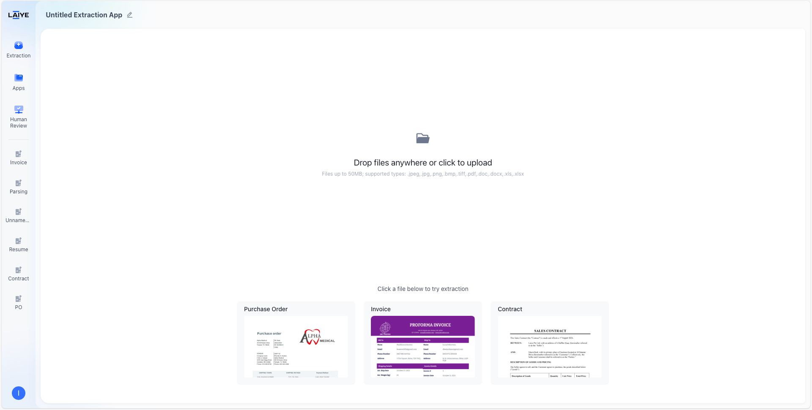

You can upload up to **10 documents per batch**\. Each document can be up to **100 pages, 50MB**, and in the following formats:

|Document Type|Format|
|---|---|
|Image|\.JPEG, \.JPG, \.PNG, \.BMP, \.TIFF|
|PDF|\.PDF|
|Microsoft Excel|\.XLSX, \.XLS|
|Microsoft Word|\.DOCX, \.DOC |

Alternatively, you can test with sample documents provided by the platform\.


### Step 2: Build a Schema

Three methods are available:

1. Generate a schema from a prompt

2. Generate a schema from smart suggestions

3. Build a schema from scratch 

> Detailed instructions and steps can be found in the [corresponding section](#configuring-schemas).
> 
> 


### Step 3: Test and Call API

While configuring the schema, you can click **Test** at any time to verify the extraction results on the displaying document\. Test results can be copied or exported\. Detailed instructions can be found in the Testing Schemas section\. Once completed, click **Save** to update the latest schema version\.


## Out\-of\-the\-Box Agents

Upload Invoice/receipt/purchase order documents via quick access entry, enabling rapid extraction without manual configuration\.


**No configuration needed, Click and Use**

- **Zero Configuration:** No prompt tuning or complex environment setup required\. Experience true out\-of\-the\-box functionality\.

- **Fully Automated Processing:** Automated extraction begins immediately upon upload, delivering a seamless and fluid workflow\.

- **Comprehensive Document Coverage**: Supports core business documents including Invoices, Receipts, and Purchase Orders \(PO\)\. Includes pre\-configured extraction for over 15 key fields, such as document number, date, and amount\.

- **Built\-in Expert Schemas:** Comes with verified, high\-precision extraction strategies designed specifically for business documents—enabling general\-purpose models to achieve expert\-level performance\.

- **Superior Accuracy \& Performance:** Extraction accuracy exceeds 90%, with a 33% boost in overall performance \(processing time compressed to under 20 seconds per page\)\. Both accuracy and speed meet industry\-leading standards\.


**Steps**

1. Access Ready\-to\-Use extraction capabilities for Invoices/receipts\.

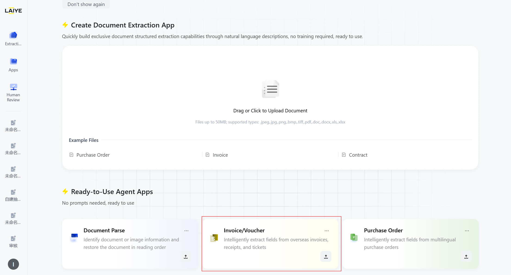

2. Select to upload an invoice/receipt document, only **single document** upload is supported\.

3. The platform automatically classifies and extracts documents at the document level, and displays the results\.

    1. Through a dropdown menu, users can manually change the automatically classified document type\. After the type is modified, the platform will re\-run the extraction task accordingly\.

    2. Extraction results can be viewed in either a visual layout or JSON view, and can be exported in JSON or Excel format\.

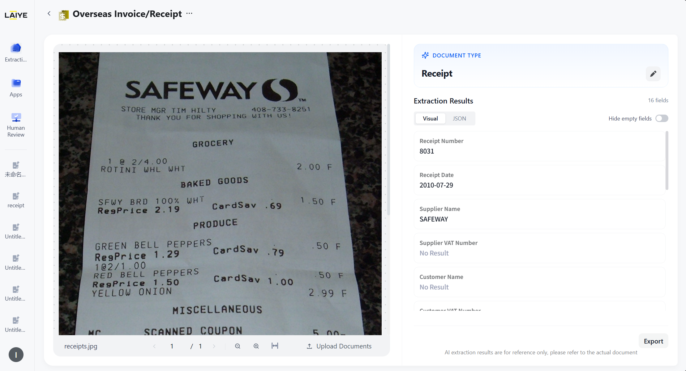


**Note:**

- Ready\-to\-Use capability supports integration with Human Review\. When users call the Ready\-to\-Use capability via API, if review rules are enabled for Human Review, a Human Review task will be automatically created\.

- Human Review applications associated with Out\-of\-the\-Box capabilities do not currently support setting rules related to document confidence levels\.

> For more detailed instructions on human review operations, please refer to the [human-in-the-loop workflow](#human-workflow).
> 
> 


## Configuring Schemas <a id="configuring-schemas"></a>

ADP provides flexible configuration options to suit different business needs, ensuring that users can build extraction workflows with both speed and precision\. The platform offers three approaches:

- **Generate a schema from a prompt** – Use natural language to describe your extraction requirements, and ADP will automatically generate a schema\.

- **Generate a schema from smart suggestions** – Let ADP analyze your document and propose intelligent, pre\-configured instructions that you can refine\.

- **Build a schema from scratch** – Manually define each field and rule with a structured form, giving you complete control over schema design\.


### Generate a schema from a prompt

Once documents are uploaded, simply describe your extraction requirements in natural language\. ADP will transform your input into a structured schema\.


**To create a schema from custom prompts:**

1. Enter a very clear and detailed prompt\. Specify the exact fields you want to extract\. Explain how they are labeled in the document, and if you want them labeled differently in the extracted results\.

> Prompt best practices include:
> 
> - Prompt best practices include:
> 
> - Field names \(e\.g\., Order Number, Customer Name, Contact Information\)
> 
> - Field descriptions \(e\.g\., “Transaction Amount should be numeric,” or “Delivery Date is the deadline requested by the customer”\)
> 
> - Overall extraction rules \(e\.g\., “Return company names in original language, translate minor languages, keep English and Traditional Chinese unchanged”\)\- Overall extraction rules \(e\.g\., “Return company names in original language, translate minor languages, keep English and Traditional Chinese unchanged”\)
> 
> 

More information on prompt writing can be found in the [ADP Prompt Practice Guide](https://laiye-tech.feishu.cn/docx/KfnLdMNBZo9UmuxNtZQcTjNgn0g)\.

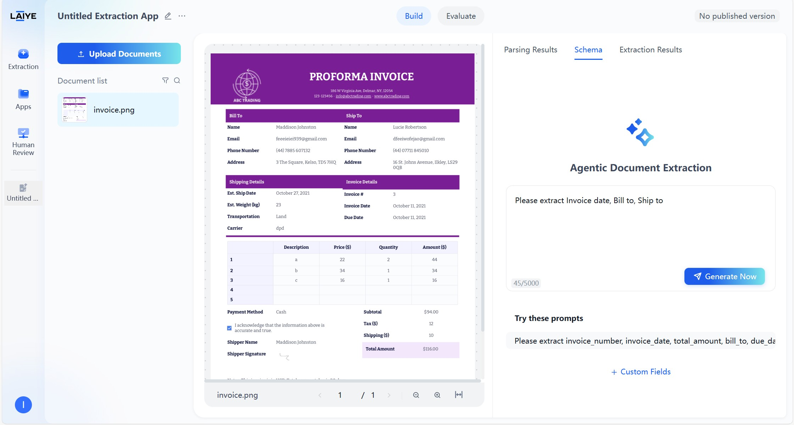

2. Click **Generate Now** to create a schema instantly\. You can fine\-tune the output by editing fields or adjusting rules\.

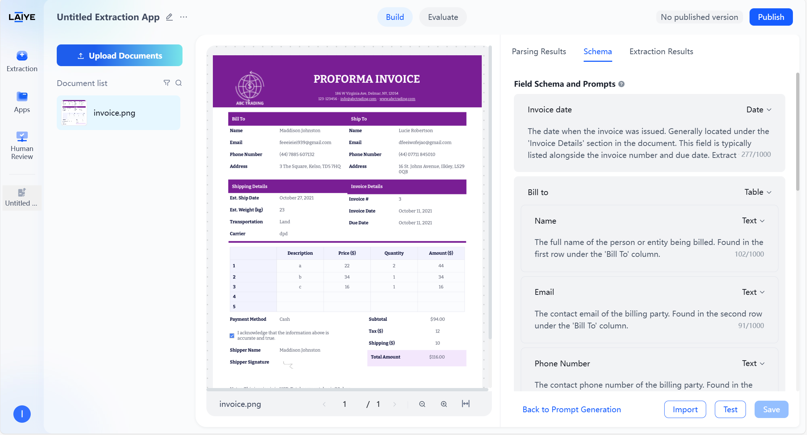

3. If you want to reset, click **Back to Prompt Generation**\. This clears all configurations irreversibly and takes you back to the schema generation interface\.

4. You can either save or test the schema once completing configuration\.


### Generate a schema from smart suggestions

When extraction requirements are unclear, ADP can auto\-generate intelligent recommendations based on the content and structure of your uploaded document\.

With a single click, you receive a ready\-made schema that can be customized further\. This approach accelerates setup for users unfamiliar with the document or with uncertain extraction requirements\.


**To create a schema from smart suggestions:**

1. Upload a document\.

2. Select a prompt from "**Try these Prompts**"\.

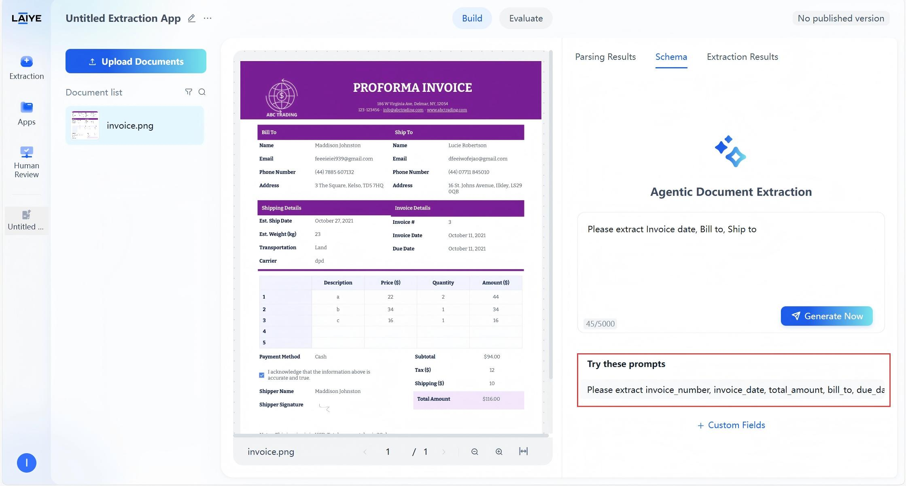

3. The schema will be generated automatically\. You can fine\-tune the output by editing fields or adjusting rules\.

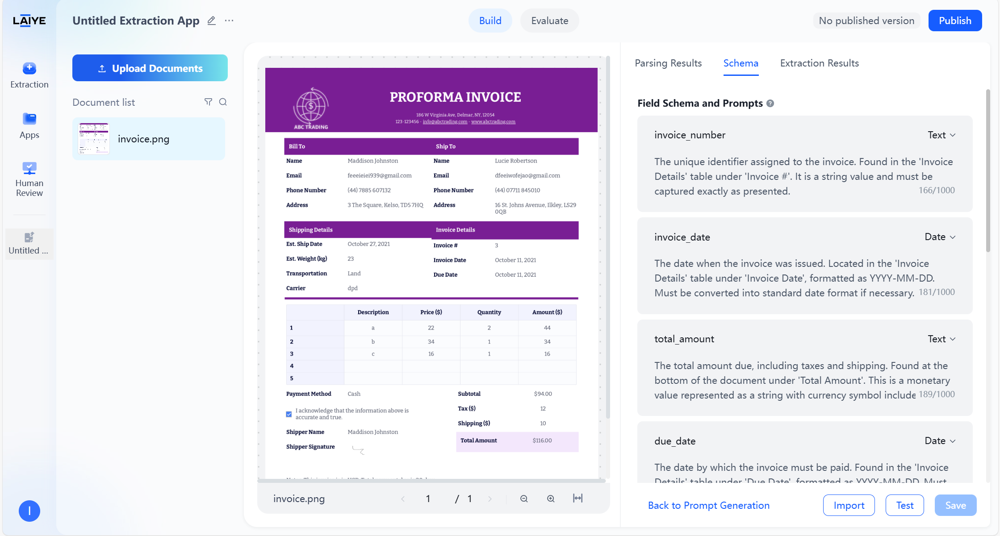

4. If you want to reset, click **Back to Prompt Generation**\. This clears all configurations irreversibly and takes you back to the schema generation interface\.

5. You can either save or test the schema once completing configuration\.


### Build a schema from scratch

For maximum precision, you may build the configuration entirely from scratch\.


**To create a schema from scratch:**

1. Click **\+ Custom Fields** to start with a blank schema\.


2. Add fields with name, type, and description\.

- Supported field types include Text, Date, and Table\.

- Field descriptions can include semantics, formatting rules, common document locations, or aliases\.

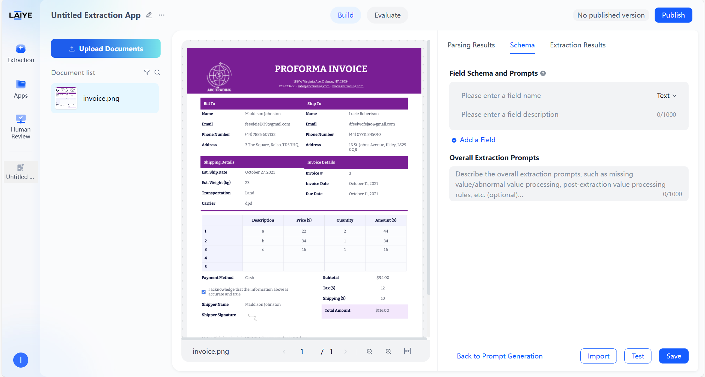

3. Additionally, you can specify **Overall Extraction Prompts**—for example, handling missing values or post\-processing extracted results \(e\.g\., "Only capture numeric parts of Quantity, Price, and Amount, stripping currency symbols and units"\)\.

4. If you want to reset, click **Back to Prompt Generation**\. This clears all configurations irreversibly and takes you back to the schema generation interface\.

5. You can either save or test the schema once completing configuration\.


### Version Control

To facilitate comparison and optimization of different prompt effects, ADP supports multi\-version configuration management functionality:


**Version Saving and Management**

- Supports saving extraction configurations as different versions, each with independent field configurations and overall extraction requirements\.

- Meaningful names can be set for versions for easy identification and management\.

- Supports viewing, renaming, or deleting historical versions of configurations\.

**Version Comparison and Optimization**

- Extraction effects can be compared between different versions to select the optimal configuration\.

- Supports continuing editing based on historical versions for rapid iterative optimization\.

- Any specified version can be published to production environment for API calling\.


**Steps**

1. After completing extraction rule settings on the configuration page, click the "Save" button to automatically generate the first version\.


2. All saved versions can be viewed on the historical configuration page for comparison and management\.


3. Select the version to be published and click "Publish" to complete deployment\.


### Schema Import and Export

To facilitate team collaboration and configuration reuse, ADP supports extraction configuration import and export:


**Schema Export**

- Supports exporting current extraction configuration as \.config format files\.

- Exported files contain complete data including field names, field descriptions, overall extraction requirements, etc\.

- Facilitates configuration backup, team sharing, and version management\.

**Schema Import**

- Supports importing configuration files exported from the ADP platform\.

- Modifications and optimizations can be made based on imports\.


**Steps**

1. On the application to be exported \- Configuration \- Historical Configuration page, select the configuration version to be exported, click \[···\] \- \[Export\] button\.

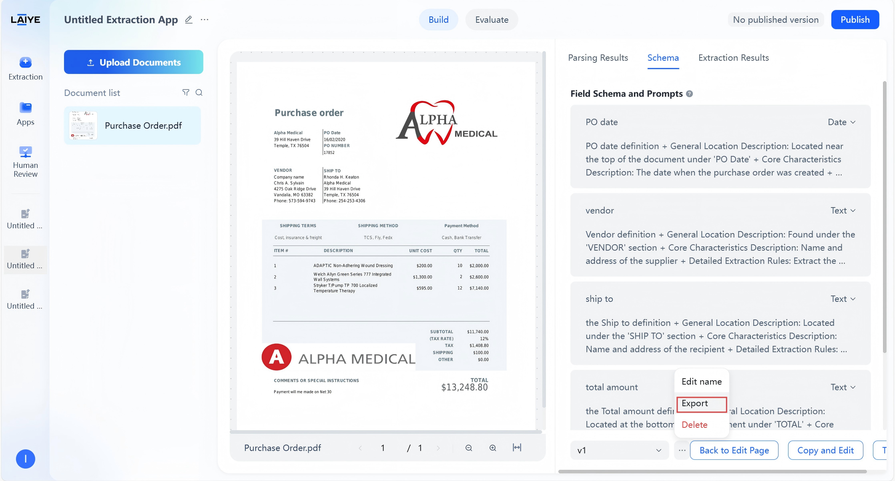

2. Download the generated \.config configuration file\.

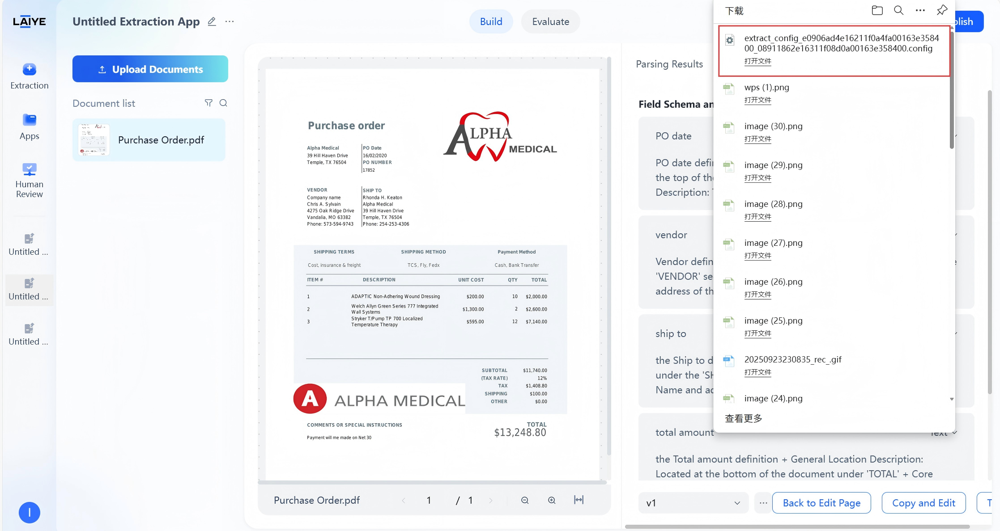

3. On the target application \- Configuration \- Extraction Configuration page, click the \[Import\] button\.


4. Upload the configuration file, and after successful upload, it will be automatically imported as a new configuration version\.


### Advanced Settings

Users can configure advanced extraction options, including "Mode" \(Standard, Advanced, Agentic\) and "Highlight", to optimize the accuracy and traceability of document parsing based on specific user use cases\.

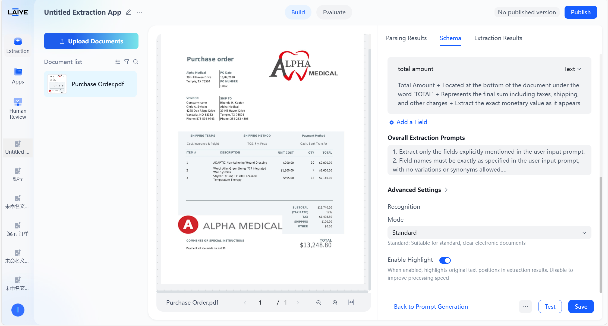

|Configuration Options|Options|Description|
|---|---|---|
|Mode|Standard|Suitable for standard, clear electronic documents|
||Advanced|Suitable for documents with complex layouts such as stamps, signatures, and multiple tables|
||Agentic|Intelligently combines multiple models for parsing to significantly improve the stability of complex document parsing|
|Highlight|Enable/Disable<br></br>|When enabled, highlights original text positions in extraction results\. Disable to improve processing speed\.|

> Note：  
> 
> - After modifying the configuration of the "mode" and "highlight", if you choose \[Save\], the new configuration will not be applied to historical documents, but will only take effect on newly uploaded documents after the configuration change\.
> 
> - After modifying the "mode" configuration, if you choose \[Test\], it will refresh the current preview effect, re\-recognize the current document, and deduct the corresponding credits\.
> 
> - When "highlight" is disabled, back\-annotation will not appear in parsing results, extraction results, or human\-in\-the\-loop collaboration results\.
> 
> - All three parsing modes \(Standard, Advanced, Agentic\) consume the same amount of credits\.
> 
> 


Users can configure the 【Long Document Extraction】 option, specify the document type range, and efficiently and accurately extract fields of specific document categories\.

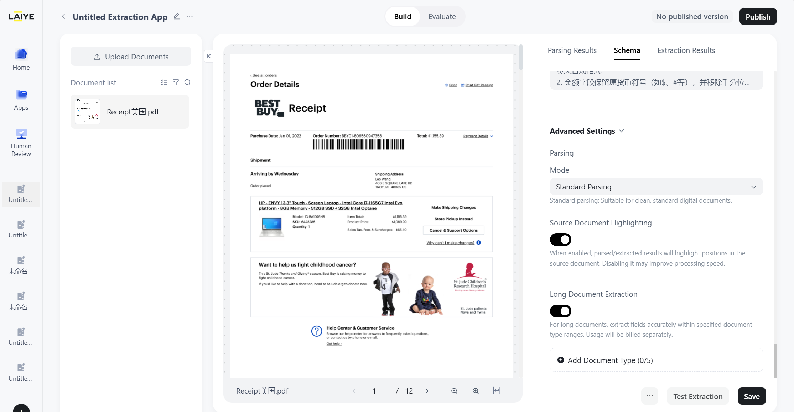

**Steps**

1. In Schema, turn on the "Long Document Extraction " switch\.

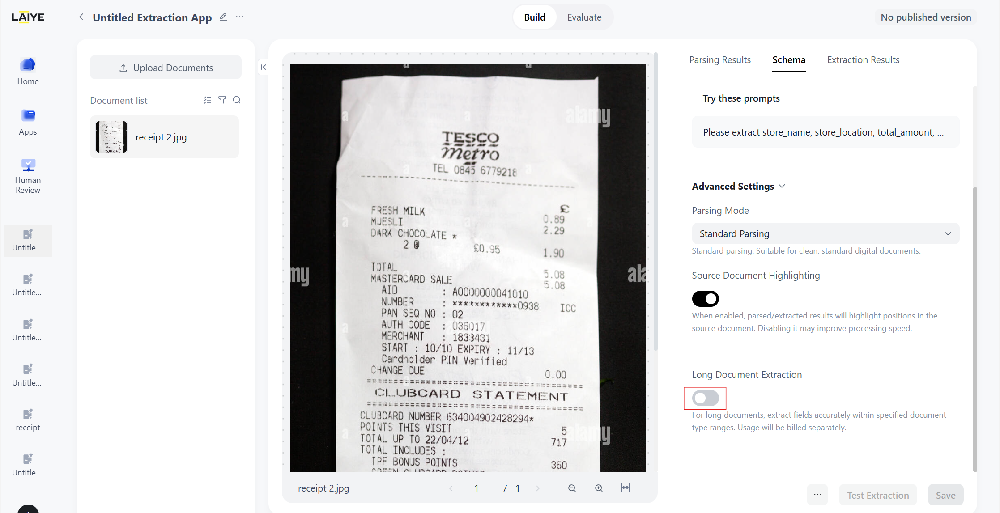

2. Enter 【Document Type】 and 【Document Feature】

    1. Supports inputting up to 5 document types

    2. Inputting page ranges is not supported\.

    3. Writting document features can refer to [best prompt practices](#long-doc-guide).

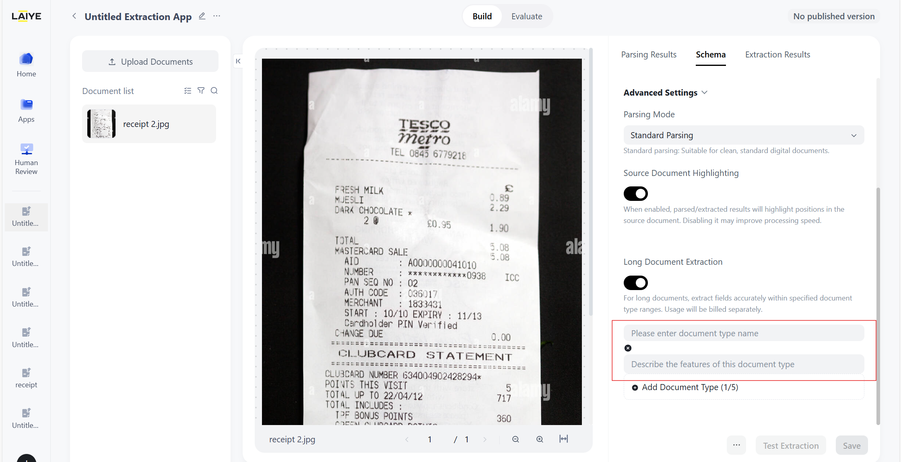

3. The platform automatically locates the specified range for precise extraction and displays the extraction results\.

    1. Clicking on the page number label supports source document highlighting and displays the document type to which the page number range belongs\.

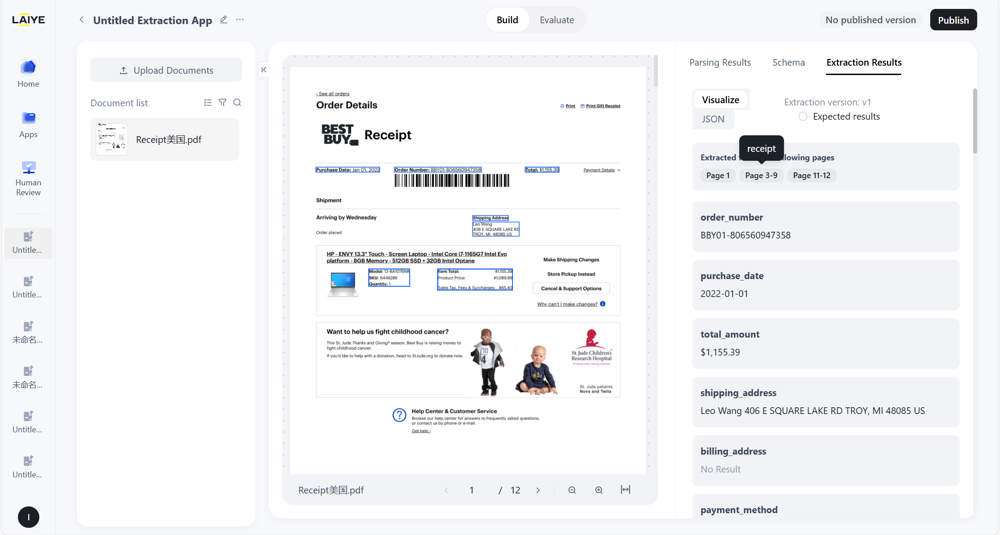

    2. The extraction results can be switched between visual view and JSON view, support export in JSON, EXCEL, and Markdown formats, and support specifying the page range for export\.

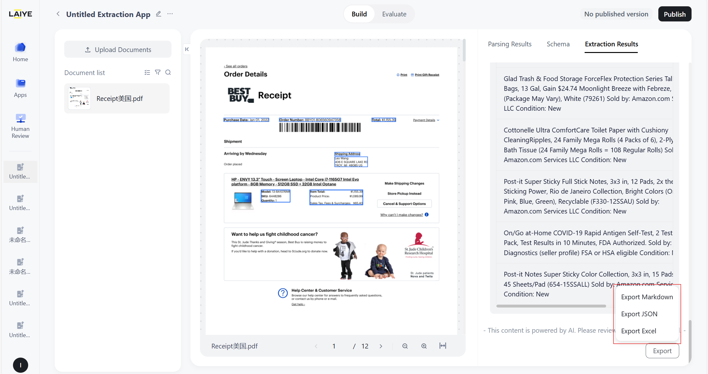

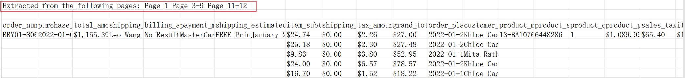

**Long Document Extraction Configuration Input Guide:** <a id="long-doc-guide"></a>

Document Type Name: Please define a **concise, unambiguous** name for the document \(e\.g\., ID Card, Balance Sheet, Elevator parameters\)\.
Document Type Description: Please describe how to identify such documents, including their **definition, core structure and format**, **common locations, aliases, and key rules\.**
      For complex documents, the following dimensions may be included:
           \-Definition/Purpose: What is this document and its main purpose?
           \-Core Content \& Structure: What are its essential content items and typical document structure \(e\.g\., tables, figures\)?
           \-Common Location in Composite Documents: Where does it usually appear within complex files \(e\.g\., typically in a “Technical Parameters” section\)?
           \-Aliases or Variant Names: What other common names or variants does it have?

\-Key Identification \& Exclusion Rules: What special rules must be followed for identification? Which similar documents must be excluded?

**Best Practices for Long Document Extraction Configuration:**

**Applicable Scenario:** **Financial Reporting**

Document Type: Balance Sheet

Description: Must contain a complete tabular structure, including the consolidated balance sheet and the parent company balance sheet\. This is a report that presents assets, liabilities, and shareholders’ equity, and is used to assess the financial position and audit the financial health of an enterprise in a comprehensive manner\. Exclude the following: text that only mentions the report name; management discussion and analysis of operations, asset\-liability and equity analysis, financial structure analysis, asset structure proportion analysis, ratio analysis tables, statistical tables from management discussion and analysis, and tables displaying only part of the assets or liabilities\.


Document Type: Income Statement

Description: Must contain a complete tabular structure, including the consolidated income statement and the parent company income statement\. This is a report displaying revenue, expenses, and profits, and is used to evaluate financial performance and audit the profitability of a company in a comprehensive manner\. Must exclude: text that only mentions the report name; analysis tables for changes in items related to the income statement and cash flow statement; the reconciliation of accounting profit and income tax expense; management discussion and analysis of operations, profit composition, gross/expense ratio analysis tables, performance analysis tables, profit statistics in management commentary, tables presenting only part of the revenue or expenses, or incomplete/analytical tables based on proportion, changes, or year\-on\-year analysis\.


Document Type: Cash Flow Statement

Description: Must contain a complete tabular structure, including the consolidated cash flow statement and the parent company cash flow statement\. This is a comprehensive report reflecting the inflow and outflow of cash and cash equivalents over a given accounting period\. Must exclude: text that only mentions the report name; analysis tables for changes in items related to the income statement and cash flow statement; supplementary notes, individual cash flow items, cash flow analysis, explanations of fund flows, cash receipts and payments statistics, analysis tables for operating cash flows, or cash flow explanations in management commentary\.

**Applicable Scenario: Elevator Technical Parameters**

Document Type: Elevator Parameters

Description: Information comprising a complete section related to “elevator technical parameters, standards, requirements, or specifications\.” The extent of the full section: from the title page of the section to the page immediately preceding the next section title page\. Content may include: functional configuration, requirements per national standards, technical requirements, purchaser \(Party A\) requirements, main technical specifications, technical parameters, performance indicators, detailed quotation tables, equipment lists\. In tender or contract documentation, this is usually found in sections such as “supply requirements,” “technical specifications,” “detailed quotation tables,” or “equipment lists\.” Strictly exclude: text that only mentions names without any specific parameters\.


## Viewing Extraction Results

### Testing Schemas

Testing ensures that your extraction rules work reliably before moving into production\. ADP provides an interactive and transparent way to validate outputs:


1. Click Test at any stage of configuration to instantly preview how your rules perform on the current document\.

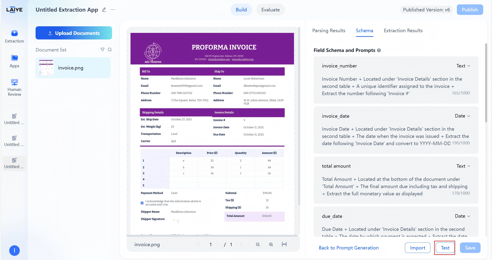

2. Extraction results are displayed in two modes: a Visual View, which highlights extracted values directly in context, and a JSON View, which provides structured machine\-readable output\.


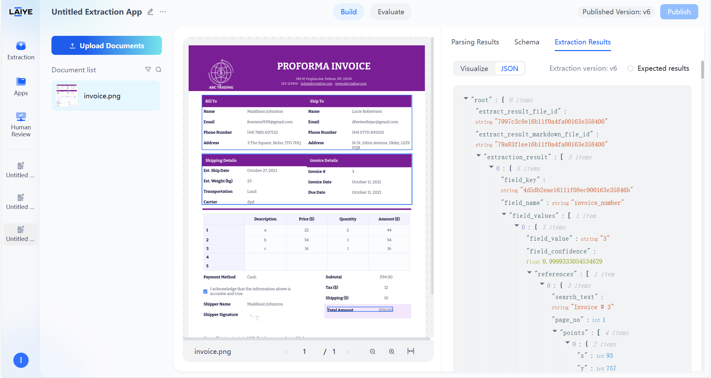

3. Results can be exported in Markdown or JSON format, or you can copy individual field outputs with a single click\.


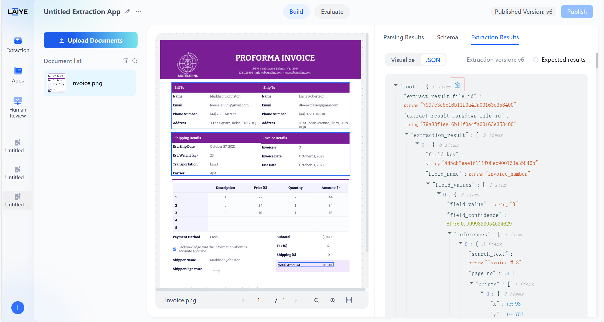

4. Once the configuration meets your requirements, click Save to publish the schema into production\. The updated configuration is immediately reflected in API calls\.


### Confidence Scores

To help users quickly identify the reliability of extraction results, ADP provides field\-level confidence scoring for each extraction result:


**Confidence Scoring Mechanism**

- Confidence score ranges from 0\-1, with higher values indicating stronger model confidence in the field extraction result\.

- Confidence is positively correlated with recognition accuracy \- the higher the confidence, the higher the probability of accurate recognition\.

- Supports setting confidence thresholds for different fields to trigger manual review \(see Human\-in\-the\-Loop Collaboration section\)\.

**Confidence Applications**

- Quick problem identification: Focus on low\-confidence fields for manual review and optimization\.

- Review rule triggering: Automatic review rules can be configured based on confidence thresholds\.

- Effect evaluation: Overall extraction configuration effects can be evaluated through confidence distribution\.


## Viewing Parsing Results

### Text Type Labels

After users upload documents to the application, the agent automatically begins parsing the document content and structure\. After parsing is complete, you can view the Markdown preview results of the document parsed by the VLM model in the "Parsing Results" tab\. Supports recognition of complex elements such as multi\-level headings, headers and footers, tables, etc\.


**Supported Text Types**

- **Annotations**: Notes and explanatory text in documents

- **Formulas**: Mathematical formulas, calculation expressions

- **Body Text**: Main content paragraphs of documents

- **Footers**: Information at the bottom of pages, such as page numbers, copyright information

- **Headers**: Information at the top of pages, such as titles, chapter names

- **Images**: Visual elements such as pictures, charts

- **Chapter Titles**: Document chapter division titles

- **Titles**: Various levels of headings and subheadings

- **Tables**: Structured data tables

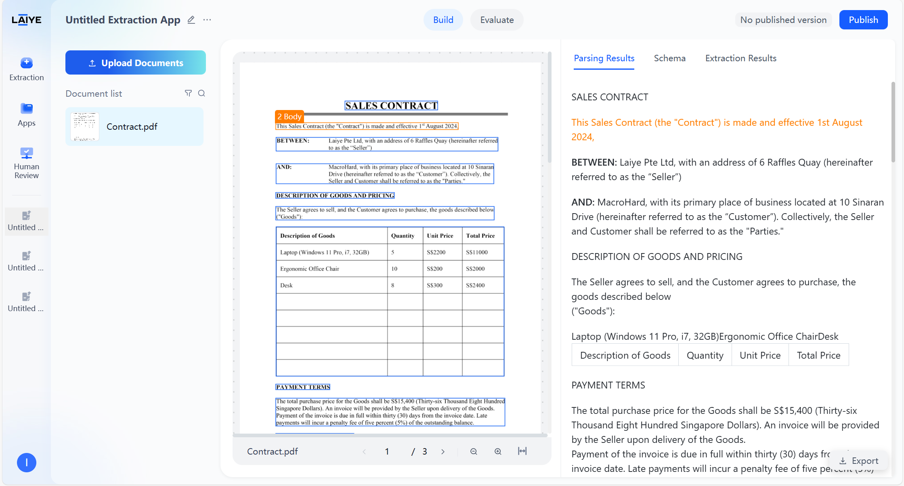

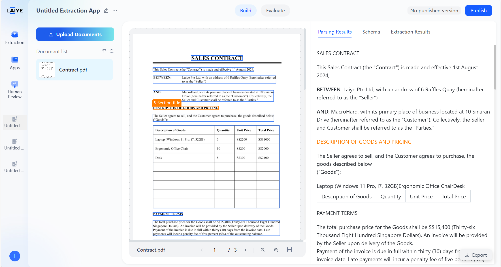

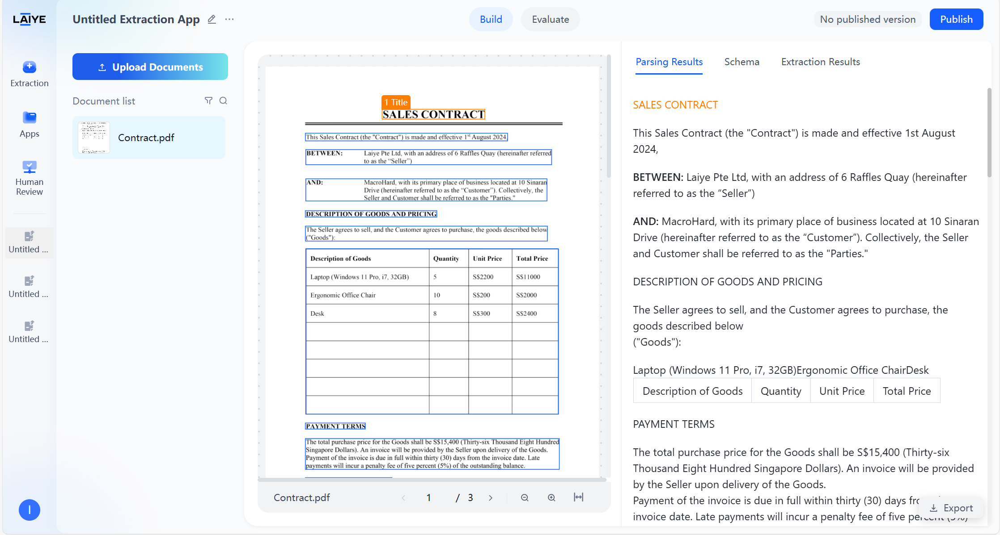

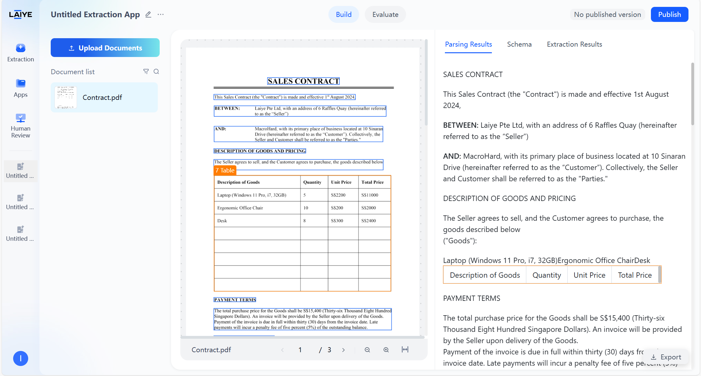

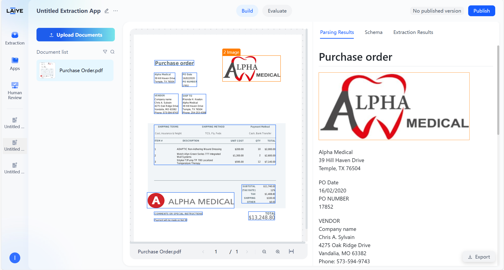

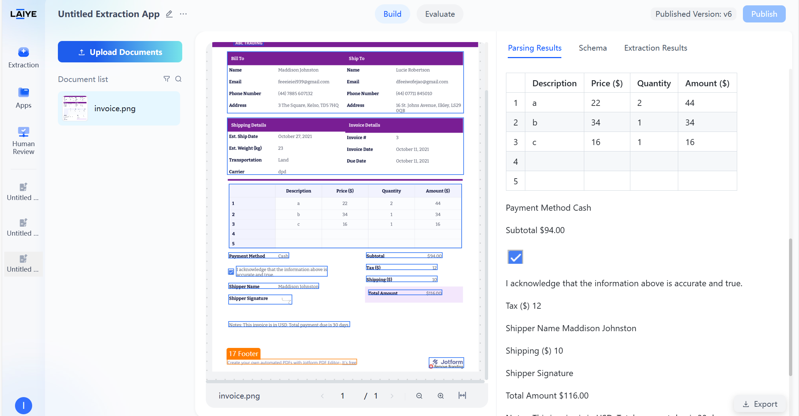

**Label Applications**

- Assists model in understanding document structure, improving extraction accuracy of complex layout documents

- Users can intuitively view text types of each section on the results page, facilitating analysis of model recognition effects and layout features

- Supports intelligent filtering and retrieval based on text types


### Parsing Result Export

Supports exporting document parsing results as Markdown files:


**Export Content**

- Complete document parsing results, including text type annotations\.

- Structured content display maintaining original document hierarchy\.

- Supports inclusion of complex elements such as tables, titles\.

**Application Scenarios**

- Direct reuse of parsing results for downstream processing\.

- Building enterprise knowledge bases and digital asset centers\.

- Data integration with external systems\.


## Source Document Highlighting

Parsing/extraction results can be automatically located and highlighted in the original text, helping users quickly verify the correspondence between fields and original text:

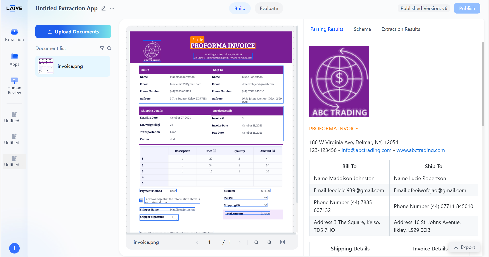


**Back\-Annotation Display**

- Automatically locate and highlight corresponding extraction fields in the original document\.

- Support clicking extraction results to quickly jump to original text positions\.

- Provide intuitive visual correspondence display\.

**Application Scenarios**

- Verify the accuracy of extraction results\.

- Locate specific positions of extraction errors\.

- Analyze model extraction logic for configuration optimization\.


## Visual Correction of Extraction Results

Provides an intuitive interface for validating and correcting model extraction results:


**Result Validation**

- After users upload documents, the platform automatically parses and generates extraction results based on the latest configuration version\.

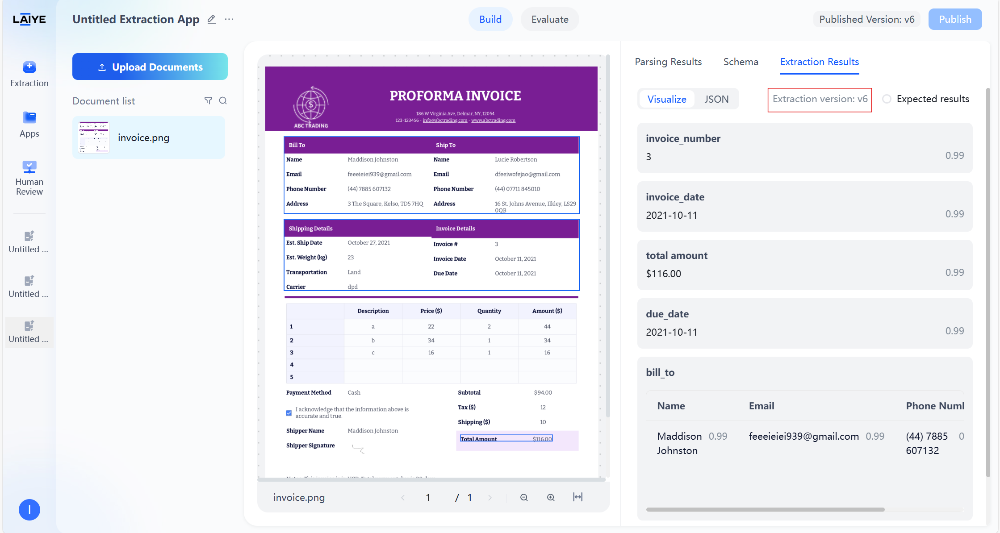

- Supports users validating model extraction results on the extraction results page and manually modifying expected results\.


- Visual display of correspondence between extraction values and original text\.


**Operation Steps**

1. View model auto\-generated extraction values on the extraction results page\.

2. Manually correct inaccurate extraction results\.

3. System records correction information for subsequent batch evaluation and model optimization\.

4. Supports batch completion of validation operations to improve processing efficiency\.


## Batch Evaluation

To evaluate the performance of extraction applications in actual business scenarios, ADP supports batch evaluation of multiple documents based on specified versions:


**Operation Steps**

1. Click "Initiate Evaluation," select the configuration version to evaluate, and initiate batch evaluation of multiple documents based on the specified version to quickly assess whether model extraction performance meets launch criteria\.

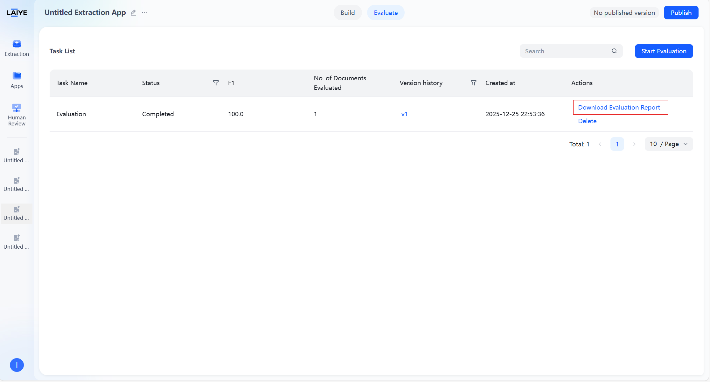

2. After batch evaluation tasks are completed, the platform automatically generates offline evaluation report files supporting user download and viewing\. Reports include overall evaluation metrics \(accuracy, recall, F1 value, etc\.\), field evaluation results, document evaluation results, and field extraction details, helping users quantify model extraction performance at multiple levels\. Field extraction details show comparisons between extracted values and expected values for each document, facilitating error sample location\.

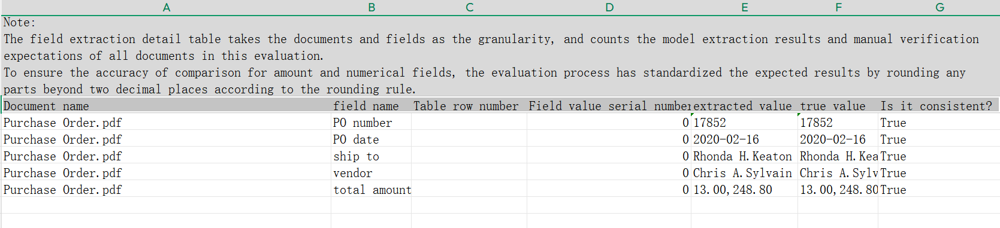


# Out\-of\-the\-Box Agents

## Overview

Upload Invoice, Receipt, Purchase Order documents via quick\-access entry points for instant extraction — no manual configuration required\.


**No Configuration Needed — Click and Use**

- **Zero Configuration:** No prompt tuning or complex environment setup required\. Experience true out\-of\-the\-box functionality\.

- **Fully Automated Processing:** Automated extraction begins immediately upon document upload, delivering a seamless and fluid workflow\.

- **Comprehensive Document Coverage:** Supports core business documents including Invoices, Receipts, and Purchase Orders \(PO\), with 15\+ pre\-configured key fields such as document number, date, and amount\. Also covers 11 common ID/certificate types including business licenses, bank cards, account opening permits, Chinese passports, ID cards, and driver's licenses\.

- **Built\-in Expert Schemas:** Comes with verified, high\-precision extraction strategies designed specifically for business documents — enabling general\-purpose models to achieve expert\-level performance\.

- **Superior Accuracy \& Performance:** Extraction accuracy exceeds **90%\+**\. Simple documents such as ID cards are processed in **1–5 seconds** per page; complex documents are processed in under **20 seconds** per page\. Both accuracy and speed meet industry\-leading standards\.


**Steps**

1. Entry point: Out\-of\-the\-Box → Document Parsing / Invoice \& Receipt

2. Select the desired Out\-of\-the\-Box capability and upload the corresponding document\. Only **single document** upload is supported\.


> **Note:**
> 
> - Out\-of\-the\-Box extraction supports integration with Human Review\. When calling the Out\-of\-the\-Box capability via API, if review rules are enabled in Human Review, a review task will be automatically created\.
> 
> - Human Review applications linked to Out\-of\-the\-Box capabilities do not currently support setting rules related to document confidence levels\.
> 
> - For more details on Human Review operations, see the Human\-in\-the\-Loop Workflow section\.
> 
> 

---

## Invoice / Receipt

### Use Cases

- Accounts payable \(AP\) automation for cross\-border e\-commerce

- Multi\-supplier, multi\-language, multi\-template invoice entry

- Shared Services Center \(SSC\) operations

- Tax compliance and audit

### Getting Classification and Extraction Results

1. Entry point: Out\-of\-the\-Box → Invoice / Receipt

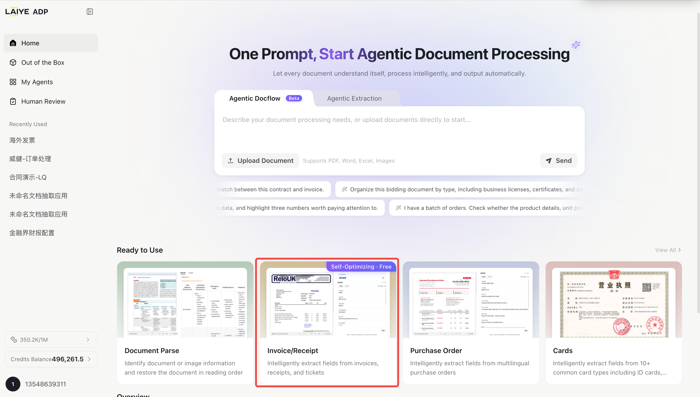

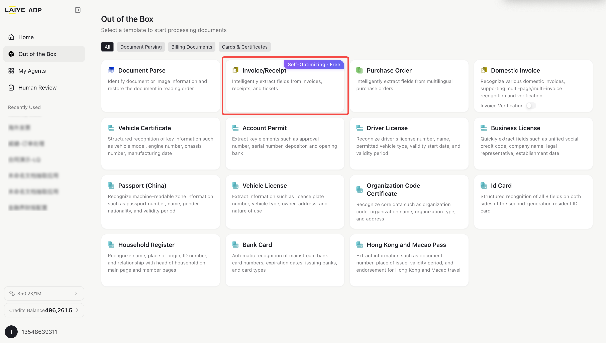

2. Upload an invoice or receipt document\. The platform will automatically classify and extract the document\.

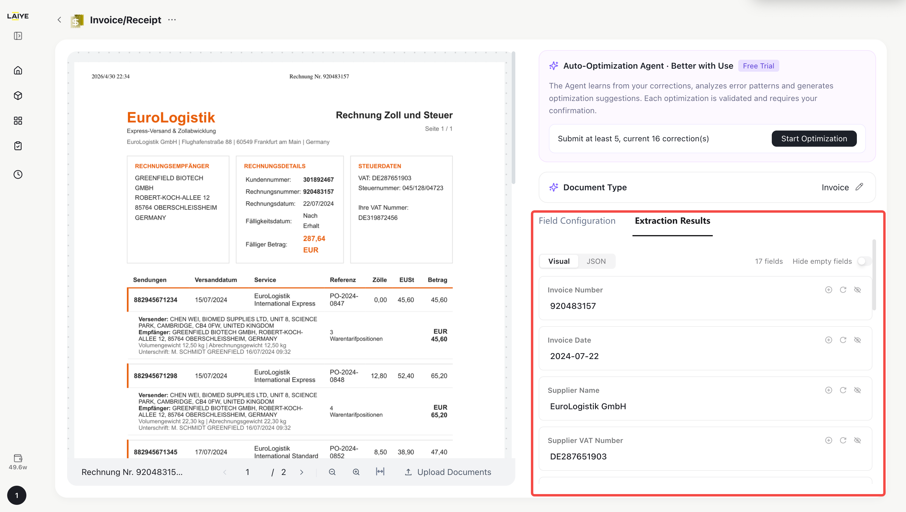

### Predefined Field List

#### Invoice

|**Field Name**|**Type**|
|---|---|
|Invoice Number|Text|
|Invoice Date|Date|
|Supplier Name|Text|
|Supplier VAT Number|Text|
|Customer Name|Text|
|Customer VAT Number|Text|
|Currency|Text|
|Total Without Tax|Text|
|VAT Rate|Text|
|Total Amount \(Inc\. Tax\)|Text|
|Amount Due|Text|
|Line Items|Table|
|Item Code|Text|
|Description|Text|
|Quantity|Text|
|Unit Price|Text|
|Total Amount|Text|

#### Receipt

|**Field Name**|**Type**|
|---|---|
|Receipt Number|Text|
|Receipt Date|Date|
|Supplier Name|Text|
|Supplier VAT Number|Text|
|Customer Name|Text|
|Customer VAT Number|Text|
|Currency|Text|
|Total Without Tax|Text|
|VAT Rate|Text|
|Total Amount \(Inc\. Tax\)|Text|
|Amount Due|Text|
|Line Items|Table|
|Item Code|Text|
|Description|Text|
|Quantity|Text|
|Unit Price|Text|
|Total Amount|Text|

### Custom Extraction Fields

In Out\-of\-the\-Box Invoice/Receipt extraction, you can flexibly add or remove extraction fields based on your business needs, without switching to a general\-purpose Document Extraction app\.

- **Predefined Fields:** System built\-in default extraction fields \(e\.g\., Invoice Number, Total Amount\), ready to use out of the box\.

- **Custom Fields:** Fields you add based on your specific business requirements \(e\.g\., PO Number, Payment Terms\)\.

**View and Manage Field Configuration**

1. On the Invoice/Receipt detail page, click the **Field Configuration** entry to open the field configuration panel\.

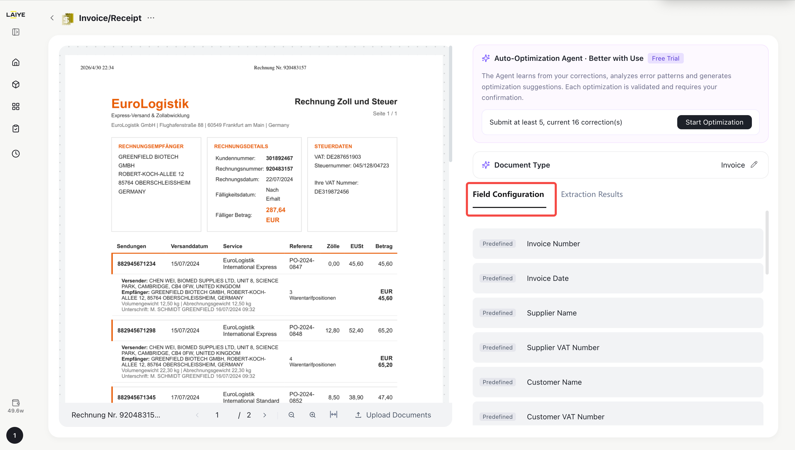

2. The panel displays all active fields, including field name, description, and data type\. Predefined and custom fields are distinguished by labels, with predefined fields listed first\.

3. If a predefined field does not apply to your business scenario, click the **Delete** button next to that field to remove it\.

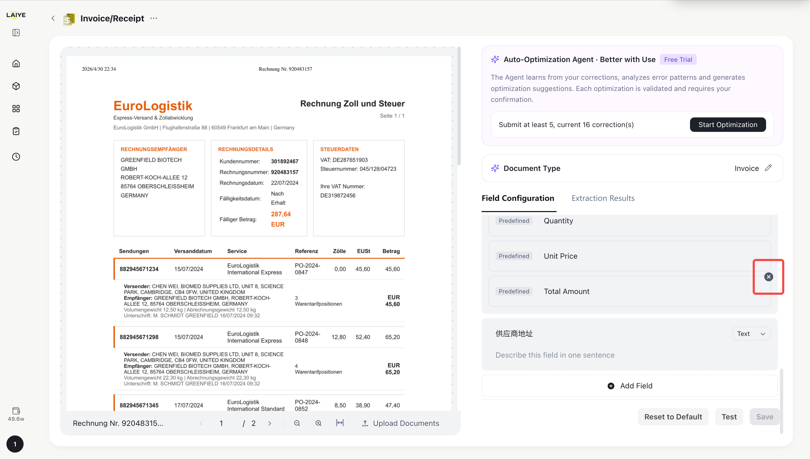

**Add a Custom Field**

4. Click the **Add Field** button and fill in the following:

|**Setting**|**Required**|**Description**|
|---|---|---|
|Field Name|Yes|Unique identifier for the field, max 100 characters|
|Data Type|Yes|Options: Text, Date, Table \(default: Text\)|
|Extraction Hint|No|A prompt to help the system locate the field, max 500 characters|

> Note: Each app supports up to 50 custom fields\.
> 
> 

5. Click **Save / Test** after completing the configuration\. The new field will take effect on the next extraction\.

> Note: Self\-optimization samples collected before a field configuration change will no longer count toward the optimization cycle\.
> 
> 

6. To revert to the system default configuration, click the **Restore Default Fields** button\.

> Important: Restoring defaults will delete all custom fields, restore predefined fields, and invalidate any applied self\-optimization results\.
> 
> 

### Self\-Optimization Agent

The Self\-Optimization Agent analyzes your corrections to extraction results, identifies error patterns, and optimizes extraction strategies — making the system more accurate over time\.


**How It Works**

Correction Collection → Trigger Optimization → Auto Verification → User Confirmation

1. **Correction Collection:** When you edit and save a field value on the extraction result page, the system automatically records the correction\.

2. **Optimization Analysis:** After accumulating corrections from 5 documents, you can start optimization\. The Agent analyzes error causes and develops improved extraction strategies\.

3. **Auto Verification:** The system automatically compares old vs\. new extraction strategies using sample documents\.

4. **User Confirmation:** Once verified, the optimization suggestion is presented for your approval\.


**Steps**

**Step 1: Correct Extraction Results \(Automatic Collection\)**

1. On the Invoice/Receipt detail page, review the extraction results\.

2. If a field value is incorrect, click directly on the field value to edit it\.

3. Save your changes\. The system will automatically record this correction as a learning sample in the background\.

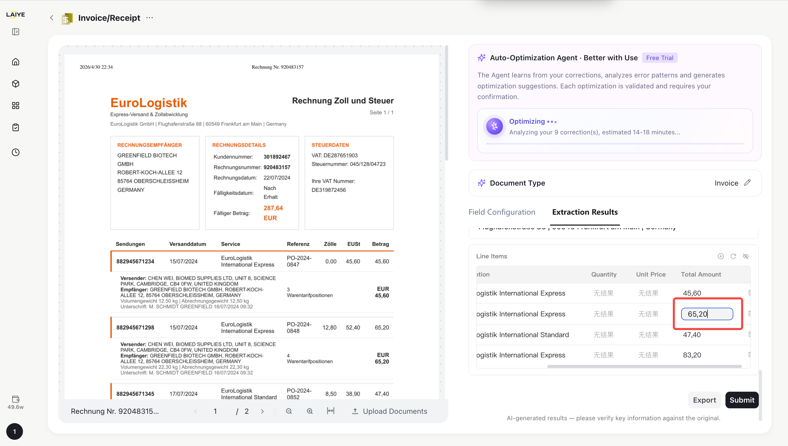

> Note: Only corrections where the modified value differs from the original extraction are collected as learning samples\. Normal editing operations are not affected\.
> 
> 


**Step 2: Trigger Optimization Analysis**

4. Once 5 or more corrections have been accumulated, the **Start Optimization** button in the Self\-Optimization Agent panel on the detail page becomes active\.

5. Click **Start Optimization**\. The system will analyze error patterns in the documents and generate an optimization proposal\.

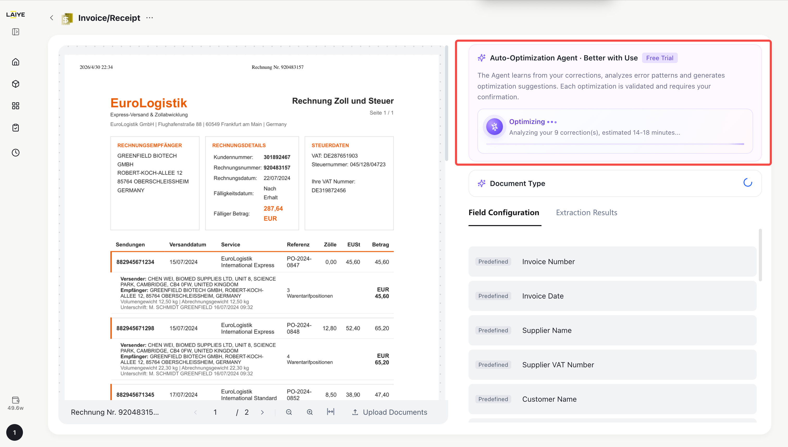

> Note: Optimization analysis runs in the background and typically takes a few minutes\. It does not block your other operations\.
> 
> 


**Step 3: Review and Confirm Optimization**

6. If verification passes, the Self\-Optimization Agent panel displays the optimization suggestion, including:

    1. **Change Summary:** Describes the optimization results\.

    2. **Target Field Results:** Original accuracy vs\. optimized accuracy \(e\.g\., total\_amount: 60% → 93%\)\.

    3. **Impact on Other Fields:** Shows whether other fields are affected\.

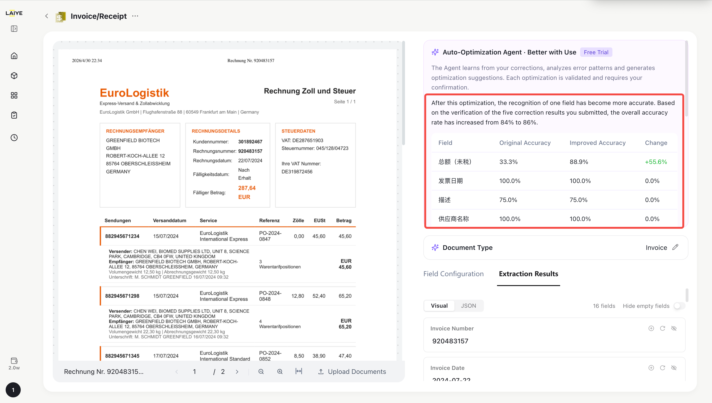

7. You can choose:

    - **Apply Optimization:** Confirm and apply\. Future extractions will use the optimized strategy\.

    - **Dismiss:** Reject the suggestion\. The current extraction strategy remains unchanged\.

    - **Re\-optimize:** Reject the suggestion and re\-analyze to define a new extraction strategy\.

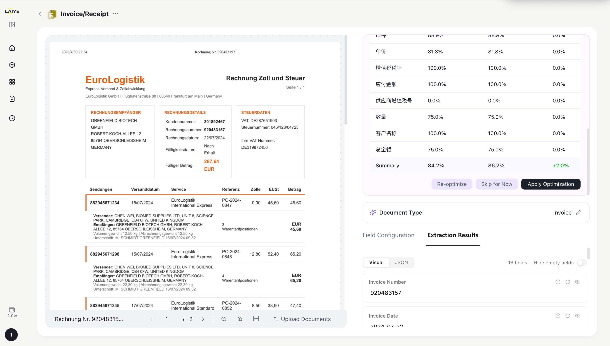

8. If verification does not pass, the Self\-Optimization Agent panel displays a notification\. Click "Got it" and choose to either re\-optimize or continue adding correction samples to improve optimization quality\.

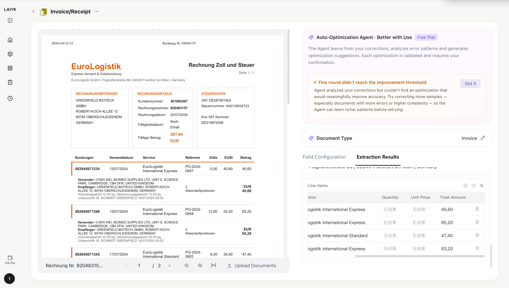

> Tip: More samples lead to more accurate optimization by the Agent\.
> 
> 


**Step 4: Continuous Optimization Loop**

9. After applying an optimization, the system returns to learning mode\. As you continue using and correcting, you can trigger further rounds of optimization to continuously improve extraction accuracy\.

> Note: Each optimization round uses all accumulated correction data to ensure globally optimal results\.
> 
> 


**View Optimization Status**

10. In the Self\-Optimization Agent panel on the detail page, you can view it at any time:

    - Number of accumulated correction samples per field

    - Current optimization status \(Learning / Optimizing / Pending Confirmation\)

    - History of applied optimizations


**Restore Defaults**

To revert to the initial system extraction strategy, click the **Restore Defaults** button below the field configuration\. After restoring:

- All optimized extraction strategies revert to their initial state

- Accumulated correction sample data is preserved \(not deleted\)

- The optimization round counter is reset

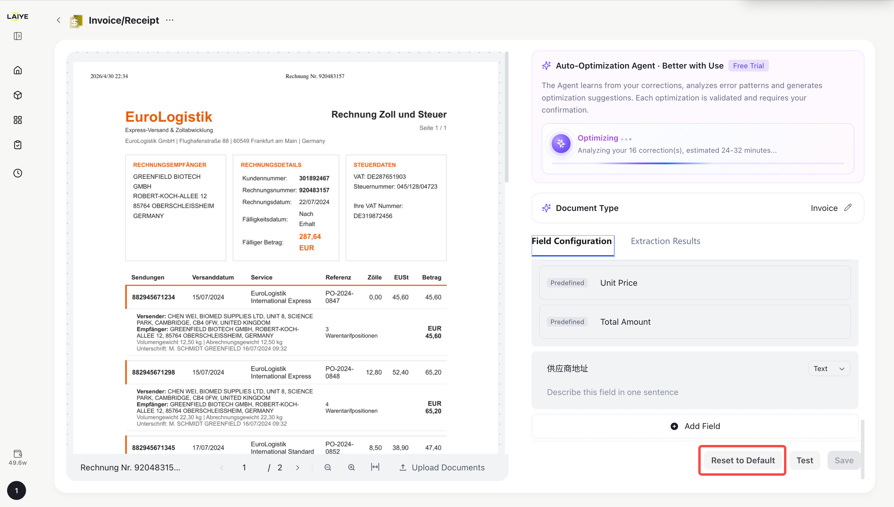

> Important: This operation shares the same entry point as "Restore Default Fields" for custom fields\. Restoring defaults resets both field configuration and optimization strategies\.
> 
> 

---

## Purchase Order

### Use Cases

- Supply chain procurement automation; bulk PO entry into ERP/SAP

- Three\-way match for accounts payable \(PO – Goods Receipt – Invoice\)

- Supplier reconciliation and fulfillment tracking

- Standardized processing of purchase orders across regions and templates

### Predefined Field List

|**Field Name**|**Type**|
|---|---|
|PO Number|Text|
|Order Date|Date|
|Seller Name|Text|
|Buyer Name|Text|
|Buyer Address|Text|
|Delivery Address|Text|
|Receiver Name|Text|
|Currency|Text|
|Total Amount|Text|
|Line Items|Table|
|Material Code|Text|
|Tax Rate|Text|
|Description|Text|
|Quantity|Text|
|Unit Price \(Inc\. Tax\)|Text|
|Total Amount \(Inc\. Tax\)|Text|
|Delivery Date|Date|

# Agentic Docflow

## Overview

Agentic Docflow is a workflow\-building capability in ADP designed for complex document processing scenarios\. Users can describe a business requirement in natural language, and the assistant will understand the task, plan the required steps, and generate a reusable document processing workflow\.

Agentic Docflow is best suited for document workflows that require multiple steps, such as document splitting, classification, field extraction, cross\-document validation, anomaly checks, and result consolidation\. Compared with a single extraction app, Agentic Docflow is better suited for end\-to\-end business processes\.

### Key Concepts

|Concept|Description|
|---|---|
|Docflow|A document processing flow made up of multiple processing nodes\. It can be used for parsing, classification, extraction, review, consolidation, and other tasks\.|
|Node|A single processing step in a docflow, such as document recognition, field extraction, document classification and splitting, or LLM\-based processing\.|
|Conversational creation|A way to create docflows by describing requirements in natural language\. The assistant plans and generates the docflow automatically\.|
|Publish|The action of publishing a tested docflow as a reusable app for repeated execution or integration\.|

> Agentic Docflow is designed for compound tasks that follow a sequence such as "first do A, then do B, and finally output C\." For example, you can split bidding documents first and then extract fields by document type, or identify contracts and invoices first and then check whether the amount, supplier, and date match\.
> 
> 

### Use Cases

Agentic Docflow is suitable for the following scenarios:

- Finance review: Check whether the amount, supplier, and date are consistent across contracts, invoices, OA forms, and other documents\.

- Receipt processing: Split multiple invoices or receipts and extract information such as receipt number, date, amount, currency, and supplier\.

- Document sorting: Identify and split mixed document packages containing business licenses, certificates, contracts, authorization letters, and other materials\.

- Order review: Check whether orders are abnormal based on product information, unit price, validity period, and other fields\.

- Financial report analysis: Extract financial report data, organize key metrics, and generate change analysis\.

## Quick Start

You can create and use an Agentic Docflow in three steps\.

### Step 1: Create an Agentic Docflow

After signing in to ADP, you can create an Agentic Docflow from either of the following entry points:

- On the Home page, enter your document processing requirement in the Agentic Docflow input box and upload the documents to process\.

- In the left navigation bar, go to **My Apps**, click **Create App**, and select **Agentic Docflow**\.

**Example requirements**

```plaintext
Check whether the amount, supplier, and date match across these contracts and invoices.
```

```plaintext
Classify and organize the business licenses, certificates, and contracts in this bidding document, then extract key information.
```

```plaintext
I have a batch of orders. Check whether the product information, unit price, and validity period look abnormal.
```

```plaintext
Analyze this financial report, extract all table data, and highlight three numbers worth paying attention to.
```

### Step 2: Refine the Docflow Through Conversation

After you enter the requirement, the assistant will understand the task objective and generate a docflow\. During the generation process, you can continue the conversation to add rules or adjust requirements\.

For example, you can:

- Add fields to extract\.

- Describe how different document types should be identified\.

- Specify the final output format\.

- Add consistency checks, anomaly rules, or result consolidation logic\.

> To generate a more accurate docflow, include the document types, processing steps, fields to extract or validate, and the expected final output in your prompt\.
> 
> 

### Step 3: Test and Publish the Docflow

After the docflow is generated, you can upload test documents and run the docflow to check whether the results meet your expectations\. If the results need improvement, you can continue refining the docflow through conversation or manually edit prompts in certain nodes on the canvas\.

Once the docflow works as expected, click **Publish** to publish the current docflow as a reusable app\. Published docflows can be used repeatedly for similar document processing tasks\.

## Create and Edit Docflows

### Create a Docflow with Natural Language

In the Agentic Docflow input box, describe the document processing task you want to complete\. The system will plan the flow and generate the corresponding nodes on the canvas\.

**Recommended**

```plaintext
I have a batch of orders. Check whether the product information, unit price, and validity period look abnormal. Output the abnormal order list in Markdown and explain the reason for each anomaly. The fields to extract and detailed review rules are included in the attachment.
```

**Not recommended**

```plaintext
Process this order.
```

> The clearer your prompt is, the closer the generated docflow will be to your actual business requirement\. We recommend specifying what the input is, what needs to be checked, and what the final output should look like\.
> 
> For complex long\-running docflowa, you can build them in stages\. For example, if a docflow needs to first classify and filter a batch of files by filename, and then extract and review the filtered files, you can first describe the classification and filtering requirement\. After the assistant builds that part and the test result looks good, describe the extraction and review requirements to complete the docflow\.
> 
> 

### Adjust a Docflow Through Conversation

After a docflow is generated, you can continue sending instructions to the assistant to adjust the processing logic\.

Common adjustments include:

- Add or remove extraction fields\.

- Modify document classification types\.

- Add review rules or anomaly detection rules\.

- Change the final output format\.

- Ask the assistant to regenerate the configuration of a specific node\.

**Examples**

```plaintext
Add an "Anomaly Reason" column to the result, and indicate whether the issue is caused by an amount mismatch, supplier mismatch, or date mismatch.
```

```plaintext
The bidding document may also include authorization letters. Split them into a separate document type and extract the signing date and authorization period.
```

You can also explicitly ask the assistant to use or modify a specific node\. Common nodes include:

|Node|Description|
|---|---|
|Start|The entry point of the docflow\. It receives uploaded files and custom variables, then passes them to downstream nodes\.|
|Loop Start|Starts a loop and runs the nodes inside it for each file or data item\. Must be paired with a Loop End node\.|
|Loop End|Ends a loop and gathers the results from each run\.|
|LLM|Uses an LLM for text tasks such as classification, extraction, translation, summarization, rewriting, and format conversion\.|
|Visual Analysis|Uses a multimodal model to understand images and documents such as PDFs and Word files\. Best for layout analysis, visual Q\&A, content extraction, and complex document understanding\.|
|Field Extraction|Extracts selected fields from documents, including both standard fields and table fields\. Best for structured data extraction\.|
|Document Recognition|Runs OCR and layout analysis on PDFs, Word files, images, and more to extract text, structure, and position data\.|
|Document Classification|Detects document types and splits pages when multiple types are found, so downstream nodes can process each type separately\.|
|Result Merging|Combines results from multiple document types or nodes in the same file into a single output\.|
|End|Ends the docflow and returns the final output\.|

## Test a Docflow

### Run a Test

On the docflow editing page, you can upload test documents and click **Test Run**\. You can also upload documents in the conversation and ask the assistant to test the docflow\. This helps you verify the current docflow result\. During the run, you can check node execution status and the final output\.

**Steps**

1. Click **Test Run**\.

2. Upload the documents you want to test\.

3. Click **Start Run**\. The docflow will start running in the background\. Hover over **Run Records** to view the status of all historical runs\.

4. Click **Run Records**, then click the file name to open the run detail page\. On the detail page, you can view the execution status of each node and the final output from the End node\. If the result does not meet expectations, continue refining the docflow through conversation or node configuration\.

### Adjust Test Results

If the test result does not meet expectations, you can improve the docflow from the following angles:

- Incorrect document splitting: add document types, type characteristics, page ranges, or other identification rules\.

- Inaccurate field extraction: add field definitions, common locations, aliases, and format requirements\.

- Incorrect review results: add business rules and anomaly handling logic\.

- Unexpected output format: specify whether the output should be a table, JSON, Markdown, or a summary report\.

> For complex scenarios, we recommend testing with 1\-2 representative sample documents first, then validating stability with a larger batch of documents\.
> 
> 

## Publish and Use Docflows

### Publish a Docflow

After the test result is confirmed, click **Publish** to publish the current version as a production\-ready docflow app\. After publishing, ADP keeps the current configuration\. You can view and roll back versions in **Version History**, making the docflow easier to reuse and maintain\.

### Use a Published Docflow

Published Agentic Docflows can be called through APIs\. You can continue processing similar documents with the docflow, edit it as business requirements change, and publish new versions\. Docflows also support import and export across accounts and environments, making it easier to share processes and collaborate\.

## Prompting Best Practices

To help the assistant generate a docflow that better matches your expectations, we recommend structuring your prompt as follows:

```plaintext
I need to process [business scenario]. The input documents include [document types].
First [step 1], then [step 2], and finally [step 3].
The fields to extract or validate include [field list].
The final output should be [output format], with the following special rules: [rules].
```

### Example 1: Contract and Invoice Consistency Check

```plaintext
I need to process a reimbursement review scenario. The input includes contracts and invoices, which may be uploaded as one or multiple files.
The workflow should:
1. Identify the document type from the uploaded files, including contracts and invoices.
2. Extract the buyer, seller, and total amount including tax from invoices.
3. Extract Party A, Party B, and total amount including tax from contracts.
Finally, check whether these fields are consistent and output a review report. If any values are inconsistent, indicate the mismatched fields and the corresponding files.
```

### Example 2: Bidding Document Classification and Extraction

```plaintext
I need to process a bidding document package. Companies may scan all materials into one large PDF, ranging from dozens to hundreds of pages. The materials may include but are not limited to bid letters, legal representative authorization letters, business licenses, performance records, ownership structure forms, bid summary sheets, bid bond payment vouchers, and service commitment letters.

The workflow should:
1. Automatically identify and split document types such as business licenses, certificates, contracts, and authorization letters. Clearly provide the page range for each material type.
2. Extract fields from each material type based on the fixed templates below.
3. Consolidate and output structured results by document type.

Fields to extract:
   (1) From the bid letter:
    - Bidder name, bid validity period, whether it is a consortium, whether it is an agent
    
   (2) From the legal representative authorization letter:
    - Authorization effective date, ID validity period, social insurance certificate period
    
   (3) From the business license:
    - Company name, unified social credit code, business term
    
   (4) From the performance record table (this is a table field):
    - Performance record table [No., contract name, contract amount]
    
   (5) From the ownership structure form (this is a table field):
    - Ownership structure form [Name of natural person/entity investing in or controlling the bidder, investment ratio (%)]
    
   (6) From the bid summary sheet:
    - Total quotation, tax rate
    
   (7) From the bid bond payment voucher:
    - Bid bond payer, bid bond amount
    
   (8) From the service commitment letter:
    - Delivery period, warranty period
```

### Example 3: Financial Report Analysis

```plaintext
I need to analyze a financial report. The input is a PDF annual report, usually 100-200 pages.
Extract all table data, including the balance sheet, cash flow statement, and income statement, and organize the output based on the fields I provide in the attachment.
Finally, highlight three numbers worth paying attention to and explain why they may need further review.

Notes:
1. If the annual report contains data for multiple years, such as 2023 and 2022 shown side by side, extract the data separately by year.
2. The final output should be a standard Excel table. Each field should include four columns: value, source, calculation formula, and year.
3. Extract only data from the original document. Do not include units in the extracted results.
```

## Notes

- Agentic Docflow is best suited for multi\-step, cross\-document tasks that require judgment or consolidation\. If you only need to extract fixed fields, you can continue using Agentic Document Extraction apps\.

- Docflow generation quality depends on prompt clarity and sample document quality\. We recommend providing clear business rules and representative test documents\.

- Before publishing, complete test validation to avoid using unverified configurations in production\.

- For long documents, scanned files, and mixed document packages, specify document types, identification characteristics, and output requirements in the prompt\.


# Human-in-the-loop Workflow <a id="human-workflow"></a>

## Key Concepts

Human\-in\-the\-loop collaboration is one of the core functions of the ADP platform, achieving complete workflow of "machine extraction \+ manual review" through intelligent review rules, solving the "last mile" problem after large customers launch ADP applications\.


**Core Value**

- **Human\-Machine Precise Routing, Ensuring 100% Business Accuracy**: High\-confidence and compliant data passes directly, low\-confidence or non\-compliant data is precisely routed to human interface, with final business data accuracy approaching 100%\.

- **Obtain High\-Quality Ground Truth, Enabling Model to "Get Smarter with Use"**: Each manual correction is recorded as high\-quality annotation data, and the system generates configuration optimization suggestions based on ground truth data, continuously improving model performance\.

- **ROI Quantification Dimension Upgrade, from "Single\-Point Accuracy" to "End\-to\-End Automation Rate"**: No longer focusing only on technical metrics, but measuring core business metrics such as end\-to\-end automation rate and manual review rate, with customer automation rates increasing from 72% to 82% within one month\.


## Configuring Review Rules

Supports configuring review rules using natural language without writing scripts:


**Rule Description Methods**

Users only need to describe business logic in natural language, for example, manual review is entered when any of the following conditions are met:

- "Amount greater than 5000"

- "Invoice number is empty"

- "Delivery date earlier than current date"


**Operation Steps**

1. Enter the Human Review module, click "Add Rule" or "Configure Rule," and select the published application to which review rules are to be added\.

2. Describe review conditions in natural language in the rule input box\.

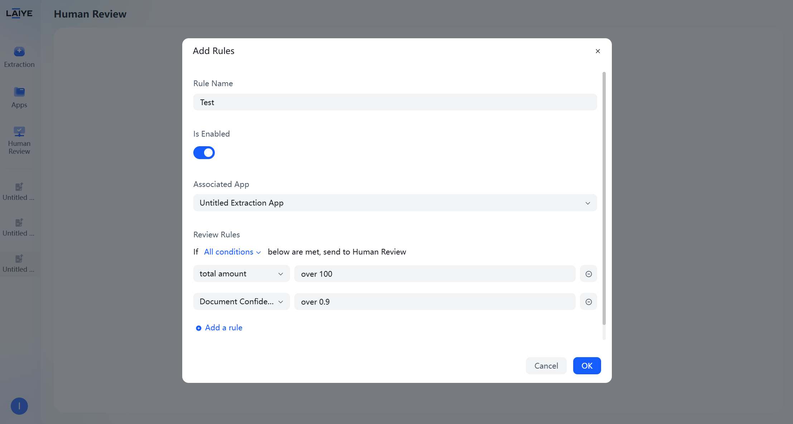

3. The platform automatically structures, parses, and generates rules based on LLM capabilities\.

4. When saving rules, validity is automatically verified\. After confirming all rules are correct, click "Confirm" to save\.


## Task Management and Processing

### Task Management Center

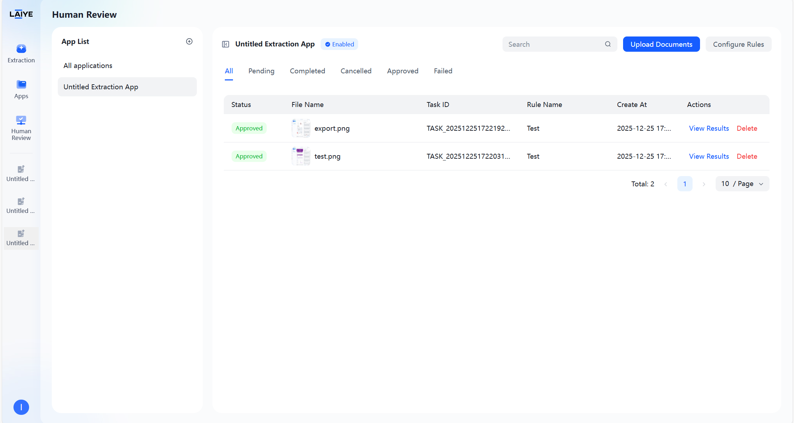

- The task list page clearly displays the status of all tasks, such as "Pending," "Approved," "Cancelled," etc\., helping reviewers understand task processing progress at any time\.

- Displays key information such as task creation time, task number, and rule name\.

- Quick operation buttons for task processing, viewing results, canceling or deleting tasks improve task management flexibility\.


### Task Processing Interface

Quickly focus on problem fields, human\-in\-the\-loop collaboration ensures extraction result accuracy:


**Intelligent Identification**

- Fields hitting review rules are highlighted, and the model's reason for triggering review is displayed\.

**Efficient Processing**

- Click "Previous" and "Next" to quickly switch between pending tasks\.

- Support one\-click "Approve" or "Cancel" task operations\.

- Provide field correction functionality supporting direct editing of incorrect extraction results\.


**Operation Steps**

1. Enter the human\-in\-the\-loop module\.

2. View the pending task list, select the task to be processed, and click "Process Immediately\."

3. View highlighted problem fields and trigger reasons\.

4. Confirm whether extraction results are correct\. After completing result validation, click "Approve\." If the task does not require processing, click "Cancel\."


# Credits Guide

## What Are Credits?

- **Credits** are Laiye ADP's universal billing unit\. 

- Each action \(parse, extract, human review\) consumes a fixed amount of credits per page\.


## How Credits Are Consumed

- Credits are deducted only for successful operations\. If a task fails due to a system error, no credits will be charged\.

> Note: When your account runs out of credits, all document processing and API services will be automatically suspended\. Please monitor your balance to ensure uninterrupted service\.
> 
> 

### Credit Consumption Rates

The number of credits consumed varies by task\. The tables below outline the cost per page for our core services\.

|Tasks|Credits|
|---|---|
|Document Extraction App（Parse \+ Extract）|1|
|Document Extraction App（Long Document Extraction）|1\*Total pages in document \+ 0\.5\*Page numbers within the specified range|
|Human Review<br></br>|Integrate with Document Extraction App:2|
||Integrate with Document Extraction App（Long Document Extraction）:2\~2\.5|
||Integrate with Purchase Order、Invoice/Receipt:2\.5|

|**Out\-of\-the\-Box**|**Credits**|
|---|---|
|Document Parse|0\.5|
|Purchase Order|1\.5|
|Invoice/Receipt|1\.5|

> Note:
> 
> - Credit consumption will be affected by factors such as document type and model configuration\.
> 
> - The credit consumption of Human Review depends on the base capability module it is combined with \(such as Document Extraction App, purchase orders, Invoices\)\. When used alone, Human Review consumes** 1 credit**\. For better understanding, please refer to the following typical scenarios:
> 
>     - **Scenario A**:** Automatic extraction of ****Invoice****s only**
> 
>         - Calculation: 1\.5 \(base\) =** 1\.5 credits per page**
> 
>     - **Scenario B**: **Purchase Order extraction with Human Review enabled**
> 
>         - Calculation: 1\.5 \(base\) \+ 1 \(Human Review\) = **2\.5 credits per page**
> 
>     - **Scenario C: Document Extraction App with Human Review enabled**
> 
>         - Calculation: 1 \(base\) \+ 1 \(Human Review\) = **2 credits per page**
> 
> 

### Consumption Example

Suppose the client has carried out the following **three operations**:

1. Process 30 two\-page documents using the Document Extraction App\.

2. Extract a 12\-page section from one 200\-page document using Long Document Extraction\.

3. Process 10 two\-page documents with Human Review\.

Here is the** total credit calculation**:

1. Document Extraction: 30 documents × 2 pages/doc × 1 credit/page = 60 credits

2. Long Document Extraction: 1 document × 200 pages × 1 credits \+ 1 document × 12 pages × 0\.5 credits = 206 credits

3. Human Review: 10 documents × 2 pages/doc × 2 credits/page = 40 credits

4. Total Consumption: 306 credits


## Credit Types and Validity

Laiye offers different types of credits, each with its own source and expiration rules\.

|Credits Type|How to obtain|Expiration Rule|
|---|---|---|
|Free Credits|Automatically granted to all registered users\.|The monthly credit balance resets to 100 at 0:00 on the 1st of each month \. Unused credits from the previous month are removed\.|
|Event Credits|earned by participating in events|expire when the event ends|

**Credit Consumption Order: **The system always consumes credits in the following order:

Event Credits \> Free Credits 

> Note：
> 
> If you want to obtain more credits, please contact the official staff of Laiye to recharge\.
> 
> 


## Checking Your Balance

You can easily monitor your credit usage:

- **Quick View:** Your current credit balance is visible in the user profile section at the bottom\-left of the platform\.

- **Detailed History:** For a full breakdown of your credit consumption, past orders, and transaction records, navigate to the "Account Management" section\.

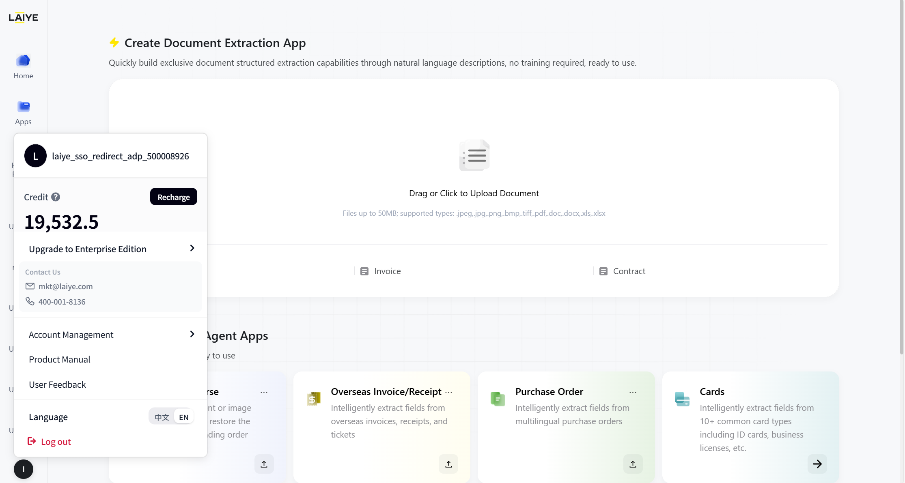

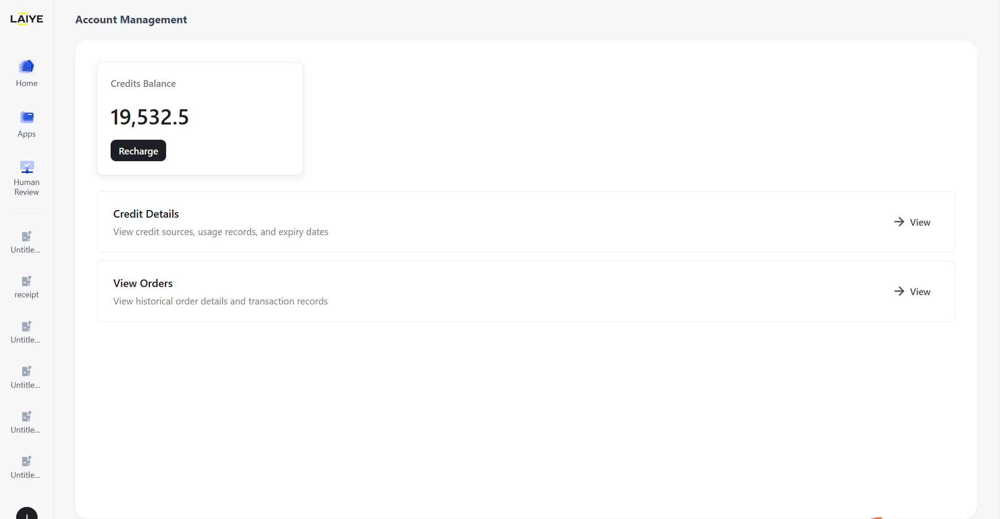

## 

> (注：内容由 AI 生成，请谨慎参考）
