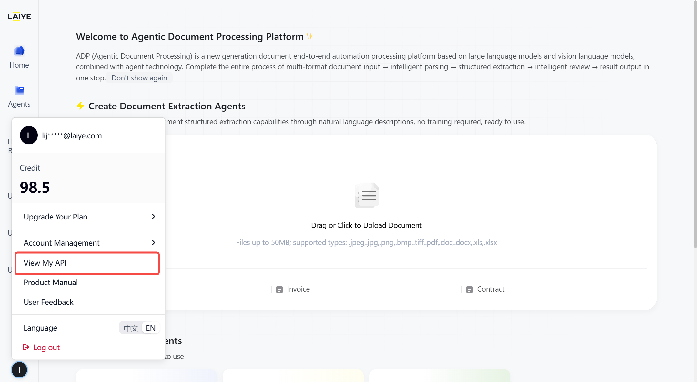

# OpenAPI User Guide

# API call

The applications within the ADP platform support being integrated into third\-party applications via API\. Before calling the API, you need to go to the [ADP platform](https://adp-global.laiye.com/) to obtain the API Key\. Click on your personal avatar to view "My API"\.



# Document Extraction \(synchronous\)

**Endpoint** [https://adp\-global\.laiye\.com](https://adp-global.laiye.com)

`POST` / open/agentic\_doc\_processor/\[tenant\_name\]/v1/app/doc/extract

**Description**

- For the documents uploaded by users, call the specified document extraction application, and extract the specified content from the file according to**application configuration**and**rules**\.

### Header

|**name**|**type**|**Mandatory or not**|**description**|
|---|---|---|---|
|X\-API\-KEY|string|is |The token for users to access the openapi, view it in the application API |
|accept\-language|string|No |Returns the language of the field names\. The default value is 'zh', which returns Chinese field names; if set to 'en', it returns English field names|

### Request

|**name**|**type**|**Mandatory or not**|**description**|
|---|---|---|---|
|tenant\_name|string|yes|Tenant name, default laiye|
|app\_id<br></br>|string|is |The unique identifier of the application, which can be viewed in the ** View API ** of the application |
|file\_base64|string|optional|The file to be extracted is base64, choose one from file\_url|
|file\_url|string|optional|Choose between the URL of the file to be extracted and file\_mase64|
|with\_rec\_result|boolean|No|Whether to return the document parsing result, false by default|

### Response

|**name**|**type**|**description**|
|---|---|---|
|message|string|return message|
|tips|string|Details|
|code|string|Business code: success, error, \.\.\.|
|data|object|Return data object|
|\|\- task\_id|string|Extract task ID|
|\|\- file\_url|string|Extract file URL|
|\|\- status|int|Task status: 1 Waiting, 2 Analyzing, 3 Extracting, 4 Successful, 5 Failed|
|\|\- doc\_recognize\_result|array|Document parsing results|
|\|\- extraction\_result|array|Field extraction results|

### Response Example:

```JSON
{
  "success": true,
  "status": 4,
  "task_id": "94fe9b74e0e311f091505e345594c618",
  "file_url": "",
  "doc_recognize_result": [
    {
      "page_num": 1,
      "document_content": "",
      "document_details": [
        {
          "type": "Picture",
          "text": "http://test-adp.laiye.com/web/agentic_doc_processor/laiye/file/7bc821dee0e311f091505e345594c618",
          "position": [
            {
              "points": [
                {
                  "x": 34,
                  "y": 26
                },
                {
                  "x": 93,
                  "y": 26
                },
                {
                  "x": 93,
                  "y": 93
                },
                {
                  "x": 34,
                  "y": 93
                }
              ]
            }
          ],
          "ocr_confidence": {
            "ocr_mean_confidence": 0.9948742372110055,
            "ocr_min_confidence": 0.6224551745238371,
            "is_overall_confidence": 0
          }
        },
        {
          "type": "Title",
          "text": "title content",
          "position": [
            {
              "points": [
                {
                  "x": 234,
                  "y": 28
                },
                {
                  "x": 577,
                  "y": 28
                },
                {
                  "x": 577,
                  "y": 81
                },
                {
                  "x": 234,
                  "y": 81
                }
              ]
            }
          ],
          "ocr_confidence": {
            "ocr_mean_confidence": 0.9649929892499949,
            "ocr_min_confidence": 0.7520648420779353,
            "is_overall_confidence": 1
          }
        },
        {
          "type": "Text",
          "text": "\u91c7\u8d2d\u5355\u53f7: P020250304012",
          "position": [
            {
              "points": [
                {
                  "x": 587,
                  "y": 72
                },
                {
                  "x": 770,
                  "y": 72
                },
                {
                  "x": 770,
                  "y": 89
                },
                {
                  "x": 587,
                  "y": 89
                }
              ]
            }
          ],
          "ocr_confidence": {
            "ocr_mean_confidence": 0.9999092513136395,
            "ocr_min_confidence": 0.9986503483477672,
            "is_overall_confidence": 1
          }
        },
        {
          "type": "Text",
          "text": "title content",
          "position": [
            {
              "points": [
                {
                  "x": 30,
                  "y": 109
                },
                {
                  "x": 676,
                  "y": 109
                },
                {
                  "x": 676,
                  "y": 125
                },
                {
                  "x": 30,
                  "y": 125
                }
              ]
            }
          ],
          "ocr_confidence": {
            "ocr_mean_confidence": 0.9907980751407313,
            "ocr_min_confidence": 0.9479157610236068,
            "is_overall_confidence": 1
          }
        },
        {
          "type": "Table",
          "text": "<table><tr><td>\u8ba2\u8d27\u65e5\u671f:</td><td>2025-03-04</td><td>\u8ba2\u8d27\u65b9:</td><td colspan=\"4\">\u4e2d\u5c71\u5e02\u8682\u8681\u7167\u660e\u5149\u7535\u6709\u9650\u516c\u53f8</td></tr><tr><td>\u4f9b\u5e94\u5546\u540d\u79f0:</td><td>\u6df1\u5733\u5e02\u552f\u7279\u5076\u65b0\u6750\u6599\u80a1\u4efd\u6709\u9650\u516c\u53f8</td><td>\u8054\u7cfb\u4eba:</td><td colspan=\"4\"></td></tr><tr><td>\u8054\u7cfb\u4eba:</td><td>\u9a6c\u56fd\u94f6</td><td>\u8054\u7cfb\u7535\u8bdd:</td><td colspan=\"4\">0760-28188088</td></tr><tr><td>\u7535\u8bdd:</td><td>0755-61813001</td><td>\u4f01\u4e1a\u4f20\u771f:</td><td colspan=\"4\">0760-28188089</td></tr><tr><td>\u4f20\u771f:</td><td></td><td>\u4f01\u4e1a\u5730\u5740:</td><td colspan=\"4\">\u4e2d\u5c71\u5e02\u6a2a\u680f\u9547\u6c38\u5174\u5de5\u4e1a\u533a\u5bcc\u5e86\u4e00\u8def21\u53f72\u680b</td></tr><tr><td>\u5e8f\u53f7</td><td>\u7269\u6599\u7f16\u53f7</td><td>\u7269\u6599\u540d\u79f0</td><td>\u89c4\u683c\u578b\u53f7</td><td>\u5355\u4f4d</td><td>\u6570\u91cf</td><td>\u4ea4\u8d27\u65e5\u671f</td><td>\u5907\u6ce8</td></tr><tr><td>1</td><td>C.FL.0003</td><td>\u6709\u94c5\u9521\u818f</td><td>GW9068C-6</td><td>\u514b</td><td>100000</td><td>2025-03-04</td><td>50\u74f6</td></tr><tr><td>2</td><td>C.FL.0001</td><td>\u9521\u4e1d</td><td>YF-12 \u03c61.1mm 55%</td><td>pcs</td><td>80</td><td>2025-03-04</td><td>80\u5377</td></tr></table>",
          "position": [
            {
              "points": [
                {
                  "x": 27,
                  "y": 125
                },
                {
                  "x": 772,
                  "y": 125
                },
                {
                  "x": 772,
                  "y": 393
                },
                {
                  "x": 27,
                  "y": 393
                }
              ]
            }
          ],
          "ocr_confidence": {
            "ocr_mean_confidence": 0.9989620051858402,
            "ocr_min_confidence": 0.8928787142723804,
            "is_overall_confidence": 1
          }
        }
      ]
    }
  ],
  "extraction_result": [
    {
      "field_key": "2ba119deda2811f0961afa59318c0ee6",
      "field_name": "\u5ba2\u6237\u8ba2\u5355\u53f7",
      "field_values": [
        {
          "field_value": "P020250304012",
          "field_confidence": 0.8672020634779243,
          "references": [
            {
              "search_text": "\u91c7\u8d2d\u5355\u53f7: P020250304012",
              "page_no": 1,
              "points": [
                {
                  "x": 587,
                  "y": 72
                },
                {
                  "x": 770,
                  "y": 72
                },
                {
                  "x": 770,
                  "y": 89
                },
                {
                  "x": 587,
                  "y": 89
                }
              ]
            }
          ]
        }
      ]
    },
    {
      "field_key": "2ba11bf0da2811f0961afa59318c0ee6",
      "field_name": "\u8ba2\u5355\u65e5\u671f",
      "field_values": [
        {
          "field_value": "2025-03-04",
          "field_confidence": 0.9325391036553888,
          "references": [
            {
              "search_text": "\u8ba2\u8d27\u65e5\u671f: 2025-03-04",
              "page_no": 1,
              "points": [
                {
                  "x": 27,
                  "y": 125
                },
                {
                  "x": 772,
                  "y": 125
                },
                {
                  "x": 772,
                  "y": 393
                },
                {
                  "x": 27,
                  "y": 393
                }
              ]
            }
          ]
        }
      ]
    },
    {
      "field_key": "2ba1219ada2811f0961afa59318c0ee6",
      "field_name": "\u91c7\u8d2d\u6e05\u5355",
      "references": [],
      "field_confidence": 0.6771570082465539,
      "table_values": [
        [
          {
            "field_name": "\u7269\u6599\u4ee3\u7801",
            "field_values": [
              {
                "field_value": "C.FL.0003",
                "field_confidence": 0.930778194375688,
                "references": [
                  {
                    "search_text": "C.FL.0003",
                    "page_no": 1,
                    "points": [
                      {
                        "x": 27,
                        "y": 125
                      },
                      {
                        "x": 772,
                        "y": 125
                      },
                      {
                        "x": 772,
                        "y": 393
                      },
                      {
                        "x": 27,
                        "y": 393
                      }
                    ]
                  }
                ]
              }
            ],
            "field_key": "2ba122dada2811f0961afa59318c0ee6"
          },
          {
            "field_name": "\u7269\u6599\u540d\u79f0",
            "field_values": [
              {
                "field_value": "\u6709\u94c5\u9521\u818f",
                "field_confidence": 0.89464598354522,
                "references": [
                  {
                    "search_text": "\u6709\u94c5\u9521\u818f",
                    "page_no": 1,
                    "points": [
                      {
                        "x": 27,
                        "y": 125
                      },
                      {
                        "x": 772,
                        "y": 125
                      },
                      {
                        "x": 772,
                        "y": 393
                      },
                      {
                        "x": 27,
                        "y": 393
                      }
                    ]
                  }
                ]
              }
            ],
            "field_key": "2ba123fcda2811f0961afa59318c0ee6"
          },
          {
            "field_name": "\u89c4\u683c\u578b\u53f7",
            "field_values": [
              {
                "field_value": "GW9068C-6",
                "field_confidence": 0.6771570082465539,
                "references": [
                  {
                    "search_text": "GW9068C-6",
                    "page_no": 1,
                    "points": [
                      {
                        "x": 27,
                        "y": 125
                      },
                      {
                        "x": 772,
                        "y": 125
                      },
                      {
                        "x": 772,
                        "y": 393
                      },
                      {
                        "x": 27,
                        "y": 393
                      }
                    ]
                  }
                ]
              }
            ],
            "field_key": "2ba1250ada2811f0961afa59318c0ee6"
          },
          {
            "field_name": "\u5355\u4f4d",
            "field_values": [
              {
                "field_value": "\u514b",
                "field_confidence": 0.9868251037487433,
                "references": [
                  {
                    "search_text": "\u514b",
                    "page_no": 1,
                    "points": [
                      {
                        "x": 27,
                        "y": 125
                      },
                      {
                        "x": 772,
                        "y": 125
                      },
                      {
                        "x": 772,
                        "y": 393
                      },
                      {
                        "x": 27,
                        "y": 393
                      }
                    ]
                  }
                ]
              }
            ],
            "field_key": "2ba1262cda2811f0961afa59318c0ee6"
          },
          {
            "field_name": "\u6570\u91cf",
            "field_values": [
              {
                "field_value": "100000",
                "field_confidence": 0.9814506015383552,
                "references": [
                  {
                    "search_text": "100000",
                    "page_no": 1,
                    "points": [
                      {
                        "x": 27,
                        "y": 125
                      },
                      {
                        "x": 772,
                        "y": 125
                      },
                      {
                        "x": 772,
                        "y": 393
                      },
                      {
                        "x": 27,
                        "y": 393
                      }
                    ]
                  }
                ]
              }
            ],
            "field_key": "2ba1273ada2811f0961afa59318c0ee6"
          },
          {
            "field_name": "\u5355\u4ef7",
            "field_values": [
              {
                "field_value": "\u65e0\u7ed3\u679c",
                "field_confidence": 1.0,
                "references": []
              }
            ],
            "field_key": "2ba12852da2811f0961afa59318c0ee6"
          },
          {
            "field_name": "\u91d1\u989d",
            "field_values": [
              {
                "field_value": "\u65e0\u7ed3\u679c",
                "field_confidence": 1.0,
                "references": []
              }
            ],
            "field_key": "2ba12960da2811f0961afa59318c0ee6"
          },
          {
            "field_name": "\u4ea4\u8d27\u65e5\u671f",
            "field_values": [
              {
                "field_value": "2025-03-04",
                "field_confidence": 0.9691904218656449,
                "references": [
                  {
                    "search_text": "2025-03-04",
                    "page_no": 1,
                    "points": [
                      {
                        "x": 27,
                        "y": 125
                      },
                      {
                        "x": 772,
                        "y": 125
                      },
                      {
                        "x": 772,
                        "y": 393
                      },
                      {
                        "x": 27,
                        "y": 393
                      }
                    ]
                  }
                ]
              }
            ],
            "field_key": "2ba12a78da2811f0961afa59318c0ee6"
          },
          {
            "field_name": "\u5907\u6ce8",
            "field_values": [
              {
                "field_value": "50\u74f6",
                "field_confidence": 0.8801841427290223,
                "references": [
                  {
                    "search_text": "50\u74f6",
                    "page_no": 1,
                    "points": [
                      {
                        "x": 27,
                        "y": 125
                      },
                      {
                        "x": 772,
                        "y": 125
                      },
                      {
                        "x": 772,
                        "y": 393
                      },
                      {
                        "x": 27,
                        "y": 393
                      }
                    ]
                  }
                ]
              }
            ],
            "field_key": "2ba12b86da2811f0961afa59318c0ee6"
          }
        ],
        [
          {
            "field_name": "\u7269\u6599\u4ee3\u7801",
            "field_values": [
              {
                "field_value": "C.FL.0001",
                "field_confidence": 0.8769415927087943,
                "references": [
                  {
                    "search_text": "C.FL.0001",
                    "page_no": 1,
                    "points": [
                      {
                        "x": 27,
                        "y": 125
                      },
                      {
                        "x": 772,
                        "y": 125
                      },
                      {
                        "x": 772,
                        "y": 393
                      },
                      {
                        "x": 27,
                        "y": 393
                      }
                    ]
                  }
                ]
              }
            ],
            "field_key": "2ba122dada2811f0961afa59318c0ee6"
          },
          {
            "field_name": "\u7269\u6599\u540d\u79f0",
            "field_values": [
              {
                "field_value": "\u9521\u4e1d",
                "field_confidence": 0.8946114917964461,
                "references": [
                  {
                    "search_text": "\u9521\u4e1d",
                    "page_no": 1,
                    "points": [
                      {
                        "x": 27,
                        "y": 125
                      },
                      {
                        "x": 772,
                        "y": 125
                      },
                      {
                        "x": 772,
                        "y": 393
                      },
                      {
                        "x": 27,
                        "y": 393
                      }
                    ]
                  }
                ]
              }
            ],
            "field_key": "2ba123fcda2811f0961afa59318c0ee6"
          },
          {
            "field_name": "\u89c4\u683c\u578b\u53f7",
            "field_values": [
              {
                "field_value": "YF-12 \u03c61.1mm 55%",
                "field_confidence": 0.6771708447138546,
                "references": [
                  {
                    "search_text": "YF-12 \u03c61.1mm 55%",
                    "page_no": 1,
                    "points": [
                      {
                        "x": 27,
                        "y": 125
                      },
                      {
                        "x": 772,
                        "y": 125
                      },
                      {
                        "x": 772,
                        "y": 393
                      },
                      {
                        "x": 27,
                        "y": 393
                      }
                    ]
                  }
                ]
              }
            ],
            "field_key": "2ba1250ada2811f0961afa59318c0ee6"
          },
          {
            "field_name": "\u5355\u4f4d",
            "field_values": [
              {
                "field_value": "pcs",
                "field_confidence": 0.9868224827570539,
                "references": [
                  {
                    "search_text": "pcs",
                    "page_no": 1,
                    "points": [
                      {
                        "x": 27,
                        "y": 125
                      },
                      {
                        "x": 772,
                        "y": 125
                      },
                      {
                        "x": 772,
                        "y": 393
                      },
                      {
                        "x": 27,
                        "y": 393
                      }
                    ]
                  }
                ]
              }
            ],
            "field_key": "2ba1262cda2811f0961afa59318c0ee6"
          },
          {
            "field_name": "\u6570\u91cf",
            "field_values": [
              {
                "field_value": "80",
                "field_confidence": 0.9818238458112999,
                "references": [
                  {
                    "search_text": "80",
                    "page_no": 1,
                    "points": [
                      {
                        "x": 27,
                        "y": 125
                      },
                      {
                        "x": 772,
                        "y": 125
                      },
                      {
                        "x": 772,
                        "y": 393
                      },
                      {
                        "x": 27,
                        "y": 393
                      }
                    ]
                  }
                ]
              }
            ],
            "field_key": "2ba1273ada2811f0961afa59318c0ee6"
          },
          {
            "field_name": "\u5355\u4ef7",
            "field_values": [
              {
                "field_value": "\u65e0\u7ed3\u679c",
                "field_confidence": 1.0,
                "references": []
              }
            ],
            "field_key": "2ba12852da2811f0961afa59318c0ee6"
          },
          {
            "field_name": "\u91d1\u989d",
            "field_values": [
              {
                "field_value": "\u65e0\u7ed3\u679c",
                "field_confidence": 1.0,
                "references": []
              }
            ],
            "field_key": "2ba12960da2811f0961afa59318c0ee6"
          },
          {
            "field_name": "\u4ea4\u8d27\u65e5\u671f",
            "field_values": [
              {
                "field_value": "2025-03-04",
                "field_confidence": 0.9691904218656449,
                "references": [
                  {
                    "search_text": "2025-03-04",
                    "page_no": 1,
                    "points": [
                      {
                        "x": 27,
                        "y": 125
                      },
                      {
                        "x": 772,
                        "y": 125
                      },
                      {
                        "x": 772,
                        "y": 393
                      },
                      {
                        "x": 27,
                        "y": 393
                      }
                    ]
                  }
                ]
              }
            ],
            "field_key": "2ba12a78da2811f0961afa59318c0ee6"
          },
          {
            "field_name": "\u5907\u6ce8",
            "field_values": [
              {
                "field_value": "80\u5377",
                "field_confidence": 0.8800471415591311,
                "references": [
                  {
                    "search_text": "80\u5377",
                    "page_no": 1,
                    "points": [
                      {
                        "x": 27,
                        "y": 125
                      },
                      {
                        "x": 772,
                        "y": 125
                      },
                      {
                        "x": 772,
                        "y": 393
                      },
                      {
                        "x": 27,
                        "y": 393
                      }
                    ]
                  }
                ]
              }
            ],
            "field_key": "2ba12b86da2811f0961afa59318c0ee6"
          }
        ]
      ]
    }
  ],
  "extract_config_version": "v51"
}
```

### End to end interface testing script

Usage:

```Shell
# file_url/file_base64:     File URL or Base64
# base_url:                 Service address
# app_id:                  app id
# api_key:                 user api token

python3 call_doc_api.py --base_url=https://adp-global.laiye.com --file_url=xxx --app_id=xxx  --api_key=xxx
```

End to end interface script call\_deoc\_mapi\-py:

```Python
#!/usr/bin/env python3*
*# -*- coding: utf-8 -*-*
*"""*
*Document processing API call script*
*Call the document details API using the obtained request headers*
*"""*

*import argparse*
*import asyncio*
*import logging*
*import time*
*import uuid*
*from typing import Any*

*import aiohttp*

*# Configure Logging*
*logging.basicConfig(*
*    level=logging.INFO,*
*    format='%(asctime)s - %(levelname)s - %(message)s'*
*)*
*logger = logging.getLogger(__name__)*


*async def get_request_headers(api_key: str = '') -> dict[str, Any]:*
*    """*
*    Get request headers*
*    Args:*
*        api_key: user-level key*

*    Returns:*
*        dict: Request Header*
*    """*
*    logger.info("Start obtaining request headers")*

*    # Simplified request header generation logic*
*    headers = {*
*        'X-Api-Key': f'{api_key}'  # Directly use a fixed api_key*
*    }*

*    logger.info(f"Request headers generated successfully: {headers}")*
*    return headers*


*async def call_doc_api(base_url: str, file_url: str, file_base64: str, app_id: str, tenant_name: str = 'laiye',*
*                       api_key: str = '') -> dict[str, Any]:*
*    """*
*  Call the Document Details API*
*  Args:*
*      base_url: API base address*
*      file_url: File URL*
*      file_base64: File base64 encoding*
*      app_id: App Secret*
*      tenant_name: tenant name*
*      api_key: user-level key*

*  Returns:*
*      dict: API response result*
*  """*
*    # Get the request headers*

*    headers = await get_request_headers(api_key=api_key)*

*    # Construct the request URL*
*    api_url = f"{base_url}/open/agentic_doc_processor/{tenant_name}/v1/app/doc/extract"*

*    # Construct the request body*
*    request_data = {*
*        "app_id": app_id*
*    }*

*    # If file_base64 is provided, add it to the request body*
*    if file_base64:*
*        request_data["file_base64"] = file_base64*
*    if file_url:*
*        request_data["file_url"] = file_url*

*    logger.info(f"Call API: {api_url}")*
*    logger.info(f"Request parameters: {request_data}")*

*    async with aiohttp.ClientSession() as session:*
*        try:*
*            async with session.post(api_url, headers=headers, json=request_data) as response:*
*                response_data = await response.json()*

*                logger.info(f"API response status code: {response.status}")*
*                logger.info(f"API response data: {response_data}")*

*                return response_data*

*        except aiohttp.ClientError as e:*
*            logger.error(f"API call failed: {str(e)}")*
*            return {"error": str(e)}*


*async def main():*
*    """main function"""*
*    parser = argparse.ArgumentParser(description='Document processing API call script')*
*    parser.add_argument('--base_url', default='https://adp.laiye.com', help='API base address')*
*    parser.add_argument('--file_url', default='', help='File URL')*
*    parser.add_argument('--file_base64', default='', help='File base64 encoding (optional)')*
*    parser.add_argument('--tenant_name', default='laiye', help='tenant name')*
*    parser.add_argument('--app_id', required=True, help='App Secret')*
*    parser.add_argument('--api_key', required=True, help='tenantsauthkey ')*

*    args = parser.parse_args()*

*    try:*
*        result = await call_doc_api(*
*            base_url=args.base_url,*
*            file_url=args.file_url,*
*            file_base64=args.file_base64,*
*            app_id=args.app_id,*
*            tenant_name=args.tenant_name,*
*            api_key=args.api_key*
*        )*

*        print("\n" + "=" * 60)*
*        print("API call completed")*
*        print(f"Result: {result}")*
*        print("=" * 60)*

*    except Exception as e:*
*        logger.error(f"Script execution exception: {str(e)}")*


*if __name__ == "__main__":*
*    asyncio.run(main())
```


# Document Extraction \(asynchronous\)

## Create task

**Endpoint** [https://adp\-global\.laiye\.com](https://adp-global.laiye.com)

`POST` / open/agentic\_doc\_processor/\[tenant\_name\]/v1/app/doc/extract/create/task

**Description**

- For the documents uploaded by users, call the specified document extraction application, and extract the specified content from the file according to ** application configuration ** and ** rules **\. 

- Asynchronous interfaces are mostly used for large documents or long\-term extraction, which can effectively avoid timeouts caused by excessively long extraction times 

### **Header**

|**name**|**type**|**Mandatory or not**|**description**|
|---|---|---|---|
|X\-API\-KEY|string|is |The token for users to access the openapi, view it in the application API |
|accept\-language<br></br>|string|No |Returns the language of the field names\. The default value is 'zh', which returns Chinese field names; if set to 'en', it returns English field names|

### **Request**

|**name**|**type**|**Mandatory or not**|**description**|
|---|---|---|---|
|tenant\_name|string|yes|Tenant name, default laiye|
|app\_id|string|yes|Unique identifier of the application|
|file\_base64|string|optional|The file to be extracted is base64, choose one from file\_url|
|file\_url|string|optional|Choose between the URL of the file to be extracted and file\_mase64|
|with\_rec\_result|boolean|optional|Whether to return the document parsing result, false by default|

### Response

|**name**|**type**|**description**|
|---|---|---|
|message|string|return message|
|tips|string|Detailed information, default to empty|
|code|string|Business code: success, error, \.\.\.|
|data|object|return data|
|\|\- task\_id|string|Extract task id|

### 

## Query task Results

**Endpoint** [https://adp\-global\.laiye\.com](https://adp-global.laiye.com)

`GET` / open/agentic\_doc\_processor/\[tenant\_name\]/v1/app/doc/extract/query/task/\[task\_id\]

Query the extraction results of the task according to the task\_id of the created task\.

### Header

|**name**|**type**|**Mandatory or not**|**description**|
|---|---|---|---|
|X\-API\-KEY|string|is |The token for users to access the openapi, view it in the application API |

### Response

|**name**|**type**|**description**|
|---|---|---|
|message|string|return message|
|tips|string|Details|
|code|string|Business code: success, error, \.\.\.|
|data|object|Return data object|
|\|\- task\_id|string|Extract task ID|
|\|\- file\_url|string|Extract file URL|
|\|\- status|int|Task status: 1 Waiting, 2 Analyzing, 3 Extracting, 4 Successful, 5 Failed|
|\|\- doc\_recognize\_result|array|Document parsing results|
|\|\- extraction\_result|array|Field extraction results|
|\|\- collaboration\_result|array|Human\-machine collaborative processing results|
|\|\- output\_result|array|Final result \(if there is no human\-machine collaboration, it is consistent with extraction\_result\)|

### End to end interface testing script

```Shell
# file_url/file_base64:     File URL or Base64
# base_url:                 Service address
# app_id:                  Application key
# api_key:               user api key

python3 call_doc_async_api.py --base_url=https://adp-global.laiye.com --file_url=xxx --app_id=xxx  --api_key=xxx
```

```Python
#!/usr/bin/env python3*
*# -*- coding: utf-8 -*-*
*"""*
*Document processing asynchronous API call script*
*Calls the document processing task interface using asynchronous polling*
*"""*

*import argparse*
*import asyncio*
*import logging*
*from typing import Any*

*import aiohttp*

*# Configure Logging*
*logging.basicConfig(*
*    level=logging.INFO,*
*    format='%(asctime)s - %(levelname)s - %(message)s'*
*)*
*logger = logging.getLogger(__name__)*

*# Task Status Mapping*
*TASK_STATUS = {*
*    0: "unknown",*
*    1: "ready",*
*    2: "running",*
*    4: "success",*
*    5: "failed",*
*    6: "cancelled"*
*}*


*async def get_request_headers(api_key: str = '') -> dict[str, Any]:*
*    """*
*    Get request headers*
*    Args:*
*        api_key: user-level key*

*    Returns:*
*        dict: Request Header*
*    """*
*    logger.info("Start obtaining the request headers")*

*    # Simplified request header generation logic*
*    headers = {*
*        'X-Api-Key': f'{api_key}',   # Directly use a fixed user api_key*
*    }*

*    logger.info(f"Request headers generated successfully: {headers}")*
*    return headers*


*async def create_doc_task(base_url: str, file_url: str, file_base64: str, app_id: str,*
*                          tenant_name: str = 'laiye', api_key: str = '') -> dict[str, Any]:*
*    """*
*    Create a document processing task*
*    Args:*
*        base_url: API base address*
*        file_url: File URL*
*        file_base64: File base64 encoding*
*        app_id: App Secret*
*        tenant_name: tenant name*
*        api_key: user-level key*

*    Returns:*
*        dict: API response results, including task_id*
*    """*
*    # Get request headers*
*    headers = await get_request_headers(api_key=api_key)*

*    # Construct the request URL*
*    api_url = f"{base_url}/open/agentic_doc_processor/{tenant_name}/v1/app/doc/extract/create/task"*

*     # Build the request body*
*    request_data = {*
*        "app_id": app_id,*
*        "file_name": "Test file name"*
*    }*

* #If file_base64 is provided, add it to the request body*
*    if file_base64:*
*        request_data["file_base64"] = file_base64*
*    if file_url:*
*        request_data["file_url"] = file_url*

*    logger.info(f"Call the Create Task API: {api_url}")*
*    logger.info(f"Request parameters: {request_data}")*

*    async with aiohttp.ClientSession() as session:*
*        try:*
*            async with session.post(api_url, headers=headers, json=request_data) as response:*
*                response_data = await response.json()*

*                logger.info(f"Create Task API Response Status Code: {response.status}")*
*                logger.info(f"Create Task API Response Data: {response_data}")*

*                return response_data*

*        except aiohttp.ClientError as e:*
*            logger.error(f"Create Task API call failed: {str(e)}")*
*            return {"error": str(e)}*


*async def query_doc_task(base_url: str, task_id: str, tenant_name: str = 'laiye', api_key: str = '') -> dict[*
*    str, Any]:*
*    """*
*    Query the status of document processing tasks*
*    Args:*
*         base_url: API base address*
*         task_id: Task ID*
*         tenant_name: Tenant name*
*         api_key: user-level key*

*    Returns:*
*        dict: API response result, including task status and result*
*    """*
*    # Get request headers*
*    headers = await get_request_headers(api_key=api_key)*

*    # Construct the request URL - task_id as a path parameter*
*    api_url = f"{base_url}/open/agentic_doc_processor/{tenant_name}/v1/app/doc/extract/query/task/{task_id}"*

*    logger.info(f"Call the query task API: {api_url}")*
*    logger.info(f"Query task ID: {task_id}")*

*    async with aiohttp.ClientSession() as session:*
*        try:*
*            async with session.get(api_url, headers=headers) as response:*
*                response_data = await response.json()*

*                logger.info(f"Query task API response status code: {response.status}")*
*                logger.info(f"Query task API response data: {response_data}")*

*                return response_data*

*        except aiohttp.ClientError as e:*
*            logger.error(f"Query task API call failed: {str(e)}")*
*            return {"error": str(e)}*


*async def poll_task_result(base_url: str, task_id: str, tenant_name: str = 'laiye', api_key: str = '',*
*                           poll_interval: int = 2, max_attempts: int = 120) -> dict[str, Any]:*
*    """*
*     Poll the task result until the task is completed or times out.*
*    Args:*
*        base_url: API base address*
*        task_id: Task ID*
*        tenant_name: tenant name*
*        api_key: user-level key*
*        poll_interval: Polling interval (seconds)*
*        max_attempts: Maximum number of polling times*

*    Returns:*
*        dict: Final task result*
*    """*
*    logger.info(f"Start polling the task result, Task ID: {task_id}")*

*    for attempt in range(max_attempts):*
*        try:*
*             # Query task status*
*            result = await query_doc_task(base_url, task_id, tenant_name, api_key)*

*            if "error" in result:*
*                logger.error(f"Query task failed: {result['error']}")*
*                return result*

*            # Get task status - status is in the data field*
*            status_code = result.get("data", {}).get("status", 0)*
*            status_name = TASK_STATUS.get(status_code, "unknown")*

*            logger.info(f"Polling attempt {attempt + 1}: Task status = {status_code} ({status_name})")*

*            # Check if the task is completed (status > = 4).*
*            if status_code >= 4:*
*                logger.info(f"Task completed, final state: {status_name}")*
*                return result*

*            # Wait for the next polling*
*            if attempt < max_attempts - 1:  # Not the last attempt*
*                logger.info(f"Wait for {poll_interval} seconds and then continue polling...")*
*                await asyncio.sleep(poll_interval)*

*        except Exception as e:*
*            logger.error(f"An exception occurred during polling.: {str(e)}")*
*            return {"error": f"Polling exception: {str(e)}"}*

*    # 轮询超时*
*    logger.error(f"Task polling timed out, with {max_attempts} attempts made.")*
*    return {"error": f"Polling timed out, with {max_attempts} attempts made."}*


*async def call_doc_async_api(base_url: str, file_url: str, file_base64: str, app_id: str,*
*                             tenant_name: str = 'laiye', api_key: str= '', poll_interval: int = 5, max_attempts: int = 120) -> dict[str, Any]:*
*    """*
*    Asynchronously call the document processing API and poll for results*
*    Args:*
*        base_url: API Base URL*
*        file_url: File URL*
*        file_base64: File base64 encoding*
*        app_id: File base64 encoding*
*        app_secret: App Secret*
*        tenant_name: tenant name*
*        api_key: user-level key*
*        poll_interval: Polling interval (seconds)*
*        max_attempts: Maximum number of polling times*

*    Returns:*
*        dict: API response result*
*    """*
*    logger.info("Start the asynchronous document processing workflow")*

*    # Step 1: Create a task*
*    create_result = await create_doc_task(base_url, file_url, file_base64, app_id, tenant_name, api_key)*

*    if "error" in create_result:*
*        logger.error(f"Failed to create task: {create_result['error']}")*
*        return create_result*

*    # Get the task ID*
*    task_id = create_result.get("data", {}).get("task_id")*
*    if not task_id:*
*        logger.error("Task creation was successful but task_id was not returned.")*
*        logger.error(f"Response data structure: {create_result}")*
*        return {"error": "Task creation was successful but task_id was not returned."}*

*    logger.info(f"Task created successfully, Task ID: {task_id}")*

*    # Step 2: Polling task results*
*    final_result = await poll_task_result(*
*        base_url=base_url,*
*        task_id=task_id,*
*        tenant_name=tenant_name,*
*        api_key=api_key,*
*        poll_interval=poll_interval,*
*        max_attempts=max_attempts*
*    )*

*    # Merge task creation and final result information*
*    final_result["task_id"] = task_id*
*    final_result["create_result"] = create_result*

*    return final_result*


*async def main():*
*    """main function"""*
*    parser = argparse.ArgumentParser(description='Document processing asynchronous API call script')*
*    parser.add_argument('--base_url', default='https://test-adp.laiye.com', help='API Base URL')*
*    parser.add_argument('--file_url', default='', help='File URL')*
*    parser.add_argument('--file_base64', default='', help='File base64 encoding (optional)')*
*    parser.add_argument('--tenant_name', default='laiye', help='tenant name')*
*    parser.add_argument('--app_id', required=True, help='App Secret')*
*    parser.add_argument('--api_key', required=True, help='App Secret')*
*    parser.add_argument('--poll_interval', type=int, default=2, help='Polling interval (seconds, default 2 seconds)')*
*    parser.add_argument('--max_attempts', type=int, default=120, help='Maximum number of polling times (default 120 times)')*

*    args = parser.parse_args()*

*    try:*
*        result = await call_doc_async_api(*
*            base_url=args.base_url,*
*            file_url=args.file_url,*
*            file_base64=args.file_base64,*
*            app_id=args.app_id,*
*            tenant_name=args.tenant_name,*
*            api_key=args.api_key,*
*            poll_interval=args.poll_interval,*
*            max_attempts=args.max_attempts*
*        )*

*        print("\n" + "=" * 60)*
*        print("Asynchronous API call completed")*
*        print(f"Final result: {result}")*
*        print("=" * 60)*

*    except Exception as e:*
*        logger.error(f"Script execution exception: {str(e)}")*


*if __name__ == "__main__":*
*    asyncio.run(main())
```


### 

# Overseas Invoice/Receipt/Purchase Order

**Endpoint** [https://adp\-global\.laiye\.com](https://adp-global.laiye.com)

`POST` /open/agentic\_doc\_processor/\{tenant\_name\}/v1/app/doc/extract

**Description**

- Perform high\-precision field extraction on overseas invoice/receipt documents 

### Header

|Name|Type|**Mandatory or not**|Description|
|---|---|---|---|
|X\-Api\-Key|string|is |The token for the tenant to access the openapi, |
|accept\-language|string|No |Returns the language of the field names\. The default value is 'zh', which returns Chinese field names; if set to 'en', it returns English field names|

### Request

|Name|Type|**Mandatory or not**|Description|
|---|---|---|---|
|tenant\_name|string|is |Tenant name, default laiye|
|app\_id|string|is |Unique identifier of the application|
|file\_base64|string|Optional|Base64 of the file to be extracted, choose one of this and file\_url|
|file\_url|string|Optional|URL of the file to be extracted, choose one between this and file\_base64<br></br>Only online addresses starting with http are supported\. If it is a local file, please use the file\_base64 parameter |
|with\_rec\_result|boolean|No |Whether to return the document parsing result\. The default value is `false`|

### Response

|Name|Type|Description|
|---|---|---|
|message|string|Return Information |
|tips|string|Detailed information, default is empty|
|code|string|Business code: success, error, \.\.\.|
|data|object|Return data |
|\|\- task\_id|string|Extract task ID|
|\|\- file\_url|string|Extract file URL|
|\|\- status|int|Extraction task status, 1=Waiting, 2=Parsing, 3=Extracting, 4=Success, 5=Failure |
|\|\- doc\_recognize\_result|array|Document Parsing Results|
|\|\- extraction\_result|array|Document Field Extraction Results|
|\|\- classify\_result|dict|Document Classification Results|

### Out Of The Box Fields:

#### Overseas Invoice:

|Chinese Name|English Name|Type|
|---|---|---|
|Invoice Number|Invoice Number|Text|
|Invoice Date|Invoice Date|Date|
|Supplier Name|Supplier Name|Text|
|Supplier Value Added Tax Number|Supplier VAT Number|Text|
|Customer Name|Customer Name|Text|
|Customer Value Added Tax Number|Customer VAT Number|Text|
|Currency|Currency|Text|
|Total Amount \(Before Tax\)|Total Without Tax|Text|
|Value Added Tax Rate|VAT Rate|Text|
|Total Amount \(Including Tax\)|Total Amount \(Inc\. Tax\)|Text|
|Amount Payable|Amount Due|Text|
|Product Details Table|Line Items|Table|
|Project Code|Item Code|\|\- Text|
|Description|Description|\|\- Text|
|Quantity|Quantity|\|\- Text|
|Unit Price|Unit Price|\|\- Text|
|Total Amount|Total Amount|\|\- Text|

#### Receipt:

|Chinese Name|English Name|Type|
|---|---|---|
|Invoice Number|Receipt Number|Text|
|Invoice Date|Receipt Date|Date|
|Supplier Name|Supplier Name|Text|
|Supplier Value Added Tax Number|Supplier VAT Number|Text|
|Customer Name|Customer Name|Text|
|Customer Value Added Tax Number|Customer VAT Number|Text|
|Currency|Currency|Text|
|Total Amount \(Before Tax\)|Total Without Tax|Text|
|Value Added Tax Rate|VAT Rate|Text|
|Total Amount \(Including Tax\)|Total Amount \(Inc\. Tax\)|Text|
|Amount Payable|Amount Due|Text|
|Product Details Table|Line Items|Table|
|Project Code|Item Code|\|\- Text|
|Description|Description|\|\- Text|
|Quantity|Quantity|\|\- Text|
|Unit Price|Unit Price|\|\- Text|
|Total Amount|Total Amount|\|\- Text|

#### Purchase Order: 

|Chinese Name|English Name|Type|
|---|---|---|
|Order Number|PO Number|Text|
|Order Date|Order Date|Date|
|Seller Name |Seller Name|Text|
|Buyer/Customer Name|Buyer Name|Text|
|Buyer/Customer Address |Buyer Address|Text|
|Customer's delivery address|Delivery Address|Text|
|Consignee Name|Receiver Name|Text|
|Currency|Currency|Text|
|Total Amount|Total Amount|Text|
|Product Details Table|Line Items|Table|
|Material Code|Material Code|\|\- Text|
|Tax Rate|Tax Rate|\|\- Text|
|Description|Description|\|\- Text|
|Quantity|Quantity|\|\- Text|
|Unit Price \(Tax Included\)|Unit Price \(Inc\. Tax\)|\|\- Text|
|Total Amount \(Including Tax\)|Total Amount \(Inc\. Tax\)|\|\- Text|
|Delivery Date |Delivery Date|\|\- Date|

### Response Example:

```JSON
{
    "task_id": "0ec70fd6f75a11f0b3bb00505687b441",
    "file_url": "",
    "message": "",
    "status": 4,
    "doc_recognize_result": [
      {
        "page_num": 1,
        "document_content": "Alpha Cleaning\nVAT INVOICE\nAlpha Facilities Group Ltd\nOld Pailles Road\nLes Pailles\nTelephone No: 212 4020\nFax No: 208 4921\nVat No: 20053005\nBRN: C06005306\nName: EMTEL LTD\nAddress: 10 EBENE CYBERCITY\nEBENE\nVat No: 20064557\nBRN: C06006174\nDate: 30/06/2025\nINV No: INACL044333\nOrd Num:\nCustomer Code:EMT001\n<table><thead><tr><th>Item Code</th><th>Description</th><th>Qty</th><th>Unit Price (MUR)</th><th>Total Price Excl(MUR)</th></tr></thead><tbody><tr><td>SS</td><td>CLEANING SERVICES SS<br></br>GENERAL CLEANING DONE ON JUNE 2025</td><td>1.00</td><td>12,000.00</td><td>12,000.00</td></tr><tr><td></td><td></td><td></td><td>Total Excl(MUR)</td><td>12,000.00</td></tr><tr><td></td><td></td><td></td><td>VAT 15%</td><td>1,800.00</td></tr><tr><td></td><td></td><td></td><td>TOTAL Incl(MUR)</td><td>13,800.00</td></tr></tbody></table>\nBank : The Mauritius Commercial Bank\nAccount Number: 000 200 755 773\nIBAN Number: MU07MCBL0920000000755773000MUR\nSwift Code: MCBLMUMU\nThis is a computer generated approved invoice and requires no signature.\nInterest at one percent per annum above bank rate will charged if payment is not effected after completion\nof work. We also reserve the right, if necessary, to recover any unpaid claims or part therof, through attorney-at-law\nIn such case the attorney's commission up to a maximum of 10% of the claim in dispute shall be payable by the customer.",
        "document_details": [
          {
            "type": "Text",
            "text": "Alpha Cleaning\nVAT INVOICE\nAlpha Facilities Group Ltd\nOld Pailles Road\nLes Pailles\nTelephone No: 212 4020\nFax No: 208 4921\nVat No: 20053005\nBRN: C06005306\nName: EMTEL LTD\nAddress: 10 EBENE CYBERCITY\nEBENE\nVat No: 20064557\nBRN: C06006174\nDate: 30/06/2025\nINV No: INACL044333\nOrd Num:\nCustomer Code:EMT001",
            "position": [],
            "ocr_confidence": {
              "ocr_mean_confidence": 0.9935322027803946,
              "ocr_min_confidence": 0.5621732187618338,
              "is_overall_confidence": 1
            }
          },
          {
            "type": "Table",
            "text": "<table><thead><tr><th>Item Code</th><th>Description</th><th>Qty</th><th>Unit Price (MUR)</th><th>Total Price Excl(MUR)</th></tr></thead><tbody><tr><td>SS</td><td>CLEANING SERVICES SS<br></br>GENERAL CLEANING DONE ON JUNE 2025</td><td>1.00</td><td>12,000.00</td><td>12,000.00</td></tr><tr><td></td><td></td><td></td><td>Total Excl(MUR)</td><td>12,000.00</td></tr><tr><td></td><td></td><td></td><td>VAT 15%</td><td>1,800.00</td></tr><tr><td></td><td></td><td></td><td>TOTAL Incl(MUR)</td><td>13,800.00</td></tr></tbody></table>",
            "position": [],
            "ocr_confidence": {
              "ocr_mean_confidence": 0.9935322027803946,
              "ocr_min_confidence": 0.5621732187618338,
              "is_overall_confidence": 1
            }
          },
          {
            "type": "Text",
            "text": "Bank : The Mauritius Commercial Bank\nAccount Number: 000 200 755 773\nIBAN Number: MU07MCBL0920000000755773000MUR\nSwift Code: MCBLMUMU\nThis is a computer generated approved invoice and requires no signature.\nInterest at one percent per annum above bank rate will charged if payment is not effected after completion\nof work. We also reserve the right, if necessary, to recover any unpaid claims or part therof, through attorney-at-law\nIn such case the attorney's commission up to a maximum of 10% of the claim in dispute shall be payable by the customer.",
            "position": [],
            "ocr_confidence": {
              "ocr_mean_confidence": 0.9935322027803946,
              "ocr_min_confidence": 0.5621732187618338,
              "is_overall_confidence": 1
            }
          }
        ]
      }
    ],
    "extraction_result": [
      {
        "field_key": "invoice_number",
        "field_name": "发票号码",
        "field_values": [
          {
            "field_value": "INACL044333",
            "field_confidence": 0.0,
            "references": []
          }
        ]
      },
      {
        "field_key": "invoice_date",
        "field_name": "发票日期",
        "field_values": [
          {
            "field_value": "2025-06-30",
            "field_confidence": 0.0,
            "references": []
          }
        ]
      },
      {
        "field_key": "supplier_name",
        "field_name": "供应商名称",
        "field_values": [
          {
            "field_value": "Alpha Facilities Group Ltd",
            "field_confidence": 0.0,
            "references": []
          }
        ]
      },
      {
        "field_key": "supplier_vat_number",
        "field_name": "供应商增值税号",
        "field_values": [
          {
            "field_value": "20053005",
            "field_confidence": 0.0,
            "references": []
          }
        ]
      },
      {
        "field_key": "customer_name",
        "field_name": "客户名称",
        "field_values": [
          {
            "field_value": "EMTEL LTD",
            "field_confidence": 0.0,
            "references": []
          }
        ]
      },
      {
        "field_key": "customer_vat_number",
        "field_name": "客户增值税号",
        "field_values": [
          {
            "field_value": "20064557",
            "field_confidence": 0.0,
            "references": []
          }
        ]
      },
      {
        "field_key": "currency",
        "field_name": "币种",
        "field_values": [
          {
            "field_value": "MUR",
            "field_confidence": 0.0,
            "references": []
          }
        ]
      },
      {
        "field_key": "total_without_tax",
        "field_name": "总额（未税）",
        "field_values": [
          {
            "field_value": "12,000.00",
            "field_confidence": 0.0,
            "references": []
          }
        ]
      },
      {
        "field_key": "vat_rate",
        "field_name": "增值税税率",
        "field_values": [
          {
            "field_value": "15%",
            "field_confidence": 0.0,
            "references": []
          }
        ]
      },
      {
        "field_key": "total_amount",
        "field_name": "总金额（含税）",
        "field_values": [
          {
            "field_value": "13,800.00",
            "field_confidence": 0.0,
            "references": []
          }
        ]
      },
      {
        "field_key": "amount_due",
        "field_name": "应付金额",
        "field_values": [
          {
            "field_value": "13,800.00",
            "field_confidence": 0.0,
            "references": []
          }
        ]
      },
      {
        "field_key": "line_items",
        "field_name": "商品明细表格",
        "references": [],
        "field_confidence": 0.0,
        "table_values": [
          [
            {
              "field_name": "项目代码",
              "field_values": [
                {
                  "field_value": "SS",
                  "field_confidence": 0.0,
                  "references": "项目代码: SS"
                }
              ],
              "field_key": "line_items_item_code"
            },
            {
              "field_name": "描述",
              "field_values": [
                {
                  "field_value": "CLEANING SERVICES SS GENERAL CLEANING DONE ON JUNE 2025",
                  "field_confidence": 0.0,
                  "references": "描述: CLEANING SERVICES SS GENERAL CLEANING DONE ON JUNE 2025"
                }
              ],
              "field_key": "line_items_description"
            },
            {
              "field_name": "数量",
              "field_values": [
                {
                  "field_value": "1.00",
                  "field_confidence": 0.0,
                  "references": "数量: 1.00"
                }
              ],
              "field_key": "line_items_quantity"
            },
            {
              "field_name": "单价",
              "field_values": [
                {
                  "field_value": "12,000.00",
                  "field_confidence": 0.0,
                  "references": "单价: 12,000.00"
                }
              ],
              "field_key": "line_items_unit_price"
            },
            {
              "field_name": "总金额",
              "field_values": [
                {
                  "field_value": "12,000.00",
                  "field_confidence": 0.0,
                  "references": "总金额: 12,000.00"
                }
              ],
              "field_key": "line_items_total_amount"
            }
          ]
        ]
      }
    ],
    "extract_config_version": "v1",
    "classify_result": {
      "type": "INVOICE",
      "confidence_score": 1.0,
      "classification_method": "AUTO"
    }
  }
```

### End\-to\-end interface test script

```Shell
# file_url/file_base64:     File URL or Base64
# base_url:                 Service address
# app_id:                  app id
# api_key:                 user api token

python3 call_doc_api.py --base_url=https://adp.laiye.com --file_url=xxx --app_id=xxx  --api_key=xxx
```

End to end interface script call\_deoc\_mapi\-py:

```Python
*#!/usr/bin/env python3*
*# -*- coding: utf-8 -*-*
*"""*
Document processing API call script
Call the document details API using the obtained request headers
*"""*

import argparse
import asyncio
import logging
import time
import uuid
from typing import Any

import aiohttp

*# Configure Logging*
logging.basicConfig(
    level=logging.INFO,
    format='%(asctime)s - %(levelname)s - %(message)s'
)
logger = logging.getLogger(__name__)


async def get_request_headers(api_key: str = '') -> dict[str, Any]:
    *"""*
*    Get request headers*
*    Args:*
*        api_key: user-level key*

*    Returns:*
*        dict: Request Header*
*    """*
*    *logger.info("Start obtaining request headers")

   *  # Simplified request header generation logic*
    headers = {
        'X-Api-Key': f'{api_key}'  # Directly use a fixed api_key
    }

    logger.info(f"Request headers generated successfully: {headers}")
    return headers


async def call_doc_api(base_url: str, file_url: str, file_base64: str, app_id: str, tenant_name: str = 'laiye', api_key: str = '') -> dict[str, Any]:
      *"""*
*    Call the Document Details API*
*    Args:*
*        base_url: API base address*
*        file_url: File URL*
*        file_base64: File base64 encoding*
*        app_id: App Secret*
*        tenant_name: tenant name*
*        api_key: user-level key*

*    Returns:*
*        dict: API response result*
*    """*
*   **  # Get the request headers*
    headers = await get_request_headers(api_key=api_key)

   * # Construct the request URL*
    api_url = f"{base_url}/open/agentic_doc_processor/{tenant_name}/v1/app/doc/extract"

    # Construct the request body
    request_data = {
        "app_id": app_id
    }

   *  # If file_base64 is provided, add it to the request body*
    if file_base64:
        request_data["file_base64"] = file_base64
    if file_url:
        request_data["file_url"] = file_url


    logger.info(f"Call API: {api_url}")
    logger.info(f"Request parameters: {request_data}")

    async with aiohttp.ClientSession() as session:
        try:
            async with session.post(api_url, headers=headers, json=request_data) as response:
                response_data = await response.json()

                logger.info(f"API response status code: {response.status}")
                logger.info(f"API response data: {response_data}")

                return response_data

        except aiohttp.ClientError as e:
            logger.error(f"API call failed: {str(e)}")
            return {"error": str(e)}


async def main():
    *"""main function"""*
*    *parser = argparse.ArgumentParser(description='Document processing API call script')
    parser.add_argument('--base_url', default='https://adp.laiye.com', help='API base address')
    parser.add_argument('--file_url', default='', help='File URL')
    parser.add_argument('--file_base64', default='', help='File base64 encoding (optional)')
    parser.add_argument('--tenant_name', default='laiye', help='tenant name')
    parser.add_argument('--app_id', required=True, help='App Secret')
    parser.add_argument('--api_key', required=True, help='tenant's auth key')

    args = parser.parse_args()

    try:
        result = await call_doc_api(
            base_url=args.base_url,
            file_url=args.file_url,
            file_base64=args.file_base64,
            app_id=args.app_id,
            tenant_name=args.tenant_name,
            api_key=args.api_key
        )

        print("\n" + "="*60)
        print("API call completed")
        print(f"Result: {result}")
        print("="*60)

    except Exception as e:
        logger.error(f"Script execution exception: {str(e)}")


if __name__ == "__main__":
    asyncio.run(main())
* *
```


# Overseas Invoice/Receipt/Purchase Order\(Asynchronous Interface\)

## Create Task

**Endpoint** [https://adp\-global\.laiye\.com](https://adp-global.laiye.com)

`POST` /open/agentic\_doc\_processor/\{tenant\_name\}/v1/app/doc/extract/create/task

**Description**

- Perform high\-precision field extraction on overseas invoice/receipt documents\. 

- Asynchronous interfaces are mostly used for large documents or long\-term extraction, which can effectively avoid timeouts caused by excessively long extraction times 

### Header

|Name|Type|**Mandatory or not**|Description|
|---|---|---|---|
|X\-Api\-Key|string|is |The token for the tenant to access the openapi, |

### Request

|Name|Type|**Mandatory or not**|Description|
|---|---|---|---|
|tenant\_name|string|is |Tenant name, default laiye|
|app\_id|string|is |Unique identifier of the Overseas Bill/Receipt Agent|
|file\_base64|string|Optional|Base64 of the file to be extracted, choose one of this and file\_url|
|file\_url|string|Optional|URL of the file to be extracted, choose one between this and file\_base64<br></br>Only online addresses starting with http are supported\. If it is a local file, please use the file\_base64 parameter |
|with\_rec\_result|boolean|No |Whether to return the document parsing result\. The default value is`false`\.|

### Response

|Name|Type|Description|
|---|---|---|
|message|string|Return Information |
|tips|string|Detailed information, default is empty|
|code|string|Business code: success, error, \.\.\.|
|data|object|Return data |
|\|\- task\_id|string|Extract task ID|

## Query task results

**Endpoint** [https://adp\-global\.laiye\.com](https://adp-global.laiye.com)

`GET` /open/agentic\_doc\_processor/\{tenant\_name\}/v1/app/doc/extract/query/task/\{task\_id\}

Query the extraction results of the task based on the task\_id of the created task\.

### Header

|Name|Type|**Mandatory or not**|Description|
|---|---|---|---|
|X\-Api\-Key|string|is |The token for the tenant to access the openapi, |

### Response

|Name|Type|Description|
|---|---|---|
|message|string|Return Information |
|tips|string|Detailed information, default is empty|
|code|string|Business code: success, error, \.\.\.|
|data|object|Return data |
|\|\- task\_id|string|Extract task ID|
|\|\- file\_url|string|Extract file URL|
|\|\- status|int|Extraction task status, 1=Waiting, 2=Parsing, 3=Extracting, 4=Success, 5=Failure |
|\|\- doc\_recognize\_result|array|Document Parsing Results|
|\|\- extraction\_result|array|Document Field Extraction Results|
|\|\- classify\_result|dict|Document Classification Results|
|\|\- collaboration\_result|array|Human\-machine collaborative processing results|
|\|\- output\_result|array|Final result \(if there is no human\-machine collaboration, it is consistent with extraction\_result\)|

### Out Of The Box Fields:

#### Overseas Invoice:

|Chinese Name|English Name|Type|
|---|---|---|
|Invoice Number|Invoice Number|Text|
|Invoice Date|Invoice Date|Date|
|Supplier Name|Supplier Name|Text|
|Supplier Value Added Tax Number|Supplier VAT Number|Text|
|Customer Name|Customer Name|Text|
|Customer Value Added Tax Number|Customer VAT Number|Text|
|Currency|Currency|Text|
|Total Amount \(Before Tax\)|Total Without Tax|Text|
|Value Added Tax Rate|VAT Rate|Text|
|Total Amount \(Including Tax\)|Total Amount \(Inc\. Tax\)|Text|
|Amount Payable|Amount Due|Text|
|Product Details Table|Line Items|Table|
|Project Code|Item Code|\|\- Text|
|Description|Description|\|\- Text|
|Quantity|Quantity|\|\- Text|
|Unit Price|Unit Price|\|\- Text|
|Total Amount|Total Amount|\|\- Text|

#### Receipt:

|Chinese Name|English Name|Type|
|---|---|---|
|Invoice Number|Receipt Number|Text|
|Invoice Date|Receipt Date|Date|
|Supplier Name|Supplier Name|Text|
|Supplier Value Added Tax Number|Supplier VAT Number|Text|
|Customer Name|Customer Name|Text|
|Customer Value Added Tax Number|Customer VAT Number|Text|
|Currency|Currency|Text|
|Total Amount \(Before Tax\)|Total Without Tax|Text|
|Value Added Tax Rate|VAT Rate|Text|
|Total Amount \(Including Tax\)|Total Amount \(Inc\. Tax\)|Text|
|Amount Payable|Amount Due|Text|
|Product Details Table|Line Items|Table|
|Project Code|Item Code|\|\- Text|
|Description|Description|\|\- Text|
|Quantity|Quantity|\|\- Text|
|Unit Price|Unit Price|\|\- Text|
|Total Amount|Total Amount|\|\- Text|

#### Purchase Order: 

|Chinese Name|English Name|Type|
|---|---|---|
|Order Number|PO Number|Text|
|Order Date|Order Date|Date|
|Seller Name |Seller Name|Text|
|Buyer/Customer Name|Buyer Name|Text|
|Buyer/Customer Address |Buyer Address|Text|
|Customer's delivery address|Delivery Address|Text|
|Consignee Name|Receiver Name|Text|
|Currency|Currency|Text|
|Total Amount|Total Amount|Text|
|Product Details Table|Line Items|Table|
|Material Code|Material Code|\|\- Text|
|Tax Rate|Tax Rate|\|\- Text|
|Description|Description|\|\- Text|
|Quantity|Quantity|\|\- Text|
|Unit Price \(Tax Included\)|Unit Price \(Inc\. Tax\)|\|\- Text|
|Total Amount \(Including Tax\)|Total Amount \(Inc\. Tax\)|\|\- Text|
|Delivery Date |Delivery Date|\|\- Date|

### Response Example:

```JSON
{
  "success": true,
  "status": 4,
  "task_id": "94fe9b74e0e311f091505e345594c618",
  "file_url": "",
  "doc_recognize_result": [
    {
      "page_num": 1,
      "document_content": "xxxxx",
      "document_details": [
        {
          "type": "Picture",
          "text": "http://test-adp.laiye.com/web/agentic_doc_processor/laiye/file/7bc821dee0e311f091505e345594c618",
          "position": [
            {
              "points": [
                {
                  "x": 34,
                  "y": 26
                },
                {
                  "x": 93,
                  "y": 26
                },
                {
                  "x": 93,
                  "y": 93
                },
                {
                  "x": 34,
                  "y": 93
                }
              ]
            }
          ],
          "ocr_confidence": {
            "ocr_mean_confidence": 0.9948742372110055,
            "ocr_min_confidence": 0.6224551745238371,
            "is_overall_confidence": 0
          }
        },
        {
          "type": "Title",
          "text": "xxxxx",
          "position": [
            {
              "points": [
                {
                  "x": 234,
                  "y": 28
                },
                {
                  "x": 577,
                  "y": 28
                },
                {
                  "x": 577,
                  "y": 81
                },
                {
                  "x": 234,
                  "y": 81
                }
              ]
            }
          ],
          "ocr_confidence": {
            "ocr_mean_confidence": 0.9649929892499949,
            "ocr_min_confidence": 0.7520648420779353,
            "is_overall_confidence": 1
          }
        },
        {
          "type": "Text",
          "text": "xxxxx",
          "position": [
            {
              "points": [
                {
                  "x": 587,
                  "y": 72
                },
                {
                  "x": 770,
                  "y": 72
                },
                {
                  "x": 770,
                  "y": 89
                },
                {
                  "x": 587,
                  "y": 89
                }
              ]
            }
          ],
          "ocr_confidence": {
            "ocr_mean_confidence": 0.9999092513136395,
            "ocr_min_confidence": 0.9986503483477672,
            "is_overall_confidence": 1
          }
        },
        {
          "type": "Text",
          "text": "xxxxxx",
          "position": [
            {
              "points": [
                {
                  "x": 30,
                  "y": 109
                },
                {
                  "x": 676,
                  "y": 109
                },
                {
                  "x": 676,
                  "y": 125
                },
                {
                  "x": 30,
                  "y": 125
                }
              ]
            }
          ],
          "ocr_confidence": {
            "ocr_mean_confidence": 0.9907980751407313,
            "ocr_min_confidence": 0.9479157610236068,
            "is_overall_confidence": 1
          }
        },
        {
          "type": "Table",
          "text": "<table><tr><td>\u8ba2\u8d27\u65e5\u671f:</td><td>2025-03-04</td><td>\u8ba2\u8d27\u65b9:</td><td colspan=\"4\">\u4e2d\u5c71\u5e02\u8682\u8681\u7167\u660e\u5149\u7535\u6709\u9650\u516c\u53f8</td></tr><tr><td>\u4f9b\u5e94\u5546\u540d\u79f0:</td><td>\u6df1\u5733\u5e02\u552f\u7279\u5076\u65b0\u6750\u6599\u80a1\u4efd\u6709\u9650\u516c\u53f8</td><td>\u8054\u7cfb\u4eba:</td><td colspan=\"4\"></td></tr><tr><td>\u8054\u7cfb\u4eba:</td><td>\u9a6c\u56fd\u94f6</td><td>\u8054\u7cfb\u7535\u8bdd:</td><td colspan=\"4\">0760-28188088</td></tr><tr><td>\u7535\u8bdd:</td><td>0755-61813001</td><td>\u4f01\u4e1a\u4f20\u771f:</td><td colspan=\"4\">0760-28188089</td></tr><tr><td>\u4f20\u771f:</td><td></td><td>\u4f01\u4e1a\u5730\u5740:</td><td colspan=\"4\">\u4e2d\u5c71\u5e02\u6a2a\u680f\u9547\u6c38\u5174\u5de5\u4e1a\u533a\u5bcc\u5e86\u4e00\u8def21\u53f72\u680b</td></tr><tr><td>\u5e8f\u53f7</td><td>\u7269\u6599\u7f16\u53f7</td><td>\u7269\u6599\u540d\u79f0</td><td>\u89c4\u683c\u578b\u53f7</td><td>\u5355\u4f4d</td><td>\u6570\u91cf</td><td>\u4ea4\u8d27\u65e5\u671f</td><td>\u5907\u6ce8</td></tr><tr><td>1</td><td>C.FL.0003</td><td>\u6709\u94c5\u9521\u818f</td><td>GW9068C-6</td><td>\u514b</td><td>100000</td><td>2025-03-04</td><td>50\u74f6</td></tr><tr><td>2</td><td>C.FL.0001</td><td>\u9521\u4e1d</td><td>YF-12 \u03c61.1mm 55%</td><td>pcs</td><td>80</td><td>2025-03-04</td><td>80\u5377</td></tr></table>",
          "position": [
            {
              "points": [
                {
                  "x": 27,
                  "y": 125
                },
                {
                  "x": 772,
                  "y": 125
                },
                {
                  "x": 772,
                  "y": 393
                },
                {
                  "x": 27,
                  "y": 393
                }
              ]
            }
          ],
          "ocr_confidence": {
            "ocr_mean_confidence": 0.9989620051858402,
            "ocr_min_confidence": 0.8928787142723804,
            "is_overall_confidence": 1
          }
        }
      ]
    }
  ],
  "extraction_result": [
    {
      "field_key": "2ba119deda2811f0961afa59318c0ee6",
      "field_name": "\u5ba2\u6237\u8ba2\u5355\u53f7",
      "field_values": [
        {
          "field_value": "P020250304012",
          "field_confidence": 0.8672020634779243,
          "references": [
            {
              "search_text": "\u91c7\u8d2d\u5355\u53f7: P020250304012",
              "page_no": 1,
              "points": [
                {
                  "x": 587,
                  "y": 72
                },
                {
                  "x": 770,
                  "y": 72
                },
                {
                  "x": 770,
                  "y": 89
                },
                {
                  "x": 587,
                  "y": 89
                }
              ]
            }
          ]
        }
      ]
    },
    {
      "field_key": "2ba11bf0da2811f0961afa59318c0ee6",
      "field_name": "\u8ba2\u5355\u65e5\u671f",
      "field_values": [
        {
          "field_value": "2025-03-04",
          "field_confidence": 0.9325391036553888,
          "references": [
            {
              "search_text": "\u8ba2\u8d27\u65e5\u671f: 2025-03-04",
              "page_no": 1,
              "points": [
                {
                  "x": 27,
                  "y": 125
                },
                {
                  "x": 772,
                  "y": 125
                },
                {
                  "x": 772,
                  "y": 393
                },
                {
                  "x": 27,
                  "y": 393
                }
              ]
            }
          ]
        }
      ]
    },
    {
      "field_key": "2ba1219ada2811f0961afa59318c0ee6",
      "field_name": "\u91c7\u8d2d\u6e05\u5355",
      "references": [],
      "field_confidence": 0.6771570082465539,
      "table_values": [
        [
          {
            "field_name": "\u7269\u6599\u4ee3\u7801",
            "field_values": [
              {
                "field_value": "C.FL.0003",
                "field_confidence": 0.930778194375688,
                "references": [
                  {
                    "search_text": "C.FL.0003",
                    "page_no": 1,
                    "points": [
                      {
                        "x": 27,
                        "y": 125
                      },
                      {
                        "x": 772,
                        "y": 125
                      },
                      {
                        "x": 772,
                        "y": 393
                      },
                      {
                        "x": 27,
                        "y": 393
                      }
                    ]
                  }
                ]
              }
            ],
            "field_key": "2ba122dada2811f0961afa59318c0ee6"
          },
          {
            "field_name": "\u7269\u6599\u540d\u79f0",
            "field_values": [
              {
                "field_value": "\u6709\u94c5\u9521\u818f",
                "field_confidence": 0.89464598354522,
                "references": [
                  {
                    "search_text": "\u6709\u94c5\u9521\u818f",
                    "page_no": 1,
                    "points": [
                      {
                        "x": 27,
                        "y": 125
                      },
                      {
                        "x": 772,
                        "y": 125
                      },
                      {
                        "x": 772,
                        "y": 393
                      },
                      {
                        "x": 27,
                        "y": 393
                      }
                    ]
                  }
                ]
              }
            ],
            "field_key": "2ba123fcda2811f0961afa59318c0ee6"
          },
          {
            "field_name": "\u89c4\u683c\u578b\u53f7",
            "field_values": [
              {
                "field_value": "GW9068C-6",
                "field_confidence": 0.6771570082465539,
                "references": [
                  {
                    "search_text": "GW9068C-6",
                    "page_no": 1,
                    "points": [
                      {
                        "x": 27,
                        "y": 125
                      },
                      {
                        "x": 772,
                        "y": 125
                      },
                      {
                        "x": 772,
                        "y": 393
                      },
                      {
                        "x": 27,
                        "y": 393
                      }
                    ]
                  }
                ]
              }
            ],
            "field_key": "2ba1250ada2811f0961afa59318c0ee6"
          },
          {
            "field_name": "\u5355\u4f4d",
            "field_values": [
              {
                "field_value": "\u514b",
                "field_confidence": 0.9868251037487433,
                "references": [
                  {
                    "search_text": "\u514b",
                    "page_no": 1,
                    "points": [
                      {
                        "x": 27,
                        "y": 125
                      },
                      {
                        "x": 772,
                        "y": 125
                      },
                      {
                        "x": 772,
                        "y": 393
                      },
                      {
                        "x": 27,
                        "y": 393
                      }
                    ]
                  }
                ]
              }
            ],
            "field_key": "2ba1262cda2811f0961afa59318c0ee6"
          },
          {
            "field_name": "\u6570\u91cf",
            "field_values": [
              {
                "field_value": "100000",
                "field_confidence": 0.9814506015383552,
                "references": [
                  {
                    "search_text": "100000",
                    "page_no": 1,
                    "points": [
                      {
                        "x": 27,
                        "y": 125
                      },
                      {
                        "x": 772,
                        "y": 125
                      },
                      {
                        "x": 772,
                        "y": 393
                      },
                      {
                        "x": 27,
                        "y": 393
                      }
                    ]
                  }
                ]
              }
            ],
            "field_key": "2ba1273ada2811f0961afa59318c0ee6"
          },
          {
            "field_name": "\u5355\u4ef7",
            "field_values": [
              {
                "field_value": "\u65e0\u7ed3\u679c",
                "field_confidence": 1.0,
                "references": []
              }
            ],
            "field_key": "2ba12852da2811f0961afa59318c0ee6"
          },
          {
            "field_name": "\u91d1\u989d",
            "field_values": [
              {
                "field_value": "\u65e0\u7ed3\u679c",
                "field_confidence": 1.0,
                "references": []
              }
            ],
            "field_key": "2ba12960da2811f0961afa59318c0ee6"
          },
          {
            "field_name": "\u4ea4\u8d27\u65e5\u671f",
            "field_values": [
              {
                "field_value": "2025-03-04",
                "field_confidence": 0.9691904218656449,
                "references": [
                  {
                    "search_text": "2025-03-04",
                    "page_no": 1,
                    "points": [
                      {
                        "x": 27,
                        "y": 125
                      },
                      {
                        "x": 772,
                        "y": 125
                      },
                      {
                        "x": 772,
                        "y": 393
                      },
                      {
                        "x": 27,
                        "y": 393
                      }
                    ]
                  }
                ]
              }
            ],
            "field_key": "2ba12a78da2811f0961afa59318c0ee6"
          },
          {
            "field_name": "\u5907\u6ce8",
            "field_values": [
              {
                "field_value": "50\u74f6",
                "field_confidence": 0.8801841427290223,
                "references": [
                  {
                    "search_text": "50\u74f6",
                    "page_no": 1,
                    "points": [
                      {
                        "x": 27,
                        "y": 125
                      },
                      {
                        "x": 772,
                        "y": 125
                      },
                      {
                        "x": 772,
                        "y": 393
                      },
                      {
                        "x": 27,
                        "y": 393
                      }
                    ]
                  }
                ]
              }
            ],
            "field_key": "2ba12b86da2811f0961afa59318c0ee6"
          }
        ],
        [
          {
            "field_name": "\u7269\u6599\u4ee3\u7801",
            "field_values": [
              {
                "field_value": "C.FL.0001",
                "field_confidence": 0.8769415927087943,
                "references": [
                  {
                    "search_text": "C.FL.0001",
                    "page_no": 1,
                    "points": [
                      {
                        "x": 27,
                        "y": 125
                      },
                      {
                        "x": 772,
                        "y": 125
                      },
                      {
                        "x": 772,
                        "y": 393
                      },
                      {
                        "x": 27,
                        "y": 393
                      }
                    ]
                  }
                ]
              }
            ],
            "field_key": "2ba122dada2811f0961afa59318c0ee6"
          },
          {
            "field_name": "\u7269\u6599\u540d\u79f0",
            "field_values": [
              {
                "field_value": "\u9521\u4e1d",
                "field_confidence": 0.8946114917964461,
                "references": [
                  {
                    "search_text": "\u9521\u4e1d",
                    "page_no": 1,
                    "points": [
                      {
                        "x": 27,
                        "y": 125
                      },
                      {
                        "x": 772,
                        "y": 125
                      },
                      {
                        "x": 772,
                        "y": 393
                      },
                      {
                        "x": 27,
                        "y": 393
                      }
                    ]
                  }
                ]
              }
            ],
            "field_key": "2ba123fcda2811f0961afa59318c0ee6"
          },
          {
            "field_name": "\u89c4\u683c\u578b\u53f7",
            "field_values": [
              {
                "field_value": "YF-12 \u03c61.1mm 55%",
                "field_confidence": 0.6771708447138546,
                "references": [
                  {
                    "search_text": "YF-12 \u03c61.1mm 55%",
                    "page_no": 1,
                    "points": [
                      {
                        "x": 27,
                        "y": 125
                      },
                      {
                        "x": 772,
                        "y": 125
                      },
                      {
                        "x": 772,
                        "y": 393
                      },
                      {
                        "x": 27,
                        "y": 393
                      }
                    ]
                  }
                ]
              }
            ],
            "field_key": "2ba1250ada2811f0961afa59318c0ee6"
          },
          {
            "field_name": "\u5355\u4f4d",
            "field_values": [
              {
                "field_value": "pcs",
                "field_confidence": 0.9868224827570539,
                "references": [
                  {
                    "search_text": "pcs",
                    "page_no": 1,
                    "points": [
                      {
                        "x": 27,
                        "y": 125
                      },
                      {
                        "x": 772,
                        "y": 125
                      },
                      {
                        "x": 772,
                        "y": 393
                      },
                      {
                        "x": 27,
                        "y": 393
                      }
                    ]
                  }
                ]
              }
            ],
            "field_key": "2ba1262cda2811f0961afa59318c0ee6"
          },
          {
            "field_name": "\u6570\u91cf",
            "field_values": [
              {
                "field_value": "80",
                "field_confidence": 0.9818238458112999,
                "references": [
                  {
                    "search_text": "80",
                    "page_no": 1,
                    "points": [
                      {
                        "x": 27,
                        "y": 125
                      },
                      {
                        "x": 772,
                        "y": 125
                      },
                      {
                        "x": 772,
                        "y": 393
                      },
                      {
                        "x": 27,
                        "y": 393
                      }
                    ]
                  }
                ]
              }
            ],
            "field_key": "2ba1273ada2811f0961afa59318c0ee6"
          },
          {
            "field_name": "\u5355\u4ef7",
            "field_values": [
              {
                "field_value": "\u65e0\u7ed3\u679c",
                "field_confidence": 1.0,
                "references": []
              }
            ],
            "field_key": "2ba12852da2811f0961afa59318c0ee6"
          },
          {
            "field_name": "\u91d1\u989d",
            "field_values": [
              {
                "field_value": "\u65e0\u7ed3\u679c",
                "field_confidence": 1.0,
                "references": []
              }
            ],
            "field_key": "2ba12960da2811f0961afa59318c0ee6"
          },
          {
            "field_name": "\u4ea4\u8d27\u65e5\u671f",
            "field_values": [
              {
                "field_value": "2025-03-04",
                "field_confidence": 0.9691904218656449,
                "references": [
                  {
                    "search_text": "2025-03-04",
                    "page_no": 1,
                    "points": [
                      {
                        "x": 27,
                        "y": 125
                      },
                      {
                        "x": 772,
                        "y": 125
                      },
                      {
                        "x": 772,
                        "y": 393
                      },
                      {
                        "x": 27,
                        "y": 393
                      }
                    ]
                  }
                ]
              }
            ],
            "field_key": "2ba12a78da2811f0961afa59318c0ee6"
          },
          {
            "field_name": "\u5907\u6ce8",
            "field_values": [
              {
                "field_value": "80\u5377",
                "field_confidence": 0.8800471415591311,
                "references": [
                  {
                    "search_text": "80\u5377",
                    "page_no": 1,
                    "points": [
                      {
                        "x": 27,
                        "y": 125
                      },
                      {
                        "x": 772,
                        "y": 125
                      },
                      {
                        "x": 772,
                        "y": 393
                      },
                      {
                        "x": 27,
                        "y": 393
                      }
                    ]
                  }
                ]
              }
            ],
            "field_key": "2ba12b86da2811f0961afa59318c0ee6"
          }
        ]
      ]
    }
  ],
  "classify_result": {
      "type": "INVOICE",
      "confidence_score": 1.0,
      "classification_method": "AUTO"
  },
  "extract_config_version": "v51"
}
```

### End to end interface testing script

```Shell
# file_url/file_base64:     File URL or Base64
# base_url:                 Service address
# app_id:                  Application key
# api_key:               user api key

python3 call_doc_async_api.py --base_url=https://adp-global.laiye.com --file_url=xxx --app_id=xxx  --api_key=xxx
```

```Python
#!/usr/bin/env python3*
*# -*- coding: utf-8 -*-*
*"""*
*Document processing asynchronous API call script*
*Calls the document processing task interface using asynchronous polling*
*"""*

*import argparse*
*import asyncio*
*import logging*
*from typing import Any*

*import aiohttp*

*# Configure Logging*
*logging.basicConfig(*
*    level=logging.INFO,*
*    format='%(asctime)s - %(levelname)s - %(message)s'*
*)*
*logger = logging.getLogger(__name__)*

*# Task Status Mapping*
*TASK_STATUS = {*
*    0: "unknown",*
*    1: "ready",*
*    2: "running",*
*    4: "success",*
*    5: "failed",*
*    6: "cancelled"*
*}*


*async def get_request_headers(api_key: str = '') -> dict[str, Any]:*
*    """*
*    Get request headers*
*    Args:*
*        api_key: user-level key*

*    Returns:*
*        dict: Request Header*
*    """*
*    logger.info("Start obtaining the request headers")*

*    # Simplified request header generation logic*
*    headers = {*
*        'X-Api-Key': f'{api_key}',   # Directly use a fixed user api_key*
*    }*

*    logger.info(f"Request headers generated successfully: {headers}")*
*    return headers*


*async def create_doc_task(base_url: str, file_url: str, file_base64: str, app_id: str,*
*                          tenant_name: str = 'laiye', api_key: str = '') -> dict[str, Any]:*
*    """*
*    Create a document processing task*
*    Args:*
*        base_url: API base address*
*        file_url: File URL*
*        file_base64: File base64 encoding*
*        app_id: App Secret*
*        tenant_name: tenant name*
*        api_key: user-level key*

*    Returns:*
*        dict: API response results, including task_id*
*    """*
*    # Get request headers*
*    headers = await get_request_headers(api_key=api_key)*

*    # Construct the request URL*
*    api_url = f"{base_url}/open/agentic_doc_processor/{tenant_name}/v1/app/doc/extract/create/task"*

*     # Build the request body*
*    request_data = {*
*        "app_id": app_id,*
*        "file_name": "Test file name"*
*    }*

* #If file_base64 is provided, add it to the request body*
*    if file_base64:*
*        request_data["file_base64"] = file_base64*
*    if file_url:*
*        request_data["file_url"] = file_url*

*    logger.info(f"Call the Create Task API: {api_url}")*
*    logger.info(f"Request parameters: {request_data}")*

*    async with aiohttp.ClientSession() as session:*
*        try:*
*            async with session.post(api_url, headers=headers, json=request_data) as response:*
*                response_data = await response.json()*

*                logger.info(f"Create Task API Response Status Code: {response.status}")*
*                logger.info(f"Create Task API Response Data: {response_data}")*

*                return response_data*

*        except aiohttp.ClientError as e:*
*            logger.error(f"Create Task API call failed: {str(e)}")*
*            return {"error": str(e)}*


*async def query_doc_task(base_url: str, task_id: str, tenant_name: str = 'laiye', api_key: str = '') -> dict[*
*    str, Any]:*
*    """*
*    Query the status of document processing tasks*
*    Args:*
*         base_url: API base address*
*         task_id: Task ID*
*         tenant_name: Tenant name*
*         api_key: user-level key*

*    Returns:*
*        dict: API response result, including task status and result*
*    """*
*    # Get request headers*
*    headers = await get_request_headers(api_key=api_key)*

*    # Construct the request URL - task_id as a path parameter*
*    api_url = f"{base_url}/open/agentic_doc_processor/{tenant_name}/v1/app/doc/extract/query/task/{task_id}"*

*    logger.info(f"Call the query task API: {api_url}")*
*    logger.info(f"Query task ID: {task_id}")*

*    async with aiohttp.ClientSession() as session:*
*        try:*
*            async with session.get(api_url, headers=headers) as response:*
*                response_data = await response.json()*

*                logger.info(f"Query task API response status code: {response.status}")*
*                logger.info(f"Query task API response data: {response_data}")*

*                return response_data*

*        except aiohttp.ClientError as e:*
*            logger.error(f"Query task API call failed: {str(e)}")*
*            return {"error": str(e)}*


*async def poll_task_result(base_url: str, task_id: str, tenant_name: str = 'laiye', api_key: str = '',*
*                           poll_interval: int = 2, max_attempts: int = 120) -> dict[str, Any]:*
*    """*
*     Poll the task result until the task is completed or times out.*
*    Args:*
*        base_url: API base address*
*        task_id: Task ID*
*        tenant_name: tenant name*
*        api_key: user-level key*
*        poll_interval: Polling interval (seconds)*
*        max_attempts: Maximum number of polling times*

*    Returns:*
*        dict: Final task result*
*    """*
*    logger.info(f"Start polling the task result, Task ID: {task_id}")*

*    for attempt in range(max_attempts):*
*        try:*
*             # Query task status*
*            result = await query_doc_task(base_url, task_id, tenant_name, api_key)*

*            if "error" in result:*
*                logger.error(f"Query task failed: {result['error']}")*
*                return result*

*            # Get task status - status is in the data field*
*            status_code = result.get("data", {}).get("status", 0)*
*            status_name = TASK_STATUS.get(status_code, "unknown")*

*            logger.info(f"Polling attempt {attempt + 1}: Task status = {status_code} ({status_name})")*

*            # Check if the task is completed (status > = 4).*
*            if status_code >= 4:*
*                logger.info(f"Task completed, final state: {status_name}")*
*                return result*

*            # Wait for the next polling*
*            if attempt < max_attempts - 1:  # Not the last attempt*
*                logger.info(f"Wait for {poll_interval} seconds and then continue polling...")*
*                await asyncio.sleep(poll_interval)*

*        except Exception as e:*
*            logger.error(f"An exception occurred during polling.: {str(e)}")*
*            return {"error": f"Polling exception: {str(e)}"}*

*    # 轮询超时*
*    logger.error(f"Task polling timed out, with {max_attempts} attempts made.")*
*    return {"error": f"Polling timed out, with {max_attempts} attempts made."}*


*async def call_doc_async_api(base_url: str, file_url: str, file_base64: str, app_id: str,*
*                             tenant_name: str = 'laiye', api_key: str= '', poll_interval: int = 5, max_attempts: int = 120) -> dict[str, Any]:*
*    """*
*    Asynchronously call the document processing API and poll for results*
*    Args:*
*        base_url: API Base URL*
*        file_url: File URL*
*        file_base64: File base64 encoding*
*        app_id: File base64 encoding*
*        app_secret: App Secret*
*        tenant_name: tenant name*
*        api_key: user-level key*
*        poll_interval: Polling interval (seconds)*
*        max_attempts: Maximum number of polling times*

*    Returns:*
*        dict: API response result*
*    """*
*    logger.info("Start the asynchronous document processing workflow")*

*    # Step 1: Create a task*
*    create_result = await create_doc_task(base_url, file_url, file_base64, app_id, tenant_name, api_key)*

*    if "error" in create_result:*
*        logger.error(f"Failed to create task: {create_result['error']}")*
*        return create_result*

*    # Get the task ID*
*    task_id = create_result.get("data", {}).get("task_id")*
*    if not task_id:*
*        logger.error("Task creation was successful but task_id was not returned.")*
*        logger.error(f"Response data structure: {create_result}")*
*        return {"error": "Task creation was successful but task_id was not returned."}*

*    logger.info(f"Task created successfully, Task ID: {task_id}")*

*    # Step 2: Polling task results*
*    final_result = await poll_task_result(*
*        base_url=base_url,*
*        task_id=task_id,*
*        tenant_name=tenant_name,*
*        api_key=api_key,*
*        poll_interval=poll_interval,*
*        max_attempts=max_attempts*
*    )*

*    # Merge task creation and final result information*
*    final_result["task_id"] = task_id*
*    final_result["create_result"] = create_result*

*    return final_result*


*async def main():*
*    """main function"""*
*    parser = argparse.ArgumentParser(description='Document processing asynchronous API call script')*
*    parser.add_argument('--base_url', default='https://test-adp.laiye.com', help='API Base URL')*
*    parser.add_argument('--file_url', default='', help='File URL')*
*    parser.add_argument('--file_base64', default='', help='File base64 encoding (optional)')*
*    parser.add_argument('--tenant_name', default='laiye', help='tenant name')*
*    parser.add_argument('--app_id', required=True, help='App Secret')*
*    parser.add_argument('--api_key', required=True, help='App Secret')*
*    parser.add_argument('--poll_interval', type=int, default=2, help='Polling interval (seconds, default 2 seconds)')*
*    parser.add_argument('--max_attempts', type=int, default=120, help='Maximum number of polling times (default 120 times)')*

*    args = parser.parse_args()*

*    try:*
*        result = await call_doc_async_api(*
*            base_url=args.base_url,*
*            file_url=args.file_url,*
*            file_base64=args.file_base64,*
*            app_id=args.app_id,*
*            tenant_name=args.tenant_name,*
*            api_key=args.api_key,*
*            poll_interval=args.poll_interval,*
*            max_attempts=args.max_attempts*
*        )*

*        print("\n" + "=" * 60)*
*        print("Asynchronous API call completed")*
*        print(f"Final result: {result}")*
*        print("=" * 60)*

*    except Exception as e:*
*        logger.error(f"Script execution exception: {str(e)}")*


*if __name__ == "__main__":*
*    asyncio.run(main())
```

# Document Parsing

**Endpoint** [https://adp\-global\.laiye\.com](https://adp-global.laiye.com)

`POST` /open/agentic\_doc\_processor/\{tenant\_name\}/v1/app/doc/recognize

Call the specified document extraction application for the document uploaded by the user\.

### Header

|Name|Type|**Mandatory or not**|Description|
|---|---|---|---|
|X\-Api\-Key|string|is |The token for the tenant to access the openapi, |

### Request

|Name|Type|**Mandatory or not**|Description|
|---|---|---|---|
|tenant\_name|string|is |Tenant name, default laiye|
|app\_id|string|is |Unique identifier of the application|
|file\_base64|string|Optional|Base64 of the file to be extracted, choose one of this and file\_url|
|file\_url|string|Optional|URL of the file to be extracted, choose one between this and file\_base64<br></br>Only online addresses starting with http are supported\. If it is a local file, please use the file\_base64 parameter |
|with\_rec\_result|boolean|No |Whether to return the document parsing result\. The default value is`false`\.|

### Response

|Name|Type|Description|
|---|---|---|
|message|string|Return Information |
|tips|string|Detailed information, default is empty|
|code|string|Business code: success, error, \.\.\.|
|data|object|Return data |
|\|\- task\_id|string|Extract task ID|
|\|\- file\_url|string|Extract file URL|
|\|\- status|int|Extraction task status, 1=Waiting, 2=Parsing, 3=Extracting, 4=Success, 5=Failure |
|\|\- doc\_recognize\_result|array|Document Parsing Results|

### Response Example:

```JSON
{
  "success": true,
  "status": 4,
  "task_id": "94fe9b74e0e311f091505e345594c618",
  "file_url": "",
  "doc_recognize_result": [
    {
      "page_num": 1,
      "document_content": "",
      "document_details": [
        {
          "type": "Picture",
          "text": "http://test-adp.laiye.com/web/agentic_doc_processor/laiye/file/7bc821dee0e311f091505e345594c618",
          "position": [
            {
              "points": [
                {
                  "x": 34,
                  "y": 26
                },
                {
                  "x": 93,
                  "y": 26
                },
                {
                  "x": 93,
                  "y": 93
                },
                {
                  "x": 34,
                  "y": 93
                }
              ]
            }
          ],
          "ocr_confidence": {
            "ocr_mean_confidence": 0.9948742372110055,
            "ocr_min_confidence": 0.6224551745238371,
            "is_overall_confidence": 0
          }
        },
        {
          "type": "Title",
          "text": "\u4e2d\u5c71\u5e02\u8682\u8681\u7167\u660e\u5149\u7535\u6709\u9650\u516c\u53f8\n\u91c7\u8d2d\u8ba2\u5355",
          "position": [
            {
              "points": [
                {
                  "x": 234,
                  "y": 28
                },
                {
                  "x": 577,
                  "y": 28
                },
                {
                  "x": 577,
                  "y": 81
                },
                {
                  "x": 234,
                  "y": 81
                }
              ]
            }
          ],
          "ocr_confidence": {
            "ocr_mean_confidence": 0.9649929892499949,
            "ocr_min_confidence": 0.7520648420779353,
            "is_overall_confidence": 1
          }
        },
        {
          "type": "Text",
          "text": "\u91c7\u8d2d\u5355\u53f7: P020250304012",
          "position": [
            {
              "points": [
                {
                  "x": 587,
                  "y": 72
                },
                {
                  "x": 770,
                  "y": 72
                },
                {
                  "x": 770,
                  "y": 89
                },
                {
                  "x": 587,
                  "y": 89
                }
              ]
            }
          ],
          "ocr_confidence": {
            "ocr_mean_confidence": 0.9999092513136395,
            "ocr_min_confidence": 0.9986503483477672,
            "is_overall_confidence": 1
          }
        },
        {
          "type": "Text",
          "text": "\u8bf7\u6ce8\u610f:\u5728\u751f\u4ea7\u4e4b\u524d\u8bf7\u4ed4\u7ec6\u770b\u5907\u6ce8\u680f,\u5982\u6709\u4e0d\u660e\u8bf7\u8054\u7cfb\u6211\u53f8,\u6216\u8005\u8ba2\u5355\u6709\u9519\u8bef\u7684\u5730\u65b9\u5148\u8981\u786e\u5b9a\u6e05\u695a\u518d\u751f\u4ea7\u3002",
          "position": [
            {
              "points": [
                {
                  "x": 30,
                  "y": 109
                },
                {
                  "x": 676,
                  "y": 109
                },
                {
                  "x": 676,
                  "y": 125
                },
                {
                  "x": 30,
                  "y": 125
                }
              ]
            }
          ],
          "ocr_confidence": {
            "ocr_mean_confidence": 0.9907980751407313,
            "ocr_min_confidence": 0.9479157610236068,
            "is_overall_confidence": 1
          }
        },
        {
          "type": "Table",
          "text": "<table><tr><td>\u8ba2\u8d27\u65e5\u671f:</td><td>2025-03-04</td><td>\u8ba2\u8d27\u65b9:</td><td colspan=\"4\">\u4e2d\u5c71\u5e02\u8682\u8681\u7167\u660e\u5149\u7535\u6709\u9650\u516c\u53f8</td></tr><tr><td>\u4f9b\u5e94\u5546\u540d\u79f0:</td><td>\u6df1\u5733\u5e02\u552f\u7279\u5076\u65b0\u6750\u6599\u80a1\u4efd\u6709\u9650\u516c\u53f8</td><td>\u8054\u7cfb\u4eba:</td><td colspan=\"4\"></td></tr><tr><td>\u8054\u7cfb\u4eba:</td><td>\u9a6c\u56fd\u94f6</td><td>\u8054\u7cfb\u7535\u8bdd:</td><td colspan=\"4\">0760-28188088</td></tr><tr><td>\u7535\u8bdd:</td><td>0755-61813001</td><td>\u4f01\u4e1a\u4f20\u771f:</td><td colspan=\"4\">0760-28188089</td></tr><tr><td>\u4f20\u771f:</td><td></td><td>\u4f01\u4e1a\u5730\u5740:</td><td colspan=\"4\">\u4e2d\u5c71\u5e02\u6a2a\u680f\u9547\u6c38\u5174\u5de5\u4e1a\u533a\u5bcc\u5e86\u4e00\u8def21\u53f72\u680b</td></tr><tr><td>\u5e8f\u53f7</td><td>\u7269\u6599\u7f16\u53f7</td><td>\u7269\u6599\u540d\u79f0</td><td>\u89c4\u683c\u578b\u53f7</td><td>\u5355\u4f4d</td><td>\u6570\u91cf</td><td>\u4ea4\u8d27\u65e5\u671f</td><td>\u5907\u6ce8</td></tr><tr><td>1</td><td>C.FL.0003</td><td>\u6709\u94c5\u9521\u818f</td><td>GW9068C-6</td><td>\u514b</td><td>100000</td><td>2025-03-04</td><td>50\u74f6</td></tr><tr><td>2</td><td>C.FL.0001</td><td>\u9521\u4e1d</td><td>YF-12 \u03c61.1mm 55%</td><td>pcs</td><td>80</td><td>2025-03-04</td><td>80\u5377</td></tr></table>",
          "position": [
            {
              "points": [
                {
                  "x": 27,
                  "y": 125
                },
                {
                  "x": 772,
                  "y": 125
                },
                {
                  "x": 772,
                  "y": 393
                },
                {
                  "x": 27,
                  "y": 393
                }
              ]
            }
          ],
          "ocr_confidence": {
            "ocr_mean_confidence": 0.9989620051858402,
            "ocr_min_confidence": 0.8928787142723804,
            "is_overall_confidence": 1
          }
        }
      ]
    }
  ]
}
```

### End\-to\-end interface test script

Usage:

```Shell
*# file_url/file_base64:     File URL or Base64
# base_url:                 Service address
# app_id:                  Application key
**# api_key:               user api key*

python3 call_doc_api.py --base_url=https://adp-global.laiye.com --file_url=xxx --app_id=xxx  --api_key=xxxx
```

End\-to\-end interface script call\_doc\_api\.py: 

```Python
#!/usr/bin/env python3*
*# -*- coding: utf-8 -*-*
*"""*
*Document Processing API Call Script*
*Call document detail API using obtained request headers*
*"""*

*import argparse*
*import asyncio*
*import logging*
*import time*
*import uuid*
*from typing import Any*

*import aiohttp*

*# Configure logging*
*logging.basicConfig(*
*    level=logging.INFO,*
*    format='%(asctime)s - %(levelname)s - %(message)s'*
*)*
*logger = logging.getLogger(__name__)*


*async def get_request_headers(api_key: str = '') -> dict[str, Any]:*
*    """*
*    Get request headers*
*    Args:*
*        api_key: Tenant-level key*

*    Returns:*
*        dict: Request headers*
*    """*
*    logger.info("Start getting request headers")*

*    # Simplified request header generation logic*
*    headers = {*
*        'X-Api-Key': f'{api_key}',  # Use fixed api_key directly*
*    }*

*    logger.info(f"Request headers generated successfully: {headers}")*
*    return headers*


*async def call_doc_api(base_url: str, file_url: str, file_base64: str, app_id: str, tenant_name: str = 'laiye',*
*                       api_key: str = '') -> dict[str, Any]:*
*    """*
*      Call document detail API*
*      Args:*
*          base_url: API base URL*
*          file_url: File URL*
*          file_base64: File base64 encoding*
*          app_id: Application ID*
*          tenant_name: Tenant name*
*          api_key: Tenant-level key*

*      Returns:*
*          dict: API response result*
*      """*
*    # Get request headers*

*    headers = await get_request_headers(api_key=api_key)*

*    # Build request URL*
*    api_url = f"{base_url}/open/agentic_doc_processor/{tenant_name}/v1/app/doc/recognize"*

*    # Build request body*
*    request_data = {*
*        "app_id": app_id*
*    }*

*    # If file_base64 is provided, add to request body*
*    if file_base64:*
*        request_data["file_base64"] = file_base64*
*    if file_url:*
*        request_data["file_url"] = file_url*

*    logger.info(f"Calling API: {api_url}")*
*    logger.info(f"Request parameters: {request_data}")*

*    async with aiohttp.ClientSession() as session:*
*        try:*
*            async with session.post(api_url, headers=headers, json=request_data) as response:*
*                response_data = await response.json()*

*                logger.info(f"API response status code: {response.status}")*
*                logger.info(f"API response data: {response_data}")*

*                return response_data*

*        except aiohttp.ClientError as e:*
*            logger.error(f"API call failed: {str(e)}")*
*            return {"error": str(e)}*


*async def main():*
*    """Main function"""*
*    parser = argparse.ArgumentParser(description='Document Processing API Call Script')*
*    parser.add_argument('--base_url', default='https://adp.laiye.com', help='API base URL')*
*    parser.add_argument('--file_url', default='', help='File URL')*
*    parser.add_argument('--file_base64', default='', help='File base64 encoding (optional)')*
*    parser.add_argument('--tenant_name', default='laiye', help='Tenant name')*
*    parser.add_argument('--app_id', required=True, help='Application ID')*
*    parser.add_argument('--api_key', required=True, help='Tenant auth key')*

*    args = parser.parse_args()*

*    try:*
*        result = await call_doc_api(*
*            base_url=args.base_url,*
*            file_url=args.file_url,*
*            file_base64=args.file_base64,*
*            app_id=args.app_id,*
*            tenant_name=args.tenant_name,*
*            api_key=args.api_key*
*        )*

*        print("\n" + "=" * 60)*
*        print("API call completed")*
*        print(f"Result: {result}")*
*        print("=" * 60)*

*    except Exception as e:*
*        logger.error(f"Script execution exception: {str(e)}")*


*if __name__ == "__main__":*
*    asyncio.run(main())
```


# Document Parsing \(Asynchronous Interface\)

## Create Task

**Endpoint** [https://adp\.laiye\.com](https://adp.laiye.com)

`POST` /open/agentic\_doc\_processor/\{tenant\_name\}/v1/app/doc/recognize/create/task

**Description**

- Accept documents uploaded by users, identify the text content in the documents, and the location information of text blocks\.

### Header

|Name|Type|Is it required?|Description|
|---|---|---|---|
|X\-API\-KEY|string|is |The token for users to access the openapi, view it in the application API |
|accept\-language|string|No |Returns the language of the field names\. The default value is 'zh', which returns Chinese field names; if set to 'en', it returns English field names|

### Request

|Name|Type|Is it required?|Description|
|---|---|---|---|
|tenant\_name|string|is |Tenant name, default laiye|
|app\_id|string|is |Unique identifier of the application|
|file\_base64|string|Optional|Base64 of the file to be extracted, choose one of this and file\_url|
|file\_url|string|Optional|The URL of the file to be extracted, choose one of this and file\_base64 <br></br>Only online addresses starting with http are supported\. If it is a local file, please use the file\_base64 parameter|

### Response

|Name|Type|Description|
|---|---|---|
|message|string|Return Information |
|tips|string|Details, default is empty|
|code|string|Business code Success: success, Error: other strings|
|data|object|Return data |
|\|\- task\_id|string|Extract task ID|

## Query Task Results

**Endpoint** [https://adp\.laiye\.com](https://adp.laiye.com)

`GET` /open/agentic\_doc\_processor/\{tenant\_name\}/v1/app/doc/recognize/query/task/\{task\_id\}

**Description**

- Query the extraction results of the task based on the task\_id of the created task\. 

### Header

|Name|Type|Is it required?|Description|
|---|---|---|---|
|X\-API\-KEY|string|is |The token for users to access the openapi, view it in the application API |
|accept\-language|string|No |Returns the language of the field names\. The default value is 'zh', which returns Chinese field names; if set to 'en', it returns English field names|

### Response

|Name|Type|Description|
|---|---|---|
|message|string|Return Information |
|tips|string|Details, default is empty|
|code|string|Business code Success: success, Error: other strings|
|data|object|Return data |
|\|\- task\_id|string|Extract task ID|
|\|\- file\_url|string|Extract file URL|
|\|\- status|int|Extraction task status, 1=Waiting, 2=Parsing, 3=Extracting, 4=Success, 5=Failure |
|\|\- doc\_recognize\_result|array|Document Parsing Results|

### Response Example:

```JSON
{
  "success": true,
  "status": 4,
  "task_id": "94fe9b74e0e311f091505e345594c618",
  "file_url": "",
  "doc_recognize_result": [
    {
      "page_num": 1,
      "document_content": "xxxxx",
      "document_details": [
        {
          "type": "Picture",
          "text": "http://test-adp.laiye.com/web/agentic_doc_processor/laiye/file/7bc821dee0e311f091505e345594c618",
          "position": [
            {
              "points": [
                {
                  "x": 34,
                  "y": 26
                },
                {
                  "x": 93,
                  "y": 26
                },
                {
                  "x": 93,
                  "y": 93
                },
                {
                  "x": 34,
                  "y": 93
                }
              ]
            }
          ],
          "ocr_confidence": {
            "ocr_mean_confidence": 0.9948742372110055,
            "ocr_min_confidence": 0.6224551745238371,
            "is_overall_confidence": 0
          }
        },
        {
          "type": "Title",
          "text": "xxxxx",
          "position": [
            {
              "points": [
                {
                  "x": 234,
                  "y": 28
                },
                {
                  "x": 577,
                  "y": 28
                },
                {
                  "x": 577,
                  "y": 81
                },
                {
                  "x": 234,
                  "y": 81
                }
              ]
            }
          ],
          "ocr_confidence": {
            "ocr_mean_confidence": 0.9649929892499949,
            "ocr_min_confidence": 0.7520648420779353,
            "is_overall_confidence": 1
          }
        },
        {
          "type": "Text",
          "text": "xxxxx",
          "position": [
            {
              "points": [
                {
                  "x": 587,
                  "y": 72
                },
                {
                  "x": 770,
                  "y": 72
                },
                {
                  "x": 770,
                  "y": 89
                },
                {
                  "x": 587,
                  "y": 89
                }
              ]
            }
          ],
          "ocr_confidence": {
            "ocr_mean_confidence": 0.9999092513136395,
            "ocr_min_confidence": 0.9986503483477672,
            "is_overall_confidence": 1
          }
        },
        {
          "type": "Text",
          "text": "xxxxxx",
          "position": [
            {
              "points": [
                {
                  "x": 30,
                  "y": 109
                },
                {
                  "x": 676,
                  "y": 109
                },
                {
                  "x": 676,
                  "y": 125
                },
                {
                  "x": 30,
                  "y": 125
                }
              ]
            }
          ],
          "ocr_confidence": {
            "ocr_mean_confidence": 0.9907980751407313,
            "ocr_min_confidence": 0.9479157610236068,
            "is_overall_confidence": 1
          }
        },
        {
          "type": "Table",
          "text": "<table><tr><td>\u8ba2\u8d27\u65e5\u671f:</td><td>2025-03-04</td><td>\u8ba2\u8d27\u65b9:</td><td colspan=\"4\">\u4e2d\u5c71\u5e02\u8682\u8681\u7167\u660e\u5149\u7535\u6709\u9650\u516c\u53f8</td></tr><tr><td>\u4f9b\u5e94\u5546\u540d\u79f0:</td><td>\u6df1\u5733\u5e02\u552f\u7279\u5076\u65b0\u6750\u6599\u80a1\u4efd\u6709\u9650\u516c\u53f8</td><td>\u8054\u7cfb\u4eba:</td><td colspan=\"4\"></td></tr><tr><td>\u8054\u7cfb\u4eba:</td><td>\u9a6c\u56fd\u94f6</td><td>\u8054\u7cfb\u7535\u8bdd:</td><td colspan=\"4\">0760-28188088</td></tr><tr><td>\u7535\u8bdd:</td><td>0755-61813001</td><td>\u4f01\u4e1a\u4f20\u771f:</td><td colspan=\"4\">0760-28188089</td></tr><tr><td>\u4f20\u771f:</td><td></td><td>\u4f01\u4e1a\u5730\u5740:</td><td colspan=\"4\">\u4e2d\u5c71\u5e02\u6a2a\u680f\u9547\u6c38\u5174\u5de5\u4e1a\u533a\u5bcc\u5e86\u4e00\u8def21\u53f72\u680b</td></tr><tr><td>\u5e8f\u53f7</td><td>\u7269\u6599\u7f16\u53f7</td><td>\u7269\u6599\u540d\u79f0</td><td>\u89c4\u683c\u578b\u53f7</td><td>\u5355\u4f4d</td><td>\u6570\u91cf</td><td>\u4ea4\u8d27\u65e5\u671f</td><td>\u5907\u6ce8</td></tr><tr><td>1</td><td>C.FL.0003</td><td>\u6709\u94c5\u9521\u818f</td><td>GW9068C-6</td><td>\u514b</td><td>100000</td><td>2025-03-04</td><td>50\u74f6</td></tr><tr><td>2</td><td>C.FL.0001</td><td>\u9521\u4e1d</td><td>YF-12 \u03c61.1mm 55%</td><td>pcs</td><td>80</td><td>2025-03-04</td><td>80\u5377</td></tr></table>",
          "position": [
            {
              "points": [
                {
                  "x": 27,
                  "y": 125
                },
                {
                  "x": 772,
                  "y": 125
                },
                {
                  "x": 772,
                  "y": 393
                },
                {
                  "x": 27,
                  "y": 393
                }
              ]
            }
          ],
          "ocr_confidence": {
            "ocr_mean_confidence": 0.9989620051858402,
            "ocr_min_confidence": 0.8928787142723804,
            "is_overall_confidence": 1
          }
        }
      ]
    }
  ]
}
```

### End\-to\-end interface test script

Usage:

```Shell
*# file_url/file_base64:     File URL or Base64
# base_url:                 Service address
# app_id:                  Application key
**# api_key:               user api key*

python3 call_doc_async_api.py --base_url=https://adp.laiye.com --file_url=xxx --app_id=xxx   --api_key=xxxxxx
```

```Python
#!/usr/bin/env python3
# -*- coding: utf-8 -*-
"""
Document Processing Asynchronous API Call Script
Call document processing task API using asynchronous polling method
"""

import argparse
import asyncio
import logging
import time
import uuid
from typing import Any

import aiohttp

# Configure logging
logging.basicConfig(
    level=logging.INFO,
    format='%(asctime)s - %(levelname)s - %(message)s'
)
logger = logging.getLogger(__name__)

# Task status mapping
TASK_STATUS = {
    0: "unknown",
    1: "ready",
    2: "running",
    4: "success",
    5: "failed",
    6: "cancelled"
}


async def get_request_headers(api_key: str = '') -> dict[str, Any]:
    """
    Get request headers
    Args:
        api_key: Tenant-level key

    Returns:
        dict: Request headers
    """
    logger.info("Start getting request headers")

    # Simplified request header generation logic
    headers = {
        'X-Api-Key': f'{api_key}',  # Use fixed api_key directly
        'X-Timestamp': f'{time.time()}',
        'X-Signature': uuid.uuid4().__str__().replace("-", ""),
    }

    logger.info(f"Request headers generated successfully: {headers}")
    return headers


async def create_doc_task(base_url: str, file_url: str, file_base64: str, app_id: str, 
                          tenant_name: str = 'laiye', api_key: str = '') -> dict[str, Any]:
    """
    Create document processing task
    Args:
        base_url: API base URL
        file_url: File URL
        file_base64: File base64 encoding
        app_id: Application ID
        tenant_name: Tenant name
        api_key: Tenant-level key

    Returns:
        dict: API response result, including task_id
    """
    # Get request headers
    headers = await get_request_headers(api_key=api_key)

    # Build request URL
    api_url = f"{base_url}/open/agentic_doc_processor/{tenant_name}/v1/app/doc/recognize/create/task"

    # Build request body
    request_data = {
        "app_id": app_id,
        "file_name": "Test file name"
    }

    # If file_base64 is provided, add to request body
    if file_base64:
        request_data["file_base64"] = file_base64
    if file_url:
        request_data["file_url"] = file_url

    logger.info(f"Calling create task API: {api_url}")
    logger.info(f"Request parameters: {request_data}")

    async with aiohttp.ClientSession() as session:
        try:
            async with session.post(api_url, headers=headers, json=request_data) as response:
                response_data = await response.json()

                logger.info(f"Create task API response status code: {response.status}")
                logger.info(f"Create task API response data: {response_data}")

                return response_data

        except aiohttp.ClientError as e:
            logger.error(f"Create task API call failed: {str(e)}")
            return {"error": str(e)}


async def query_doc_task(base_url: str, task_id: str, tenant_name: str = 'laiye', api_key: str = '') -> dict[
    str, Any]:
    """
    Query document processing task status
    Args:
        base_url: API base URL
        task_id: Task ID
        tenant_name: Tenant name
        api_key: Tenant-level key

    Returns:
        dict: API response result, including task status and result
    """
    # Get request headers
    headers = await get_request_headers(api_key=api_key)

    # Build request URL - task_id as path parameter
    api_url = f"{base_url}/open/agentic_doc_processor/{tenant_name}/v1/app/doc/recognize/query/task/{task_id}"

    logger.info(f"Calling query task API: {api_url}")
    logger.info(f"Query task ID: {task_id}")

    async with aiohttp.ClientSession() as session:
        try:
            async with session.get(api_url, headers=headers) as response:
                response_data = await response.json()

                logger.info(f"Query task API response status code: {response.status}")
                logger.info(f"Query task API response data: {response_data}")

                return response_data

        except aiohttp.ClientError as e:
            logger.error(f"Query task API call failed: {str(e)}")
            return {"error": str(e)}


async def poll_task_result(base_url: str, task_id: str, tenant_name: str = 'laiye', api_key: str = '',
                           poll_interval: int = 2, max_attempts: int = 120) -> dict[str, Any]:
    """
    Poll query task result until task completes or timeout
    Args:
        base_url: API base URL
        task_id: Task ID
        tenant_name: Tenant name
        api_key: Tenant-level key
        poll_interval: Polling interval (seconds)
        max_attempts: Maximum polling attempts

    Returns:
        dict: Final task result
    """
    logger.info(f"Start polling task result, task ID: {task_id}")

    for attempt in range(max_attempts):
        try:
            # Query task status
            result = await query_doc_task(base_url, task_id, tenant_name, api_key)

            if "error" in result:
                logger.error(f"Query task failed: {result['error']}")
                return result

            # Get task status - status is in data field
            status_code = result.get("data", {}).get("status", 0)
            status_name = TASK_STATUS.get(status_code, "unknown")

            logger.info(f"Polling attempt {attempt + 1}: Task status = {status_code} ({status_name})")

            # Check if task is complete (status >= 4)
            if status_code >= 4:
                logger.info(f"Task completed, final status: {status_name}")
                return result

            # Wait for next polling
            if attempt < max_attempts - 1:  # Not the last attempt
                logger.info(f"Waiting {poll_interval} seconds before next polling...")
                await asyncio.sleep(poll_interval)

        except Exception as e:
            logger.error(f"Exception occurred during polling: {str(e)}")
            return {"error": f"Polling exception: {str(e)}"}

    # Polling timeout
    logger.error(f"Task polling timeout, attempted {max_attempts} times")
    return {"error": f"Polling timeout, attempted {max_attempts} times"}


async def call_doc_async_api(base_url: str, file_url: str, file_base64: str, app_id: str,
                             tenant_name: str = 'laiye', api_key: str= '', poll_interval: int = 5, max_attempts: int = 120) -> dict[str, Any]:
    """
    Asynchronously call document processing API and poll for results
    Args:
        base_url: API base URL
        file_url: File URL
        file_base64: File base64 encoding
        app_id: Application ID
        tenant_name: Tenant name
        api_key: Tenant-level key
        poll_interval: Polling interval (seconds)
        max_attempts: Maximum polling attempts

    Returns:
        dict: API response result
    """
    logger.info("Start asynchronous document processing flow")

    # Step 1: Create task
    create_result = await create_doc_task(base_url, file_url, file_base64, app_id, tenant_name, api_key)

    if "error" in create_result:
        logger.error(f"Create task failed: {create_result['error']}")
        return create_result

    # Get task ID
    task_id = create_result.get("data", {}).get("task_id")
    if not task_id:
        logger.error("Task created successfully but no task_id returned")
        logger.error(f"Response data structure: {create_result}")
        return {"error": "Task created successfully but no task_id returned"}

    logger.info(f"Task created successfully, task ID: {task_id}")

    # Step 2: Poll task results
    final_result = await poll_task_result(
        base_url=base_url,
        task_id=task_id,
        tenant_name=tenant_name,
        api_key=api_key,
        poll_interval=poll_interval,
        max_attempts=max_attempts
    )

    # Merge task creation and final result information
    final_result["task_id"] = task_id
    final_result["create_result"] = create_result

    return final_result


async def main():
    """Main function"""
    parser = argparse.ArgumentParser(description='Document Processing Asynchronous API Call Script')
    parser.add_argument('--base_url', default='https://test-adp.laiye.com', help='API base URL')
    parser.add_argument('--file_url', default='', help='File URL')
    parser.add_argument('--file_base64', default='', help='File base64 encoding (optional)')
    parser.add_argument('--tenant_name', default='laiye', help='Tenant name')
    parser.add_argument('--app_id', required=True, help='Application ID')
    parser.add_argument('--api_key', required=True, help='Tenant auth key')
    parser.add_argument('--poll_interval', type=int, default=2, help='Polling interval (seconds, default 2 seconds)')
    parser.add_argument('--max_attempts', type=int, default=120, help='Maximum polling attempts (default 120 times)')

    args = parser.parse_args()

    try:
        result = await call_doc_async_api(
            base_url=args.base_url,
            file_url=args.file_url,
            file_base64=args.file_base64,
            app_id=args.app_id,
            tenant_name=args.tenant_name,
            api_key=args.api_key,
            poll_interval=args.poll_interval,
            max_attempts=args.max_attempts
        )

        print("\n" + "=" * 60)
        print("Asynchronous API call completed")
        print(f"Final result: {result}")
        print("=" * 60)

    except Exception as e:
        logger.error(f"Script execution exception: {str(e)}")


if __name__ == "__main__":
    asyncio.run(main())
```

# Create Extraction Application

**Endpoint** [https://adp\.laiye\.com](https://adp.laiye.com)

`POST` /open/agentic\_doc\_processor/\{tenant\_name\}/v1/app\-manage/create

**Description**

- Create an extraction application, and set labels, field configurations, and extraction configurations

### Header

|Name|Type|Is it required?|Description|
|---|---|---|---|
|X\-API\-KEY|string|is |The token for users to access the openapi, view it in the application API |

### Request

|Name|Type|Is it required?|Description|
|---|---|---|---|
|app\_name|string|is |Used to name custom applications, the name does not|
|app\_lable|string|No |Used for tagging and classifying applications, with a maximum of 5 tags per application |
|extract\_fields|array|is |The list of extracted fields supports up to 50 fields, and any fields exceeding this limit are invalid |
|\|\- field\_name|string|is |Field name, up to 50 characters, exceeding which is invalid|
|\|\- field\_type|string|is |Field Type: string = text; date = date; table = table|
|\|\- field\_prompt<br></br>|string|No <br></br>|Field prompt, up to 2500 characters; if field\_type = table, this field is not effective and not allowed to be passed in|
|\|\- sub\_fields|array|No ||
|\| \| \- field\_name|string|No |The name of subfields within the table should be no more than 50 characters; exceeding this limit renders it invalid; only fill in when extracting the table\. |
|\| \| \- field\_type|string|is |Types of subfields in the table: 1 = text; 2 = date |
|\| \| \- field\_prompt|string|No |The prompt for subfields within the table should be no more than 2,500 characters; only fill it in when extracting the table\. <br></br>|
|parse\_mode<br></br>|string|is |Parsing Mode: standard = Standard Parsing; advance = Enhanced Parsing; agentic = Agentic Parsing |
|enable\_long\_doc|bool|No |Whether to enable long document support, default is not enabled: true / false |
|long\_doc\_config<br></br>|array|No |Long document configuration;** Only takes effect when enable\_long\_doc=true **;** Up to 5 groups are allowed to be passed in **, and any excess is invalid |
|\|\- doc\_type|string|No |Document Type|
|\|\- doc\_desc|string|No |Document Type Description|

### Response

|Name|Type|Description|
|---|---|---|
|code||Business Code|
|message|string|Return Information |
|app\_name|string|Used to name custom applications, and the name does not|
|app\_id|string|The application ID serves as the unique identifier for the application and can be used to execute extraction tasks |
|config\_vision|string|The version of the current extraction configuration, used to distinguish and record configuration information of different versions under the application |

### Request Example:

```JSON
{
  "app_name": "string",           // 应用名称 (必填, 1-100字符)
  "app_label": ["string"],       // 应用标签 (可选, 最多5个)
  "extract_fields": [            // 抽取字段 (必填, 最多20个)
    {
      "field_name": "string",    // 字段名称 (必填, 1-50字符)
      "field_type": "string",   // string/date/table (必填)
      "field_prompt": "string", // 字段提示词 (可选, 最多200字符)
      "sub_fields": [           // 表格子字段 (仅table类型)
        {
          "field_name": "string",
          "field_type": "string", // string/date
          "field_prompt": "string"
        }
      ]
    }
  ],
  "parse_mode": "string",        // standard/advance/agentic (必填)
  "enable_long_doc": false,      // 是否开启长文档 (可选, 默认false)
  "long_doc_config": [           // 长文档配置 (可选, 最多5组)
    {
      "doc_type": "string",
      "doc_desc": "string"
    }
  ]
}
```

### Response Example:

```JSON
{
  "code": "success",
  "message": "success",
  "data": {
    "app_id": "string",
    "app_name": "string",
    "app_label": ["string"],
    "config_version": "v1"
  }
}

```

# Delete Extraction Application

**Endpoint** [https://adp\.laiye\.com](https://adp.laiye.com)

`POST` /open/agentic\_doc\_processor/\{tenant\_name\}/v1/app\-manage/delete

**Description**

- Deleting the extraction application cannot be undone 

### Header

|Name|Type|Is it required?|Description|
|---|---|---|---|
|X\-API\-KEY|string|is |The token for users to access the openapi, view it in the application API |

### Request

|Name|Type|Is it required?|Description|
|---|---|---|---|
|app\_id<br></br>|string|is |Unique identifier of the application|

### Response

|Name|Type|Description|
|---|---|---|
|code||Business Code|
|message|string|Return Information |

### Request Example:

```JSON
{
  "app_id": "string"  // 应用ID (必填)
}

```

### Response Example:

```JSON
{
  "code": 200,
  "message": "success"
}

```

# Modify Extraction Application

**Endpoint** [https://adp\.laiye\.com](https://adp.laiye.com)

`POST` /open/agentic\_doc\_processor/\{tenant\_name\}/v1/app\-manage/update

**Description**

- Update the name, label, field configuration, and extraction configuration of the extraction application 

### Header

|Name|Type|Is it required?|Description|
|---|---|---|---|
|X\-API\-KEY|string|is |The token for users to access the openapi, view it in the application API |

### Request

|Name|Type|Is it required?|Description|
|---|---|---|---|
|app\_name|string|is |Used to name custom applications, the name does not|
|app\_lable|string|No |Used for tagging and classifying applications, with a maximum of 5 tags per application |
|extract\_fields|array|is |Extracted field list, supporting up to 20 fields, with any excess being invalid |
|\|\- field\_name|string|is |Field name, up to 50 characters, exceeding which is invalid|
|\|\- field\_type|string|is |Field Type: string = text; date = date; table = table|
|\|\- field\_prompt<br></br>|string|No <br></br>|Field prompt, up to 200 characters; if field\_type = table, this field is not effective and not allowed to be passed in|
|\|\- sub\_fields|array|No ||
|\| \| \- field\_name|string|No |The name of subfields within the table should be no more than 50 characters; exceeding this limit renders it invalid; only fill in when extracting the table is required |
|\| \| \- field\_type|string|is |Type of subfields in the table: 1=Text; 2=Date|
|\| \| \- field\_prompt|string|No |The prompt for subfields within the table should be no more than 200 characters; only fill it in when extracting the table\. <br></br>|
|parse\_mode<br></br>|string|is |Parsing Mode: standard = Standard Parsing; advance = Enhanced Parsing; agentic = Agentic Parsing |
|enable\_long\_doc|bool|No |Whether to enable long document support, default is not enabled: true / false |
|long\_doc\_config<br></br>|array|No |Long document configuration;** Only takes effect when enable\_long\_doc=true **;** Up to 5 groups are allowed to be passed in **, and any excess is invalid |
|\|\- doc\_type|string|No |Document Type|
|\|\- doc\_desc|string|No |Document Type Description|

### Response

|Name|Type|Description|
|---|---|---|
|code||Business Code|
|message|string|Return Information |
|app\_name|string|Used to name custom applications, the name does not|
|app\_id|string|The application ID serves as the unique identifier for the application and can be used to execute extraction tasks |
|config\_vision|string|The version of the current extraction configuration, used to distinguish and record configuration information of different versions under the application |

### Request Example:

```JSON
{
  "app_id": "string",            // 应用ID (必填)
  "app_name": "string",          // 应用名称 (可选)
  "app_label": ["string"],       // 应用标签 (可选)
  "config_version": "string",    // 当前版本 (必填, 修改后将另存为新版本)
  "extract_fields": [...],       // 同创建接口
  "parse_mode": "string",        // standard/advance/agentic (必填)
  "enable_long_doc": false,
  "long_doc_config": [...]
}

```

### Response Example:

```JSON
{
  "code": 200,
  "message": "success",
  "data": {
    "config_version": "v2"  // 新版本号
  }
}

```

# Query application list

**Endpoint** [https://adp\.laiye\.com](https://adp.laiye.com)

`POST` /open/agentic\_doc\_processor/\{tenant\_name\}/v1/app\-manage/config

**Description**

- Used to query the configuration information of existing custom applications

### Header

|Name|Type|Is it required?|Description|
|---|---|---|---|
|X\-API\-KEY|string|is |The token for users to access the openapi, view it in the application API |

### Request

|Name|Type|Is it required?|Description|
|---|---|---|---|
|app\_name|string|No |Filter by Name|
|ai\_function|int|No |Filter by AI Capability |
|app\_type|int|No |Application Type: 1=Custom, 0=System Preset |
|with\_extra|int|No |Whether to query additional information \(0/1\) |
|offset|int|No |Pagination Offset |
|limit|int|No |Items per Page|

### Response

|Name|Type|Description|
|---|---|---|
|code||Business Code|
|message|string|Return Information |
|app\_name|string|Used to name custom applications, and the name does not|
|app\_id|string|The application ID serves as the unique identifier for the application and can be used to execute extraction tasks |
|app\_lable|string|Used for tagging and classifying applications, with a maximum of 5 tags per application |
|data|object||
|\|\- app\_list|array|App List|
|\| \|\- id|string|App ID|
|\| \|\- app\_name|string|App Name|
|\| \|\- app\_label|array|Application Label |

### Response Example:

```JSON
{
  "code": "success",
  "message": "success",
  "data": {
    "list": [
      {
        "id": "string",
        "app_name": "string",
        "app_label": ["string"]
      }
    ],
    "total": 100
  }
}

```

# Query Application Configuration

**Endpoint** [https://adp\.laiye\.com](https://adp.laiye.com)

`POST` /open/agentic\_doc\_processor/\{tenant\_name\}/v1/app\-manage/config

**Description**

- Used to query the configuration information of existing custom applications

### Header

|Name|Type|Is it required?|Description|
|---|---|---|---|
|X\-API\-KEY|string|is |The token for users to access the openapi, view it in the application API |

### Request

|Name|Type|Is it required?|Description|
|---|---|---|---|
|app\_id|string|is |The application ID serves as the unique identifier for the application and can be used to execute extraction tasks |
|config\_vision|string|No |By default, the data of the latest version is returned\. You can also set the version number to query the configuration information of historical versions\. |

### Response

|Name|Type|Description|
|---|---|---|
|code||Business Code|
|message|string|Return Information |
|app\_name|string|Used to name custom applications, and the name does not|
|app\_id|string|The application ID serves as the unique identifier for the application and can be used to execute extraction tasks |
|app\_lable|string|Used for tagging and classifying applications, with a maximum of 5 tags per application |
|data|object||
|\|\- config\_vision|string|Extract configuration version, used to distinguish and record information such as historical version field configuration under the application|
|\|\- extract\_fields|array|Extracted Field List|
|\| \|\- field\_name|string|Field Name|
|\| \|\- field\_type|string|Field Type: string = text; date = date; table = table|
|\| \|\- field\_prompt|string|Field Prompt|
|\|\- sub\_fields|array||
|\| \| \- field\_name|string|The name of subfields within the table should be no more than 50 characters; exceeding this limit renders it invalid; only fill in when extracting the table is required |
|\| \| \- field\_type|string|Type of subfields in the table: 1=Text; 2=Date|
|\| \| \- field\_prompt|string|The prompt for subfields within the table should be no more than 200 characters; only fill it in when extracting the table\. |
|\|\- parse\_mode|string|Parsing Mode: standard = Standard Parsing; advance = Enhanced Parsing; agentic = Agentic Parsing |
|\|\- enable\_long\_doc|bool|Whether to enable long document support |
|\|\- long\_doc\_config|array|Long document configuration;|
|\| \|\- doc\_type|string|Document Type|
|\| \|\- doc\_desc|string|Document Type Description|

### Request Example:

```JSON
{
  "app_id": "string",            // 应用ID (必填)
  "config_version": "string"     // 配置版本 (可选, 默认最新版本)
}

```

### Response Example:

```JSON
{
  "code": 200,
  "message": "success",
  "data": {
    "app_id": "string",
    "app_name": "string",
    "app_label": ["string"],
    "config_version": "v1",
    "extract_fields": [
      {
        "field_name": "string",
        "field_type": "string",
        "field_prompt": "string",
        "sub_fields": [
          {
            "field_name": "string",
            "field_type": "string",
            "field_prompt": "string"
          }
        ]
      }
    ],
    "parse_mode": "standard",
    "enable_long_doc": false,
    "long_doc_config": [
      {
        "doc_type": "string",
        "doc_desc": "string"
      }
    ]
  }
}

```

# Delete the configuration of the extraction application

**Endpoint** [https://adp\.laiye\.com](https://adp.laiye.com)

`POST` /open/agentic\_doc\_processor/\{tenant\_name\}/v1/app\-manage/version/delete

**Description**

- Used to delete the field configuration information of a specific version under the application

### Header

|Name|Type|Is it required?|Description|
|---|---|---|---|
|X\-API\-KEY|string|is |The token for users to access the openapi, view it in the application API |

### Request

|Name|Type|Is it required?|Description|
|---|---|---|---|
|app\_id|string|is |The application ID serves as the unique identifier for the application and can be used to execute extraction tasks |
|config\_vision|string|is |Extract configuration version, used to distinguish and record information such as historical version field configuration under the application|

### Response

|Name|Type|Description|
|---|---|---|
|code||Business Code|
|message|string|Return Information |

### Request Example:

```JSON
{
  "app_id": "string",            // 应用ID (必填)
  "config_version": "string"     // 要删除的版本 (必填, 已发布版本不可删除)
}

```

### Response Example:

```JSON
{
  "code": 200,
  "message": "success"
}

```

# Agent generates extraction field prompts

**Endpoint** [https://adp\.laiye\.com](https://adp.laiye.com)

`POST` /open/agentic\_doc\_processor/\{tenant\_name\}/v1/app\-manage/ai\-recommend

**Description**

- Based on the example document, AI automatically generates configuration references such as field names, field types, and field prompts

### Header

|Name|Type|Is it required?|Description|
|---|---|---|---|
|X\-API\-KEY|string|is |The token for users to access the openapi, view it in the application API |

### Request

|Name|Type|Is it required?|Description|
|---|---|---|---|
|app\_id|string|is |The application ID serves as the unique identifier for the application and can be used to execute extraction tasks |
|file\_base64|string|Optional|The base64 of the file to be parsed, choose one of base64 and file\_url |
|file\_url|string|Optional|URL of the file to be parsed, choose one of this or file\_base64<br></br>Only online addresses starting with http are supported\. If it is a local file, please use the file\_base64 parameter|

### Response

|Name|Type|Description|
|---|---|---|
|code||Business Code|
|message|string|Return Information |
|app\_name|string|Used to name custom applications, and the name does not|
|app\_id|string|The application ID serves as the unique identifier for the application and can be used to execute extraction tasks |
|data|object||
|\|\- config\_vision|string|Extract configuration version, used to distinguish and record information such as historical version field configuration under the application|
|\|\- extract\_fields|array|Extracted Field List|
|\| \|\- field\_name|string|Field Name|
|\| \|\- field\_type|string|Field Type: string = text; date = date; table = table|
|\| \|\- field\_prompt|string|Field Prompt|

### Request Example:

```JSON
{
  "app_id": "string",            // 应用ID (必填)
  "file_base64": "string",       // 文件base64 (可选, 与file_url二选一)
  "file_url": "string"           // 文件URL (可选, 与file_base64二选一)
}

```

### Response Example:

```JSON
{
  "code": 200,
  "message": "success",
  "data": {
    "app_id": "string",
    "app_name": "string",
    "extract_fields": [
      {
        "field_name": "string",
        "field_type": "string",
        "field_prompt": "string",
        "sub_fields": [
          {
            "field_name": "string",
            "field_type": "string",
            "field_prompt": "string"
          }
        ]
      },
      {
        "field_name": "string",
        "field_type": "string",
        "field_prompt": "string"
      }
    ]
  }
}

```

# View user points usage

**Endpoint** [https://adp\.laiye\.com](https://adp.laiye.com)

`POST` /open/agentic\_doc\_processor/\{tenant\_name\}/v1/user/payment

**Description**

- Based on the example document, AI automatically generates configuration references such as field names, field types, and field prompts

### Header

|Name|Type|Is it required?|Description|
|---|---|---|---|
|X\-API\-KEY|string|is |The token for users to access the openapi, view it in the application API |

### Request

- No need to pass parameters, obtain current user information based on X\-API\-KEY 

### Response

|Name|Type|Description|
|---|---|---|
|code||Business Code|
|message|string|Return Information |
|app\_name|string|Used to name custom applications, and the name does not|
|app\_id|string|The application ID serves as the unique identifier for the application and can be used to execute extraction tasks |
|data|object||
|\|\- total\_credits|number|Total Points|
|\|\- used\_credits|number|Used Points|
|\|\- used\_credits|number|Expired Points|
|\|\- used\_credits|number|Remaining Points|

### Response Example:

```JSON
{
  "total_credits": 0,           // 总积分
  "used_credits": 0,            // 已使用积分
  "expired_credits": 0,         // 已过期积分
  "remaining_credits": 0        // 剩余积分
}
```

# DocFlow Intelligent Workflow Interface

## Overview

ADP introduces the brand\-new DocFlow intelligent workflow capability, which can build document processing workflows with just one sentence via the intelligent assistant, meeting end\-to\-end requirements related to document processing\. DocFlow is built on the Laiye Agentic Engine, uses the unified OpenAPI interface of the intelligent engine, and supports integrating applications into third\-party systems in API mode\. Currently, it supports functions such as workflow execution and file management required for workflow execution through OpenAPI\.

## Manage authentication methods

DocFlow APP is a type of ADP application\. ADP centrally manages both the original agent application and DocFlow application, with the authentication and access methods being consistent with those of the agent application\. Please refer to the above text\.

---

## Run Application \(Synchronous Interface\)

**Endpoint** `{base_url}`

Since DocFlow is based on the Laiye Intelligent Engine, EndPoint uniformly uses the access point of the Intelligent Engine\.

`POST /open/agentic_engine/laiye/v1/app/run`

**Description**

- Synchronously run the release version of the application, block and wait for the execution to complete, then return the result 

### Header

|Name|Type|Is it required?|Description|
|---|---|---|---|
|X\-API\-Key|string|is |API Secret Access Key|
|Content\-Type|string|is |application/json|

### Request

|Name||Type|Is it required?|Description|
|---|---|---|---|---|
|application\_id||string|is |App ID|
|release\_version\_id||string|No |Release version ID, if not provided, the currently active version will be used|
|session\_id<br></br>||string|No |Session ID, used for multi\-turn conversation scenarios|
|files||array|No |File input list, with the following being each list element:|
||url<br></br>|string<br></br>|is |File URL \(supports http/https/data URL\), generally an internal URL returned by the file upload interface in the following text; if network conditions permit, it can also be an external URL that allows direct downloading|
||name|string|is |File name \(including extension\)|
||mime\_type|string|is |MIME Type |
||size|int|No |File Size \(ByteDance\)|
|inputs||object|No |API input parameter dictionary\. If DocFlow requires additional parameters, it can prompt the intelligent assistant to generate corresponding input variables for use by relevant nodes\. At this time, the API can pass custom variables through this object|

### Response

|Name||Type|Description|
|---|---|---|---|
|code||string|Business Code: success / failed|
|message||string|Return Information|
|data||object|Return data |
||run\_id|string|Running Task ID|
||status|string|Running Status: pending / running / succeeded / failed / cancelled|
||output|object|Output result \(only has a value when succeeded\),**currently only returns the output data of the last node in DocFlow**|
||error|string|Error message \(only has a value when failed\)|
||started\_at|string|Start Time \(ISO 8601\)|
||ended\_at|string|End Time \(ISO 8601\)|

### Request Example

```JSON
{
  "application_id": "app_abc123",
  "inputs": {
    "query": "请帮我分析这份采购单"
  },
  "files": [
    {
      "url": "https://example.com/purchase_order.pdf",
      "name": "采购单.pdf",
      "mime_type": "application/pdf"
    }
  ]
}
```

### Response Example

```JSON
{
  "code": "success",
  "message": "",
  "data": {
    "run_id": "run_xyz789",
    "status": "succeeded",
    "output": {
      "result": "采购单分析完成",
      "total_amount": 150000
    },
    "error": null,
    "started_at": "2026-04-30T10:00:00Z",
    "ended_at": "2026-04-30T10:00:15Z"
  }
}
```

---

## Run Application \(Asynchronous Interface\)

### Create an asynchronous task

**Endpoint** `{base_url}`

`POST /open/agentic_engine/laiye/v1/app/run/create/task`

**Description**

- Asynchronously trigger the application to run, immediately return the run\_id, and do not wait for the execution to complete 

- Polling to obtain the execution status and results via the "Query Execution Results" interface 

### Header

|Name|Type|Is it required?|Description|
|---|---|---|---|
|X\-API\-Key|string|is |API Secret Access Key|
|Content\-Type|string|is |application/json|

### Request

The request body is the same as that of "Run Application \(Synchronous Interface\)"\. 

### Response

|Name||Type|Description|
|---|---|---|---|
|code||string|Business code: success / failed|
|message||string|Return Information |
|data||object|Return data |
||run\_id|string|Run ID|
||status|string|Initial state: pending / running|
||started\_at|string|Start Time \(ISO 8601\)|

### Request Example

```JSON
{
  "application_id": "app_abc123",
  "inputs": {
    "document_url": "https://example.com/invoice.pdf"
  }
}
```

### Response Example

```JSON
{
  "code": "success",
  "message": "",
  "data": {
    "run_id": "run_xyz789",
    "status": "running",
    "output": null,
    "error": null,
    "started_at": "2026-04-30T10:00:00Z",
    "ended_at": null
  }
}
```

### Query the running results

**Endpoint** `{base_url}`

`GET /open/agentic_engine/laiye/v1/app/run/query/task/{run_id}`

**Description**

- Query the status and results of the run based on the run\_id

### Header

|Name|Type|Is it required?|Description|
|---|---|---|---|
|X\-API\-Key|string|is |API Secret Access Key|

### Path Parameters

|Name|Type|Is it required?|Description|
|---|---|---|---|
|run\_id|string|is |Run ID \(returned by the create task interface\)|

### Response

|Name||Type|Description|
|---|---|---|---|
|code||string|Business Code: success / failed|
|message||string|Return Information |
|data||object|Return data |
||run\_id|string|Run ID|
||status|string|Running Status: pending / running / succeeded / failed / cancelled|
||output|object|Output result \(only has a value when succeeded\),**currently only returns the output data of the last node of DocFlow**|
||error|string|Error message \(only has a value when failed\) |
||started\_at|string|Start Time \(ISO 8601\)|
||ended\_at|string|End Time \(ISO 8601\)|

### Response Example

```JSON
{
  "code": "success",
  "message": "",
  "data": {
    "run_id": "run_xyz789",
    "status": "succeeded",
    "output": {
      "result": "分析完成",
      "fields": {
        "order_number": "PO-2026-001",
        "total_amount": 150000
      }
    },
    "error": null,
    "started_at": "2026-04-30T10:00:00Z",
    "ended_at": "2026-04-30T10:00:15Z"
  }
}
```


### Operating Status Description

|Status|Description|
|---|---|
|pending|Waiting to execute|
|running|In Execution |
|succeeded|Execution Successful |
|failed|Execution failed |
|cancelled|Cancelled |
|`paused`|Paused by user （Maybe  from Web）|
|`timeout`|Timeout   （Commonly for network reason）|

---

## File Upload 

The intelligent engine underlying DocFlow supports unified file storage and sharing at both the application and user levels\. Users can first upload files to the DocFlow intelligent engine and then call the DocFlow application for processing via the returned URL \(see above\)\. 

**Endpoint** `{base_url}`

`POST /open/agentic_engine/laiye/files/upload`

**Description**

- Upload a file to the engine storage, returning the file ID and download address

- The uploaded file can be used as the files parameter in the running application interface 

### Header

|Name|Type|Is it required?|Description|
|---|---|---|---|
|X\-API\-Key|string|is |API Secret Access Key|
|Content\-Type|string|is |multipart/form\-data|

### Form Data

|Name|Type|Is it required?|Description|
|---|---|---|---|
|chunk|file|is |Uploaded File|
|application\_id|string|No |Associated Application ID |
|sharing\_scope|string|No |Sharing Scope: user / application \(default\) |

### Response

|Name||Type|Description|
|---|---|---|---|
|code||string|Business Code: success / failed|
|message||string|Return Information|
|data||object|Return data |
||id|string|File ID|
||file\_name|string|File Name|
||file\_size|int|File Size \(ByteDance\)|
||content\_type|string|MIME Type |
||download\_url|string|Download URL|

### Response Example

```JSON
{
  "code": "success",
  "message": "",
  "data": {
    "id": "file_ghi789",
    "file_name": "invoice.pdf",
    "file_size": 245678,
    "content_type": "application/pdf",
    "download_url": "https://example.com/files/file_ghi789/download"
  }
}
```

---

## Get file information

**Endpoint** `{base_url}`

`GET /open/agentic_engine/laiye/files/{file_id}`

**Description**

- Get file metadata by file ID

### Header

|Name|Type|Is it required?|Description|
|---|---|---|---|
|X\-API\-Key|string|is |API Secret Access Key|

### Path Parameters

|Name|Type|Is it required?|Description|
|---|---|---|---|
|file\_id|string|is |File ID|

### Response

|Name||Type|Description|
|---|---|---|---|
|code||string|Business Code: success / failed|
|message||string|Return Information|
|data||object|Return data |
||id|string|File ID|
||file\_name|string|File Name|
||file\_size|int|File Size \(ByteDance\)|
||content\_type|string|MIME Type |

### Response Example

```JSON
{
  "code": "success",
  "message": "",
  "data": {
    "id": "file_ghi789",
    "file_name": "invoice.pdf",
    "file_size": 245678,
    "content_type": "application/pdf",
    "status": "active"
  }
}
```

---

## Delete File

**Endpoint** `{base_url}`

`POST /open/agentic_engine/laiye/files/{file_id}/delete`

**Description**

- Delete the specified file, which cannot be recovered

### Header

|Name|Type|Is it required?|Description|
|---|---|---|---|
|X\-API\-Key|string|is |API Secret Access Key|

### Path Parameters

|Name|Type|Is it required?|Description|
|---|---|---|---|
|file\_id|string|is |File ID|

### Response

|Name||Type|Description|
|---|---|---|---|
|code||string|Business Code: success / failed|
|message||string|Return Information|
|data||object|Return data |
||id|string|Deleted File ID|

### Response Example

```JSON
{
  "code": "success",
  "message": "",
  "data": {
    "id": "file_ghi789"
  }
}
```

# Common definition

### Errors

|**Error Code**|**Meaning**|
|---|---|
|`422`|Validation Error|

### Example code for obtaining request headers

```Python
*#!/usr/bin/env python3*
*# -*- coding: utf-8 -*-*
*"""*
*Document Extraction Interface E2E Test Script*
*Perform asynchronous testing using asyncio + aiohttp*
*"""*

import asyncio
import logging
import time
import uuid
from typing import Optional, Any

import aiohttp

*# Configuration Log*
logging.basicConfig(
    level=logging.INFO,
    format='%(asctime)s - %(levelname)s - %(message)s'
)
logger = logging.getLogger(__name__)


class DocExtractTester:
    *"""Document Extraction Interface Tester"""*

*   ** *def __init__(self, base_url: str = "https://adp.laiye.com", tenant_name: str = 'laiye'):
        self.base_url = base_url
        self.tenant_name = tenant_name
        self.access_token: Optional[str] = None
        self.api_key: Optional[str] = None
        self.session: Optional[aiohttp.ClientSession] = None

    async def __aenter__(self):
        *"""Asynchronous context manager entry point"""*
*        *self.session = aiohttp.ClientSession()
        return self

    async def __aexit__(self, exc_type, exc_val, exc_tb):
        *"""Asynchronous Context Manager Exit"""*
*        *if self.session:
            await self.session.close()

    async def get_api_key(self) -> bool:
        *"""*
*        Step 2: Obtain the OpenAPI call credential*

*        Returns:*
*            bool: Get whether it was successful*
*        """*

*        *logger.info("Start obtaining the OpenAPI call credential")

        self.api_key = ''
        return True


async def get_header(base_url, tenant_name) -> dict[str, Any]:
    *"""*
*    Get request headers*
*    Args:*
*        base_url: Service address, e.g.https://preview-adp.laiye.com*
*        tenant_name: Tenant name, e.g.：laiye*

*    Returns:*
*        : Request Header*

*    """*

*    *logger.info("=" * 60)
    logger.info("=" * 60)

    async with DocExtractTester(base_url, tenant_name) as tester:

        *# Step 2: Obtain the **api_key*
        if not await tester.get_api_key():
            logger.error("Failed to obtain api_key, test terminated")
            return {}

        *# Step 3: Concurrently invoke business interfaces*
        headers = {
            'accept': 'application/json',
            'Content-Type': 'application/json',
            'X-Api-Key': tester.api_key,
            'X-Timestamp': f'{time.time()}',
            'X-Signature': uuid.uuid4().__str__().replace("-", ""),
        }
        logger.info(f"request_header: {headers}")

        logger.info("=" * 60)

    return headers


if __name__ == "__main__":
    try:
        asyncio.run(get_header('https://adp.laiye.com', 'laiye'))
    except KeyboardInterrupt:
        logger.info("The test was interrupted by the user")
    except Exception as e:
        logger.error(f"Test execution exception: {str(e)}")
```

