# ADP SaaS Version Release Notes

The upgrade of** Laiye ADP SaaS Version** marks the transition of Laiye ADP from private deployment to a public cloud experience\. It offers a lower operational threshold and a more lightweight operation experience, assisting governments and enterprises in accelerating their digital transformation\.

This update log includes records of new features and optimizations for Laiye ADP V1\.5 and later versions\. As the product is continually iterating, some features may change\. Please refer to the latest feature status for current updates\.

## V1\.12 \(2026\.5\.7\)

### Out\-of\-the\-box: Enhanced Capabilities for Invoices \& Receipts 

We keep optimizing features for Invoices and Receipts\. The updated version now supports tax rate calculation and high\-volume fast processing, enabling users to handle cross\-border documents more efficiently\.

- 🎯 Over 98% accuracy for key fields Core data is extracted precisely, greatly reducing the workload of manual verification and data entry\.

- ⚡ Ultra\-fast batch processing Hundreds of invoices can be fully parsed within minutes, with an average speed of 3–5 seconds per page\.

- 📄 Southeast Asian tax document parsing Compatible with the tax regimes of Thailand, Indonesia, Vietnam, the Philippines, Singapore and Malaysia\. The system automatically identifies tax rates and verifies calculation results\.

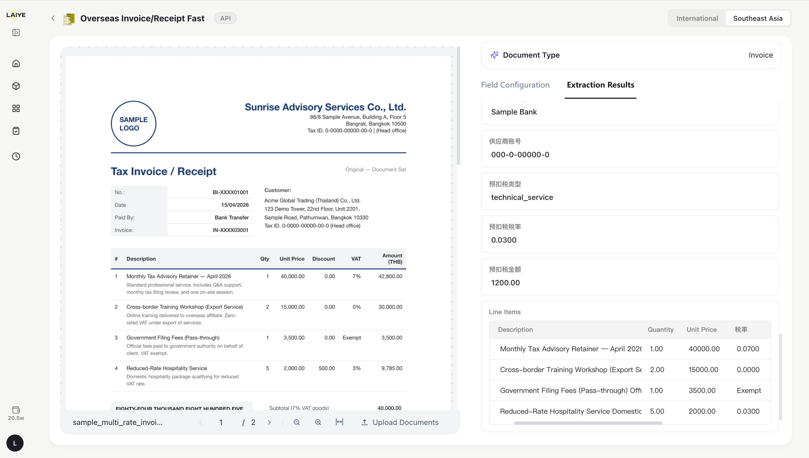

### Full MCP Protocol Compatibility to Enable Agent Integration 

To further enhance the open integration capabilities of the ADP platform, we have completed standard adaptation for MCP \(Model Context Protocol\) and enabled registered users to access MCP Servers flexibly\. All Agent platforms can now directly invoke ADP capabilities via the MCP protocol\.

- **Full MCP Protocol Support for ADP Atomic Capabilities **

    - The ADP platform is fully compliant with the universal MCP protocol\. We provide 17 out\-of\-the\-box standard tools, along with APIs for viewing and running custom applications, checking asynchronous task status and retrieving task results\. These capabilities cover all features for document parsing and data extraction\.

- **Flexible Access to MCP Server **

    - All registered ADP users can click the avatar card and enter My MCP to obtain the MCP Server URL\. Simply paste the URL into any Agent platform for configuration, and you can start using ADP functions without repeated identity authentication\.

### Agentic Workflow: New Data Query and Write Node

Agentic Workflow now introduces the new “Data Query and Write” node in the public cloud environment\. This node supports writing process data into a specified data table, or querying historical records from a data table for use in subsequent workflow steps\.

- **Write workflow results**: When a workflow generates data that needs to be stored, users can write the processing results into a specified data table for easier tracking, reuse, and analysis\.

- **Query historical records**: When later workflow steps need to reference historical data, users can query records from a target data table and pass the query results to downstream nodes for further processing\.

- **Automatically generated configuration**: The node configuration includes node name, target data table, and operation summary\. The intelligent assistant automatically creates the data table in the background based on the business requirement, and generates a one\-sentence operation summary to help users confirm the node behavior before publishing\.

### Agentic Extraction: Field Configuration \& Export Result Improvements

ADP has improved the field configuration and result export experience for custom extraction, helping users organize fields more flexibly and use extraction results more smoothly for evaluation, review, and downstream data processing\.

- **More flexible field configuration**: Custom extraction fields can now be reordered by dragging, and table fields support internal ordering, so exported results can follow the sequence required by the business\.

- **Export results are easier to process**: A new “Number” field type is available\. When exported to Excel, these fields are treated as numeric cells, making it easier to filter, summarize, and calculate with formulas\.

- **More complete result retention**: Parsed result exports can include image content\. Images are saved locally and referenced by file path in Markdown\. Custom extraction results exported to Excel can also include expected results, making evaluation and comparison easier\.

- **Human\-in\-the\-Loop results can be exported**: The Web interface supports exporting Human\-in\-the\-Loop results as Markdown, JSON, and Excel\. The exported content includes both the original extraction results and the user\-corrected results, supporting easier review, traceability, and system integration\.

## V1\.11 \(2026\.5\.7\)

### Ready\-to\-Use: Self\-Optimization Agent for Invoices and Receipts

The Agent learns from your manual corrections to extraction results\. With just 5 corrected samples, it can initiate model optimization — delivering increasingly accurate results over time\.

Learn more: Self\-Optimization Agent

- **Continuously improving recognition**: Learns from real user corrections to identify recurring error patterns and improve extraction quality for invoices and receipts\.

- **Lower maintenance effort**: Reduces the need to manually tune prompts or field rules\. The Agent generates optimization suggestions and validates them automatically\.

- **Controlled optimization rollout**: Every optimization is validated against historical documents and only takes effect after user confirmation, helping keep production results stable\.

### Ready\-to\-Use: Custom Fields for Invoices and Receipts

Invoice and receipt extraction now supports custom fields\. Users can add, delete, or edit extraction fields based on their business needs, and restore the default field set at any time\.

This makes it easier to adapt extraction to different countries, industries, document layouts, and business\-specific field requirements\.

### ADP Platform: Agentic Docflow

ADP introduces Agentic Docflow, a new way to create end\-to\-end document processing workflows with natural language\. Users can describe a business need, and the assistant will understand the task, plan the required steps, and generate a reusable workflow for document splitting, classification, extraction, review, and result consolidation\.

- **Create workflows with natural language**: Describe what you need in one sentence to generate workflows such as contract\-invoice consistency checks, bidding document classification, order anomaly review, or financial report analysis\.

- **Intelligent process planning**: ADP can automatically arrange parsing, classification, extraction, review, and result merging steps, reducing the effort required to build complex workflows\.

- **Conversational optimization**: Users can refine rules, adjust fields, and improve outputs through multi\-turn conversations instead of configuring every node from scratch\.

- **Built for complex document scenarios**: Supports mixed documents, long documents, multi\-document comparisons, financial report analysis, and other end\-to\-end document workflows\.

- **Reusable workflow apps**: Workflows can be saved, published, and reused, helping teams turn one\-time document processing experience into stable operational processes\.

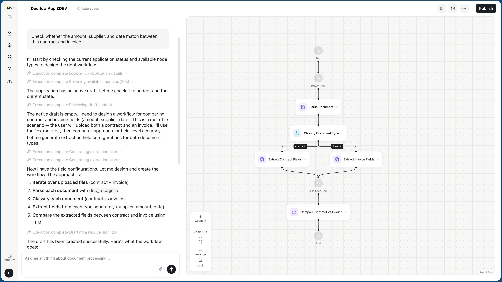

## V1\.10\.1（2026\.4\.24）

### ADP CLI: Officially Released

ADP CLI has been officially launched, fully supporting the invocation of all capabilities of ADP Open API through the command line, and simultaneously launching CLI Skill, seamlessly integrating ADP's intelligent document processing capabilities into various AI Agent ecosystems\.

- More convenient user authentication: Supports one\-click configuration with API Key \+ API Base URL, with persistent and long\-term valid authentication information stored locally, and supports real\-time updates and reconfiguration\.

- Seamless local file processing: Supports direct input of local file/folder paths for batch parsing and extraction; also compatible with URL/base64 dual\-mode input, outputting standard JSON structure without additional dependencies\.

- Full support for application configuration: Supports the creation, invocation, modification, deletion, and list query of custom applications through the command line, achieving a full functional closed\-loop operation without the need for a web interface\.

- Real\-time account asset viewing: Supports quick query of remaining points and available quotas in the account, real\-time display of asset status and billing information, facilitating usage control and cost planning\.

> CLI User Guide: [CLI User Guide](https://laiye-tech.feishu.cn/wiki/YIaawiK2DimisZk5KfDc8a8cnLh)
> 
> 

### CLI Skill Officially Released

CLI Skill has been officially launched, allowing the full capabilities of ADP to be integrated into various Agent platforms with just one sentence: "I want to use this skill: https://github\.com/laiye\-ai/adp\-cli", without complex configuration, environment preparation, or familiarity with ADP platform usage interaction, achieving true out\-of\-the\-box usability in the AI context\.

## V1\.10（2026\.4\.7）

### Open API: Authentication Optimization

Optimized API authentication logic, simplified the pre\-call authentication process for users, and improved usability

- **Authentication Method Optimization**: Optimize the user authentication logic before API calls, introduce a new API Key authentication method, where users only need to use one**API Key** to complete authentication, eliminating the need for additional cumbersome operations and significantly simplifying the authentication process\.

- **Optimization of API Key Entry**: Optimize the API Key viewing entry\. Users can quickly find the "My API" entry by clicking on their personal avatar, conveniently view and manage their own API Keys, and improve operational efficiency\.

- **Legacy User Compatibility**: To ensure the usage experience of legacy users, the original Access Key authentication method will be retained\. Legacy users can continue to use the original authentication method or switch to the new API Key authentication method, allowing for flexible choice\.

### Open API: Function Optimization

Open API whole\-link function upgrade, simplifying application call logic, enriching document parsing capabilities, and improving the application management system

- **Optimization of Application Invocation Logic:** Only one APP ID is required to invoke the corresponding application\. For existing users, the original authentication methods using APP Key and APP Secret will be retained\.

- **New Query Application List Interface**: After passing in the API Key, the interface can return**core information across all dimensions such as application name, application ID, and application tag**, helping users quickly sort, filter, and manage their applications, thereby improving operational efficiency\.

- **Upgrade of Out Of The Box Application Tags**: Added **default tags** for Out Of The Box applications to help Agents accurately filter product matches when autonomously invoking; meanwhile, opened up tag customization permissions, allowing users to set exclusive tags for applications via API to adapt to personalized business scenarios\.

- **New Application Configuration Interface**: Fully supports operation interfaces related to application configuration items, covering**creation, editing, deletion, and query**four basic capabilities; meanwhile, adds the**designated version deletion**function under the application, as well as the**AI\-generated extraction field prompt recommendation**function, improving the configuration efficiency of API users\.

- **Comprehensive Expansion of Document Parsing Interface:**New streaming return capability for document parsing has been added, suitable for real\-time result output during long document parsing, and relevant synchronous/asynchronous interfaces for document parsing have been supplemented and improved, including:

    - Streaming Document Parsing \(Synchronous Interface\)

    - Streaming Document Parsing \(Asynchronous Interface\)

    - Non\-streaming Document Parsing Creation Task \(Asynchronous Interface\)

    - Non\-streaming Document Parsing Query Task Results \(Asynchronous Interface\)

- **New Query API Asset Interface:** Users can directly query their remaining API assets and clearly understand the usage of their assets\.

## V1\.9（2026\.3\.10）

### Document Parsing: Performance Optimization for Long Document Parsing

The document parsing engine has been comprehensively upgraded, achieving a qualitative leap in processing speed for long documents containing hundreds of pages\.

- Based on the results of 6 test cases, for long documents averaging nearly **200 pages**, the parsing time was reduced from an average of approximately 2,146 seconds to just **36 seconds ，**with the parsing performance improving by over **98%** on average\. This drastically reduces user waiting time and significantly enhances the long document processing experience\.

### Subscription Payment: Optimization of Pending Payment Order Status

For payment failure scenarios, the information display on the user account management page has been optimized\.

- Fixed an issue where user identity and payment status were displayed inconsistently in certain scenarios, ensuring the accuracy and real\-time updates of order status, and guaranteeing a smoother and more reliable payment process\.

## V1\.8（2026\.2\.12）

### Document Extraction: Long Document Extraction Settings

For long document types, users can specify the range of document types to accurately extract fields\.

- **Specified Range Precise Extraction：** For long documents such as financial reports and bidding documents with 20\-300 pages, it enables the extraction of field data for specific document categories \(such as Balance Sheet, technical parameters, etc\.\) within a specified range, which is faster and more accurate than full\-text extraction\.

- **Overall Efficiency Improvement：** Automating the positioning and extraction processes has significantly enhanced the accuracy and overall efficiency of field extraction from long documents, and shortened the field extraction cycle\.

> For more information,please refer to [Long Document Extraction](https://laiye-tech.feishu.cn/wiki/OfexwgVUQiOpEek4kO7c7NEJnAe?fromScene=spaceOverview#share-IYrJdeuYNo0koYxG926cvffDnPe)\.
> 
> 

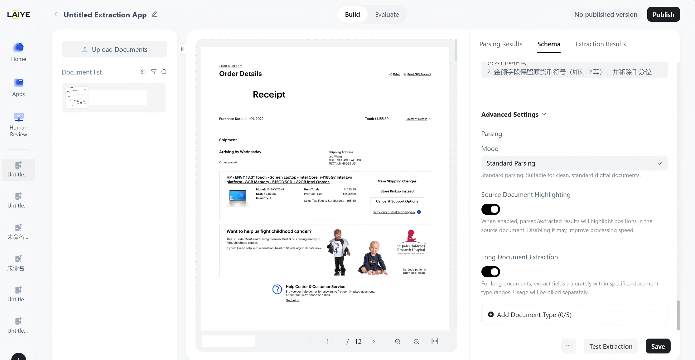

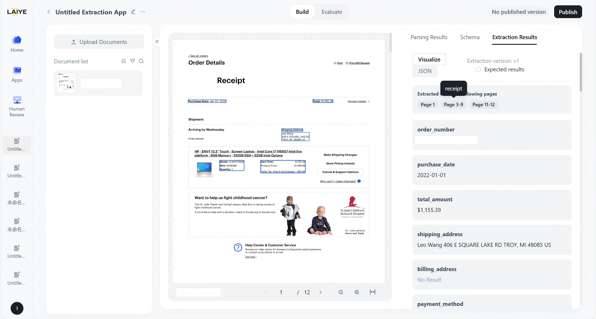

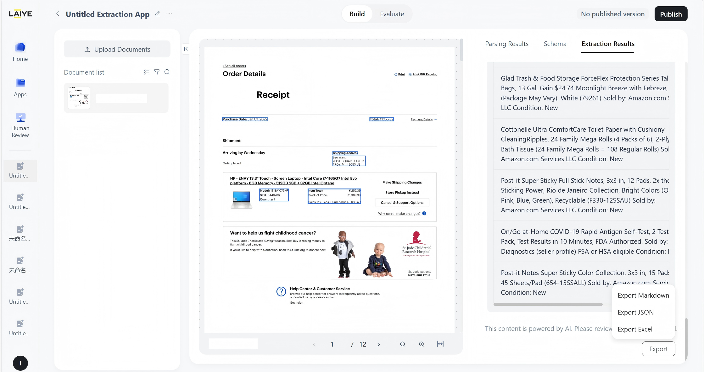

### Document Extraction: Prompt Generation Optimization

Leveraging domain expertise across diverse document types, the system automatically generates high\-quality, highly accurate extraction fields\. This enhances information extraction efficiency while reducing the complexity and cost of prompt debugging\.

- **Core Fields, High Quality \& Efficiency:** After prompt generation optimization, matching accuracy exceeds** 90%** across **10\+ **high\-frequency document fields, ensuring first\-pass extraction accuracy above 90% to help you quickly obtain reliable, precise information\.

- **Broad Support, Comprehensive Coverage:** Both Document Extraction App and Out\-of\-the\-Box features can automatically generate highly accurate extraction fields\. The product is widely applicable to various general documents \(e\.g\., invoices/receipts,  purchase orders, procurement contracts\), as well as specialized document types in finance \(e\.g\., performance report\), logistics and transportation \(e\.g\., Bill of Landing, Packing List\), and import/export trade \.

> For more information, please refer to [Configuring Schemas](https://laiye-tech.feishu.cn/wiki/OfexwgVUQiOpEek4kO7c7NEJnAe?fromScene=spaceOverview#share-THZFd2ypMopPRAx23e9c9pgCnZd)\.
> 
> 

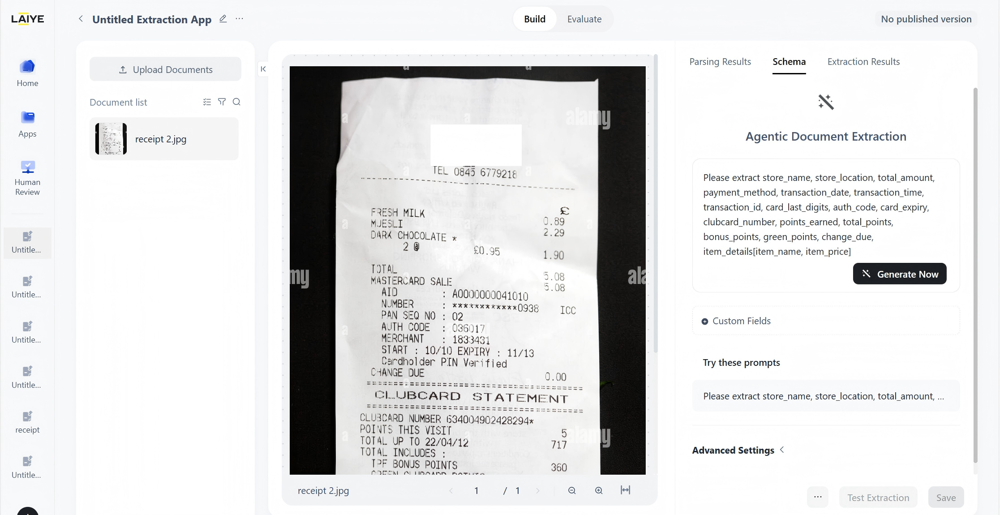

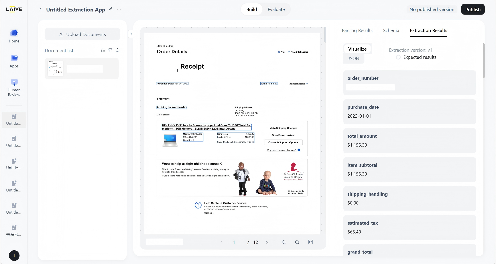

### Laiye ADP : Supports users' self\-service subscriptions

Laiye ADP offers comprehensive self\-service subscription management, enabling users to easily browse, purchase, upgrade, downgrade, or cancel subscription plans, and conveniently review historical transaction records\.

- **Flexible Plan Options: **Users can browse and compare different subscription plans, view benefits, pricing, and billing cycles for each option, and flexibly choose the plan that best fits their business needs\.** **

- **Convenient Subscription Management: **Users can check their subscription status, credits balance, and expiration dates in real time, and upgrade, downgrade, or cancel plans on demand\.

- **Transparent Records \& Tracking:** Users can access detailed order history, payment status, and real‑time updates for full financial visibility\.

> For more information,please refer to[ Credits Guide\.](https://laiye-tech.feishu.cn/wiki/OfexwgVUQiOpEek4kO7c7NEJnAe?fromScene=spaceOverview#share-DszHdoVGQocRnoxL9S9c2W3KnEd)
> 
> 

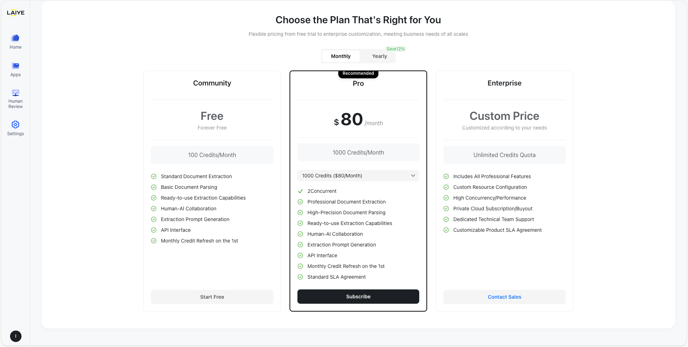

## V1\.7（2026\.1\.20）

### Brand\-New “Out\-of\-the\-Box” Capability Now Available: Zero Configuration, Instant Use

We’re excited to introduce a new **“****Out\-of\-the\-Box****” processing module** for overseas invoices, receipts, and purchase orders\. Unlike previous custom applications that require manual prompt configuration, this module is powered by industry\-tuned, universal models\.

Simply upload your document, and the system will automatically extract key fields with high precision — no configuration needed\. This reduces setup time to zero and delivers a dramatic improvement in both processing efficiency and accuracy\.

- **Zero\-Config Ready:** No prompt engineering needed\. Just upload and go\.

- **Instant Automation:** Immediate processing for a friction\-free workflow\.

- **All\-in\-One Coverage:** Supports Invoices, Receipts, and POs with 15\+ auto\-extracted fields\.

- **Expert\-Level Precision:** Pre\-tuned strategies that turn general models into document experts\.

- **Industry\-Leading Speed:** \>90% accuracy, \<20s per page\. 33% faster than before\.

> For more information, please refer to [Out\-of\-the\-Box](https://laiye-tech.feishu.cn/wiki/OfexwgVUQiOpEek4kO7c7NEJnAe#share-Ex0Udgr4Ro7MOLxGXIFcTpEOnYb) instructions\.
> 
> 

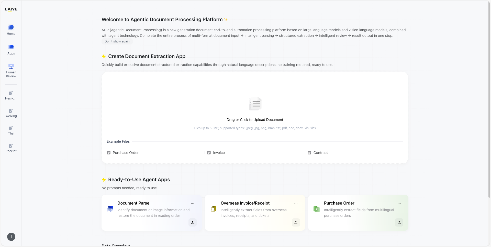

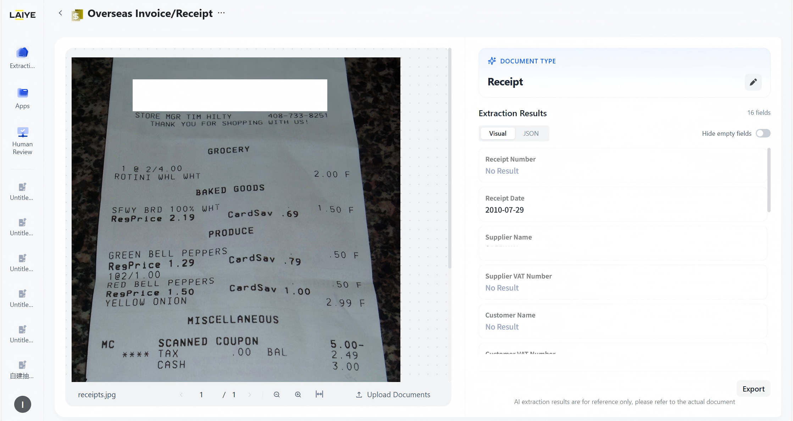

### Enhanced User Interface

- **Redesigned layout:** Updated homepage and app management UI for clearer data visibility and key metric insights at a glance\.

- **Improved interaction flow:** Streamlined advanced settings, prompt generation, config import/export, and history access to reduce clicks and increase efficiency\.

- **Upgraded Color Scheme:** Adopting a simple and graceful black\-grey color scheme, providing a more comfortable and immersive visual experience and smoother operation feeling\.

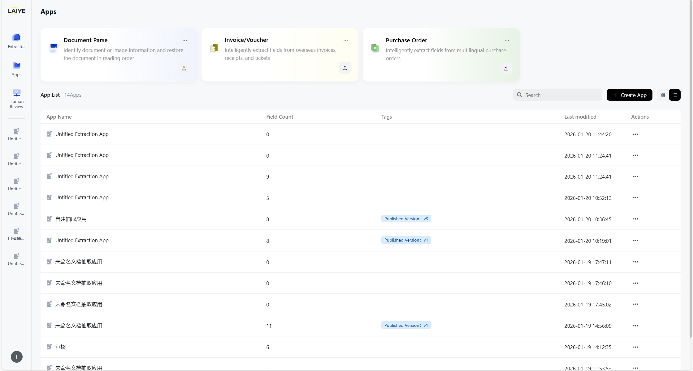

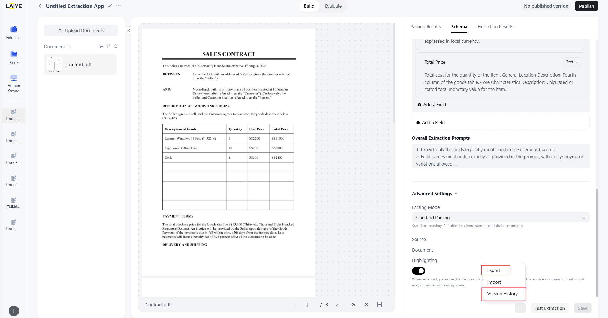

### Document Parsing: New Standalone Module

The document parsing capability is now available as a standalone feature\. You can upload a document directly — no extraction application setup required — to quickly understand and structurally reconstruct document information\.

**Use case:** Retrieve the full text and layout structure of a document\. If you need to extract specific key\-value pairs or individual fields, please continue using the **Document Extraction App**\.

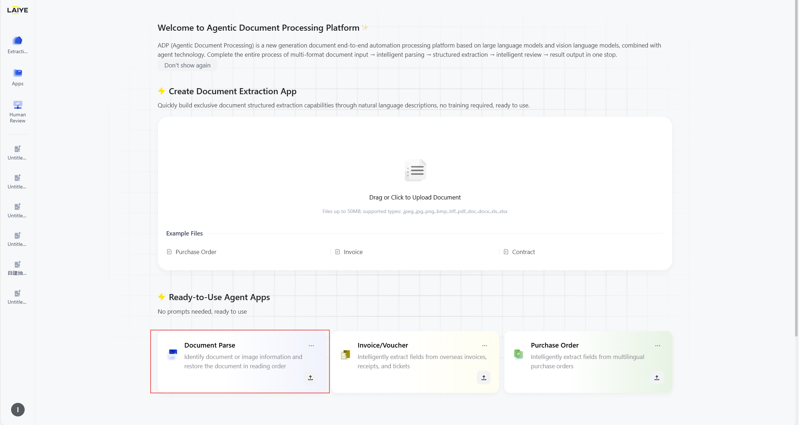

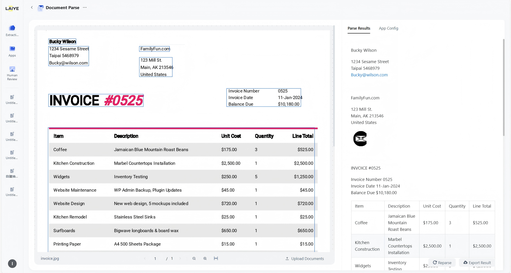

### Parsing Result Loading Optimization

- When uploading multi\-page documents, parsing results are returned page by page, allowing users to browse parsed results without long waits\.

- During the parsing process of multi\-page documents, if parsing fails, single pages can be re\-parsed\. Re\-parsing will also consume corresponding credits\.

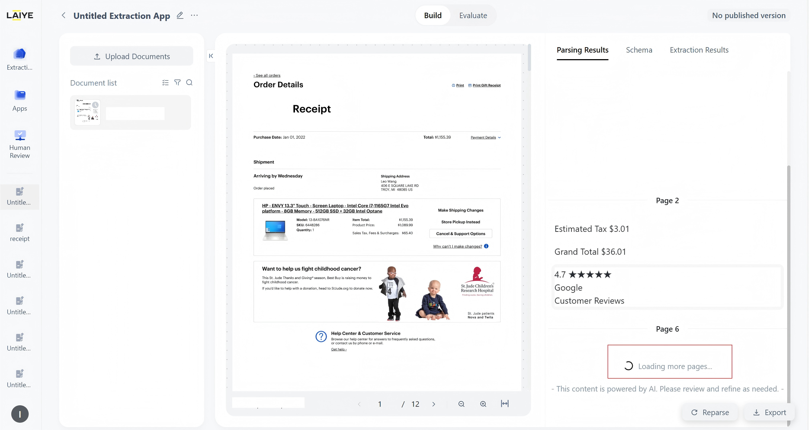

### Version Publish Optimization

After the current version is published, the system will automatically create a new version\.

- Users can make modifications on the new version, avoiding direct impacts of configuration changes on the published version and ensuring the stability of the production environment and historical versions\.

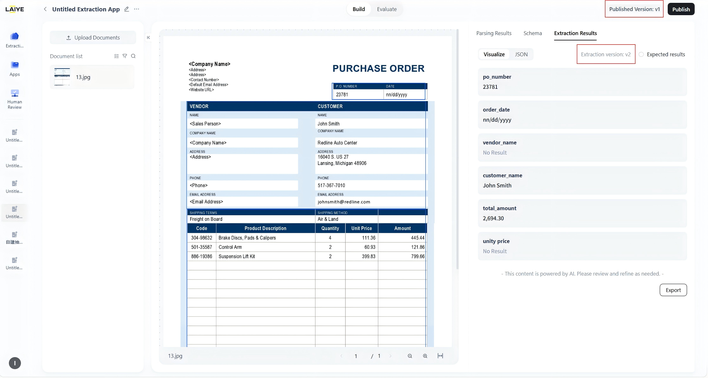

### User Feedback

Users can submit feedback and suggestions at any time to help continuously optimize and upgrade the product, enhancing user experience and satisfaction\.

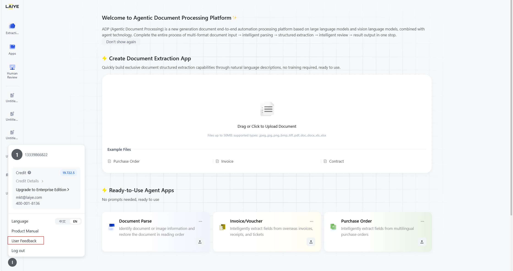

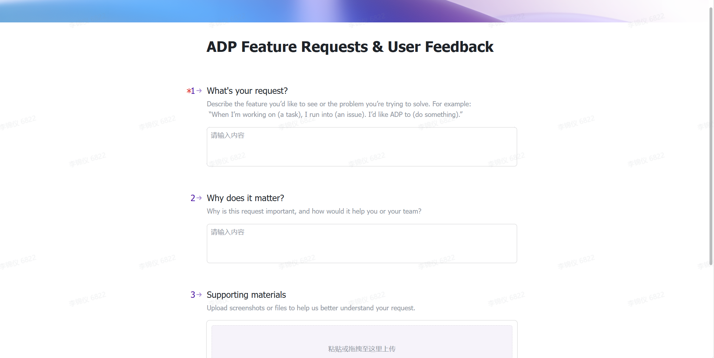

## V1\.6（2025\.12\.30）

### Application Configuration: Add Advanced Settings \(Parsing Mode \& Back\-Annotation\)

- In application configuration, users can configure advanced extraction options, including "Mode" \(Standard, Advanced, Agentic\) and "Highlight", to optimize the accuracy and traceability of document parsing based on specific user use cases\.

- Changes in configuration only apply to newly uploaded documents, with different operations and effects for saving or testing\.

> More details can be found in [Advanced Settings](https://laiye-tech.feishu.cn/wiki/OfexwgVUQiOpEek4kO7c7NEJnAe#share-HRbtdkOXzoWxXgx3tQXcdrEcndc)\.
> 
> 

### Parsing Result: Add Retry Parse

- In the parsing results, users can click "Retry Parse" to apply the latest advanced configuration settings to re\-parse the currently previewed document\.  

- "Retry Parse" requires consuming parsing credits\.

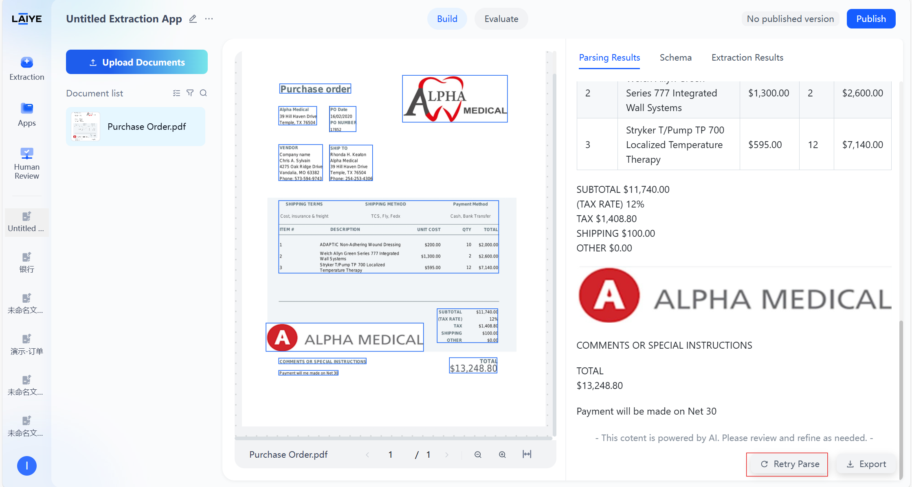

### Document Processing: Add Batch 

A “Batch” option has been added to the document list, allowing users to select multiple or all files for batch testing or batch deletion\.

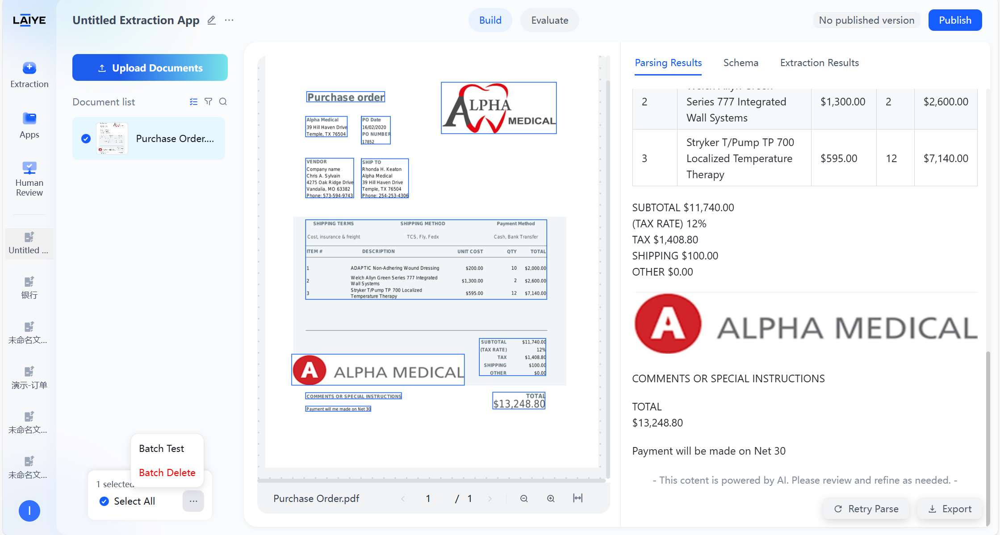

### Extraction Results Exportable to Excel

Extraction results can be exported in Excel format for easier subsequent data entry\.

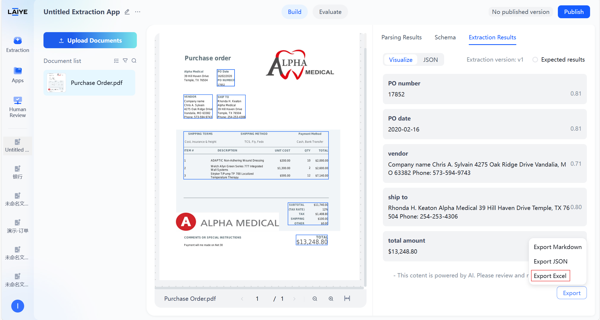

### View Credits Records

- Users can view credit source, used credits, credit expiration date, etc\. through “View Usage”\.

- Users can invite new users to earn additional credits; new users who register via the invitation link will also receive corresponding credits upon their first login\.

> More details can be found in the [Credits Guide](https://laiye-tech.feishu.cn/wiki/OfexwgVUQiOpEek4kO7c7NEJnAe#share-RRRMd4PNjo7R6MxO0KGcdDuEnyf)\.
> 
> 

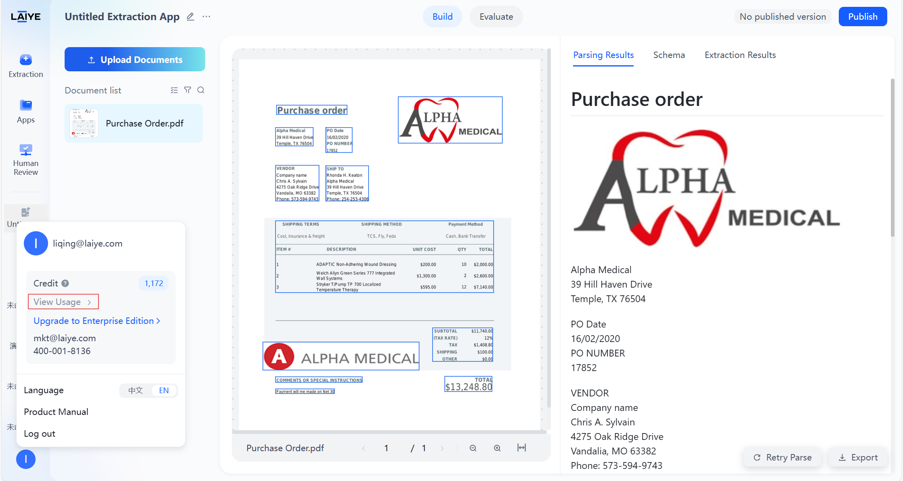

## V1\.5（2025\.12\.9）

### Support self\-registration

Laiye ADP V1\.5 supports users in self\-registering, logging in, and resetting passwords without relying on complex private deployment processes, allowing them to effortlessly experience the entire Agentic Document Processing  procedure\.

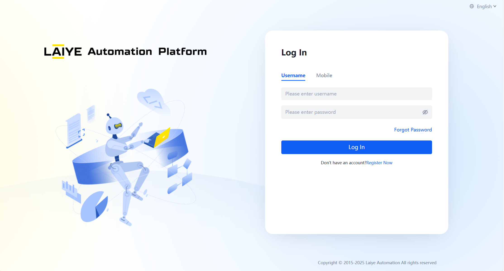

### Unified credits settings

A unified credits billing standard is set up, charging based on the consumption of credits for different tasks\.

|Tasks|Credits|
|---|---|
|Parse|0\.5|
|Extract|1|
|Human\-in\-the\-loopcollaboration|2|

> 📌 Note：  
> 
> More details can be found in [Credits Guide](https://laiye-tech.feishu.cn/wiki/OfexwgVUQiOpEek4kO7c7NEJnAe#share-RRRMd4PNjo7R6MxO0KGcdDuEnyf)\.
> 
> 

### Uploading a large number of documents is smoother

Say goodbye to lag; uploading large quantities of documents simultaneously is now smoother\. \(Up to 100 documents per upload, with each document having up to 100 pages\.\)

> (注：内容由 AI 生成，请谨慎参考）
