# ADP 公有云版 操作手册

# 智能体文档抽取

## 概念说明

### **应用**

指用户在 ADP中创建的、用于实现特定文档抽取功能的实例。 用户需通过 “创建应用 \- 配置应用 \- 测试应用” 的路径完成应用构建，最终可通过 API 方式调用，实现外部系统的智能文档抽取能力集成。

### **配置**

指定义文档抽取规则的具体设置，包含两部分：

- 字段配置：需配置字段名称、字段类型、字段描述。

- 整体抽取要求：用自然语言描述全局规则。

### **字段**

指应用配置中需要从文档中抽取的具体数据项。


## 快速开始

仅需三步，就可以完成一个文档抽取应用的快速搭建。

### 第一步：创建应用

登录ADP平台，点击左侧主导航栏的“创建抽取”按钮，进入创建应用页。在右侧区域将待抽取的文档上传到应用内，即可完成抽取应用的快速创建。

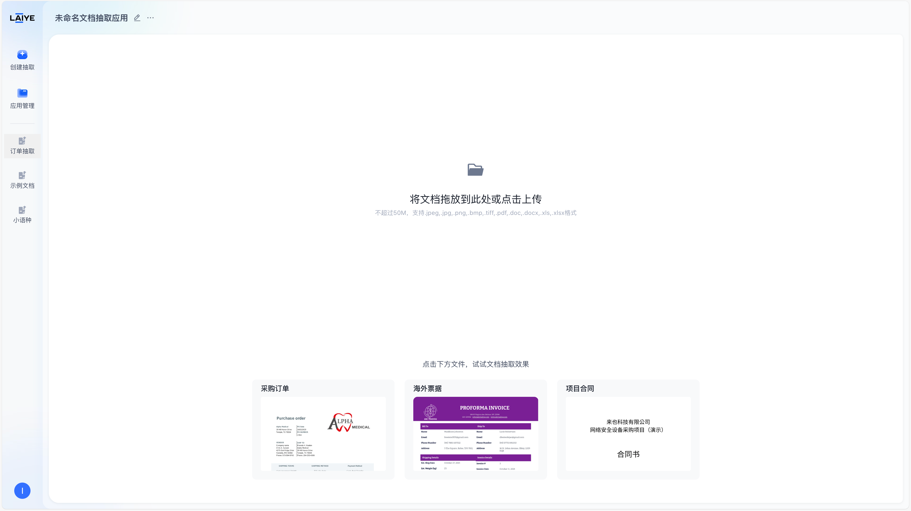

单次最多上传10份文档，每份文档上限300页，大小不超过50M。支持上传如下文档格式： 

|**文档类型**|**支持格式**|
|---|---|
|图片|\.JPEG, \.JPG, \.PNG, \.BMP, \.TIFF|
|PDF|\.PDF|
|Microsoft Excel|\.XLSX, \.XLS|
|Microsoft Word|\.DOCX, \.DOC|

> 您也可以选择平台预置的示例文档，测试文档抽取应用的功能和效果。
> 
> 


### 第二步：配置抽取规则

完成应用创建后，平台支持通过如下3种方式配置应用的抽取规则：

- 方式一：基于自定义提示词生成配置

- 方式二：基于推荐指令生成配置

- 方式三：手动填写配置表单 

> 详细的操作说明和步骤可跳转至[对应章节](https://laiye-tech.feishu.cn/wiki/UDYIwG42pisBbFkJI39ctpeKnWh?fromScene=spaceOverview#share-WmNGd8HpNoZlKQxwKnxcLWakn1d)查看。
> 
> 


### 第三步：测试和调用

配置抽取应用的过程中，您可以随时点击“测试”按钮，在当前预览的文档上快速验证配置的抽取效果。测试的结果支持复制和导出。详细操作步骤见测试抽取配置。 完成抽取应用的配置后，点击“保存”按钮，将更新最新版本的抽取配置。


## 配置应用规则

为了让您尽可能简单快速地完成抽取应用的搭建，平台提供如下3种方式配置应用的抽取规则：

- 方式一：基于自定义提示词生成配置

- 方式二：基于推荐指令生成配置

- 方式三：手动填写配置表单


### 方式一：基于自定义提示词生成配置

完成文档上传后，您可以用自然语言描述您的抽取需求，文档抽取智能体会根据您的描述自动生成抽取的字段配置和整体抽取要求。这适用于抽取要求明确的业务场景。


**操作步骤**

1. 在提示词输入窗口填写文档抽取的需求。为了获得较为准确的抽取配置，提示词中建议包含：

- 待抽取的字段名称（如：订单号、客户名称、联系人信息）

- 对字段简单的描述（如：交易金额为小写数字、交货日期是客户要求的履约截止时间）

- 整体抽取要求（如：公司名称统一按原文语言返回，其他字段小语种需要翻译，英文和繁体不翻译）

如果想了解更多关于提示词撰写的方法，可查看[提示词模板最佳实践](https://laiye-tech.feishu.cn/wiki/JJXZwBoirik76pk7nV6cGjYbnwg)

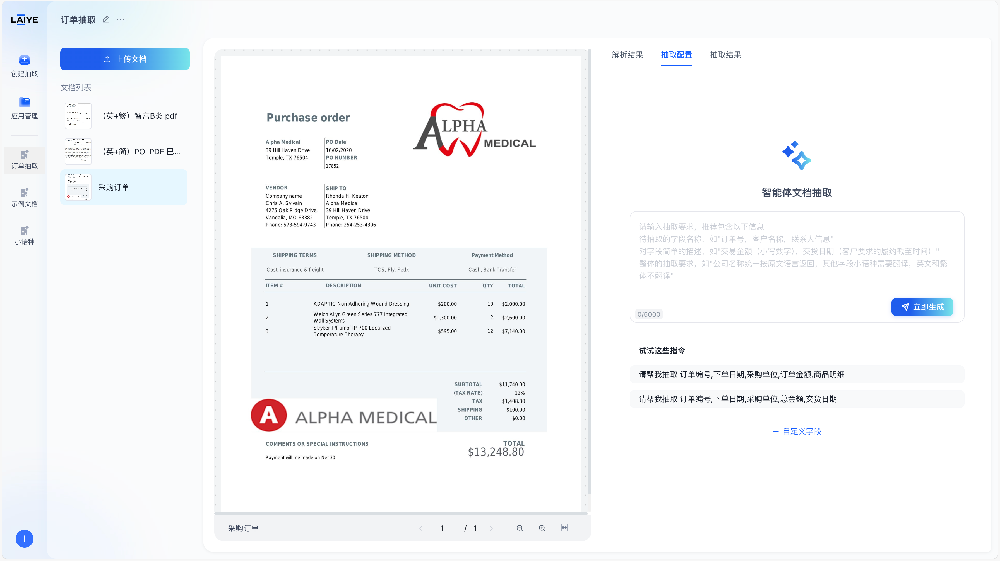

2. 完成提示词编写后，点击“立即生成”按钮，即可得到一个结构化的抽取配置。您可以根据具体的业务需求在配置页进一步修改待抽取的字段和整体抽取要求。

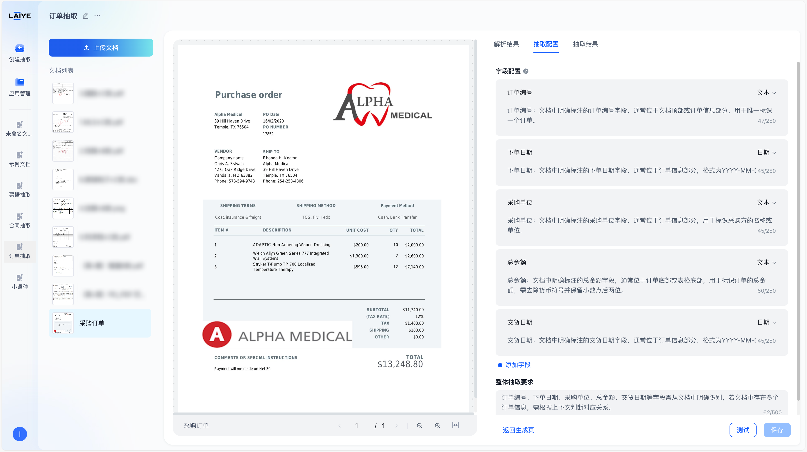

3. 完成抽取应用的配置后，点击“保存”，将更新应用的API配置，或点击“测试”，可快速验证抽取配置在当前预览文档上的抽取效果。


### 方式二：基于推荐指令生成配置

除了自定义抽取的提示词以外，您也可以基于推荐指令生成应用的抽取配置。推荐指令是智能体根据待抽取文档的文本内容和逻辑结构自动生成的配置提示词。这适用于应用搭建者对文档内容不熟悉或抽取要求不明确的场景。


**操作步骤**

1. 点击推荐指令，即可快速生成应用的抽取配置。

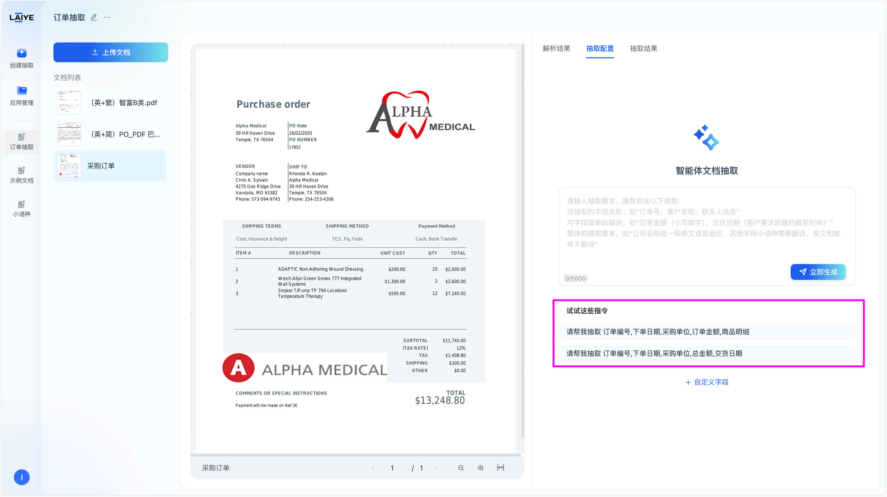

2. 您可以根据具体的业务需求在配置页进一步修改待抽取的字段和整体抽取要求。


3. 完成抽取应用的配置后，点击“保存”，将更新应用的API配置，或点击“测试”，可快速验证抽取配置在当前预览文档上的抽取效果。


### 方式三：手动填写配置表单

如果您希望从空白的表单开始完成抽取应用的配置，可以点击抽取配置页的“自定义字段”按钮直接进入配置填写页。

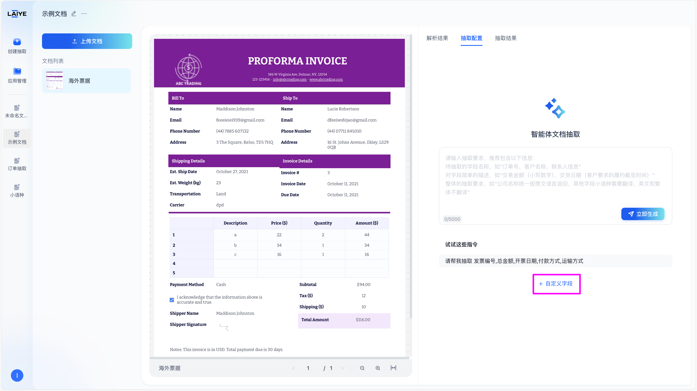


**操作步骤**

1. 点击“添加字段”，填写字段名称、类型和描述。已添加的字段支持随时修改和删除。

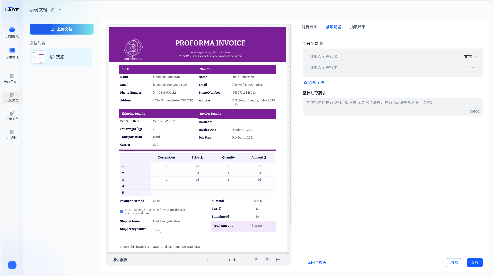

|**配置项**|**说明**|
|---|---|
|字段名称 \[必填\]|待抽取的字段名。|
|字段类型 \[必填\]<br></br>|支持文本、日期、表格三种字段类型。<br></br>- 文本：包括字符串、数值、数组等数据类型。<br></br>- 日期：选择该字段类型后，智能体会在抽取时将输出格式规范为`YYYY-MM-DD`的格式。<br></br>- 表格：表格字段是具有层级结构的字段，一个表格字段包含多个子字段，每个子字段对应表格的一列。如订单信息（商品名称、单价、数量）。|
|字段描述 \[选填\]|字段描述内可包含字段含义、常见格式、在文档中常见位置、字段别名等，如：<br></br>> 客户地址是公司注册地址或办公地址（含义），格式含省市区街道门牌号（常见格式），通常列于客户名称下方或独立地址栏（常见位置），常用标识字段，如"需方地址"\|"甲方地址"\|"买方地址"（别名），注意跨行地址要提取完整（其他补充规则）<br></br>> <br></br>> |

2. 填写整体抽取要求（选填）。整体抽取要求是适用于多个字段的抽取规则，包括缺失值/异常值处理、抽取结果后处理规则等，如：“数量、金额和单价只提取数字部分，去除货币符号、单位”。

3. 完成抽取应用的配置后，点击“保存”，将更新应用的API配置，或点击“测试”，可快速验证抽取配置在当前预览文档上的抽取效果。


### 返回生成页

如果您对生成的配置不满意，希望重新调整提示词或使用系统推荐的提示词，可以随时点击表单页下方的“返回生成页”按钮，回到配置的初始界面。 

**注：此操作将清空当前页面上的所有配置，且不可恢复。**

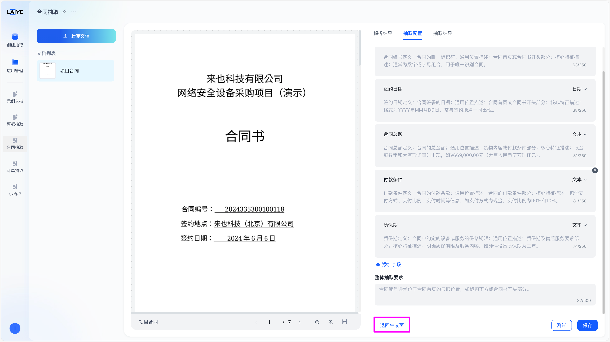


### 配置版本管理

为便于对不同提示词的效果进行对比和调优，ADP支持多版本配置管理功能：


**版本保存与管理**

- 支持将抽取配置保存为不同版本，每个版本都有独立的字段配置和整体抽取要求。

- 可为版本设置有意义的名称，便于识别和管理。

- 支持查看、重命名或删除配置的历史版本。


**版本对比与优化**

- 可在不同版本间对比抽取效果，选择最优配置。

- 支持在历史版本的基础上继续编辑，快速迭代优化。

- 可将任意指定版本发布至生产环境，供API调用使用。


**操作步骤**

1. 在配置页面完成抽取规则设置后，点击"保存"按钮，自动生成首个版本。

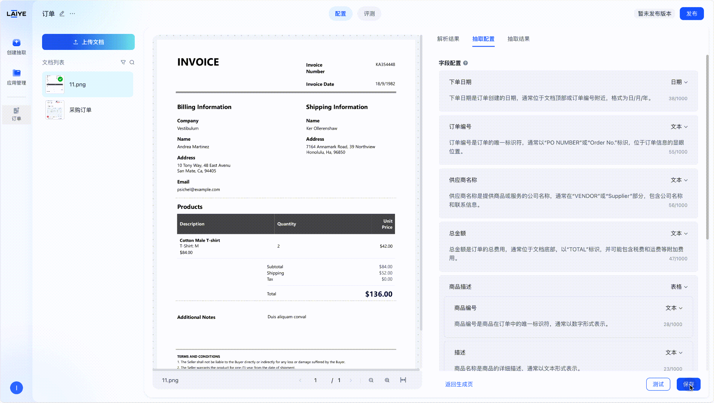

2. 在历史配置页面可查看所有已保存的版本，进行比较和管理。

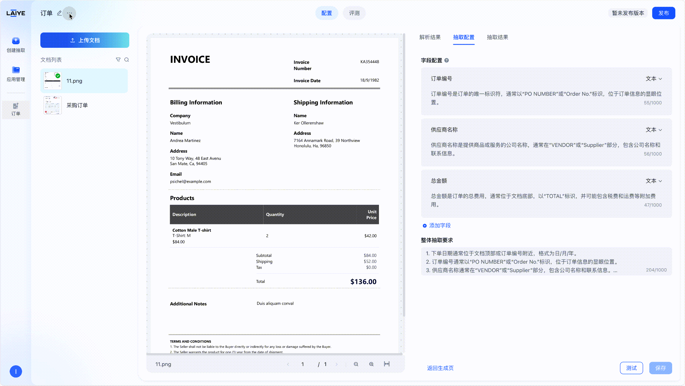

3. 选择需要发布的版本，点击“发布”完成部署。 

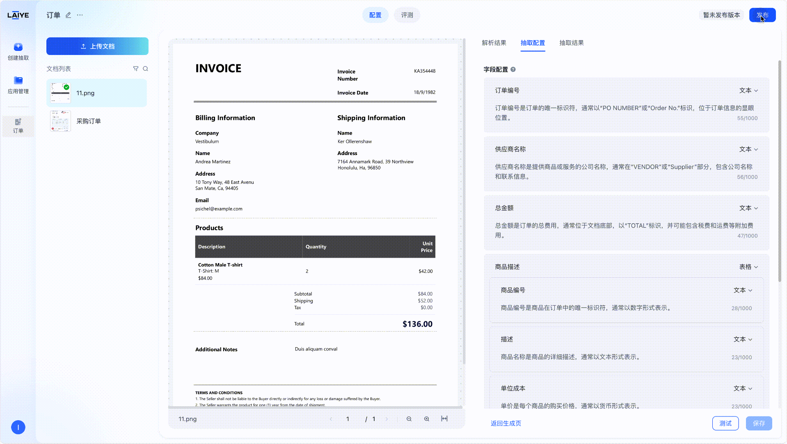


### 配置导入导出

为便于团队协作和配置复用，ADP支持抽取配置的导入导出：


**配置导出**

- 支持将当前抽取配置导出为\.config 格式文件。

- 导出文件包含字段名称、字段描述、整体抽取要求等完整数据。

- 便于配置备份、团队共享和版本管理。


**配置导入**

- 支持导入从ADP平台导出的配置文件。

- 可在导入基础上进行修改和优化。


**操作步骤**

1. 在待导出应用\-配置\-历史配置页面，选择需要导出的配置版本，点击【···】\-【导出】按钮。

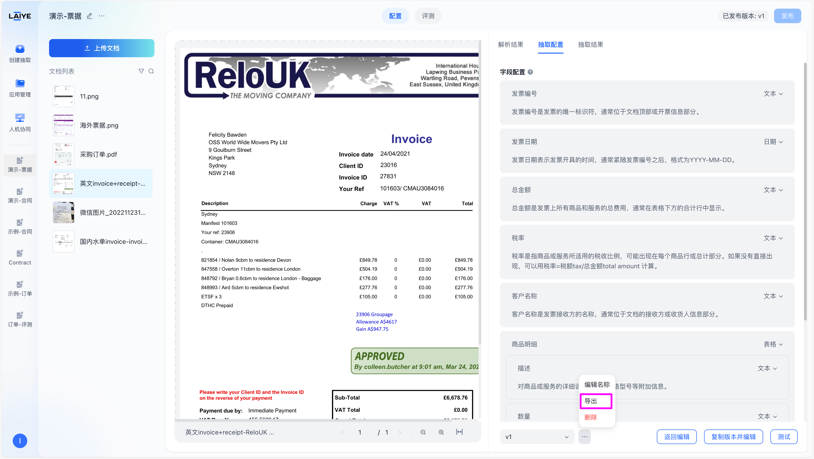

2. 下载生成的\.config 配置文件。 

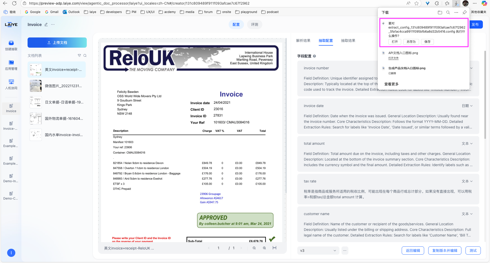

3. 在目标应用\-配置\-抽取配置页面，点击【导入】按钮。 

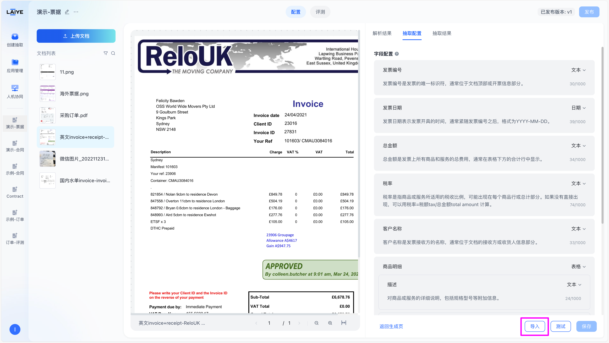

4. 上传配置文件，成功后自动导入为新的配置版本。


### 高级配置：解析模式与原文回标

- 用户可配置高级抽取选项，包括【解析模式】（标准、增强、智能体）和【原文回标】，以便根据用户的特定用例优化文档解析的准确性和可追溯性。

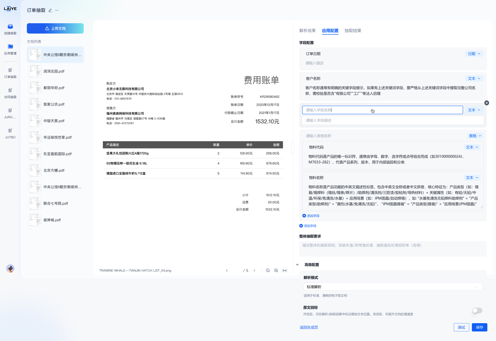

|配置项|选项|描述|
|---|---|---|
|解析模式|标准解析|适用于标准、清晰的电子版文档|
||增强解析|适用于印章、签名、多表格等版式复杂的文档|
||智能体解析|智能组合多个模型进行解析，显著提升复杂文档的解析稳定性|
|原文回标|开/关<br></br>|开启后，可在解析/抽取结果中标注原始文本位置。<br></br>关闭后，可提升文档处理速度|


> 说明 ：  
> 
> - 修改解析模式和原文回标的配置后，若选择【保存】，新配置效果不应用于历史文档，仅在配置更改后新上传的文档上生效。
> 
> - 修改解析模式配置后，若选择【测试】，将会刷新当前预览效果，重新识别当前文档，并扣除相应积分。
> 
> - 关闭原文回标后，解析结果、抽取结果、人机协同结果均不显示回标结果。
> 
> - 三种解析模式\(标准、增强、智能体）均消耗同样的积分。
> 
> - 【增强解析】无原文回标配置。
> 
> 


### 高级配置：长文档抽取配置

- 用户可配置【长文档抽取配置】选项，指定文档类型范围，高效精准抽取特定文档类别字段。

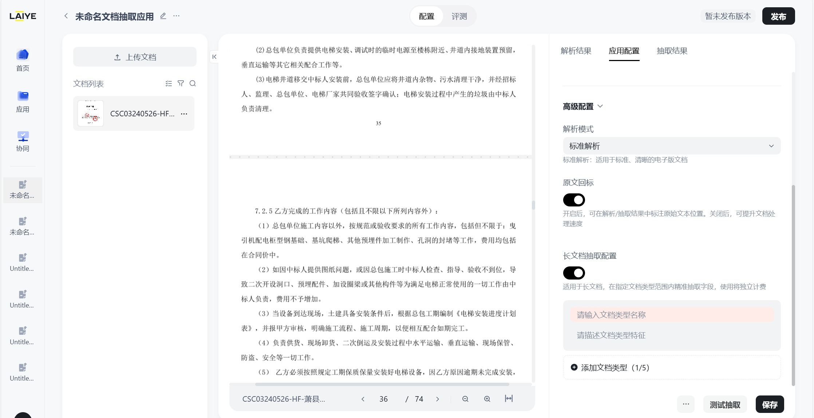

**操作步骤**

1. 在应用配置的高级配置里，开启“长文档抽取配置”开关

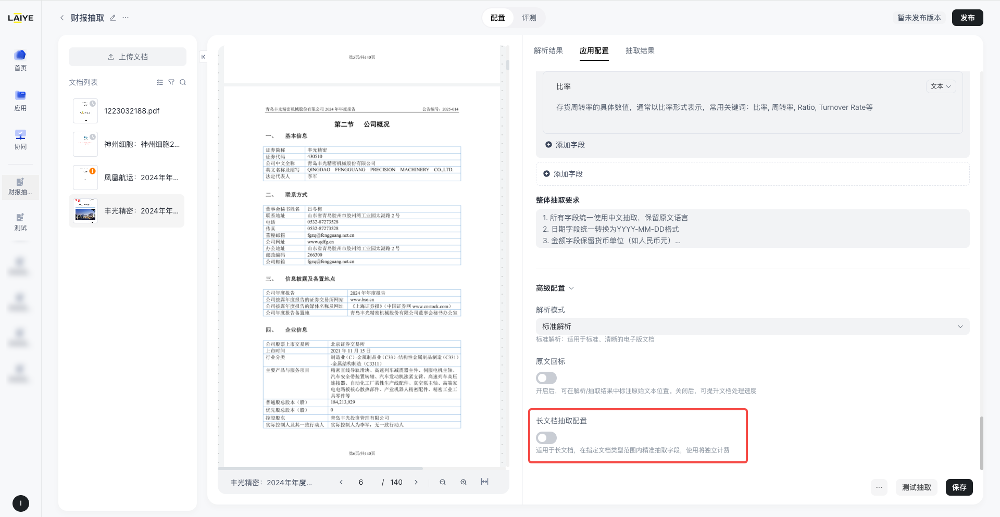

2. 输入【文档类型】和【文档特征】

    1. 最大可支持输入5种文档类型

    2. 文档描述不支持输入页码范围

    3. 文档特征写法可参考[最佳提示词实践](https://laiye-tech.feishu.cn/wiki/UDYIwG42pisBbFkJI39ctpeKnWh?fromScene=spaceOverview#share-NQ6sdzqkFoEc8MxdAVRc6nblnyd)。

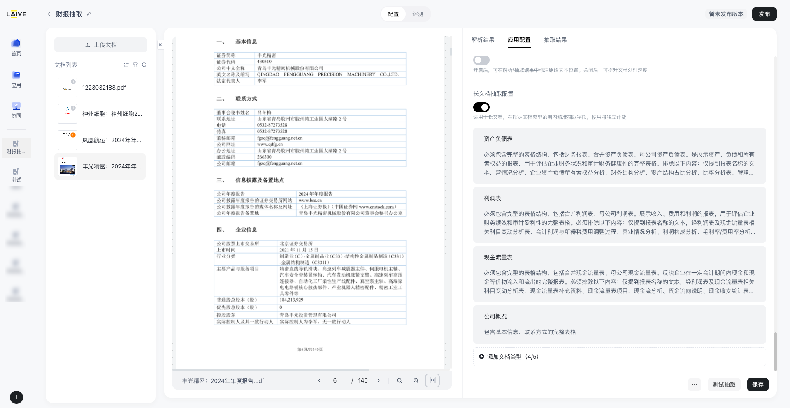

3. 平台自动定位指定范围进行精准抽取，并展示抽取结果。

    1. 点击页码标签支持原文回标，并展示页码范围所属文档类型。

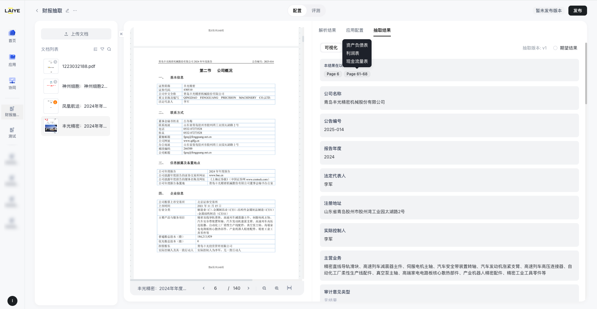

    2. 抽取结果支持可视化视图/JSON视图切换，支持导出为JSON、EXCEL、Markdown格式，支持导出页码范围。

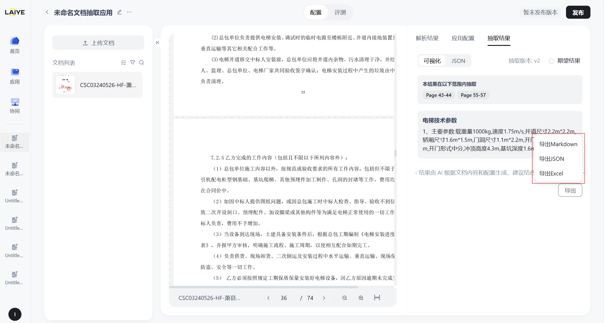

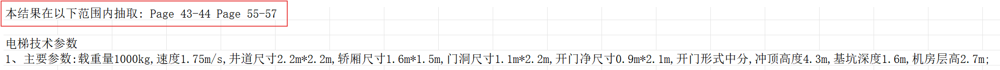

**长文档抽取配置输入指南：**

文档类型：请为该类文档定义一个**简洁、无歧义**的名称（如：身份证、资产负债表、电梯参数）
类型描述：请描述如何识别这类文档，需包含其**含义、核心结构与格式、常见位置、别名及关键规则**。
    复杂文档可包含的维度如下：
        \- 含义/用途：这类文档是什么？主要用途是什么？
        \- 核心内容与结构：其必须包含的关键内容项和典型文档结构是什么？（如：表格、数值）
        \- 在复合文档中的常见位置：在复杂文件中，它通常出现在什么部分或顺序？\(如：通常在“技术规格”章节\)
        \- 别名或变体名称：它有哪些常见的其他叫法或变体？
        \- 关键识别规则与排除项：识别时必须注意的特殊规则是什么？必须排除哪些相似文档？

**长文档抽取配置最佳实践：**

**适用场景：财报**

文档类型：资产负债表

类型描述：必须包含完整的表格结构，包括合并资产负债表、母公司资产负债表。是展示资产、负债和所有者权益的报表，用于评估企业财务状况和审计财务健康性的完整表格。排除以下内容：仅提到报表名称的文本，营情况分析、企业资产负债所有者权益分析、财务结构分析、资产结构占比分析、比率分析表、管理层讨论与分析中的统计表、仅展示部分资产或负债项目的表格

文档类型：利润表

类型描述：必须包含完整的表格结构，包括合并利润表、母公司利润表。展示收入、费用和利润的报表，用于评估企业财务绩效和审计盈利性的完整表格。必须排除以下内容：仅提到报表名称的文本，经利润表及现金流量表相关科目变动分析表、会计利润与所得税费用调整过程、营业情况分析、利润构成分析、毛利率/费用率分析表、经营成果分析表、管理层讨论与分析中的利润统计表、仅展示收入或费用部分项目的表格、以占比、变动比例、同比分析为主的不完整或分析性表格。

文档类型：现金流量表

类型描述：必须包含完整的表格结构，包括合并现金流量表、母公司现金流量表。反映企业在一定会计期间内现金和现金等价物流入和流出的完整报表。必须排除以下内容：仅提到报表名称的文本，经利润表及现金流量表相关科目变动分析表、现金流量表补充资料、现金流量表项目、现金流分析、资金流向说明、现金收支统计表、经营活动现金流分析表、管理层讨论中的现金流说明表。

**适用场景：电梯技术参数**

文档类型：电梯参数

类型描述：描述与"电梯技术参数、标准、要求、规定"有关的信息的完整章节。完整章节范围 ：从该章节的标题页 到 下一个章节标题页的前一页。该章节中可能包含：功能配置、符合国家标准的规定、技术要求、甲方要求、电梯主要技术规格、技术参数、性能指标、分项报价表、设备清单。在招标或者合同文档中，通常位于"供货要求"、"技术规格"、"分项报价表"、"设备清单"等部分。严格排除：仅提及名称而没有具体参数的文本。

## 

## 查看抽取结果

### 测试抽取配置

**操作步骤**

1. 配置抽取应用的过程中，您可以随时点击“测试”按钮，在当前预览的文档上快速验证配置的抽取效果。

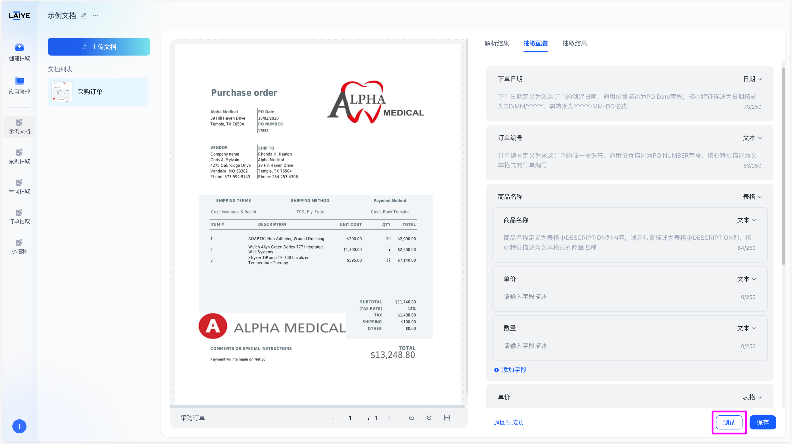

2. 抽取结果以可视化和JSON两种视图展示。

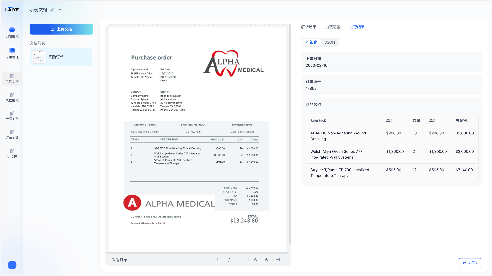

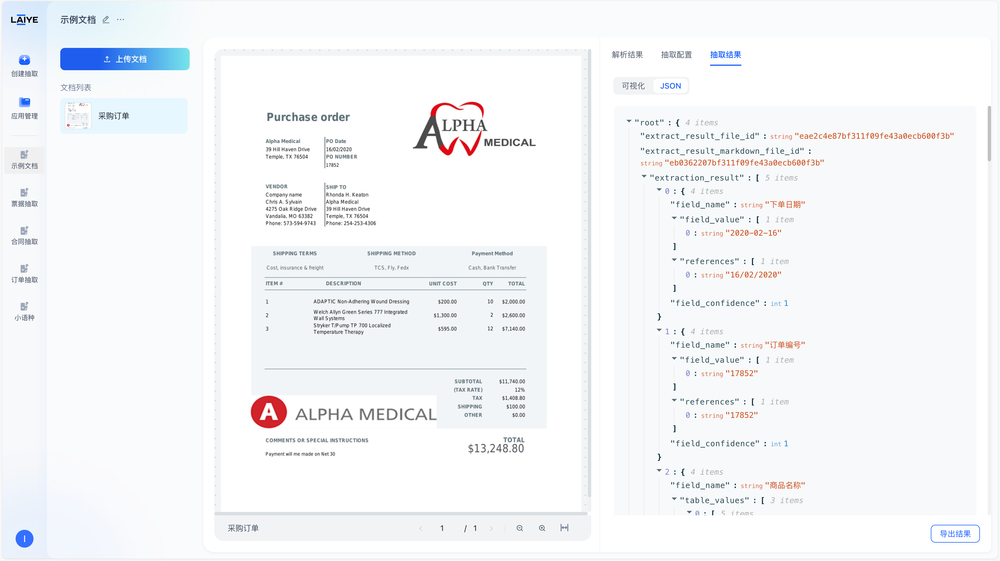

3. 您可以将测试的抽取结果复制或导出至第三方应用进行下游的处理操作。

- 在“可视化”视图下点击“导出结果”按钮，可导出Markdown格式的测试结果；在JSON视图下点击“导出结果”按钮，可导出JSON格式的测试结果。

- JSON视图下鼠标hover到对应的字段处，可点击复制按钮复制该字段的结构化抽取信息。

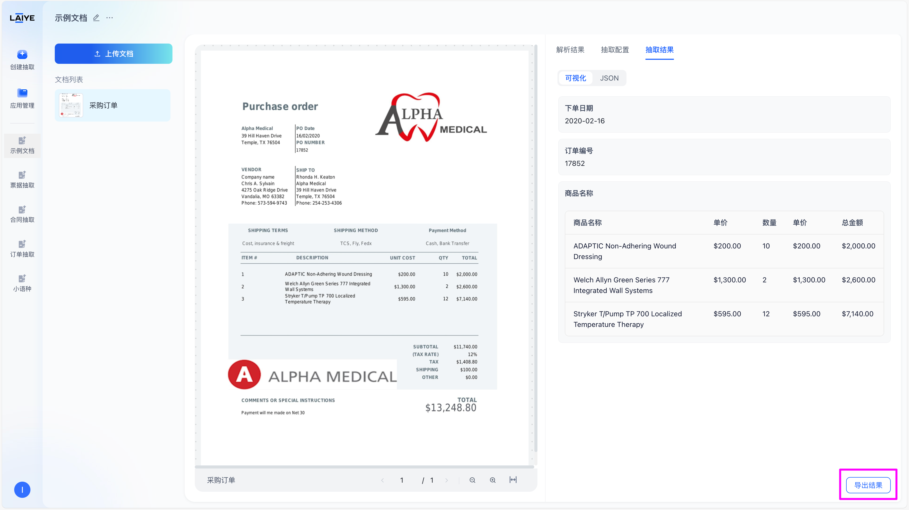

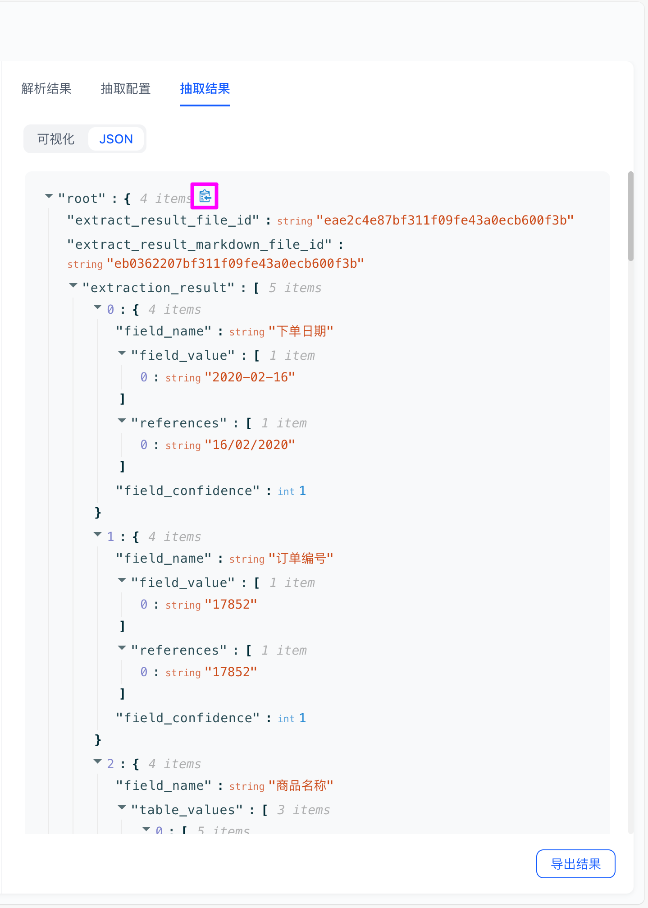


### 置信度

为帮助用户快速识别抽取结果的可靠性，ADP为每个抽取结果提供字段级置信度评分：


**置信度评分机制**

- 置信度分数范围为0\-1，数值越高表示模型对该字段抽取结果的信心越强。

- 置信度与识别准确率呈正相关，即置信度越大，识别准确的概率越高。

- 支持为不同字段设置置信度阈值，用于触发人工审核（详见人机协同章节）。

**置信度应用**

- 快速定位问题：重点关注低置信度字段，进行人工复核和优化。

- 审核规则触发：可基于置信度阈值配置自动审核规则。

- 效果评估：通过置信度分布评估抽取配置的整体效果。


## 查看解析结果

### 文本类型标签

用户将文档上传到应用后，智能体会自动开始解析文档的内容和结构。解析完成后，可以在“解析结果”tab下查看文档经过VLM模型解析后的Markdown预览结果。支持识别文档的多级标题、页眉页脚、表格等复杂元素。 


**支持的文本类型**

- 注释：文档中的备注、说明文字

- 公式：数学公式、计算表达式

- 正文：文档的主要内容段落

- 页脚：页面底部的信息，如页码、版权信息

- 页眉：页面顶部的信息，如标题、章节名

- 图片：图像、图表等视觉元素

- 章节标题：文档的章节划分标题

- 标题：各级标题和子标题

- 表格：结构化的数据表格


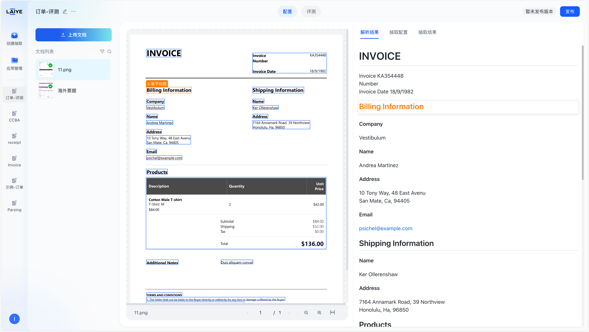


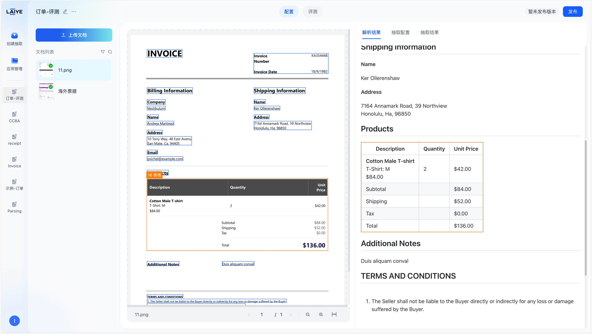

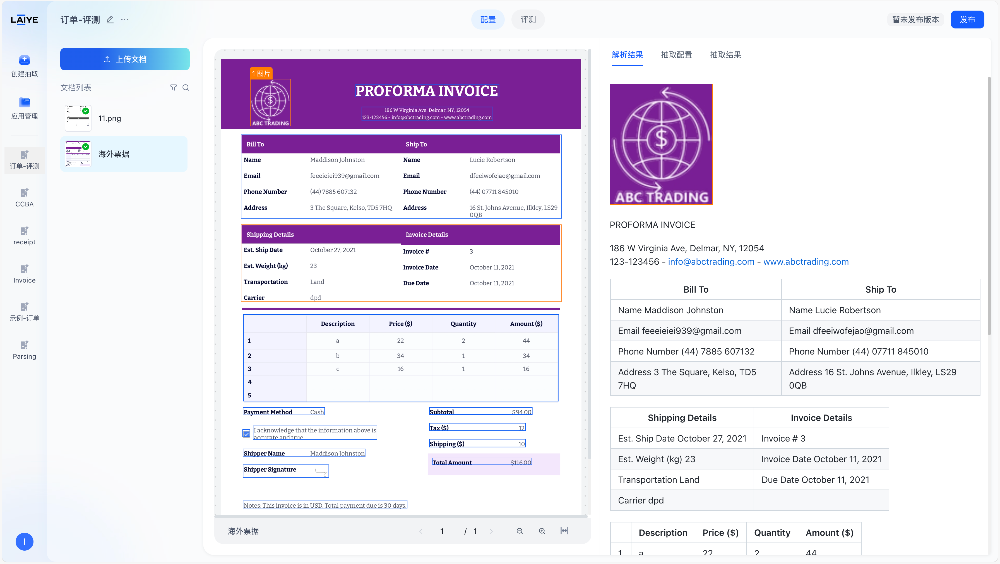

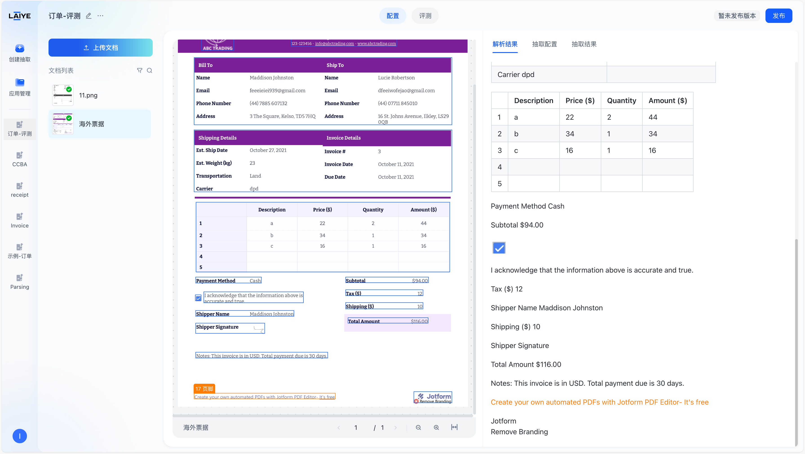

**标签应用**

- 辅助模型理解文档结构，提升复杂版式文档的抽取准确率

- 用户在结果页可直观查看各段文本类型，便于分析模型识别效果与版面特征

- 支持基于文本类型进行智能筛选和检索


### 解析结果导出

支持将文档解析结果导出为Markdown文件：


**导出内容**

- 完整的文档解析结果，包括文本类型标注。

- 结构化的内容展示，保持原文档的层次结构。

- 支持包含表格、标题等复杂元素。


**应用场景**

- 直接复用解析结果做下游处理。

- 构建企业知识库和数字化资产中心。

- 与外部系统进行数据对接和集成。


## 解析/抽取结果原文回标

解析/抽取结果可在原文中自动定位并高亮显示，帮助用户快速核对字段与原文对应关系：

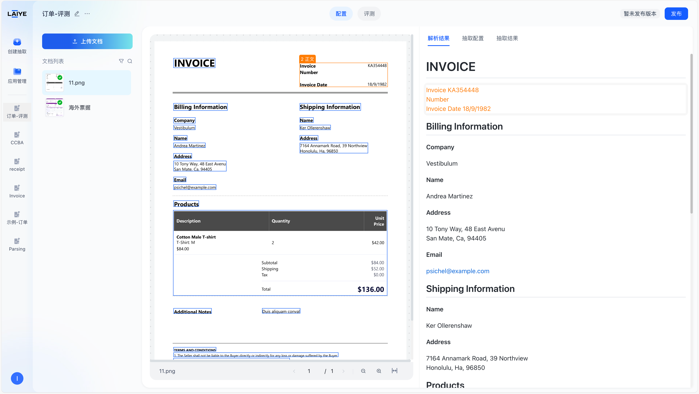

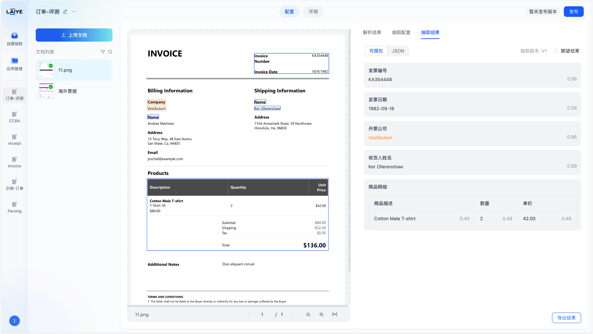

**回标展示**

- 在原文档中自动定位并高亮显示对应的抽取字段。

- 支持点击抽取结果快速跳转到原文位置。

- 提供直观的可视化对应关系展示。


**应用场景**

- 验证抽取结果的准确性。

- 定位抽取错误的具体位置。

- 分析模型抽取逻辑，便于配置优化。


## 抽取结果可视化校正

提供直观的界面用于验证和修正模型的抽取结果：

**结果验证**

- 用户上传文档后，平台自动解析，并基于最新配置版本生成抽取结果。

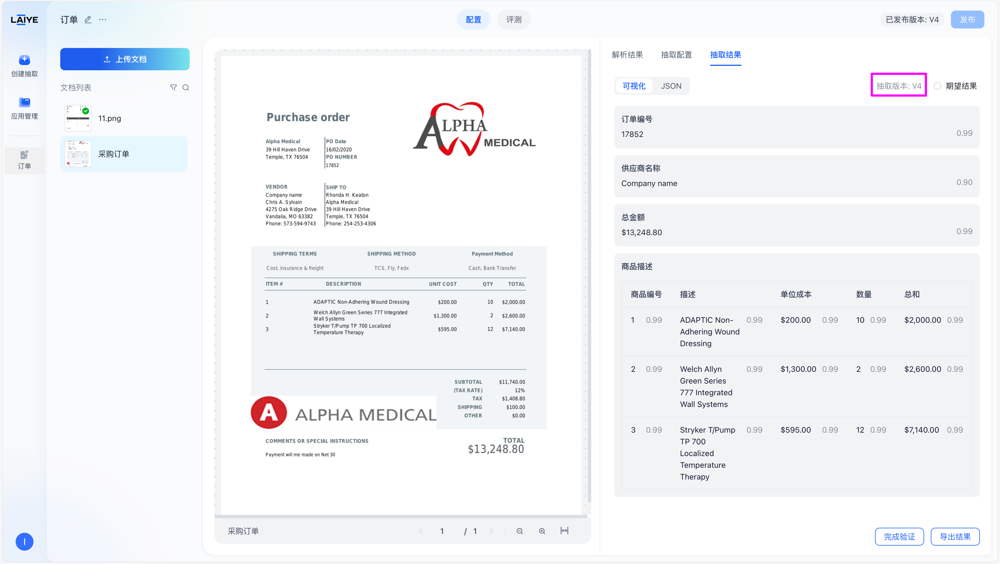

- 支持用户在抽取结果页验证模型的抽取结果，并手动修改期望结果。

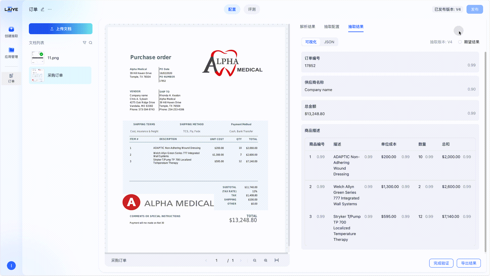

- 可视化展示抽取值与原文的对应关系。


**操作步骤**

1. 在抽取结果页面查看模型自动生成的抽取值。

2. 对不准确的抽取结果进行手动修正。

3. 系统记录修正信息，用于后续批量评测和模型优化。

4. 支持批量完成验证操作，提高处理效率。


## 批量评测

为评估抽取应用在实际业务场景中的表现，ADP支持基于指定版本发起多份文档的批量评测：


**操作步骤**

1. 点击“发起评测”，选择要评测的配置版本，可基于指定版本发起多份文档的批量评测，快速评估模型抽取效果是否满足上线指标。

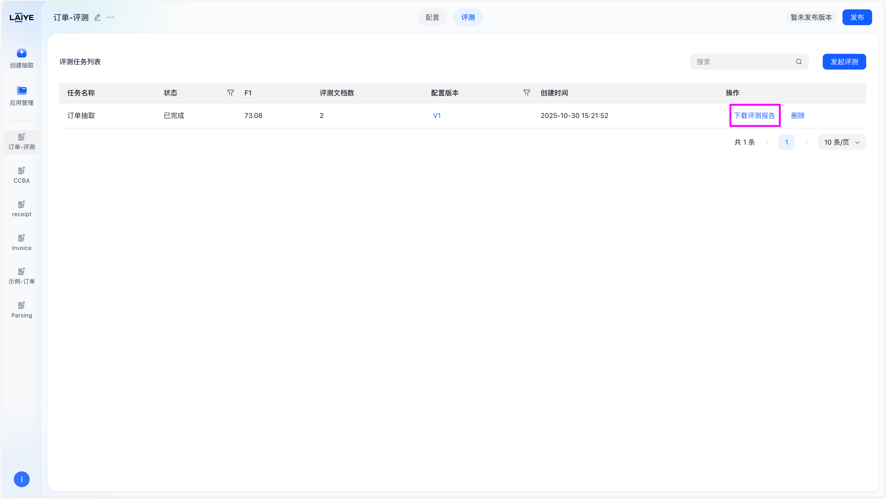

2. 批量评测任务完成后，平台自动生成离线评测报告文件，支持用户下载查看。报告包含**整体评测指标（准确率、召回率、F1值等）、字段评测结果、文档评测结果和字段抽取详情**，帮助用户多粒度量化模型抽取效果。字段抽取详情中展示每份文档的抽取值与期望值对比，**便于定位错误样本**。

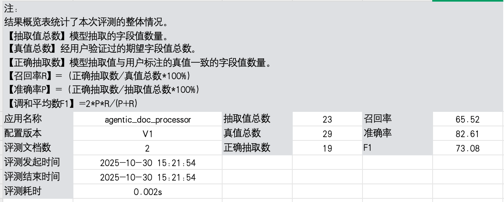

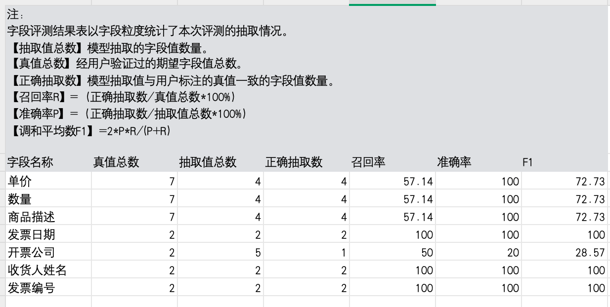


# 开箱即用的智能体应用

## 概述

通过快捷入口上传海外发票/收据/采购订单/卡证文档，无需手动配置即可快速实现抽取。


**无需配置，点击即用**

- **零门槛配置：**无需调试提示词（Prompt）或复杂的环境搭建，真正实现开箱即用。

- **全自动处理：**文档上传即刻启动自动化抽取流程，体验丝滑流畅的工作流。

- **多场景单据覆盖 ：**支持海外发票（Invoice）、收据（Receipt）及采购订单（PO）等核心业务文档，内置票据号码、日期、金额等 15\+ 关键字段；覆盖营业执照、银行卡、开户许可证、中国护照、身份证、驾驶证等11种常见卡证类型。

- **内置专家级抽取配置：**预置经过验证的高精度抽取策略，专为商业单据设计，让通用模型也能发挥出垂类专家的水准。

- **精准高效，性能卓越：**抽取准确率突破 **90%\+**，常见卡证等文档单页耗时**1\-5 秒** ，复杂文档单页耗时 20秒 以内 ，准确率和性能均达到业界领先水平。


**操作步骤**

1. 功能入口：开箱即用\-文档解析/票据类/卡证类

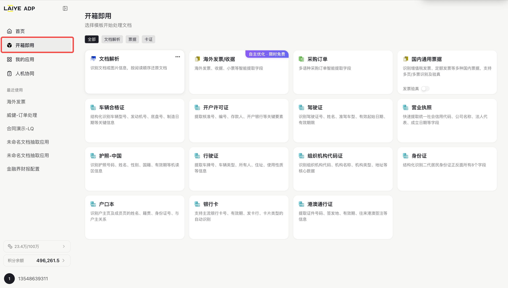

2. 选择需要的开箱即用能力上传对应文档，仅支持上传**单个**文档。


**注意：**

- 开箱即用的抽取能力支持接入人机协同，用户通过API调用开箱即用抽取能力时，如果在人机协同开启了审核规则，会自动创建人机协同任务。

- 关联了开箱即用能力的人机协同应用暂不支持设定文档置信度相关的规则。

> 更多人机协同操作说明详见[人机协同工作流](https://laiye-tech.feishu.cn/wiki/UDYIwG42pisBbFkJI39ctpeKnWh?fromScene=spaceOverview#share-R3AddJ2QSoQ7swxhy7Zcyhc0nod)。
> 
> 

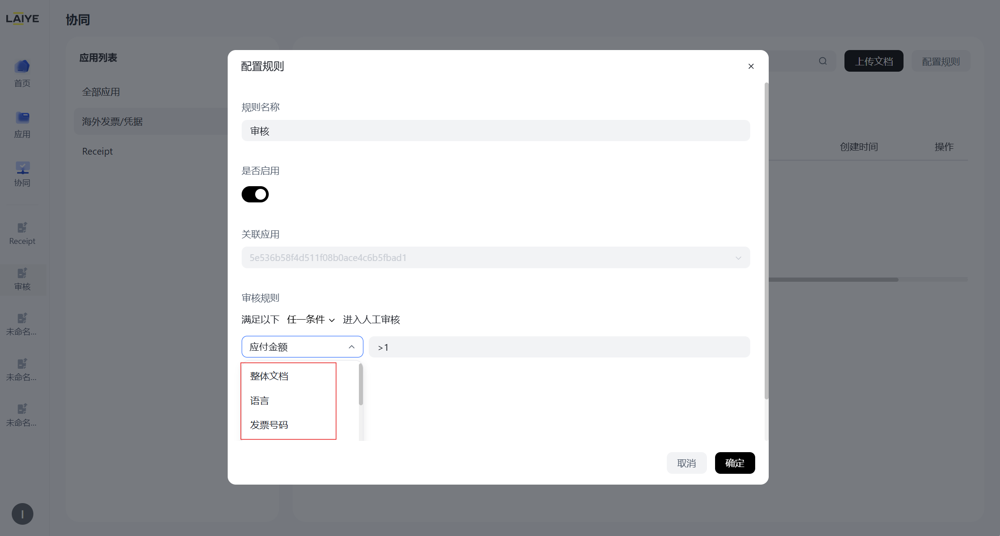


## 海外发票/收据

### **适用场景**

- 跨境电商应付账款（AP）自动化

- 多供应商、多语言、多模板发票录入

- 财务共享中心 \(SSC\) 海外业务

- 财税合规审计

### 获得分类与抽取结果

1. 功能入口：开箱即用\-\>海外发票/收据

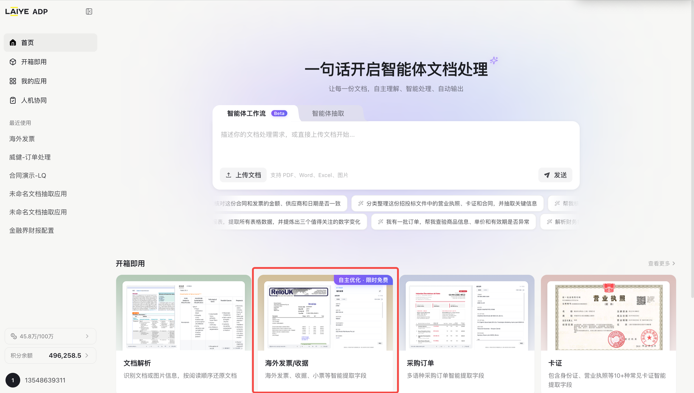

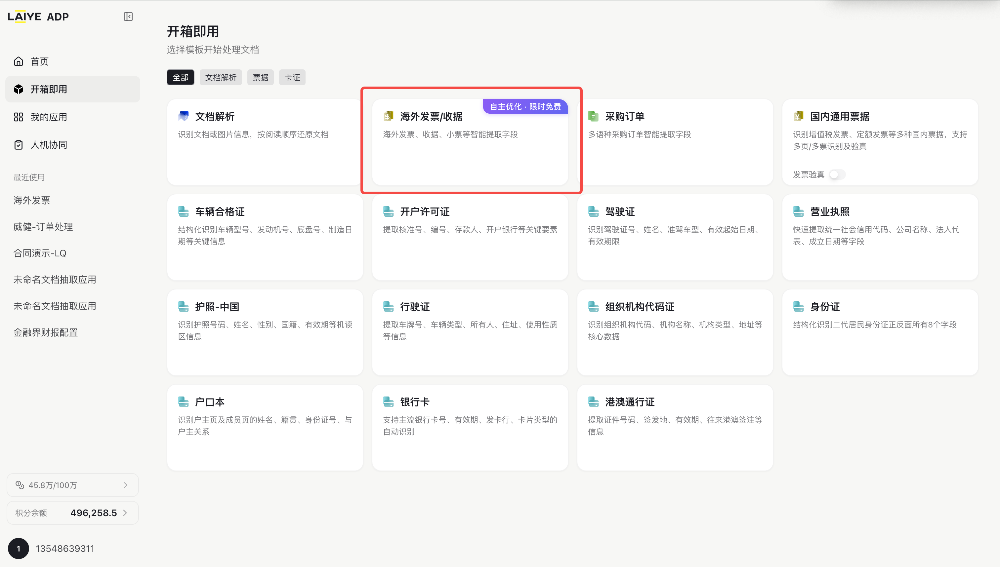

2. 上传海外发票/收据，自动获取该文档的分类与抽取结果（海外发票/收据）

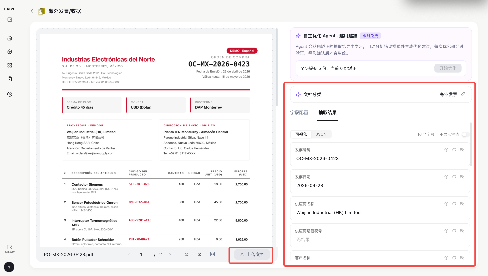

### 预定义字段列表

1. 海外发票

|中文名|英文名|类型|
|---|---|---|
|发票号码|Invoice Number|文本|
|发票日期|Invoice Date|日期|
|供应商名称|Supplier Name|文本|
|供应商增值税号|Supplier VAT Number|文本|
|客户名称|Customer Name|文本|
|客户增值税号|Customer VAT Number|文本|
|币种|Currency|文本|
|总额（未税）|Total Without Tax|文本|
|增值税税率|VAT Rate|文本|
|总金额（含税）|Total Amount \(Inc\. Tax\)|文本|
|应付金额|Amount Due|文本|
|商品明细表格|Line Items|表格|
|项目代码|Item Code|\|\- 文本|
|描述|Description|\|\- 文本|
|数量|Quantity|\|\- 文本|
|单价|Unit Price|\|\- 文本|
|总金额|Total Amount|\|\- 文本|

2. 收据

|中文名|英文名|类型|
|---|---|---|
|发票号码|Receipt Number|文本|
|发票日期|Receipt Date|日期|
|供应商名称|Supplier Name|文本|
|供应商增值税号|Supplier VAT Number|文本|
|客户名称|Customer Name|文本|
|客户增值税号|Customer VAT Number|文本|
|币种|Currency|文本|
|总额（未税）|Total Without Tax|文本|
|增值税税率|VAT Rate|文本|
|总金额（含税）|Total Amount \(Inc\. Tax\)|文本|
|应付金额|Amount Due|文本|
|商品明细表格|Line Items|表格|
|项目代码|Item Code|\|\- 文本|
|描述|Description|\|\- 文本|
|数量|Quantity|\|\- 文本|
|单价|Unit Price|\|\- 文本|
|总金额|Total Amount|\|\- 文本|


### 自定义抽取字段

在海外发票/收据的开箱即用抽取中，您可以根据业务需要灵活增加或删除抽取字段，无需切换到通用文档抽取应用。

- 预定义字段：系统内置的默认抽取字段（如发票号码、总金额等），开箱即用

- 自定义字段：您根据业务需要自行添加的抽取字段（如 PO 号、付款条件等）


**查看和管理字段配置**

1. 在海外发票/收据详情页，点击**字段配置**入口，打开字段配置面板。

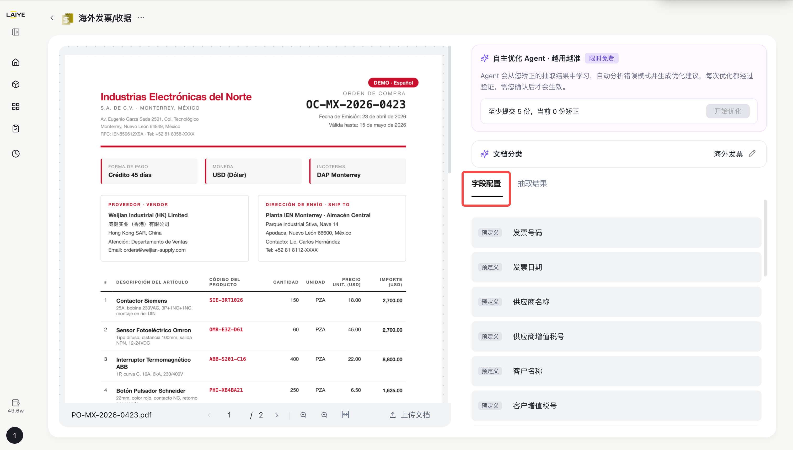

2. 面板中展示所有当前生效的字段，包含字段名称、描述、数据类型，并通过标签区分预定义字段和自定义字段。字段按预定义在前、自定义在后排列。

3. 如果某些预定义字段不适用于您的业务场景，点击该字段旁的**删除**按钮即可移除。

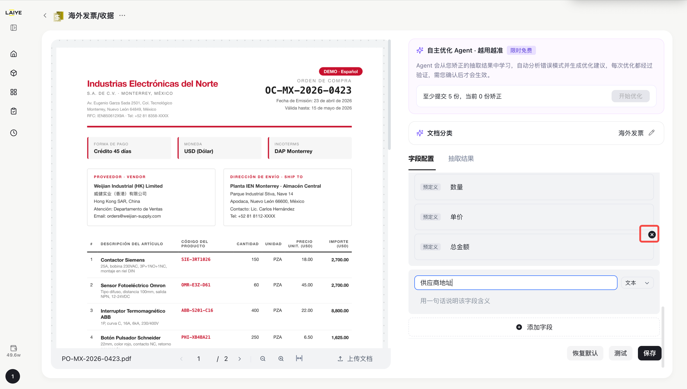


**新增自定义字段**

4. 点击**添加字段**按钮，填写以下信息：

|配置项|是否必填|说明|
|---|---|---|
|字段名称|必填|字段的唯一标识名，最长 100 字符|
|数据类型|必填|可选：文本、日期、表格（默认为文本）|
|抽取提示语|选填|帮助系统定位字段的提示描述，最长 500 字符|

> 提示：每个应用最多支持 50 个自定义字段。
> 
> 

5. 填写完成后点击**保存/测试**，新字段将在下次抽取时生效。

> 提示：字段变更前的自主优化样本将不再计入自主优化的循环。
> 
> 

6. 如需还原为系统默认配置，点击**恢复默认字段**按钮。

> 注意：恢复默认将删除所有自定义字段并还原预定义字段，同时已应用的自主优化内容也将失效。
> 
> 


### 自主优化 Agent

自主优化 Agent 能够根据您对抽取结果的修正，自动分析错误模式并优化抽取策略，使系统越用越准。

- **识别持续精进：**基于真实修正记录学习常见错误模式，帮助海外发票/收据识别效果持续提升。

- **降低维护成本**：无需手动调整提示词与字段规则，Agent 自动生成优化建议并完成校验。

- **优化结果可控**：所有优化均通过历史文档验证，需用户确认后生效，保障业务识别稳定。


**工作原理**

真值采集 → 主动触发优化 → 自动验证 → 用户确认应用

1. **真值采集**：您在抽取结果页修改字段值并保存后，系统自动记录

2. **优化分析：**积累5份修正的文档，即可开始学习，Agent将分析错误的原因，制定更完善的抽取策略

3. **自动验证**：系统使用样本文档自动对比新旧抽取策略的效果

4. **用户确认**：验证通过后展示优化建议，由您决定是否应用


**操作步骤**

**第一步：修正抽取结果（自动采集真值）**

1. 在海外发票/收据详情页，查看抽取结果。

2. 如发现某个字段抽取有误，直接点击该字段值进行编辑修改。

3. 修改后保存，系统将在后台自动记录此次修正作为学习样本。

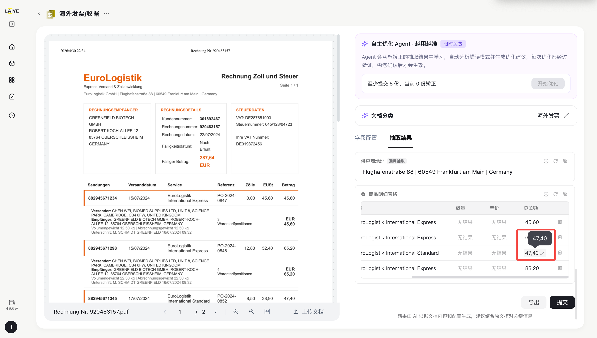

> 提示：仅当修改值与原始抽取值不同时才会被采集为学习样本。编辑操作不受影响。
> 
> 


**第二步：触发优化分析**

4. 当累计达到 5 条及以上修正后，详情页的**自主优化 Agent** 面板中"开始优化"按钮变为可点击状态。

5. 点击**开始优化**，系统将自动分析文档中的错误模式并生成优化方案。

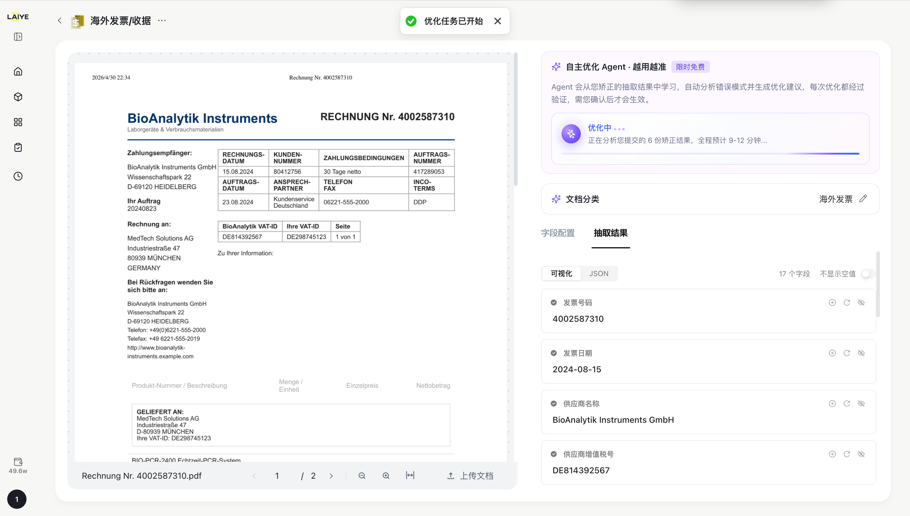

> 提示：优化分析在后台完成，通常需要数分钟，不影响您的其他操作。
> 
> 


**第三步：查看优化建议并确认**

6. 验证通过后，自主优化 Agent 面板将展示优化建议，包含：

    1. **变更摘要**：描述优化的结果

    2. **目标字段验证结果**：原始正确率 vs 优化正确率（如 total\_amount: 60% → 93%）

    3. **其他字段影响**：展示对其他字段是否有影响

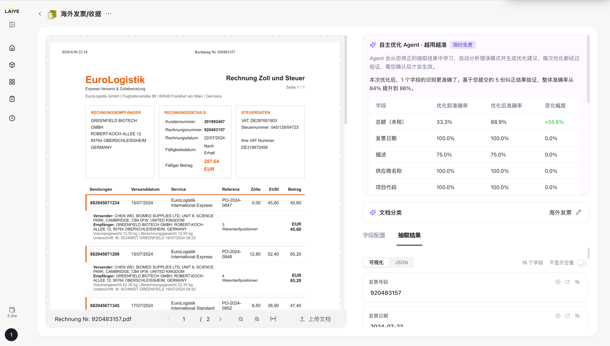

7. **您可以选择：**

    1. **一键应用当前优化方案**：确认应用，后续抽取使用优化后的策略

    2. **暂不应用**：驳回本次建议，保持当前抽取策略不变

    3. **重新优化**：驳回本次建议，重新分析并定义抽取策略

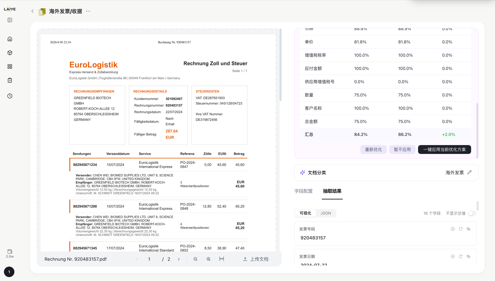


8. 验证未通过，自主优化 Agent 面板将返回提醒，点击“我知道了”，可以选择重新优化或继续添加纠正样本，以保障优化效果

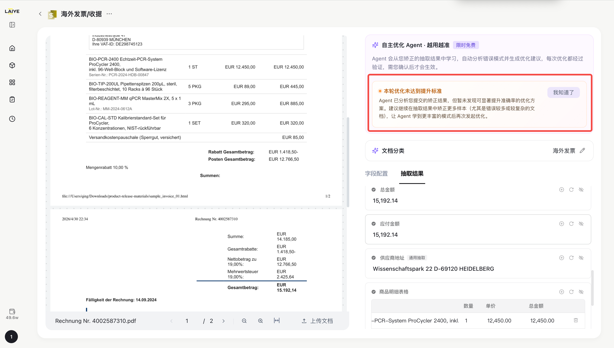


> 提示：更多的样本让Agent优化更精准
> 
> 


**第四步：持续优化循环**

9. 应用优化后，系统继续进入学习状态。随着您持续使用和修正，可再次触发新一轮优化，使抽取精度持续提升。

> 提示：每一轮优化使用所有累积的修正数据，确保全局最优。
> 
> 


**查看优化状态**

10. 在详情页的自主优化 Agent 面板中，您可以随时查看：

    - 各字段已积累的修正样本数

    - 当前优化状态（学习中 / 优化中 / 待确认）

    - 已应用的优化历史记录


**恢复默认**

如需恢复为系统初始抽取策略，在字段配置下方点击**恢复默认**按钮。恢复后：

- 所有已优化的抽取策略回到初始状态

- 已积累的修正样本数据保留（不清除）

- 优化轮次计数器重置

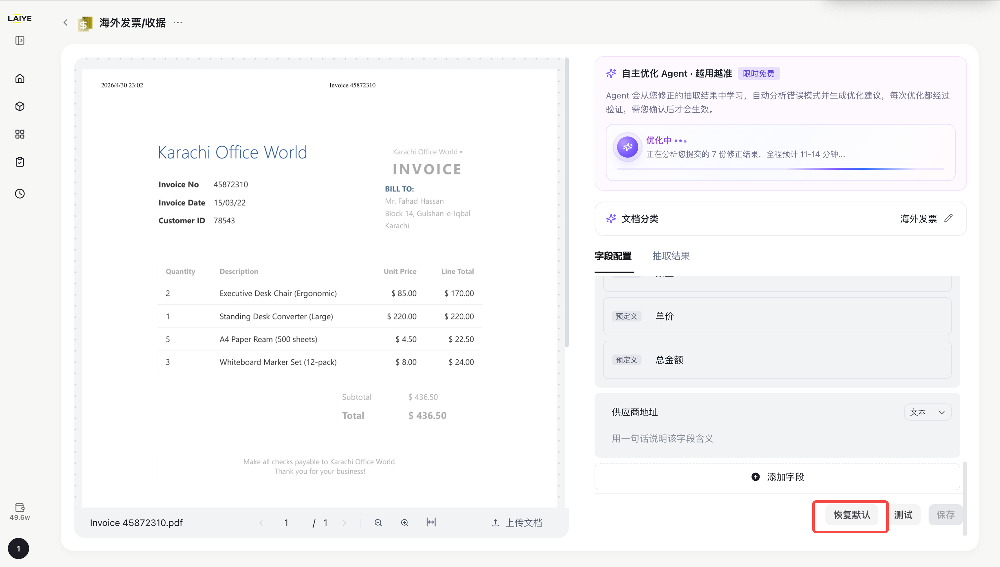

> 注意：此操作与自定义字段的"恢复默认字段"共用同一入口，恢复默认将同时重置字段配置和优化策略。
> 
> 


## 采购订单

### 适用场景

- 供应链采购自动化，PO 单据批量录入 ERP/SAP

- 应付账款三单匹配（采购订单 \- 收货单 \- 发票）核对

- 供应商对账与履约跟踪

- 跨地区、多模板采购订单标准化处理

### 预定义字段列表

|中文名|英文名|类型|
|---|---|---|
|订单编号|PO Number|文本|
|订单日期|Order Date|日期|
|卖方名称|Seller Name|文本|
|买方/客户名称|Buyer Name|文本|
|买方/客户地址|Buyer Address|文本|
|客户收货地址|Delivery Address|文本|
|收货方名称|Receiver Name|文本|
|币种|Currency|文本|
|总金额|Total Amount|文本|
|商品明细表格|Line Items|表格|
|物料代码|Material Code|\|\- 文本|
|税率|Tax Rate|\|\- 文本|
|描述|Description|\|\- 文本|
|数量|Quantity|\|\- 文本|
|单价（含税）|Unit Price \(Inc\. Tax\)|\|\- 文本|
|总金额（含税）|Total Amount \(Inc\. Tax\)|\|\- 文本|
|交货日期|Delivery Date|\|\- 日期|

## 国内通用票据

国内通用票据能够识别全电发票、普通发票、专用发票、出租车票、火车票、飞机行程单、财政发票等财务场景覆盖的30多种常见票据，并从中抽取出核心字段值。在票据识别的同时，可对发票进行验证，支持11种国内通用票据类型的查验，判断发票的真实性。

### 适用场景

- 企业差旅与费用报销自动化

- 财务凭证批量录入与归档

- 发票真伪查验，防范虚假票据风险

- 税务合规审计与进项发票核对

### **操作步骤**

1. 功能入口：开箱即用\-\>国内通用票据

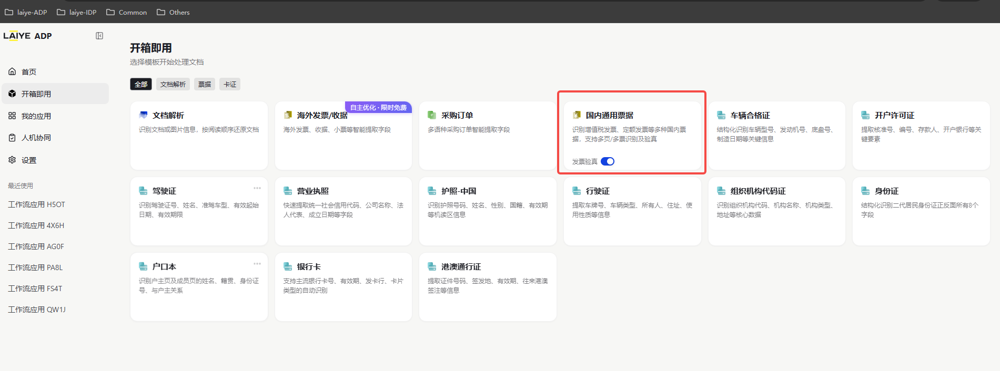

2. 在国内通用票据卡片上，开启发票验真开关，点击进入票据识别页面

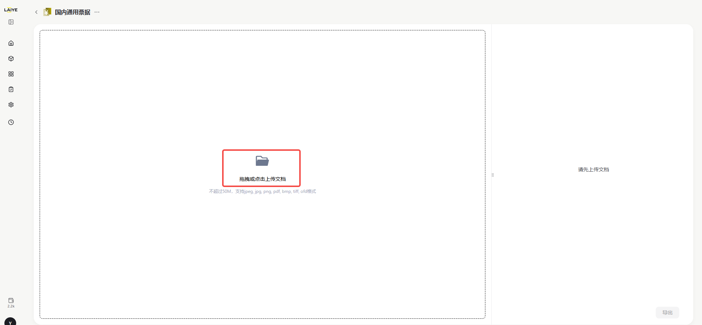

3. 在票据识别页面上传文件，识别结果和验真结果展示在右侧

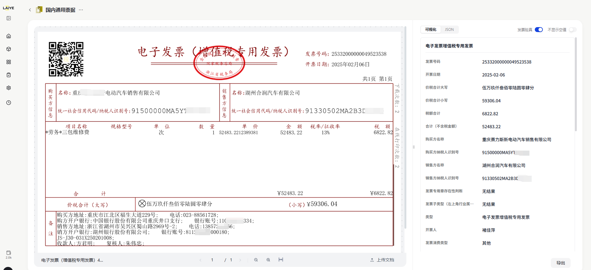


### 支持的票据类型

|**序号**|**票据类型**|**是否支持验真**|
|---|---|---|
|1|增值税专用发票|✅|
|2|增值税普通发票|✅|
|3|增值税电子普通发票|✅|
|4|增值税电子普通发票（通行费）|❌|
|5|增值税电子专用发票|✅|
|6|区块链电子发票|❌|
|7|电子发票增值税专用发票|✅|
|8|电子发票普通发票|✅|
|9|出租车发票|❌|
|10|航空运输电子客票行程单|❌|
|11|电子发票航空运输电子客票行程单|✅|
|12|火车票|❌|
|13|电子发票铁路电子客票|✅|
|14|增值税普通发票（卷票）|✅|
|15|机动车销售统一发票|✅|
|16|二手车销售统一发票|✅|
|17|通用定额发票|❌|
|18|通用机打发票|❌|
|19|通用机打电子发票|❌|
|20|公路客运发票|❌|
|21|增值税销货清单|❌|
|22|船运客票|❌|
|23|过路过桥费发票、汽车通行费|❌|
|24|网约车行程单|❌|
|25|火车票退票费|❌|
|26|电子财政票据|❌|
|27|财政票据|❌|
|28|电子医疗票据|❌|
|29|医疗票据|❌|
|30|完税证明|❌|
|31|海关缴费书|❌|
|32|海关报关单|❌|

## 卡证

### 适用场景

- 银行/金融机构 KYC 客户身份核验

- 企业开户尽职调查与资质审核

- HR 员工入职证件采集与归档

- 车辆登记、保险理赔等业务办理

### 预定义卡证类型及字段

|车辆合格证|营业执照|组织机构代码证|银行卡|开户许可证|护照\-中国|身份证|港澳通行证|驾驶证主页|驾驶证副页|行驶证|户口本|
|---|---|---|---|---|---|---|---|---|---|---|---|
|||||||||智能分类|||智能分类|
|车辆型号|注册日期|有效期|有效期|基本存款账户|类型|民族|姓名|驾驶证证号|类型|燃料类型|宗教信仰|
|车辆制造企业名称|经营范围|代码|发卡机构|开户银行|出生地点|有效期限|出生日期|有限期始\(至\)|驾驶证证号|外廓尺寸|成员姓名|
|车身颜色|组成形式|地址|卡号|核准号|签发地点|签发机构|性别|姓名|姓名|总质量|血型|
|轴数|经营者|机构类型|是否为借记卡\(debit return is credit\)|账号|姓名|住址|签发机关|类型|档案编号|号牌号码\(副页\)|服务处所|
|转向形式|统一社会信用代码|机构名称|是否为借记卡\(debit返回是credit返回否\)|编号|性别|姓名|有效期限|准驾车型||车辆识别代号|婚姻状况|
|后轮轮距|名称|法定代表人|是否为借记卡|法定代表人|有效期|性别|签发地点|性别||核定载人数|出生日期|
|车辆制造日期|类型|登记号||整体|签发日期|出生|英文姓名|住址||品牌型号|文化程度|
|排量|经营场所|颁发单位|||签发机关|身份证号码|证件号码|出生日期||检验记录|职业|
|前轮轮距|登记日期||||国籍||证件机读码|初次领证日期||车辆类型|籍贯|
|合格证编号|是否为副本||||国家码|||签发机构||所有人|出生地|
|发证日期|营业期限||||护照号码|||国籍||使用性质|性别|
|底盘类别|注册资本||||出生日期|||总计有效期限||发证日期|身份证号码|
|轴距|登记机关||||拼音|||||注册日期|民族|
|总质量||||||||||发动机号码|与户主关系|
|驾驶室准乘人数||||||||||整备质量|登记日期|
|轮胎数||||||||||号牌号码|身高|
|车辆识别代号/车架号||||||||||住址|户别|
|燃料种类||||||||||档案编号|户号|
|车辆制造企业信息||||||||||核定载质量|户主姓名|
|排放标准||||||||||备注|住址|
|最高设计车速||||||||||准牵引质量总质量|曾用名|
|车辆品牌||||||||||||
|发动机号||||||||||||
|整备质量||||||||||||
|轴荷||||||||||||
|弹簧片数||||||||||||
|车辆名称||||||||||||
|发动机型号||||||||||||
|外廓尺寸||||||||||||
|底盘型号||||||||||||
|功率||||||||||||
|轮胎规格||||||||||||
|备注||||||||||||


# 智能体工作流

## 概念说明

智能体工作流是 ADP 平台面向复杂文档处理场景提供的工作流搭建能力。用户可以通过自然语言描述业务需求，由智能助手自动理解任务、规划处理步骤，并生成可复用的文档处理工作流。

智能体工作流适用于需要多步骤处理的文档业务，例如文档拆分、分类整理、字段抽取、跨文档核对、异常查验、结果汇总等。与单一文档抽取应用相比，智能体工作流更适合处理端到端业务流程。

### 核心概念

|概念|说明|
|---|---|
|工作流|由多个处理节点组成的文档处理流程，可用于完成解析、分类、抽取、审核、汇总等任务。|
|节点|工作流中的单个处理步骤，如文档解析、字段抽取、文档分类与拆分、大语言模型处理等。|
|对话式创建|用户通过自然语言描述需求，智能助手自动规划并生成工作流。|
|发布|将调试完成的工作流发布为可稳定复用的应用，用于后续重复执行或集成调用。|

智能体工作流适合处理“先做 A，再做 B，最后输出 C”的复合型文档任务。例如：先拆分招投标资料，再按文档类型抽取字段；先识别合同和发票，再核对金额、供应商和日期是否一致。

### 典型场景

智能体工作流适用于以下典型场景：

- 财务审核：核对合同、发票、OA 表单等多类单据中的金额、供应商、日期是否一致。

- 票据处理：拆分多张发票或收据，抽取票号、日期、金额、币种、供应商等信息。

- 文档分拣：识别并拆分混合文档包中的营业执照、卡证、合同、授权委托书等材料。

- 订单查验：基于商品信息、单价、有效期等字段查验订单是否异常。

- 财报分析：提取财务报表数据，整理核心指标，并生成变化分析。

## 快速开始

仅需三步，即可创建并使用一个智能体工作流。

### 第一步：创建智能体工作流

登录 ADP 平台后，可以从以下入口创建智能体工作流：

- 在首页「智能体工作流」输入框中，直接描述文档处理需求，并上传待处理文档。

- 在左侧导航栏进入「我的应用」，点击新建应用，选择「智能体工作流」。

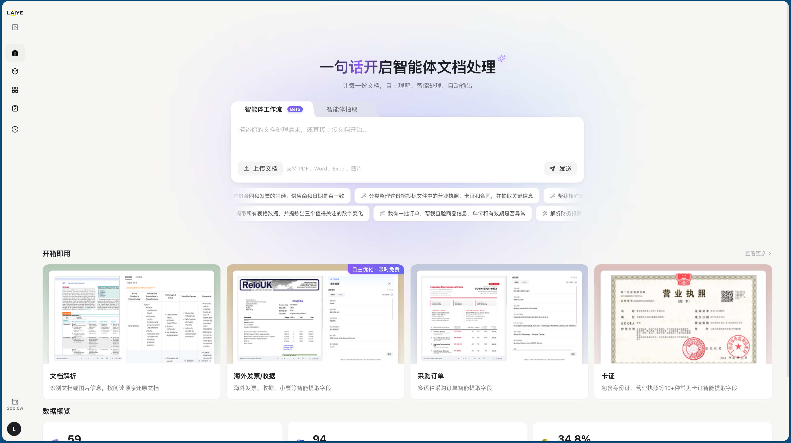

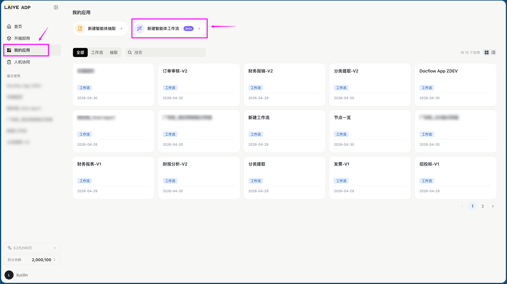

**示例需求**

```Plain Text
核对这些合同和发票的金额、供应商和日期是否一致。
```

```Plain Text
分类整理这份招投标文件中的营业执照、卡证和合同，并抽取关键信息。
```

```Plain Text
我有一批订单，帮我查验商品信息、单价和有效期是否异常。
```

```Plain Text
解析财务报表，提取所有表格数据，并提炼出三个值得关注的数字变化。
```

### 第二步：通过对话调整工作流

输入需求后，智能助手会根据任务目标自动理解处理步骤，并生成工作流。生成过程中，您可以继续通过对话补充规则或调整要求。

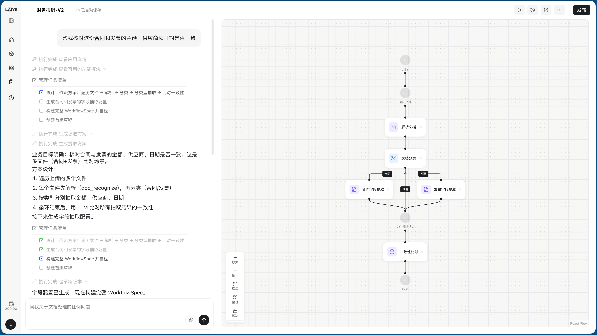

例如：

- 补充需要抽取的字段名称。

- 说明不同文档类型的识别规则。

- 指定最终结果的输出格式。

- 要求增加一致性核对、异常判断或结果汇总逻辑。

为了获得更准确的工作流，建议在提示词中说明：要处理的文档类型、处理步骤、需要抽取或判断的字段、最终希望得到的输出结果。

### 第三步：测试并发布工作流

工作流生成后，您可以上传测试文档并运行工作流，查看处理结果是否符合预期。若结果需要调整，可继续通过对话修改，也可以在画布中手动修改部分节点的提示词。

确认效果后，点击「发布」，即可将当前工作流发布为可复用应用。发布后的工作流可用于后续重复处理同类文档。

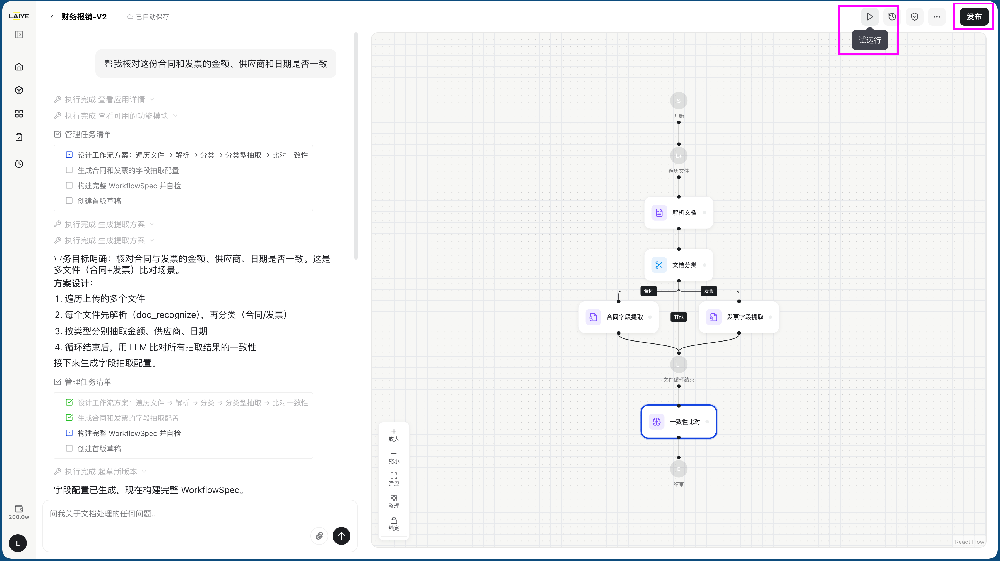

## 创建与编辑工作流

### 通过自然语言创建

在智能体工作流输入框中，用自然语言描述需要完成的文档处理任务。系统会自动规划流程，并在右侧画布生成对应节点。

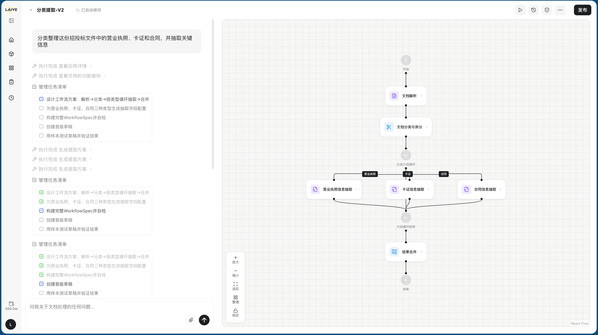

**推荐写法**

```Plain Text
我有一批订单，帮我查验商品信息、单价和有效期是否异常。最终以Markdown格式输出异常订单列表，并说明异常原因。待抽取的字段和详细审核规则见附件。
```

**不推荐写法**

```Plain Text
帮我处理这个订单。
```

- 提示词越明确，生成的工作流越接近实际业务需求。建议尽量说明“输入是什么、要做什么判断、最终输出什么结果”。

- 对于较为复杂的长程工作流，可以分阶段生成。如，某个工作流需要先对一批文件按文件名进行分类和筛选，再对筛选后的列表文件进行抽取和审核，那么可以分成两阶段生成工作流：第一阶段先描述分类和筛选需求，在助手完成搭建后进行一次测试，待效果满意后，第二阶段再描述抽取和审核的需求，生成完整的工作流。

### 通过对话调整工作流

工作流生成后，如果需要调整处理逻辑，可以继续向智能助手发送修改要求。

常见调整方式包括：

- 增加或删除抽取字段。

- 修改文档分类类型。

- 增加审核规则或异常判断规则。

- 调整最终输出格式。

- 要求重新生成某个节点的配置。

**示例**

```Plain Text
请在结果中增加一列“异常原因”，并把金额不一致、供应商不一致、日期不一致分别标出来。
```

```Plain Text
招投标文件中还会包含授权委托书，请把它作为单独类型拆分，并抽取签署日期和授权期限。
```

可以明确要求助手使用/修改某个节点，常见节点如下：

|节点|说明|
|---|---|
|开始节点|工作流的入口节点，用于接收上传文件和自定义变量，并将这些内容传递给后续节点。|
|循环开始|循环处理的起点，用于对一组文件或数据逐项执行循环内部节点，需与循环结束节点配合使用。|
|循环结束|循环处理的终点，用于收集并汇总每次循环的执行结果。|
|大语言模型|调用大语言模型完成文本类任务，适用于分类判断、信息抽取、翻译、总结、改写和格式转换等场景。|
|视觉分析|基于多模态模型理解图片、PDF、Word 等文档内容，适用于版面分析、图文问答、内容提取和复杂文档理解。|
|字段抽取|从文档内容中抽取指定字段，支持普通字段和表格字段，适用于结构化信息提取。|
|文档解析|对 PDF、Word、图片等文件进行 OCR 和版面解析，提取文本、结构信息和位置信息。|
|文档分类与拆分|识别文档类型，并在包含多类文档时自动拆分页面，便于后续按类型抽取和处理。|
|结果合并|汇总并合并同一文件下多个文档类型或多个节点的处理结果，形成统一输出。|
|结束节点|工作流的结束节点，用于输出最终结果。|

## 测试工作流

### 运行测试

在工作流编辑页上传测试文档后，点击试运行按钮，或通过对话上传文档，并要求助手测试工作流，即可验证当前工作流的处理效果。运行过程中，可查看节点执行状态和最终输出结果。

**操作步骤**

1. 点击【试运行】按钮。

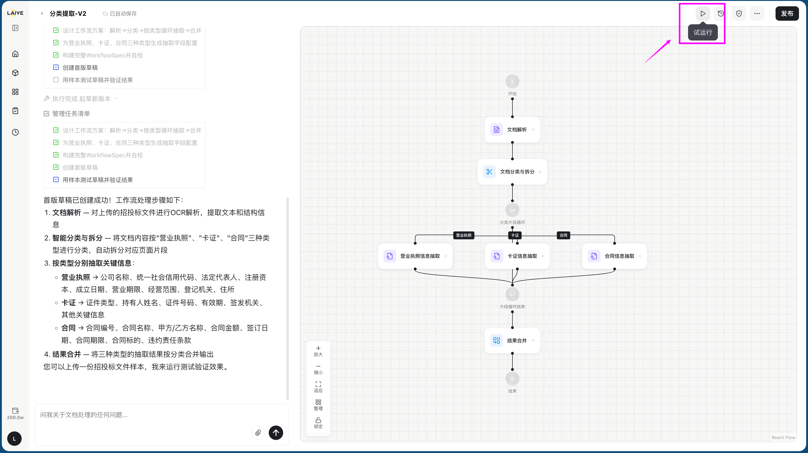

2. 上传需要测试的文档。

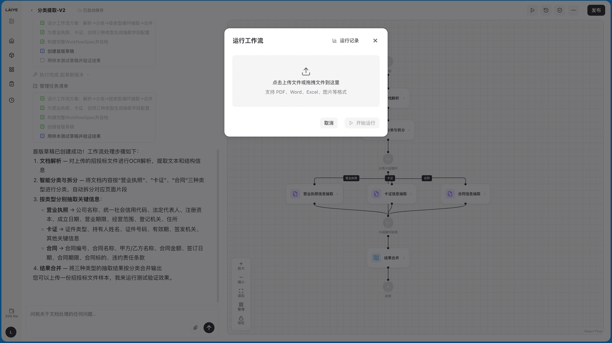

3. 点击【开始运行】按钮。系统会自动开始在后台运行工作流。鼠标悬浮【运行记录】按钮，可以看到所有历史运行记录的状态。

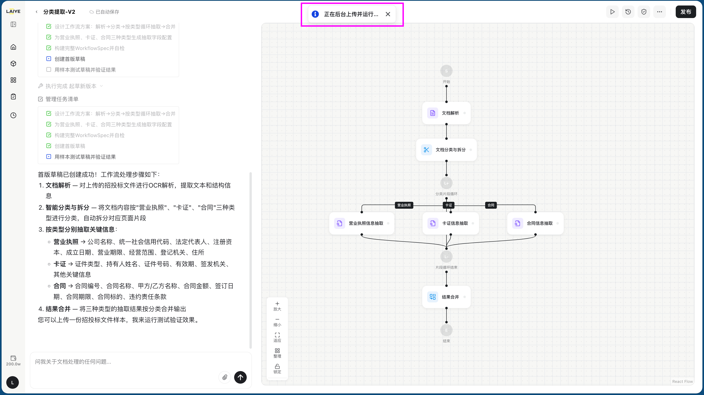

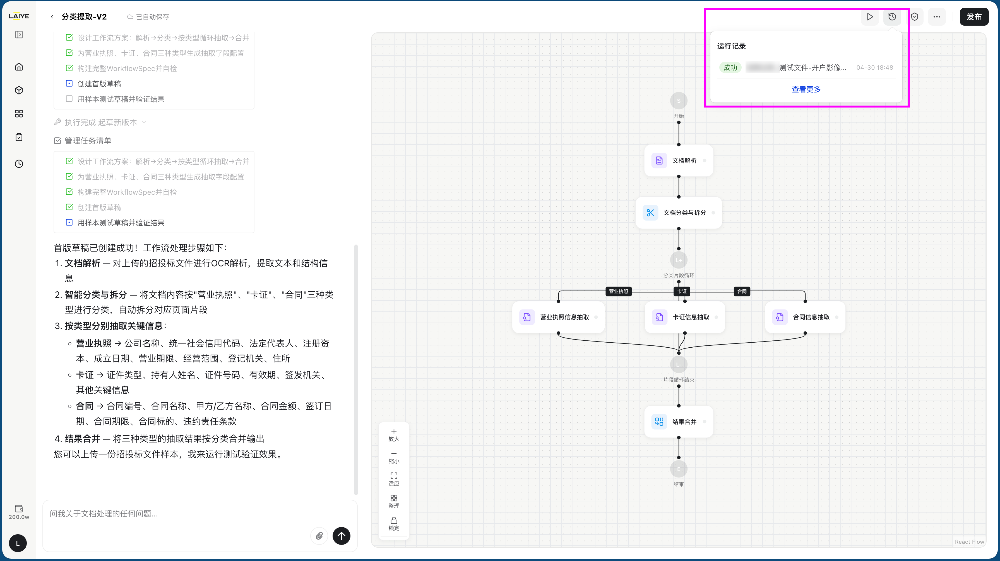

4. 点击【运行记录】按钮，点击对应的文件名，进入运行记录详情页，查看每个节点的执行状态和结束节点输出的最终结果。如结果不符合预期，可继续通过对话或节点配置进行调整。

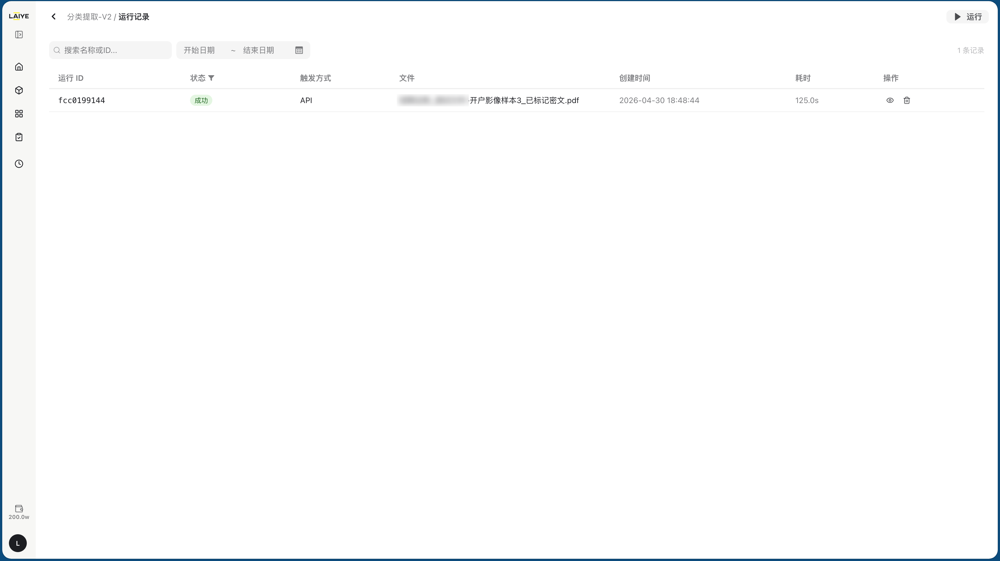

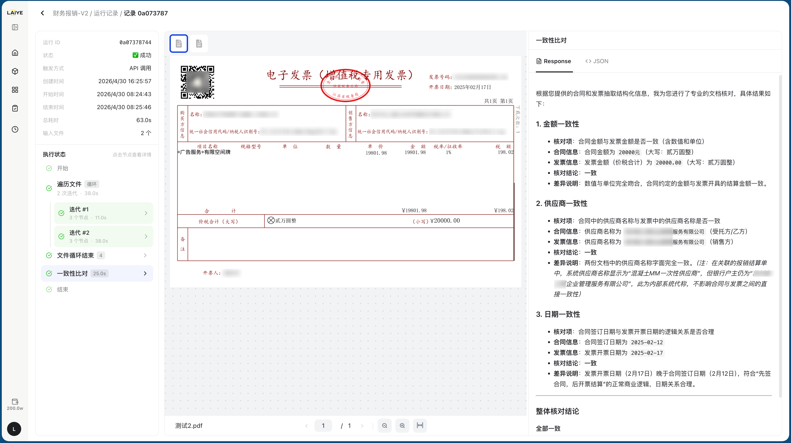

### 调整测试结果

如果测试结果不符合预期，可从以下几个方向调整：

- 文档没有正确拆分：补充文档类型、类型特征、页码范围等信息。

- 字段抽取不准确：补充字段含义、常见位置、别名、格式要求。

- 审核结论不准确：补充业务判断规则和异常处理方式。

- 输出格式不符合要求：说明希望输出为表格、JSON、Markdown 或摘要报告。

复杂场景建议先用 1\-2 份代表性样本文档完成调试，再使用批量文档验证稳定性。

## 发布与使用工作流

### 发布工作流

测试效果确认后，点击「发布」按钮，将当前版本发布为正式可用的工作流应用。发布后，系统会保留当前配置，可以在“版本历史”中查看和回退，便于后续稳定复用。

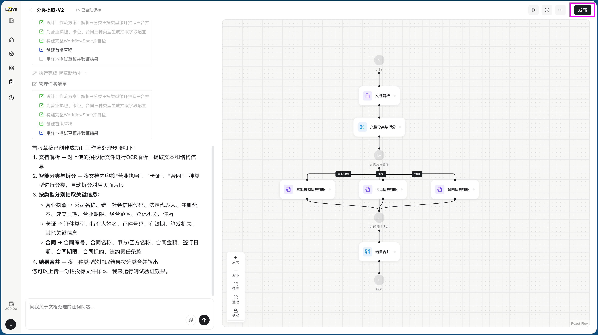

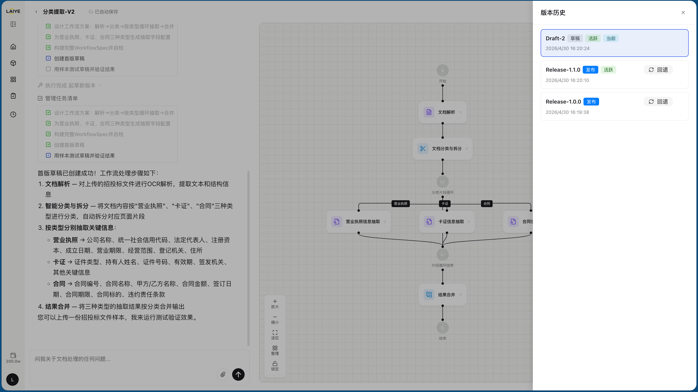

### 使用已发布工作流

已发布的智能体工作流可通过API进行调用。用户可以继续上传同类文档运行处理，也可以根据业务变化继续编辑并发布新版本。工作流支持跨账号、跨环境导入、导出，便于流程共享和协作。

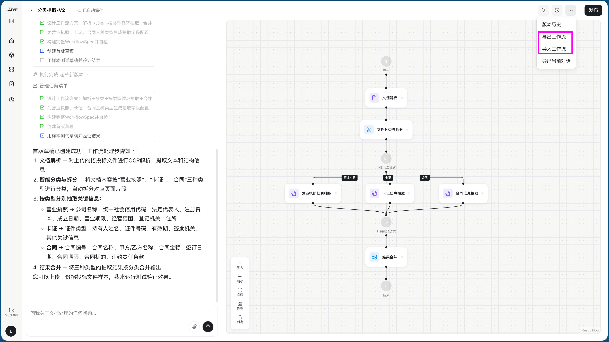

## 提示词最佳实践

为了让智能助手生成更符合预期的工作流，建议按以下结构描述需求：

```Plain Text
我需要处理【业务场景】。输入文档包括【文档类型】。
请先【步骤 1】，再【步骤 2】，最后【步骤 3】。
需要抽取/判断的字段包括【字段列表】。
最终输出【结果格式】，并说明【特殊规则】。
```

### 示例 1：合同与发票一致性核对

```Plain Text
我需要处理报销审核场景。输入是合同和发票，可能是一份或多份文件。
工作流需要：
1. 先从上传的文件中识别出文档类型（合同、发票）。
2. 从发票中提取：购方、销方、总金额（含税）。
3. 从合同中提取：甲方、乙方、总金额（含税）。
最后核对这些字段是否一致，并输出一份审核报告。如果不一致，请标明差异字段和对应文件。
```

### 示例 2：招投标资料分类提取

```Plain Text
我需要处理一份招投标资料包。企业会把所有材料扫描成一个大的PDF上传（数十至上百页）。材料包括但不限于：投标函、法定代表人授权书、营业执照、业绩情况表、控股情况表、投标一览表、投标保证金汇款凭证、服务承诺书。

工作流需要：
1. 自动识别并拆分其中的营业执照、卡证、合同、授权委托书等文档类型。明确给出每种类别材料的页码范围。
2. 对每种材料按固定模板抽取字段（字段见下方）。
3. 最后按文档类型汇总输出结构化结果。

抽取字段：
   （1）在投标函抽取：
    - 应答方名称、投标有效期、是否为联合体、是否为代理商
    
   （2）在法定代表人授权书抽取：
    - 授权生效时间、身份证有效期、社保证明时间
    
   （3）在营业执照抽取：
    - 公司名称、统一社会信用代码、营业期限
    
   （4）在业绩情况表抽取 （注意，这是一个表格字段）：
    - 业绩情况表[序号、业绩合同名称、业绩合同金额]
    
   （5）在控股情况表抽取（注意，这是一个表格字段）：
    - 控股情况表[对投标人出资/控股的自然人/企业名称、出资比例(%)]
    
   （6）在投标一览表抽取：
    - 总报价、税率
    
   （7）在投标保证金汇款凭证抽取：
    - 应答保证金付款人、应答保证金付款金额
    
   （8）在服务承诺书抽取：
    - 交货期、保修期
```

### 示例 3：财务报表分析

```Plain Text
我需要分析财务报表。输入为PDF年报（通常100-200页）。
请提取所有表格数据（资产负债表、现金流量表、利润表），按照我提供的字段进行整理输出（详见附件）。
最后提炼三个值得关注的数字变化，并说明可能需要进一步关注的原因。

注意：
1. 如果年报包含多年度数据（如同时列示2023年和2022年），请分年度分别抽取。
2. 最终输出为标准Excel表格格式，字段指标为行，每个字段需要输出值、来源、计算公式、所属年度4列。
3. 只抽取原文数据，抽取结果不带单位。
```

## 注意事项

- 智能体工作流适合处理多步骤、跨文档、需要判断或汇总的任务；如果仅需抽取固定字段，也可以继续使用智能体文档抽取应用。

- 工作流生成结果会受到提示词清晰度和样本文档质量影响。建议尽量提供明确的业务规则和代表性测试文档。

- 发布前请完成测试验证，避免未确认的配置影响正式使用效果。

- 对于长文档、扫描件、混合文档包等复杂文件，建议在提示词中明确文档类型、识别特征和输出要求。


# 人机协同工作流

## 概念说明

人机协同是ADP平台的核心功能之一，通过智能审核规则实现“机器抽取 \+ 人工复核”的完整流转，解决大客户上线ADP应用后“最后一公里”的问题。


**核心价值**

- **人机精准分流，保障业务100%准确**：高置信度且符合规则的数据直接通过，低置信度或违规数据精准路由至人工界面，最终业务数据准确率接近100%。

- **获取高质量真值，实现模型“越用越聪明”**：每次人工修正都被记录为高质量标注数据，系统基于真值数据生成配置优化建议，持续提升模型性能。

- **ROI量化维度升级，从“单点精度”到“端到端自动化率”**：不再只关注技术指标，而是衡量端到端自动化率、人工复核率等核心业务指标，客户一个月内自动化率从72%提升至82%。


## 配置审核规则

支持使用自然语言配置审核规则，无需编写脚本：


**规则描述方式 **用户只需用自然语言描述业务逻辑，例如，满足以下任一条件时进入人工审核：

- “金额大于5000”

- “发票号为空”

- “交货日期早于当前日期”


**操作步骤**

1. 进入人机协同模块，点击“添加规则”或“配置规则”，选择待添加审核规则的已发布应用。

2. 在规则输入框中使用自然语言描述审核条件。

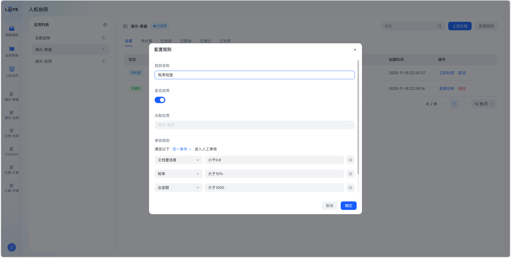

3. 平台基于LLM能力，自动结构化解析并生成规则。

4. 规则保存时，会自动校验有效性，所有规则确认无误后点击“确认”保存。


## 任务管理与处理

### 任务管理中心

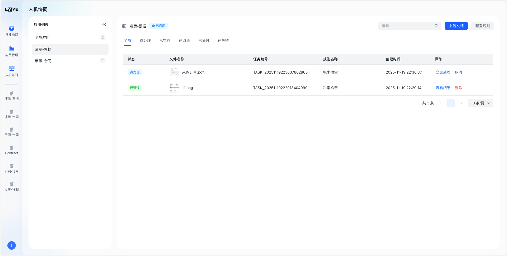

- 任务列表页面清晰展示所有任务的状态，如“待处理”、“已通过”、“已取消”等，帮助审核员随时了解任务的处理进度。

- 显示任务创建时间、任务编号、规则名称等关键信息。

- 快速通过操作按钮进行任务处理、查看结果、取消或删除任务，提升任务管理的灵活性。

### 

### 任务处理界面

快速聚焦问题字段，人机协同确保抽取结果精度：

### 

**智能标识**

- 命中审核规则的字段高亮标识，并展示模型判定触发审核的原因说明。

**高效处理**

- 点击“上一份”“下一份”，快速切换待处理任务。

- 支持一键“通过”或“取消”任务操作。

- 提供字段修正功能，支持直接编辑错误的抽取结果。


**操作步骤**

1. 进入人机协同模块。

2. 查看待处理任务列表，选择待处理的任务，点击“立即处理”。

3. 查看高亮的问题字段和触发原因。

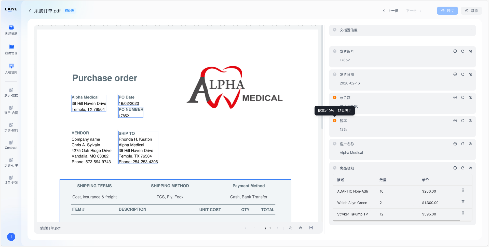

4. 确认抽取结果是否正确，完成结果验证后，点击“通过”。如任务无需处理，可点击“取消


# 积分说明

## 积分概述

ADP 平台采取灵活透明的按量付费（Pay\-As\-You\-Go）模式，旨在帮助用户以最低的成本高效开展业务。**积分（Credit）** 是 ADP 平台的通用计费单位。一次文档处理工作流由若干“任务”构成（如解析、抽取、评测、人机协同等），每个任务根据复杂度与业务价值按不同积分消耗。


### 计费原则

- 自动解析计费：文件上传后将自动触发解析，并根据所选模型消耗相应积分。

- 按量计费：平台仅对成功调用的服务次数进行积分扣除。若系统处理异常，不消耗任何积分。

- 服务保障：当账户积分耗尽时，平台将自动暂停所有文档处理及 API 调用服务。请关注余额变动并及时充值。


## 积分类型与规则

ADP 平台提供多种积分类型，以满足不同阶段的业务需求。

|积分类型|获取方式|过期规则|
|---|---|---|
|免费积分|社区版每月自动发放，每月更新到100|每月 1 日 0 点刷新，上月余量清零，不支持结转|
|充值积分|单独充值的积分包或者自定义金额|- 原价积分：永不过期<br></br>- 折扣积分：在积分充值当天\+365天积分过期|
|活动积分|参加官方活动获得积分|活动结束时过期|
|企业版积分|企业合同采购|在积分发放当天\+365天积分过期|


## 计费项与价格标准

积分消耗由任务类型和文档页数决定，具体标准如下：

- 通用定价：¥0\.2/积分，按平台套餐购买提供折扣


### 核心任务积分消耗

|任务类型|每页积分|
|---|---|
|智能体文档抽取（解析\+抽取）|1|
|智能体文档抽取（开启长文档配置）|1\*文档总页数\+0\.5\*指定范围内页数|
|人机协同|1|

### 开箱即用能力积分消耗

|**开箱即用任务类型**|**每页积分**|
|---|---|
|文档解析|0\.5|
|采购订单|1\.5|
|海外发票/收据|1\.5|
|卡证|0\.5|
|国内通用票据|0\.8|
|发票验真|1|

### 工作流积分消耗

智能助手（对话）每日每用户赠送**1百万token免费额度**

|**节点名称**|**积分消耗**|
|---|---|
|文档解析|0\.5积分/页|
|文档抽取|1积分/页|
|文档分类|0\.5积分/页|
|LLM|按消耗（基于Token、资源占用）|
|VLM |按消耗（基于Token、资源占用）|
|数据存储与查询|0\.2积分/次|


> 说明：
> 
> - 价格区间会受文档类型、模型配置等因素影响，实际价格以商务方案或控制台显示为准。
> 
> - 人机协同模块的积分消耗取决于与其组合的基础能力模块（自定义抽取/采购订单/海外发票/卡证），单独使用人机协同消耗1积分。为了方便理解，您可以参考以下典型场景：
> 
>     - **场景 A：仅自动抽取海外发票**
> 
>         - 计算：1\.5 \(基础\) = **1\.5 Credits / 页**
> 
>     - **场景 B：开启人机协同的订单抽取**
> 
>         - 计算：1\.5 \(基础\) \+ 1 \(人机协同\) = **2\.5 Credits / 页**
> 
>     - **场景 C：开启人机协同的卡证抽取**
> 
>         - 计算：0\.5 \(基础\) \+ 1 \(人机协同\) = **1\.5 Credits / 页**
> 
> 


### 免费/付费配置

付费开通后均可保证单账户 **10**** **并发需求，如您有很高的调用量 / 并发量需求，或需其他特殊的付费方式欢迎进行 [商务咨询](https://www.fxiaoke.com/proj/page/marketing-page?marketingEventId=68cd27c1cb84d60001e4cc79&spreadChannel=wechat&objectType=26&ea=zhulilaiye&id=21e9eee4dd4b451592e9eb1204001b44&type=1&sessionid=)。

**免费使用和开通付费所使用服务相同** ，识别效果与性能相同，无需更改调用方式。**但开通付费后的服务配置有较大提升** ，具体对比如下：

|**状态**|**每月免费额度**|**并发****限制**|
|---|---|---|
|免费状态|拥有|2并发|
|付费状态|拥有|10并发|

## 

## 抵扣逻辑与消耗示例

### 积分抵扣顺序

当账户内存在多种类型的积分时，系统将按照以下顺序依次抵扣：

活动积分 \> 免费积分 \> 企业版积分 \> 充值积分

### 计算公式

> 积分总消耗 = 文档页数 × 每页积分
> 
> 

### 场景示例

假设客户进行了以下三项业务操作：

1. 自定义抽取：处理 30 份（每份 2 页）文档。

- 消耗：30 份 × 2 页/份 × 1 积分/页 = 60 积分

2. 长文档抽取：处理 1 份 200 页的长文档，并指定抽取其中 12 页的关键报表。

- 消耗：1 份 × 200 页/份 × 1 积分/页 \+ 1 份 × 12 页/份 × 0\.5 积分/页 = 206 积分

3. 人机协同：处理 10 份（每份 2 页）文档。

- 消耗：10 份 × 2 页/份 × 2 积分/页 = 40 积分


## 账户管理与充值

### 余量查询

- 快速查看：用户可在个人信息区域的头像和名称下方实时查看积分余量。

- 明细查询：在“账户管理”中可查看详细的积分流水和历史订单。

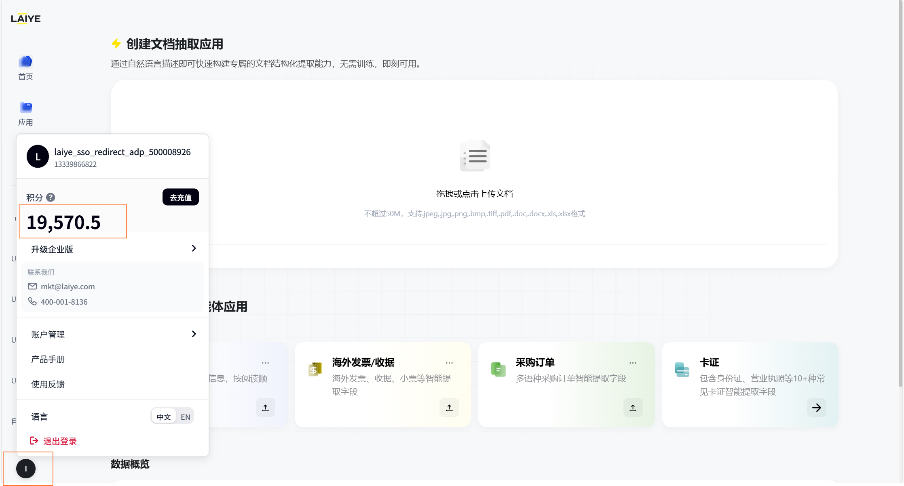


### 充值指南

- 按需充值：免费额度耗尽后，服务自动切换至付费模式。

- 充值额度：支持 1\-10000 元人民币自定义金额充值。

- 企业方案：针对大规模业务、合同签订或对公转账需求，请联系商务顾问定制专属方案。

> 📌 温馨提示：为确保您的业务不中断，请定期关注积分余额并及时完成充值。
> 
> 


> (注：内容由 AI 生成，请谨慎参考）
