# ADP 公有云版 功能更新日志

本更新日志仅包含 Laiye ADP V1\.5 及以后版本的新特性和功能优化记录。鉴于产品处于持续迭代中，部分功能或有变动，请以最新功能状态为准。

# 2026\.5\.26（V1\.12）

### 开箱即用：海外发票/收据能力升级 

海外发票和收据相关能力持续优化，进一步覆盖税率计算和高速处理场景，帮助用户更高效地完成跨境票据处理。

- 🎯 **关键字段准确率98%\+：**关键字段精准提取，大幅减少人工核对、录单成本

- ⚡ **批量极速处理：**分钟级完成上百张发票解析，平均3\-5s/页

- 📄 **东南亚税单解析：**覆盖泰国、印尼、越南、菲律宾、新加坡、马来西亚税制，自动识别税率并校验计算。

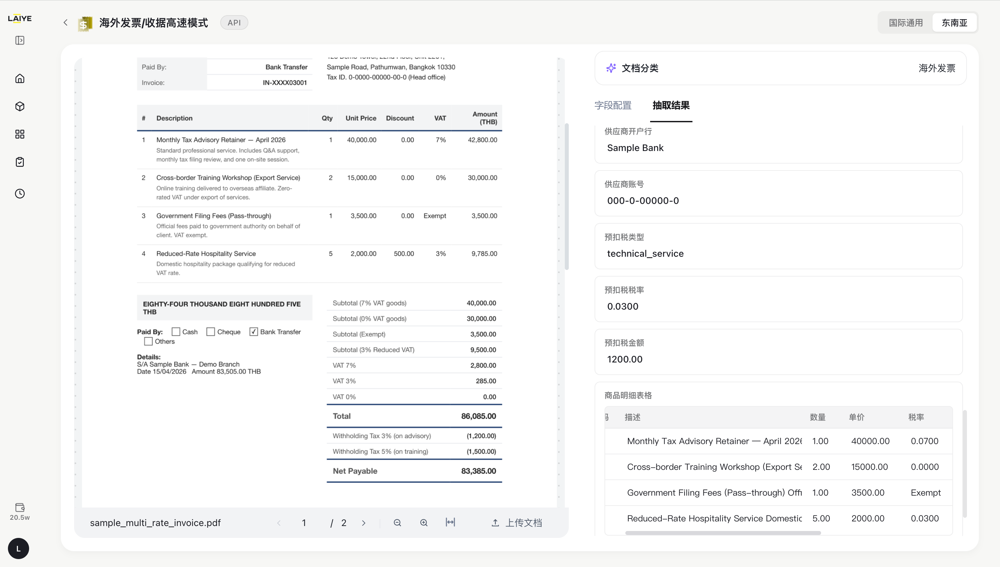

### 智能体工作流：新增数据查询与写入节点 

智能体工作流在公有云环境新增“数据查询与写入”节点，支持将流程中的数据写入指定数据表，或查询数据表中的历史记录供后续节点使用。

- **支持写入流程结果**：当流程中产生需要沉淀的数据时，用户可通过该节点将处理结果写入指定数据表，方便后续追踪、复用和统计。

- **支持查询历史记录**：当后续节点需要参考历史数据时，用户可通过该节点从目标数据表中查询记录，并将查询结果传递给后续节点继续处理。

- **助手自动生成配置**：节点配置包含节点名称、目标数据表和操作摘要。智能助手会根据业务需求，自动在后台建数据表，并生成一句话操作摘要，帮助用户在发布前确认节点行为。

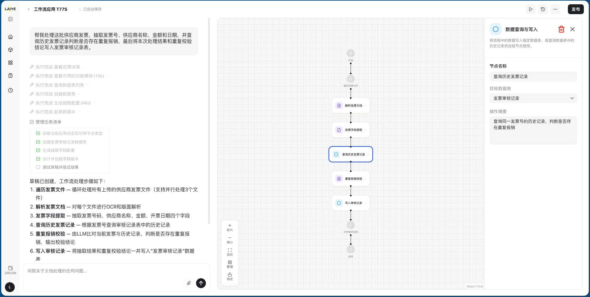

### 智能体抽取：字段配置与导出结果优化 

ADP 优化了自定义抽取的字段配置和结果导出体验，帮助用户更灵活地组织字段，并将抽取结果更顺畅地用于评测、复核和下游数据处理。

- **字段配置更灵活**：自定义抽取字段支持拖动排序，表格字段支持内部排序，导出结果可按照业务需要保持一致顺序。

- **结果留存更完整**：解析结果导出可包含图片内容，图片保存到本地并在 Markdown 中通过路径引用；自定义抽取导出 Excel 时可包含期望结果，便于对比评测。

- **人机协同结果可导出**：Web 端支持导出 Markdown、JSON 和 Excel，导出内容包含原始抽取结果和用户修正后的结果，方便复核留痕和系统集成。

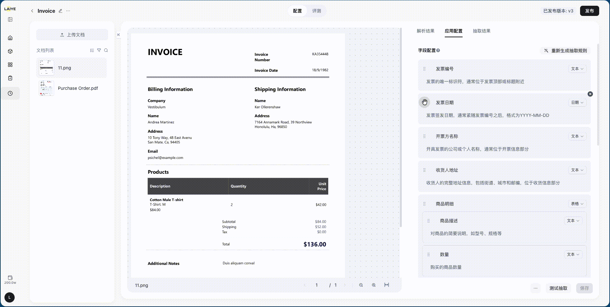

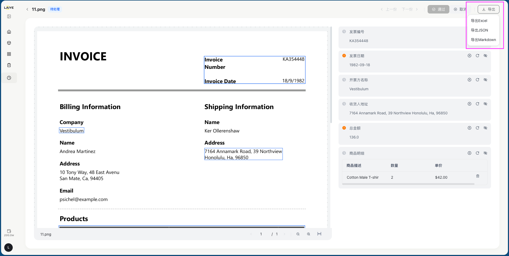

### 文档解析：新增印章识别能力

- 解析文档时，可自动检测并识别文件中的印章内容，包括印章形状、颜色、文字信息，有效助力文档关键信息的结构化提取与合规性审核。

- 支持在“开箱即用\-文档解析”能力的应用配置页面开启印章识别，上传文件并解析完成后，解析结果页底部会展示印章识别结果。也可通过调用文档解析的openAPI接口返回数据中提取印章识别结果。

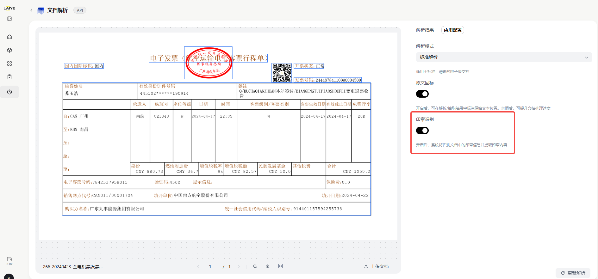

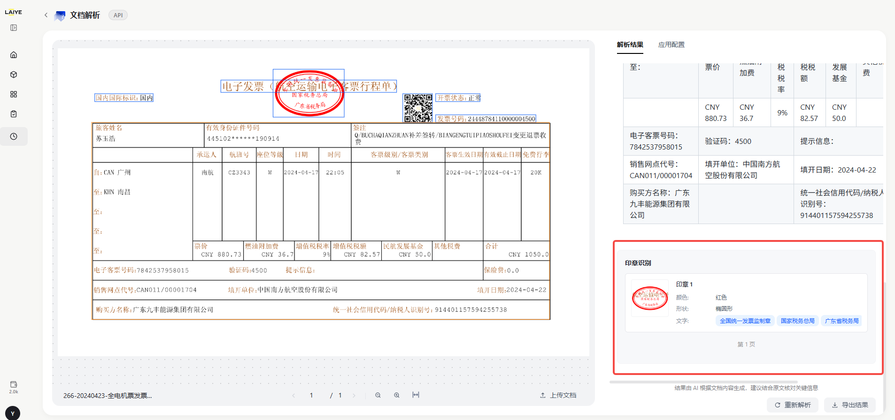

- 支持在“智能体抽取”能力的应用配置页面开启印章识别，上传文件并解析完成后，解析结果页底部会展示印章识别结果。也可根据需求在应用配置页添加字段抽取印章相关信息。

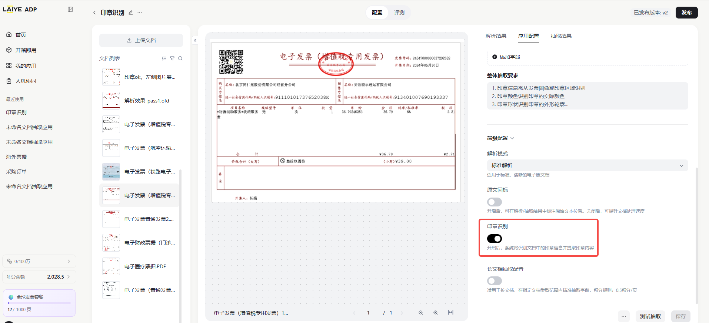

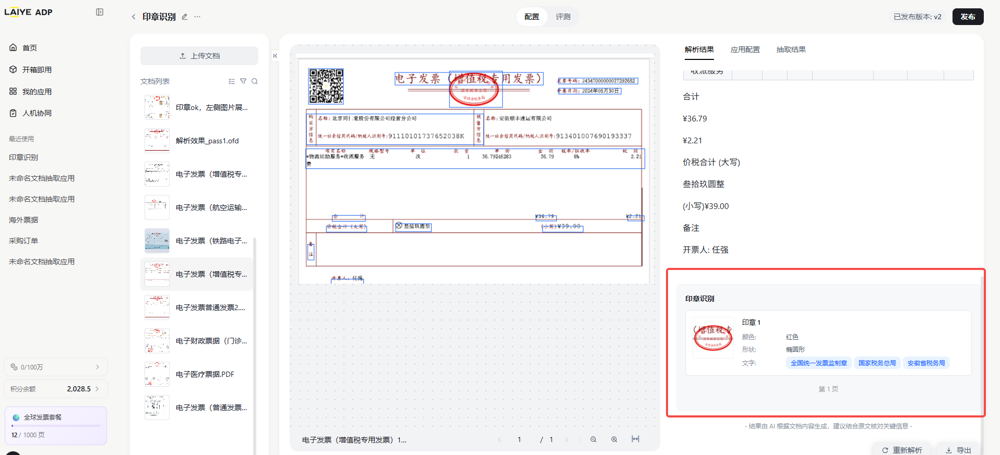

### 开箱即用：文档解析和国内通用票据新增OFD格式识别 

目前财税电子发票主要采用 OFD 格式，现在上传 OFD格式 文档可直接解析文档或提取票据字段。

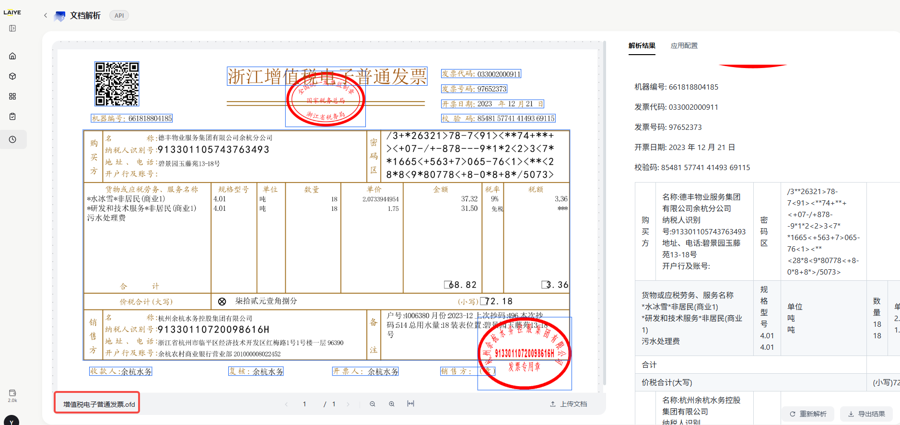

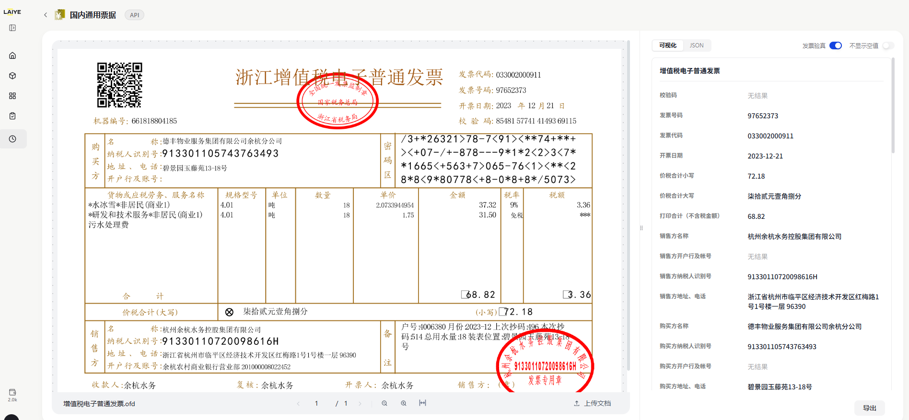

### 全面兼容 MCP 协议，打通 Agent 调用通路

为进一步提升 ADP 平台的开放集成能力，我们完成 MCP（Model Context Protocol）标准化能力补齐与注册用户 MCP Server 灵活获取，支持各类 Agent 平台通过 MCP 协议直接调用 ADP 能力

- **ADP原子能力全面支持MCP协议**

    - ADP平台已完整兼容MCP通用协议规范，并对外开放17个开箱即用标准工具，同时支持自定义应用的列表获取与执行，查询异步任务状态、获取异步任务结果等工具接口，覆盖文档解析、文档抽取全部功能。

- **MCP Server 灵活获取**

    - ADP 所有注册用户均可在我的个人头像卡片处，点击查看“我的MCP”后，获取MCP Server URL，可将URL粘贴至任意Agent平台进行配置后，使用ADP功能，无需二次进行身份认证

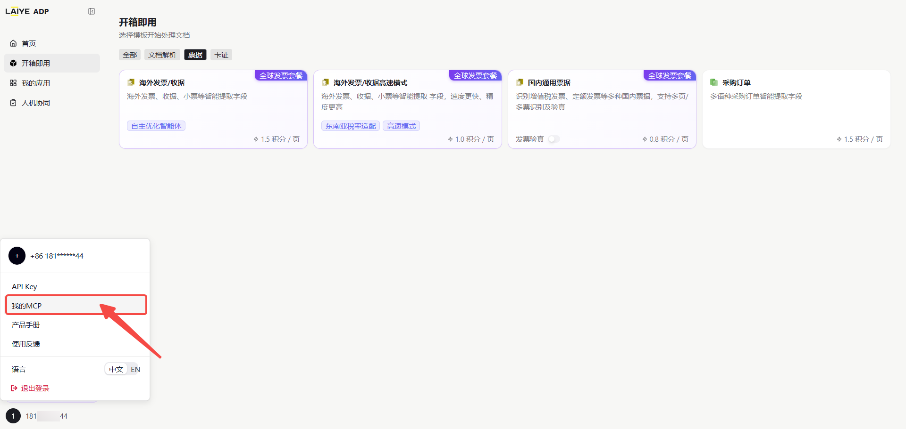

# 2026\.4\.30（V1\.11）

### 开箱即用：海外发票/收据上线自主优化 Agent【限时免费】

用户手动修正的抽取结果将被 Agent 记忆和学习，仅需 5 份纠错样本即可启动模型优化，无需调试提示词，即可实现越用越准，提供“专属”客户业务的海外发票。

> 了解详情：[自主优化 Agent](/#self-optimization-agent)
> 
> 

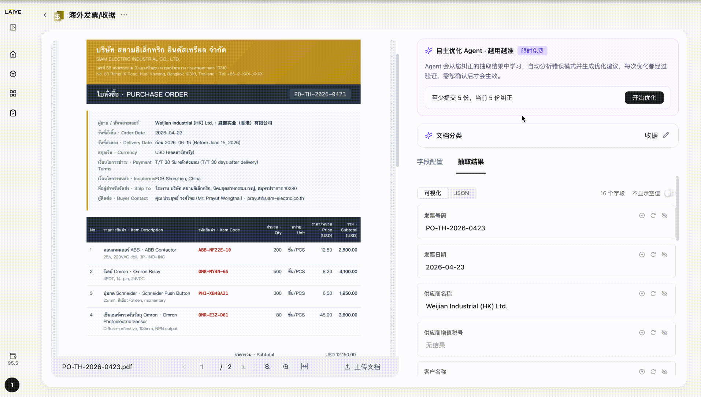

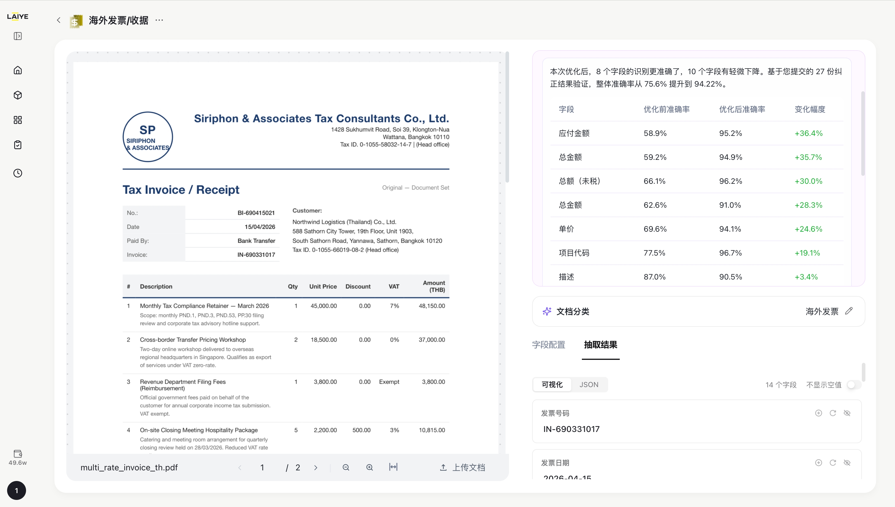

### 开箱即用：海外发票/收据支持自定义字段

用户可根据业务需要新增、删除、编辑提取字段，也可以一键恢复系统默认字段，灵活适配不同国家、行业和票据格式下的字段需求。

> 了解详情：[自定义抽取字段](/#custom-fields)
> 
> 

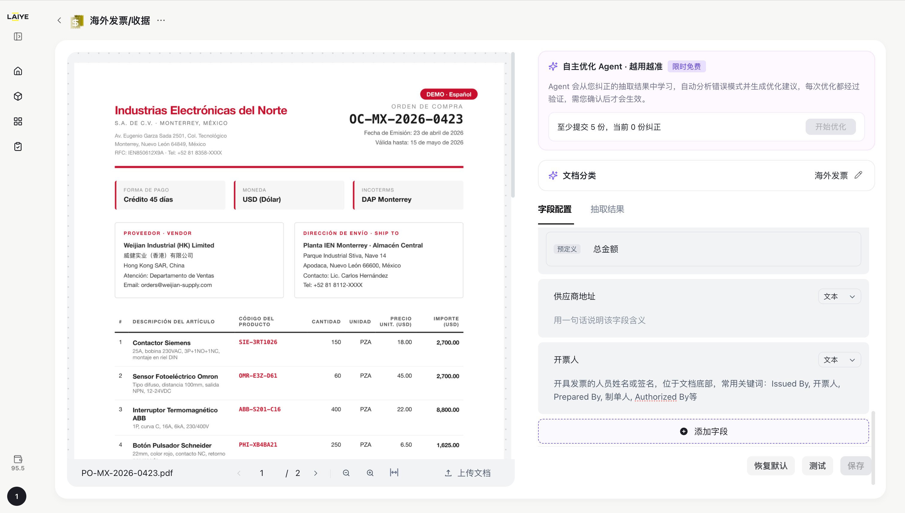

### 开箱即用：国内通用票据全新上线

ADP 新增「国内通用票据」开箱即用能力，覆盖财务报销和票据审核中的高频票据类型。用户上传票据后，系统可自动识别票据类型并抽取核心字段，同时支持部分票据类型查验，帮助提升票据录入、审核和验真效率。

- **覆盖 30\+ 种常见票据**：支持全电发票、普通发票、专用发票、出租车票、火车票、飞机行程单、财政发票等财务场景常见票据。

- **自动抽取核心字段**：可从票据中提取发票号码、开票日期、金额、购买方、销售方等关键信息，减少人工录入工作量。

- **支持 11 种票据查验**：可对支持查验的国内通用票据进行真实性校验，辅助财务审核和合规风控。

- **支持多页/多票据处理**：可处理多页文件或一份文件中包含多张票据的场景，适配批量报销和集中审核流程。

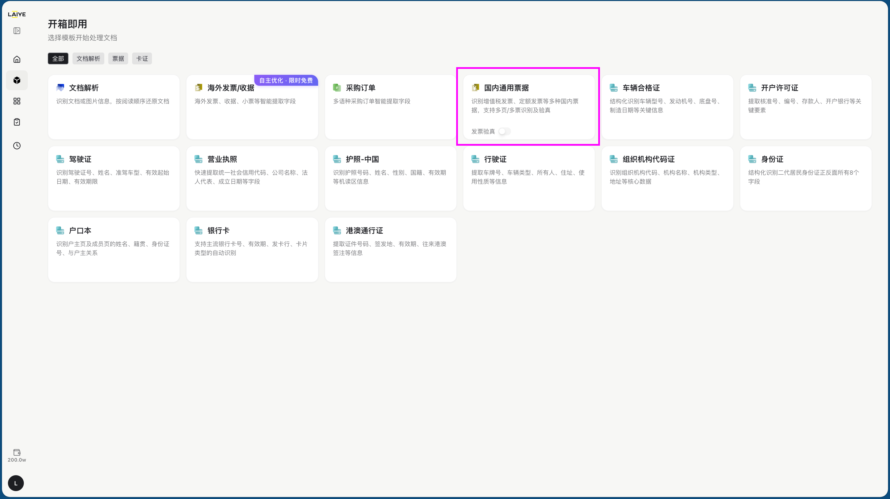

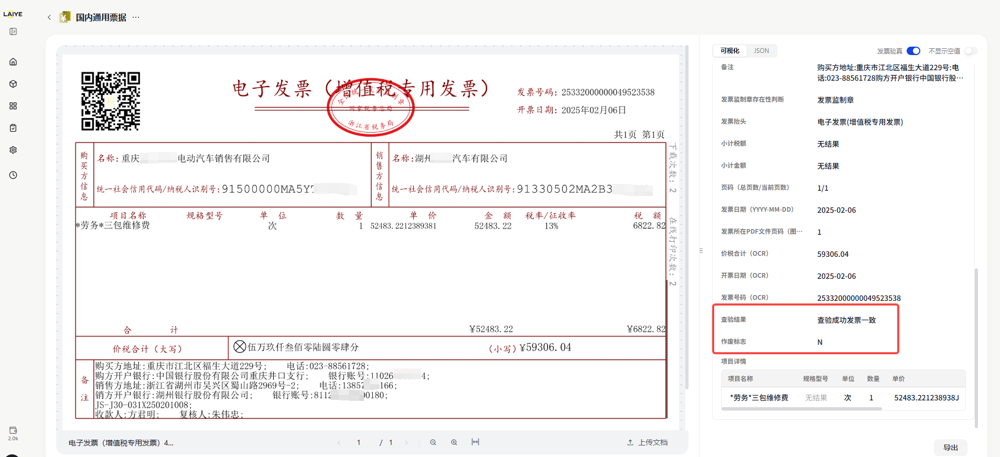

### ADP 平台：智能体工作流全新发布

ADP 新增「智能体工作流」能力，支持用户通过自然语言创建端到端文档处理流程。用户只需描述业务需求，智能助手即可自动理解任务、规划步骤，并生成可复用的工作流，帮助完成文档拆分、分类、抽取、审核和结果汇总等复杂任务。

- **自然语言创建工作流**：用一句话描述需求，即可生成合同与发票一致性核对、招投标资料分类整理、订单异常查验、财务报表分析等文档处理工作流。

- **智能规划处理流程**：系统可自动编排解析、分类、抽取、审核、合并等处理步骤，降低复杂流程搭建门槛。

- **对话式持续优化**：用户可通过多轮对话补充规则、调整字段和优化输出结果，无需从零手动配置每个节点。

- **适配复杂文档场景**：支持混合文档、长文档、多单据比对、财报分析等任务，覆盖更完整的文档业务流程。

- **沉淀可复用应用**：工作流可保存、发布并重复执行，帮助企业将一次性的文档处理经验沉淀为稳定流程。

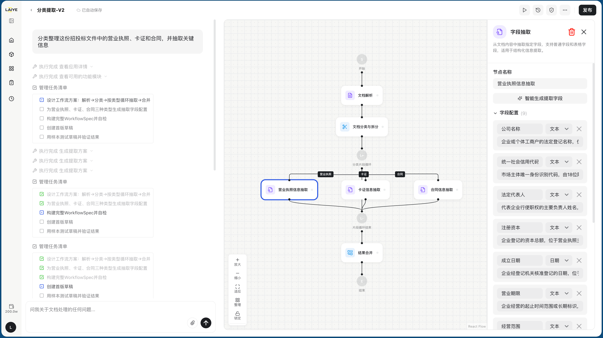

> 智能体工作流操作手册：[ADP 公有云版 操作手册](/#agentic-docflow)
> 
> 

# 2026\.4\.24（V1\.10）

### ADP CLI 全新发布

ADP CLI 正式发布，全面支持通过命令行调用 ADP Open API 全部能力，并同步上线 CLI Skill，让 ADP 文档智能处理能力无缝融入各类 AI Agent 生态。

- **用户认证更便捷**：支持 API Key \+ API Base URL 一键配置，认证信息本地持久化、长期有效，支持随时更新与重新配置。

- **本地文件无感处理**：支持直接传入本地文件 / 文件夹路径，实现批量解析与抽取；同时兼容 URL /base64 双模式输入，输出标准 JSON 结构，无额外依赖。

- **应用配置全链路支持**：支持通过命令行完成自定义应用的创建、调用、修改、删除与列表查询，无需 Web 端即可实现全功能闭环操作。

- **账户资产实时可查**：支持快速查询账户剩余积分与可用额度，实时展示资产状态与计费信息，便于用量管控与成本规划。

> CLI使用文档：[CLI 使用指南](https://github.com/laiye-ai/adp-cli)
> 
> 

### CLI Skill 全新发布

CLI Skill 正式发布，让 ADP 全能力只需一句话“我想使用这个技能：[https://github\.com/laiye\-ai/adp\-cli](https://github.com/laiye-ai/adp-cli) ”即可接入各类 Agent 平台，无需复杂配置、无需环境准备、无需熟悉ADP平台使用交互，实现了AI背景下真正意义上的开箱即用。

> CLI Skill详细介绍：[ADP-CLI 发布 - 让 ADP 的能力，融入每一个 Agent](https://github.com/laiye-ai/adp-cli)
> 
> 

# 2026\.4\.7

### Open API：鉴权优化

API鉴权逻辑优化，简化用户调用前认证流程，提升使用便捷性

- **鉴权方式优化**：优化API调用前的用户认证逻辑，新增API Key鉴权方式，用户仅需使用一个**API Key**即可完成鉴权认证，无需额外繁琐操作，大幅简化鉴权流程。

- **API Key入口优化**：优化API Key查看入口，用户点击个人头像，即可快速找到“我的API”入口，便捷查看、管理自身API Key，提升操作效率。

- **老用户兼容**：为保障老用户使用体验，原有的Access Key认证方式予以保留，老用户可继续使用原有方式鉴权，也可切换至新的API Key鉴权方式，灵活选择。

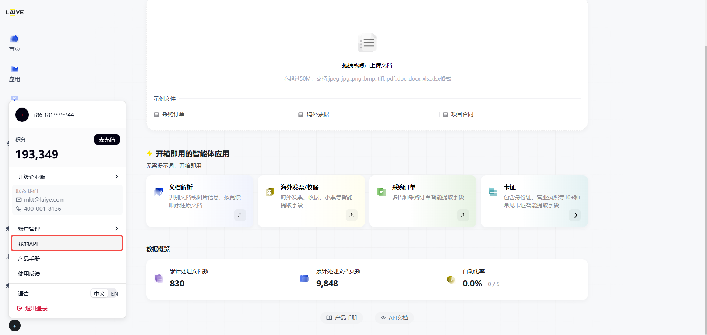

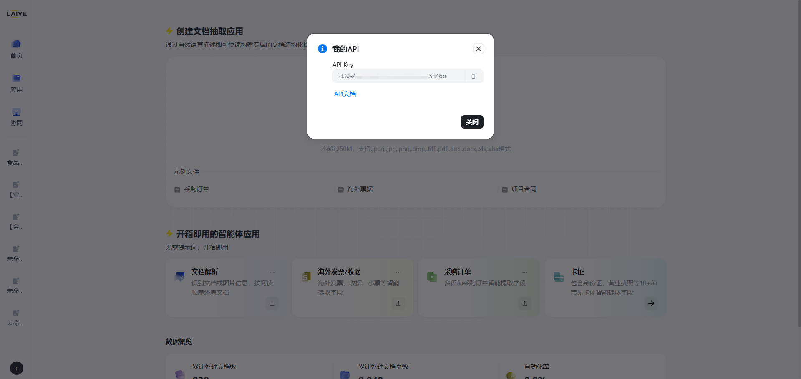

### Open API：功能优化

Open API 全链路功能升级，简化应用调用逻辑，丰富文档解析能力，完善应用管理体系

- **应用调用逻辑优化：**只需要一个APP ID即可调用对应应用，对于老用户，原有的APP Key、APP Secret认证方式保留

- **新增查询应用列表接口**：传入 API Key 后，接口可返回**应用名称、应用ID、应用标签**等全维度核心信息，帮助用户快速梳理、筛选及管理名下应用，提升操作效率。

- **开箱即用应用标签升级**：为开箱即用应用新增**默认标签**，助力 Agent 自主调用时精准筛选产品匹配需求；同时开放标签自定义权限，用户可通过 API 为应用设置专属标签，适配个性化业务场景。

- **新增应用配置接口**：全面支持应用配置项相关操作接口，涵盖**创建、编辑、删除、查询**四大基础能力；同时新增应用下**指定版本删除**功能，以及**AI 生成抽取字段提示词推荐**功能，提升API用户的配置效率。

- **文档解析接口全面拓展：**新增文档解析流式返回能力，适用于长文档解析时实时性结果输出，并补充完善文档解析相关同步 / 异步接口，包括：

    - 流式文档解析（同步接口）

    - 流式文档解析（异步接口）

    - 非流式文档解析创建任务（异步接口）

    - 非流式文档解析查询任务结果（异步接口）

- **新增查询API资产接口：**用户可直接查询名下剩余API资产，清晰掌握资产使用情况

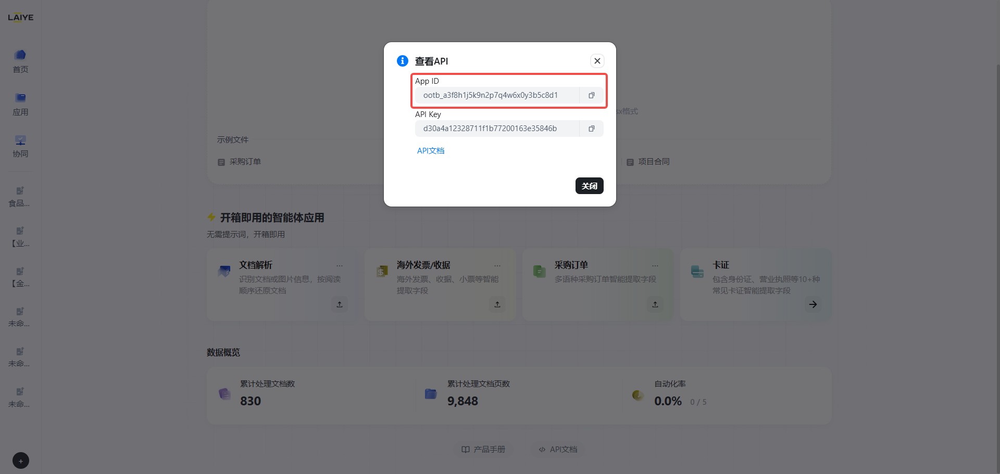

# 2026\.3\.10

### 文档解析：长文档解析性能优化

文档解析引擎全面升级，针对百页级长文档的处理速度实现质的飞跃。

- 对可读 PDF、Word、Excel 等格式文档效率提升显著。

- 基于实测数据结果，在平均近**200页**的长文档上，解析时长由平均约**2146秒**缩短至**36秒**，解析性能平均提升**98%**以上，极大缩短用户等待时间，显著提升长文档处理体验。

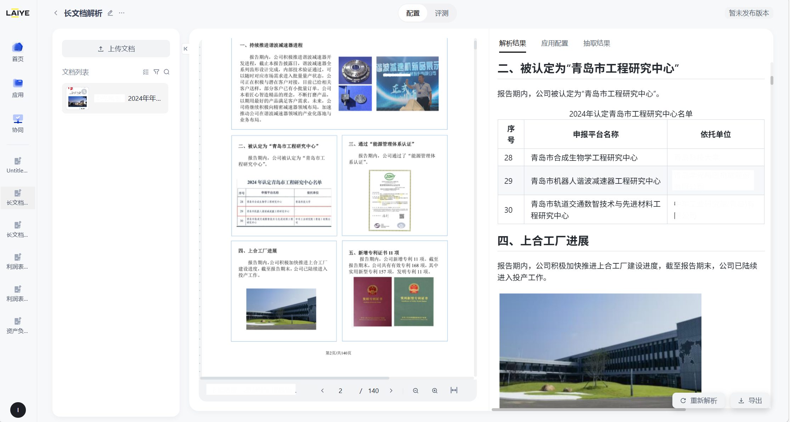

### **ADP平台：解析服务资源扩容优化**

- 解析服务并发处理能力提升 100%，整体处理效率显著提升。

# 2026\.2\.10

### 卡证抽取：新增10\+种类型的卡证抽取【仅国内】

即传即用，快速、准确地处理各类证件和卡片文档，覆盖营业执照、银行卡、开户许可证、中国护照、身份证、驾驶证等11种常见卡证类型。

- **专家级模型，精准识别：**内置**11种**专业卡证识别模型，显著提升抽取结果的准确性和质量。

- **高效便捷，极速响应：**单张卡证处理时长≤**3秒**，抽取准确率**90%****\+**，点击即可快速获取结构化结果。

> 该产品模块仅在中国站点支持，具体操作步骤详见[开箱即用的智能体应用](/#out-of-the-box)。
> 
> 

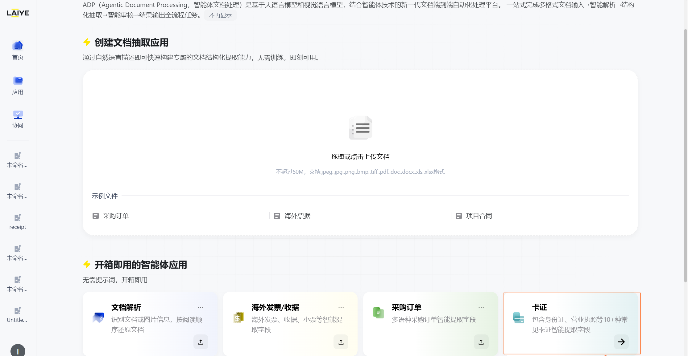

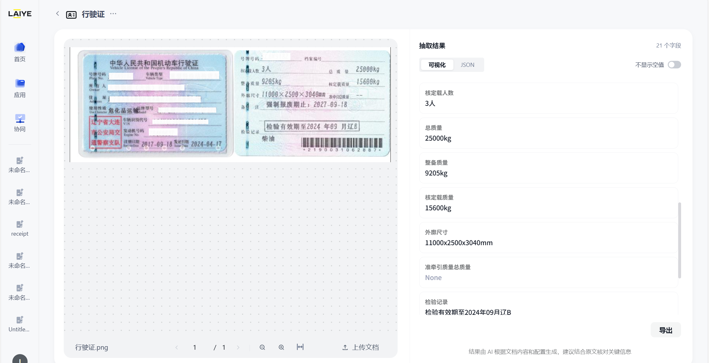

### 文档抽取：长文档抽取设置

针对长文档类型，用户可指定文档类型范围，精准抽取字段；

- **指定范围精准抽取：**针对20\-300页的财报、招投标等长文档，实现指定范围内的特定文档类别（如资产负债表、技术参数等）的字段数据提取，相比全文抽取速度更快更精准。

- **处理效率全面提高：**在抽取结果页，展示指定范围的页码，点击可自动定位原文，显著提升了长文档字段抽取的精准度和整体效率。

> 具体操作步骤详见[长文档抽取配置](/#long-doc-config)。
> 
> 

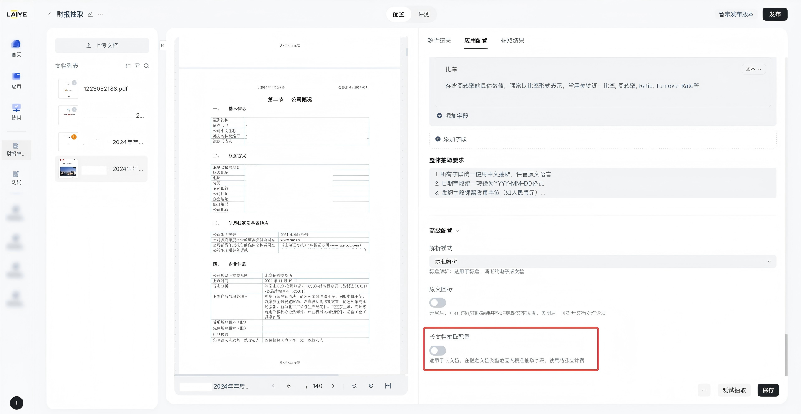

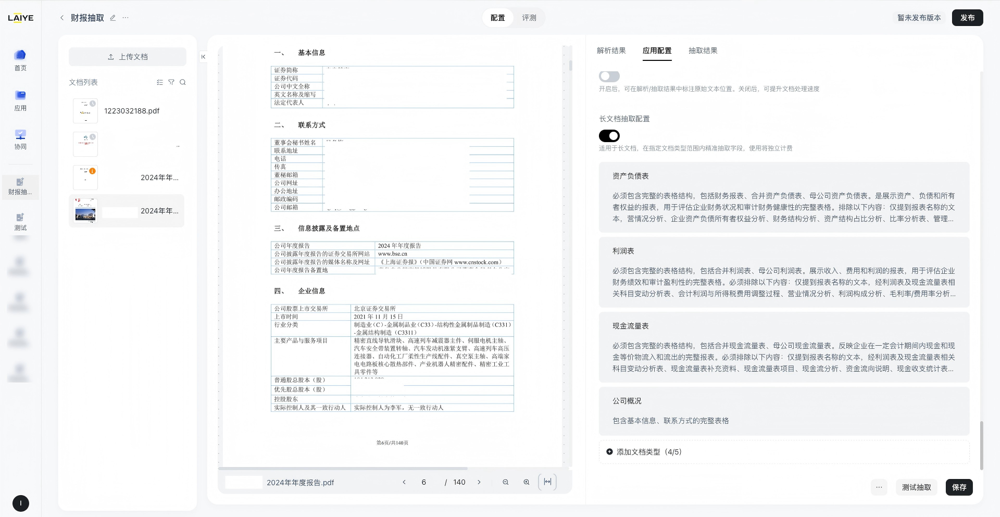

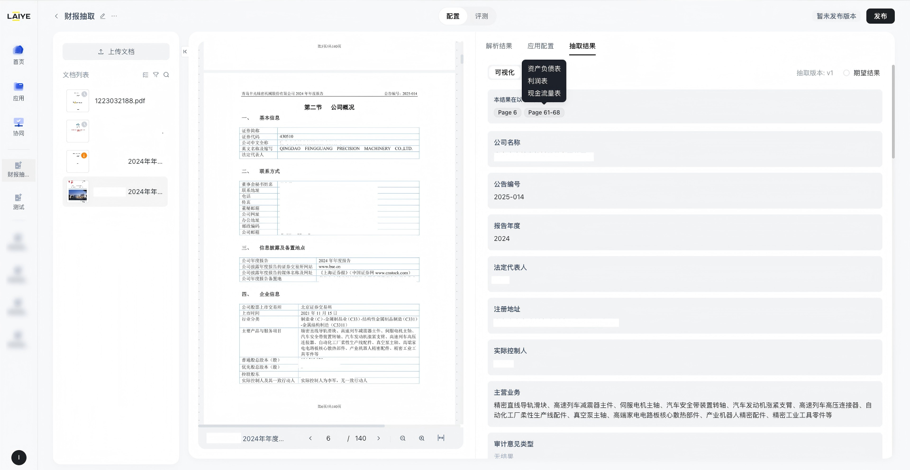

### 文档抽取：提示词生成优化

基于不同的文档类型的专业领域知识，系统会自动生成高质量、高精确度的抽取字段，帮助用户提升信息抽取效率，降低提示词的调试难度和成本。

- **核心字段，高质高效**: 提示词生成优化后，在**10\+**高频文档字段上的匹配度超过**90%**，确保首次抽取准确率可达**90%**以上，助您快速获取可靠、精准的信息。

- **广泛支持，全面覆盖:** 无论是自定义抽取应用还是开箱即用功能，均可自动生成高精度的抽取字段。产品广泛适用于各类通用文档（如发票/收据、订单、采购合同），以及金融（如业绩预告）、物流运输（如海运提单、空运装箱单）、进出口外贸（如核注清单）等多种专业文档类型。

> 更多抽取配置的信息详见[配置应用规则](/#config-rules)。
> 
> 

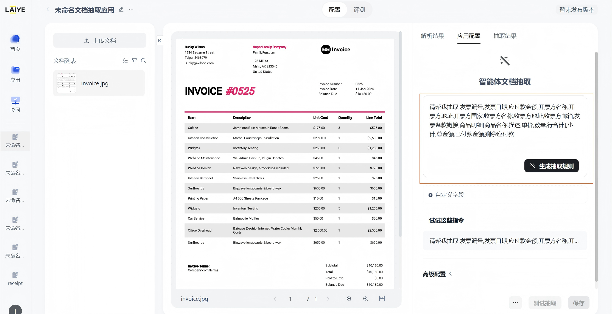

### ADP平台：支持用户自主充值

现采取灵活透明的**按量付费**模式，无需联系客服进行充值，即充即用，以最低的成本高效开展业务。

- **自主计费，按需充值**：根据业务量要求，支持自主购买充值套餐或充值自定义金额。

- **便捷的支付方式**：支持在线支付（支付宝）能力

- **透明的交易记录**：支持查看所有历史订单、支付状态、消费明细

> - 用户需根据预估业务量在账户内预先充值积分。
> 
> - 单次充值支持1\-10000元人民币的金额，原价积分无有效期限制，折扣积分有效期为365天。
> 
> - 针对企业级业务量级或需签订合同、对公转账等服务，欢迎联系商务顾问定制专属方案。
> 
> - 更多积分设置详见[积分说明](/#credits-guide)。
> 
> 

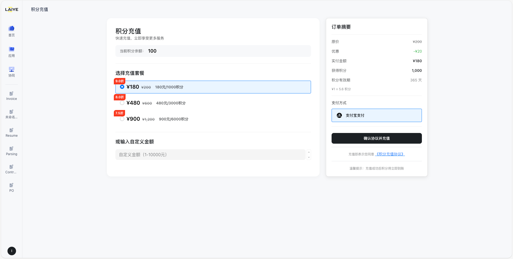

# 2026\.1\.20

### 全新“开箱即用”能力上线：零配置，即传即用

针对**海外发票、收据及采购订单**，推出“开箱即用”处理模块。

与以往需要手动配置提示词的自定义应用不同，该模块内置了经过深度调优的专家级抽取配置。只需直接上传文档，系统即可自动完成关键字段的精准抽取，将配置时间缩短为零，轻松实现文档处理效率和准确率质的飞跃

- **零门槛配置：**无需调试提示词（Prompt）或复杂的环境搭建，真正实现开箱即用。

- **全自动处理：**文档上传即刻启动自动化抽取流程，体验丝滑流畅的工作流。

- **多场景单据覆盖 ：**支持海外发票（Invoice）、收据（Receipt）及采购订单（PO）等核心业务文档，内置票据号码、日期、金额等 15\+ 关键字段。

- **内置专家级抽取配置：**预置经过验证的高精度抽取策略，专为商业单据设计，让通用模型也能发挥出垂类专家的水准。

- **精准高效，性能卓越：**抽取准确率突破 **90%**，整体性能提升 **33%（**单页文档处理耗时压缩至 **20秒** 以内），准确率和性能均达到业界领先水平。

> 更多信息详见[开箱即用](/#out-of-the-box)操作说明。
> 
> 

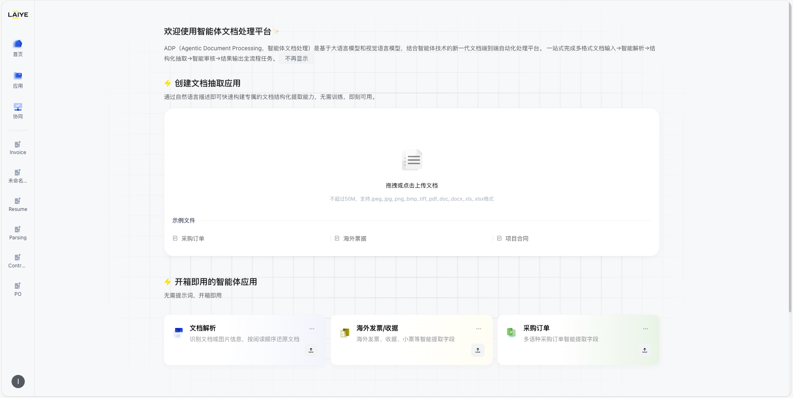

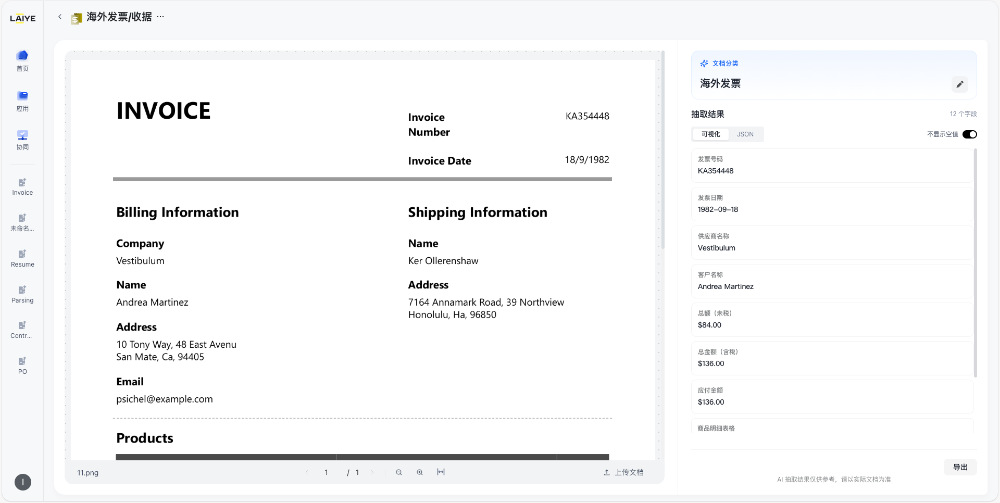

### ADP平台：界面焕新升级

- **布局重构，数据一目了然：**首页与应用管理页全新改版，优化信息层级展示。支持文档数据全局总览，关键业务指标展示更直观。

- **操作整合，交互路径更短：**重构高级配置、提示词生成、配置导入导出与历史配置入口，优化交互路径，提升配置效率。

- **深色 UI，沉浸式操作体验：**采用专业级深色（黑灰）设计语言，提升视觉舒适度和沉浸感。

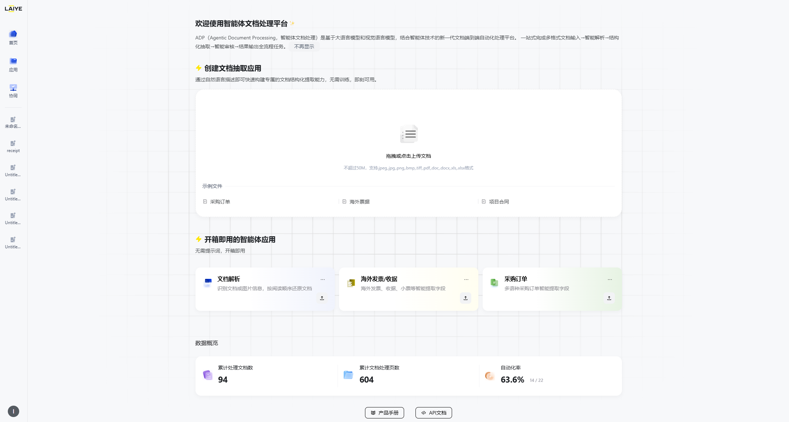

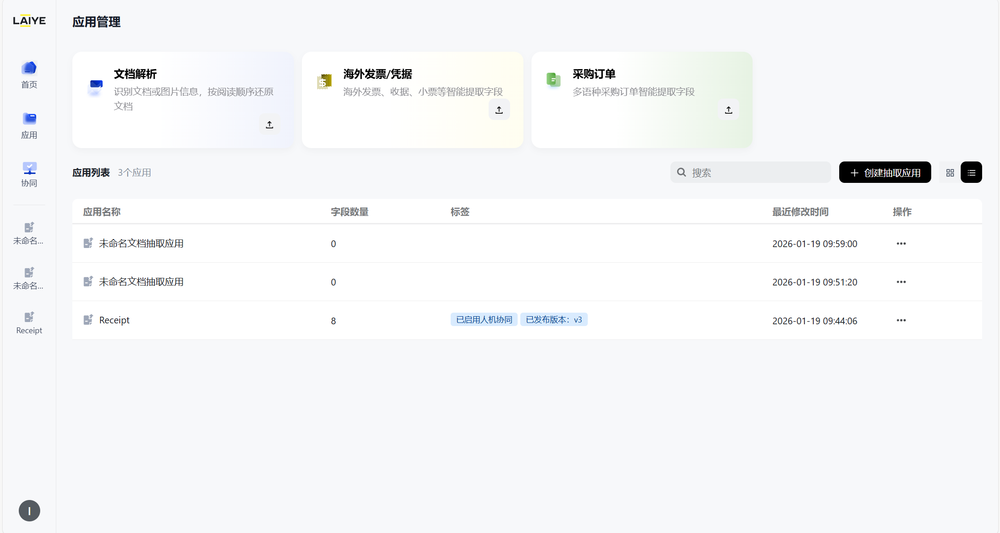

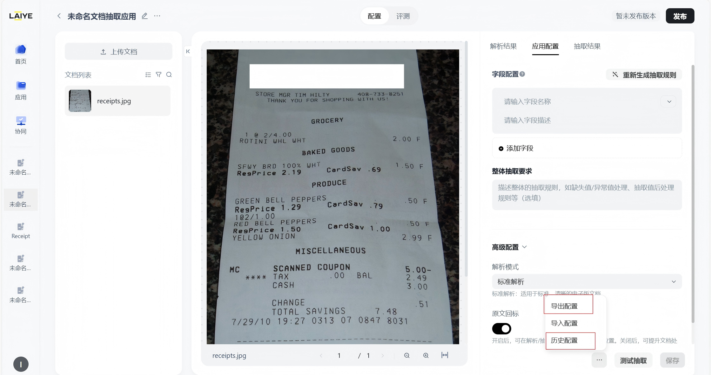

### 文档解析：新增文档解析独立模块

文档解析能力现已支持独立使用。无需创建抽取应用，上传文档即可快速理解并结构化还原文档信息。

> 适用场景：获取文档全文及版面结构。 如需提取特定键值（Key\-Value）或关键字段，请继续使用“文档抽取应用”。
> 
> 

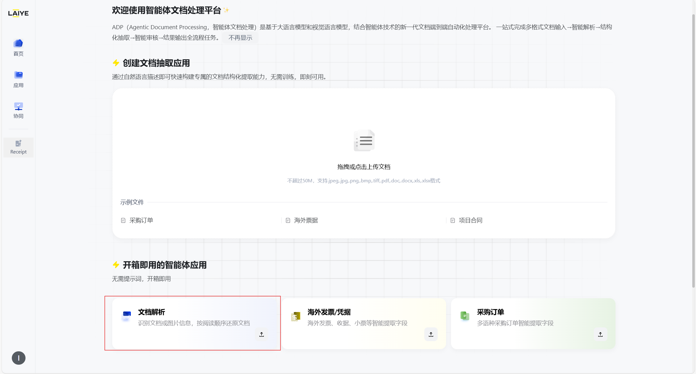

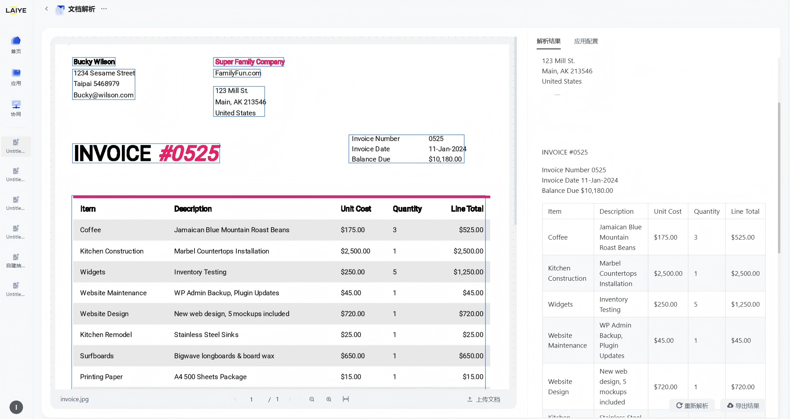

### 文档抽取/解析：解析结果加载优化

- 上传多页文档，解析结果按页返回，无需长时间等待即可浏览已解析结果。

- 多页文档解析过程中，若解析失败可支持单页重新解析。

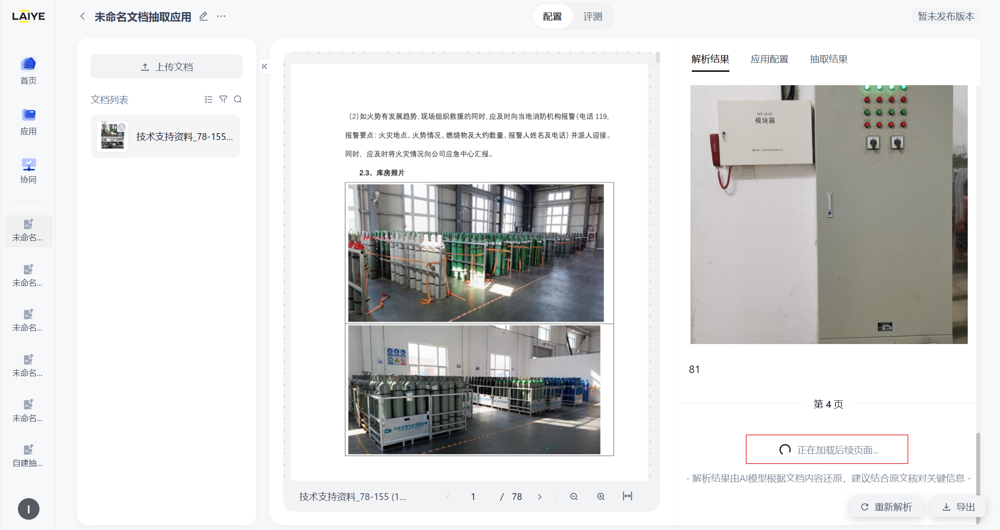

### 文档抽取：版本发布逻辑优化

- 发布当前版本后，系统会自动创建新的版本。

- 用户可在新版本上进行后续修改，避免配置修改直接影响已发布版本，确保生产环境和历史版本的稳定性。

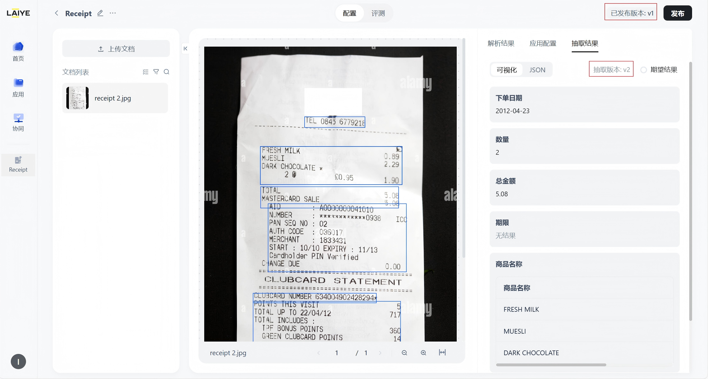

### 新增用户反馈入口

用户可从任意页面便捷提交使用反馈和建议，帮助产品持续优化升级，提升用户体验感和满意度。

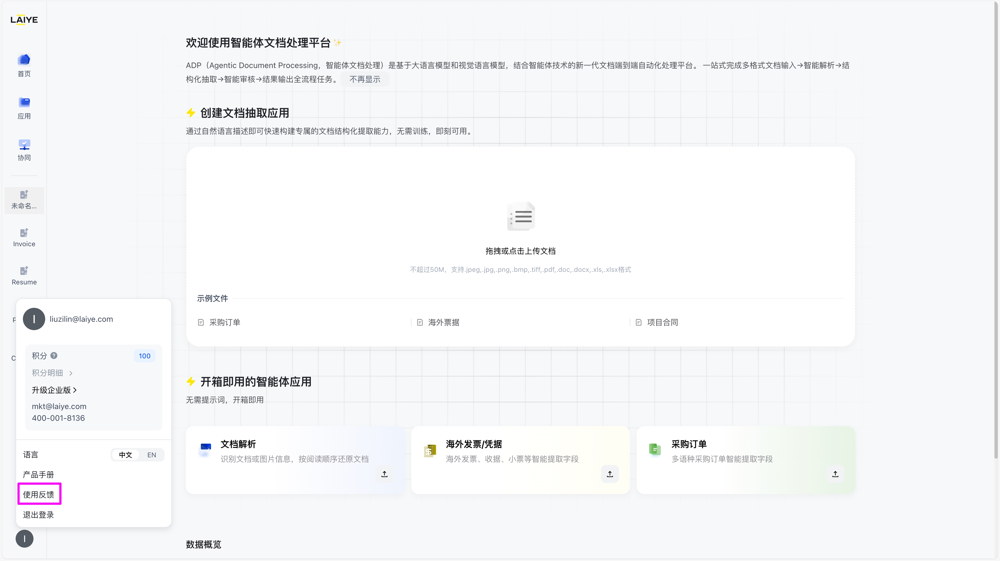

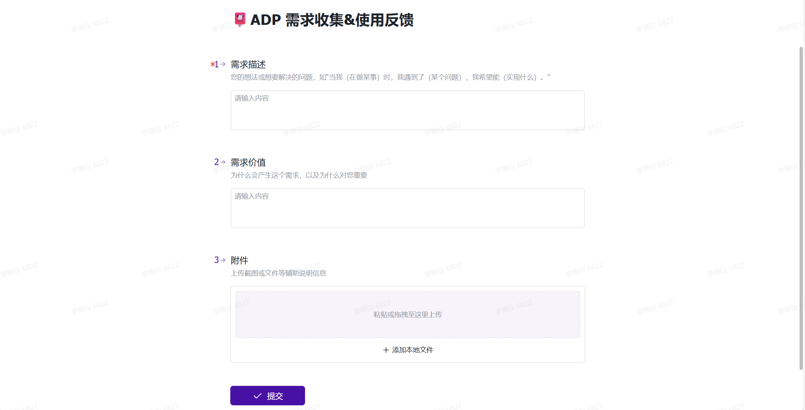

# 2025\.12\.30

### 应用配置：新增高级配置（解析模式\&原文回标）

- 在应用配置中增加高级配置，支持切换【解析模式】（含标准解析、增强解析、智能体解析），可根据文档特点选择不同解析模式。

- 提供【原文回标】开关，默认开启，关闭后，可显著提升抽取速度。

- 配置更改仅对新上传文档生效，保存或测试有不同操作和效果。

> 更多高级配置信息详见[高级配置](/#advanced-config)。
> 
> 

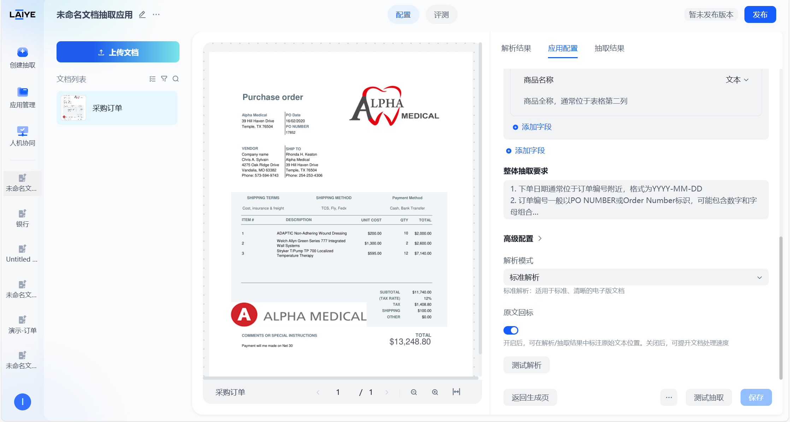

### 解析结果：新增重新解析

- 当出现解析异常或应用最新高级配置解析当前文档时，在解析结果中用户可点击【重新解析】。

- 重新解析需要消耗解析积分。

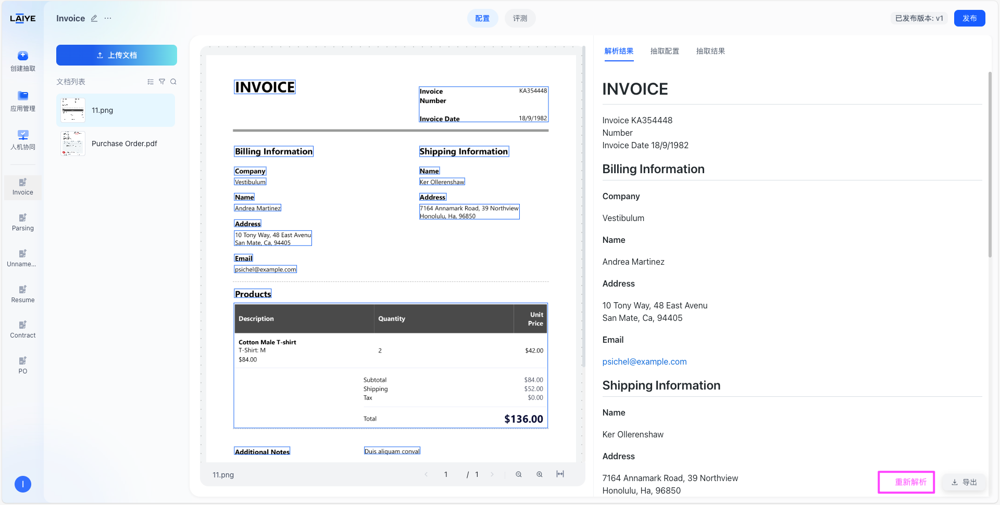

### 文档列表：新增批量操作

在文档列表处新增【批量操作】，点击后可多选/全选文件进行批量测试或批量删除。

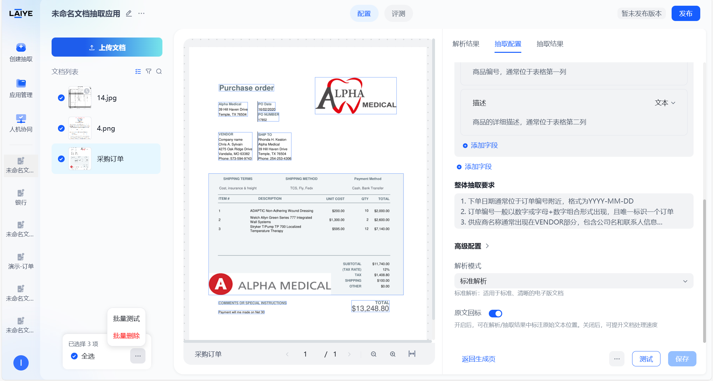

### 抽取结果：支持导出为Excel格式

抽取结果可导出为Excel格式，便于编辑抽取结果。

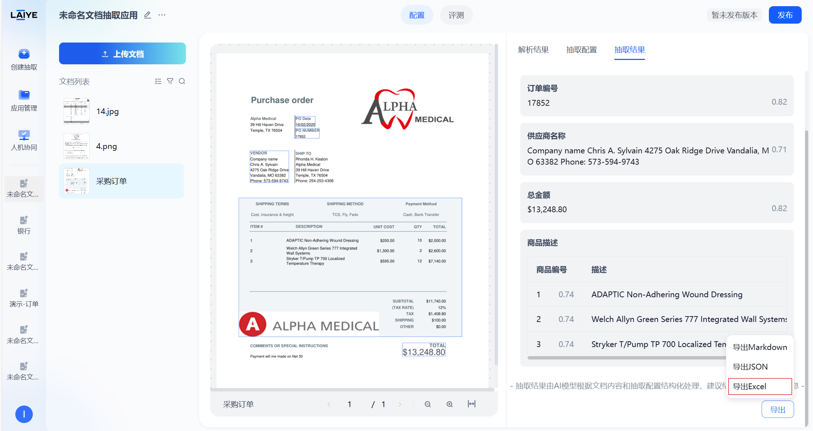

### 查看积分记录

- 用户可通过积分明细查看积分来源、积分用量、积分期限等。

> 更多积分设置详见[积分说明](/#credits-guide)。
> 
> 

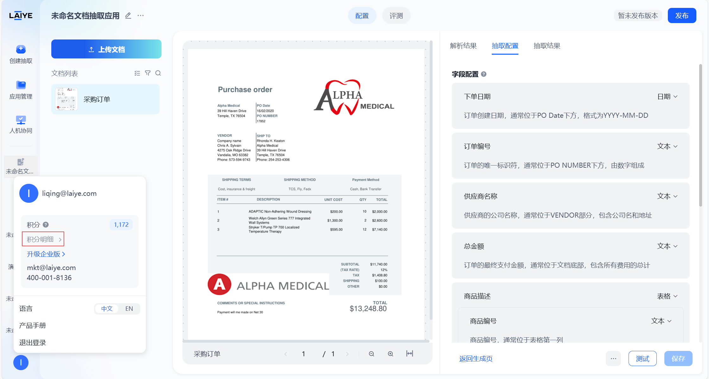

# 2025\.12\.9

### 支持用户自主注册、登录

Laiye ADP V1\.5 支持用户自主注册、登录、重置密码，无需依赖复杂的私有化部署流程，轻松体验智能体文档处理全过程。

### 统一积分设置

积分（Credit） 是ADP的通用计费单位，根据不同任务的积分消耗来计费。

|任务|每页积分|
|---|---|
|解析|0\.5|
|抽取（解析\+抽取）|1|
|人机协同（解析\+抽取\+人机协同）|2|

> 📌 说明 ：  
> 
> 具体积分使用、获得详见[积分说明](/#credits-guide)。
> 
> 

### 大量文档上传更流畅

告别卡顿，大量文档同时上传更流畅。（单次上传最多100份，每份100页。）

> (注：内容由 AI 生成，请谨慎参考）
